<p align="center">
  
</p>

<h1 align="center">몽그루</h1>

<p align="center">
  오늘 있었던 일을 적으면, 그 마음을 닮은 캐릭터가 함께 자랍니다.
</p>

<p align="center">
  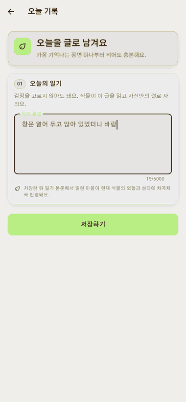
</p>

<p align="center"><sub>일기를 저장하면 그 자리에서 캐릭터가 반응합니다.</sub></p>

## 어떤 앱인가요

감정 일기 앱입니다. 다만 기분을 별점이나 이모지로 먼저 고르라고 하지 않습니다.
있었던 일을 편하게 적으면 앱이 그 글에서 마음을 읽고, 읽힌 마음이 지금 키우는
캐릭터의 생김새와 말투가 됩니다.

- 감정을 먼저 고르지 않습니다. 한 줄만 적어도 오늘의 기록이 됩니다.
- 같은 캐릭터라도 어떤 마음이 많이 쌓였는지에 따라 다르게 자랍니다.
- 남긴 기록은 달력과 회고에서 언제든 다시 읽을 수 있습니다.
- 다 자란 캐릭터는 박물관에 남고, 그다음 씨앗을 새로 심습니다.

화면은 다섯 개뿐이고, 화면마다 답해 주는 것이 하나씩 정해져 있습니다.

| 화면 | 이 화면이 답해 주는 것 |
| --- | --- |
| **오늘** | 지금 뭘 하면 되지? |
| **기록** | 전에 뭘 썼더라? |
| **정원** | 모은 걸로 뭘 하지? |
| **박물관** | 캐릭터가 어떻게 자랐지? |
| **회고** | 요즘 내 마음은 어땠지? |

## 오늘 — 한 줄로 시작합니다

기분을 고르는 단계가 없습니다. 가장 기억나는 장면 하나만 적고 저장하면 됩니다.
저장한 글에서 읽힌 마음이 캐릭터의 다음 모습에 쌓입니다.

<table>
  <tr>
    <td width="50%">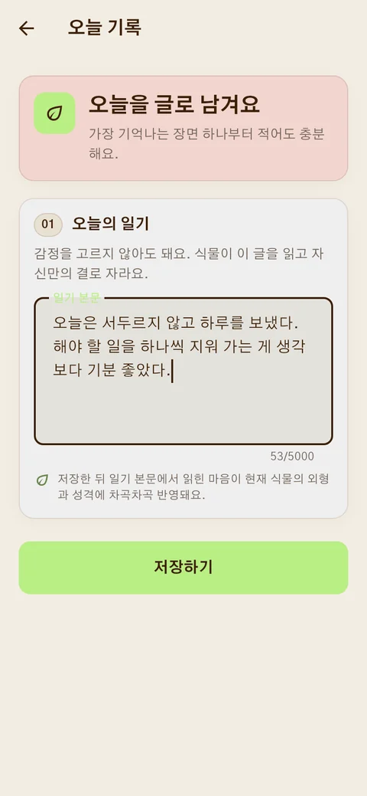</td>
    <td width="50%"></td>
  </tr>
  <tr>
    <td align="center"><sub>적는 건 이게 전부예요</sub></td>
    <td align="center"><sub>적은 만큼 캐릭터가 자라요</sub></td>
  </tr>
</table>

홈에는 오늘 캐릭터가 어디까지 왔는지, 지금 어떤 결로 자라는 중인지가 함께
있습니다. 일기 다음에 이어서 할 작은 행동도 여기서 고르지만 건너뛰어도
기록과 성장은 그대로 남습니다.

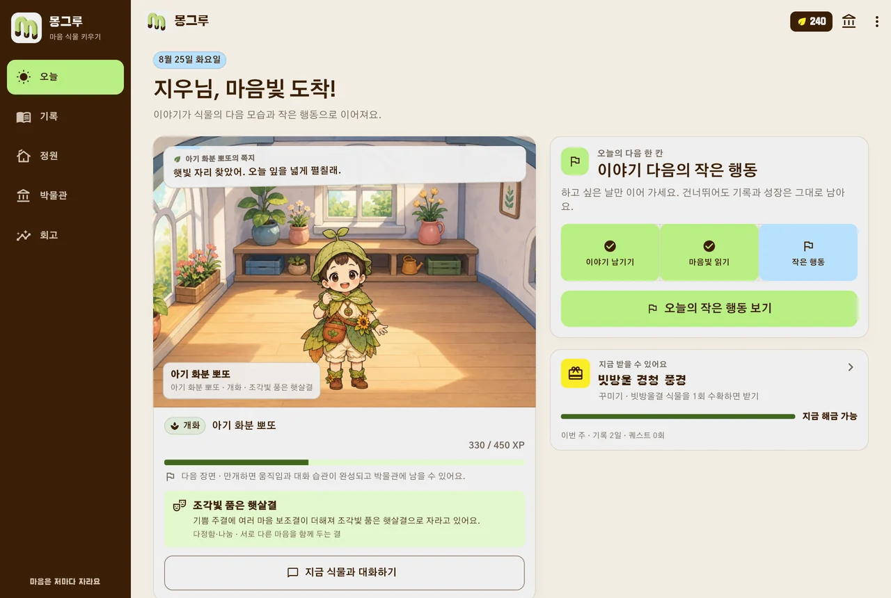

## 마음마다 다르게 자랍니다

캐릭터는 씨앗 · 새싹 · 줄기 · 개화 · 만개의 다섯 단계를 거칩니다. 같은 씨앗에서
시작해도 일기에 어떤 마음이 많이 쌓였는지에 따라 여섯 갈래 중 하나로 갈라지고,
생김새뿐 아니라 말투와 움직임까지 달라집니다.

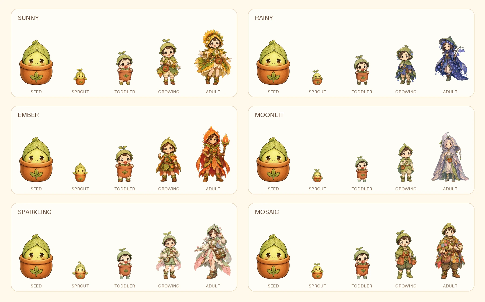

| 많이 쌓인 마음 | 자라는 결 | 결이 가진 성격 |
| --- | --- | --- |
| 기쁨 | 햇살결 | 다정함 · 나눔 |
| 슬픔 | 빗물결 | 섬세함 · 경청 |
| 분노 | 불씨결 | 강인함 · 솔직함 |
| 불안 | 달빛결 | 신중함 · 준비 |
| 놀람 | 별빛결 | 호기심 · 발견 |
| 여러 마음 | 모아결 | 유연함 · 다채로움 |

어느 마음도 좋고 나쁨으로 채점하지 않습니다. 슬픔이 많이 쌓였다고 덜 자라거나
불리해지는 일은 없고, 결마다 다른 모습이 될 뿐입니다. 이렇게 자라는 계보가
지금 15종 있습니다.

<details>
<summary><strong>다른 캐릭터의 성장 계보 보기</strong></summary>

<br>

먼저 만든 10종의 계보입니다.


</details>

## 기록과 회고 — 지난 마음을 다시 읽습니다

<table>
  <tr>
    <td width="42%">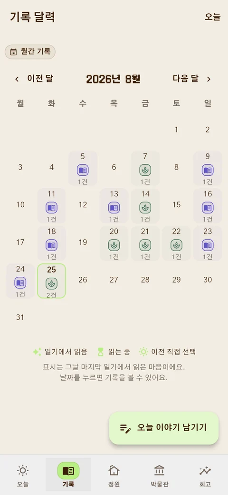</td>
    <td valign="top">
      <h3>날짜별로 다시 읽는 기록</h3>
      <p>달력에는 기록을 남긴 날과 그날 마지막 일기에서 읽힌 마음이 표시됩니다. 날짜를 누르면 그날 쓴 글을 그대로 다시 볼 수 있어요.</p>
      <ul>
        <li>하루에 여러 번 적어도 됩니다.</li>
        <li>쓴 글은 나중에 고치거나 지울 수 있어요.</li>
        <li>빈 날이 있어도 앞의 기록은 그대로 남습니다.</li>
      </ul>
    </td>
  </tr>
</table>

회고는 한 주나 한 달을 묶어 자주 나온 마음과 되돌아볼 질문을 한 장으로
보여 줍니다. 통계는 기록에서 바로 계산하고, 요약 문장은 참고용으로만 붙습니다.

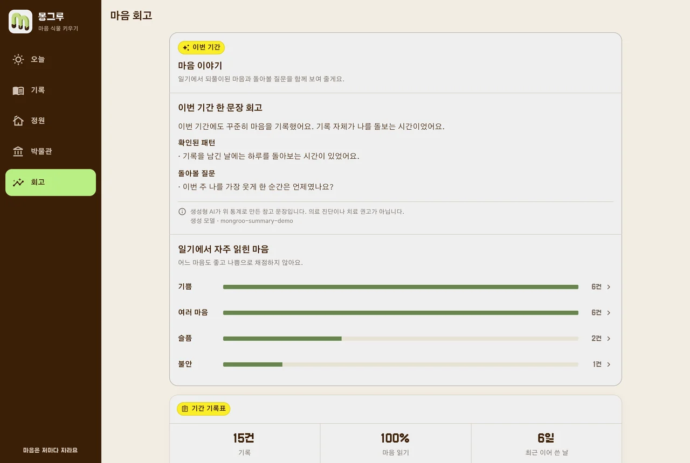

## 박물관 — 다 키운 캐릭터가 남습니다

만개까지 키운 캐릭터는 수확해서 박물관에 전시합니다. 어떤 결로 자랐는지,
그동안 어떤 기록과 함께였는지가 캐릭터마다 남습니다.

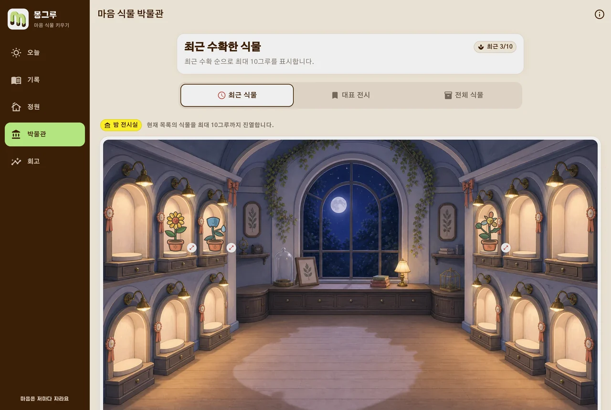

## 정원 — 캐릭터와 지내는 공간

기록과 작은 행동으로 모은 씨앗으로 방 테마와 소품, 새 성장 계보, 캐릭터 의상을
해금합니다. 지금 키우는 캐릭터가 방 안에 그대로 서 있고, 동행 친구도 함께
둘 수 있습니다.

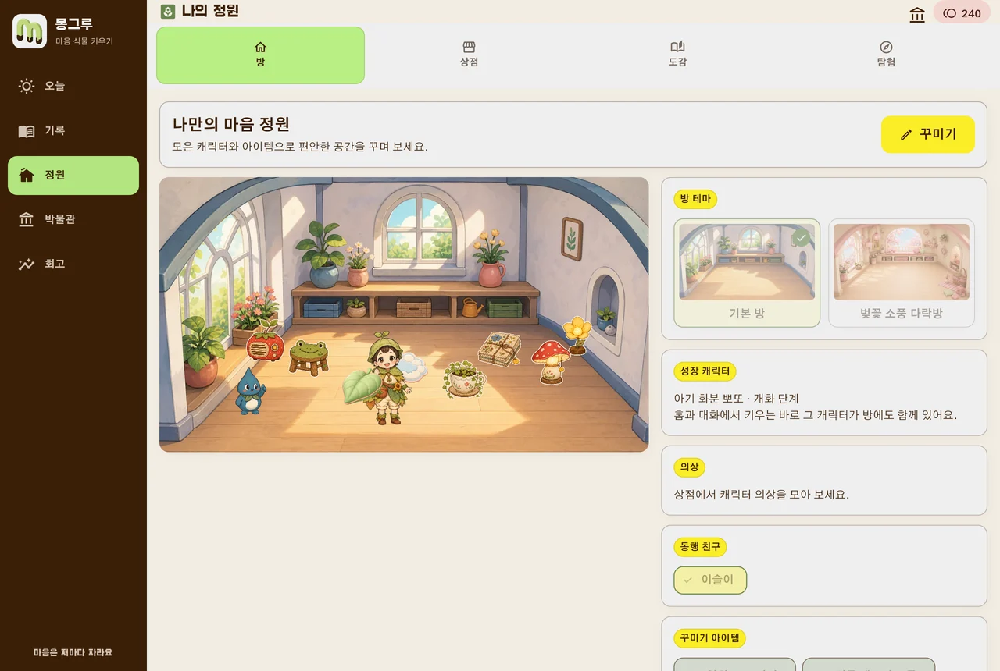

<table>
  <tr>
    <td width="42%">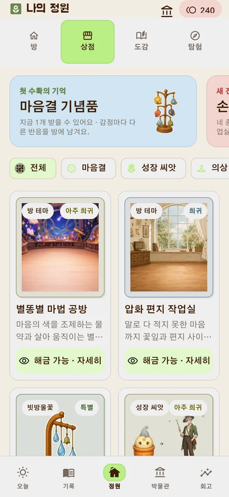</td>
    <td valign="top">
      <h3>씨앗으로 넓히는 선택지</h3>
      <p>상점에는 방 테마, 꾸미기 소품, 동행 친구, 새 성장 계보, 의상이 있습니다. 조건을 채우면 씨앗 없이 열리는 항목도 있어서, 꾸준히 기록하는 것만으로도 선택지가 늘어납니다.</p>
      <ul>
        <li>확률 뽑기가 없습니다. 가격과 조건이 그대로 보입니다.</li>
        <li>씨앗은 기록과 작은 행동으로 모읍니다.</li>
        <li>꾸민 방은 홈 화면 배경으로 그대로 이어집니다.</li>
      </ul>
    </td>
  </tr>
</table>

## 원할 때 떠나는 탐험

일기를 쓴 날에는 캐릭터와 함께 탐험을 나갈 수 있습니다. 필수는 아니고,
보상도 일기가 항상 가장 큽니다. 앱이 그 차이를 화면에 그대로 적어 둡니다.

<table>
  <tr>
    <td width="42%">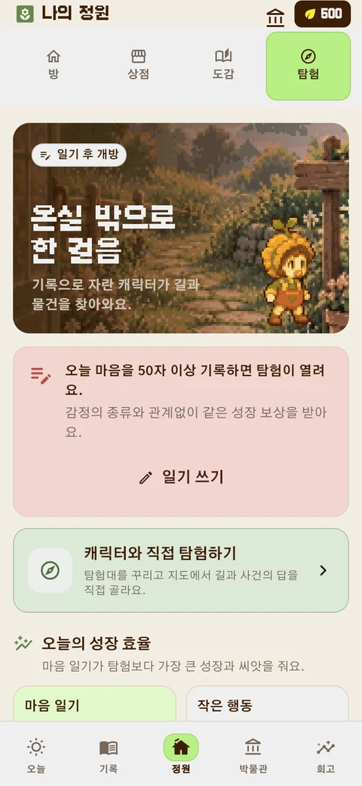</td>
    <td valign="top">
      <h3>일기가 먼저, 탐험은 그다음</h3>
      <p>탐험은 하루를 채우는 의무가 아니라 원할 때 더 들어가는 콘텐츠입니다. 며칠 건너뛰어도 기록과 성장은 사라지지 않습니다.</p>
      <ul>
        <li>탐험에 실패해도 캐릭터가 다치거나 사라지지 않아요.</li>
        <li>지나온 스테이지는 언제든 다시 걸을 수 있어요.</li>
        <li>바쁜 날에는 자동 지휘와 배속을 켜 두면 됩니다.</li>
      </ul>
    </td>
  </tr>
</table>

목적지를 목록에서 고르는 방식이 아니라, 키운 캐릭터를 한 칸씩 움직여 던전을
직접 걷습니다. 갈림길에서 어느 쪽으로 갈지 고를 수 있고, 굳이 들르지 않아도
되는 곁방에는 기록함과 떨어진 조각이 놓여 있습니다.

<p align="center">
  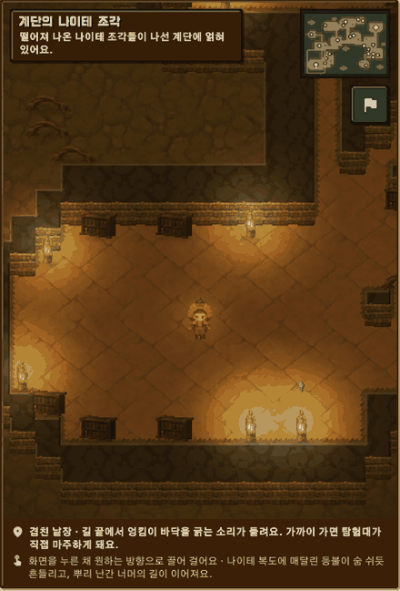
</p>

이끼 기억서고에서 시작해 메아리 우물정원, 별빛 씨앗 보관고, 마음나무 관측실까지
네 지역이 순서대로 열리고, 지역마다 여덟 스테이지가 이어집니다. 오늘 갈 곳은
언제나 하나만 크게 보여 주기 때문에 어디부터 해야 할지 고민할 일이 없습니다.

길을 막는 상대는 괴물이 아니라 돌보는 손이 모자라 엉켜 버린 서고의 물건들입니다.
적이 다음에 누구를 노리는지 먼저 보여 주고, 그걸 보고 카드 한 장을 고르면 한
차례가 끝납니다.

<p align="center">
  
</p>

## 가입 전에 3분만 써 봐도 됩니다

계정을 만들기 전에 기기 안에서만 도는 체험을 켤 수 있습니다. 마음 하나를 적고
캐릭터가 자라는 과정까지 직접 보고 나서 결정하면 됩니다.

<table>
  <tr>
    <td width="42%"></td>
    <td valign="top">
      <h3>기기 안에서만 도는 체험</h3>
      <ul>
        <li>체험 기록은 서버로 보내지 않습니다.</li>
        <li>같은 기기에서는 멈춘 곳부터 이어집니다.</li>
        <li>체험 기록이 가입 계정으로 자동으로 옮겨지지는 않습니다.</li>
      </ul>
    </td>
  </tr>
</table>

## 마음을 안심하고 남길 수 있도록

- 가입 전 체험은 서버 전송 없이 기기에만 저장합니다.
- 내 기록은 언제든 내보낼 수 있고, 앱 안에서 계정과 함께 영구 삭제할 수 있습니다.
- 도움이 필요해 보이는 표현이 감지되면 지원 안내를 먼저 보여 줍니다.

> 몽그루는 감정 기록과 회고를 돕는 서비스이며, 의료 진단이나 전문 상담을
> 대신하지 않습니다.

## 기능 한눈에

| 구분 | 내용 |
| --- | --- |
| 마음 기록 | 일기 작성 · 수정 · 삭제, 글에서 읽은 감정 반영, 달력, 주간 · 월간 회고 |
| 캐릭터 | 15종 성장 계보, 여섯 갈래 감정 성장, 다섯 단계, 캐릭터별 고유 기술, 의상 교체 |
| 생활 콘텐츠 | 오늘의 작은 행동, 씨앗, 상점, 방 · 정원 꾸미기, 도감, 박물관 |
| 탐험 | 네 지역 각 8스테이지, 칸 단위 던전 걷기, 1~3명 편성, 카드 한 장 전투, 자동 지휘 · 배속 |
| 시작 방식 | 이메일 계정, 또는 서버 전송 없는 비회원 체험 |

<details>
<summary><strong>로컬에서 실행하기</strong></summary>

<br>

API 서버와 분석 작업자를 띄운 뒤 Flutter 앱을 붙입니다.

```powershell
scripts\start_demo.ps1 -AiMode fake

cd app
flutter pub get
flutter run -d chrome --dart-define=API_BASE_URL=http://127.0.0.1:8000/api/v1
```

안드로이드 에뮬레이터와 환경별 설정은 [앱 실행 문서](app/README.md), 운영 배포는
[배포 문서](docs/deployment.md)에 있습니다.

</details>

<details>
<summary><strong>기술 구성과 상세 문서</strong></summary>

<br>

Flutter · FastAPI · MySQL

- [화면 캡처 규약](docs/screenshots/README.md)
- [직접 탐험 설계](docs/interactive_adventure_design.md)
- [전투 · 캐릭터 성장 시스템](docs/combat_system_design_v8.md)
- [성능 기준](docs/performance.md)
- [품질 점검 기준](docs/quality.md)

</details>
