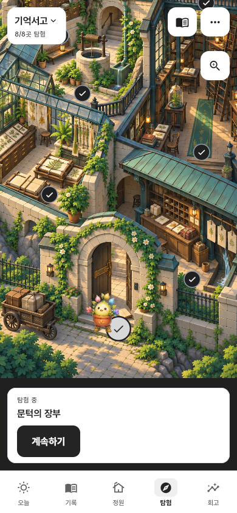
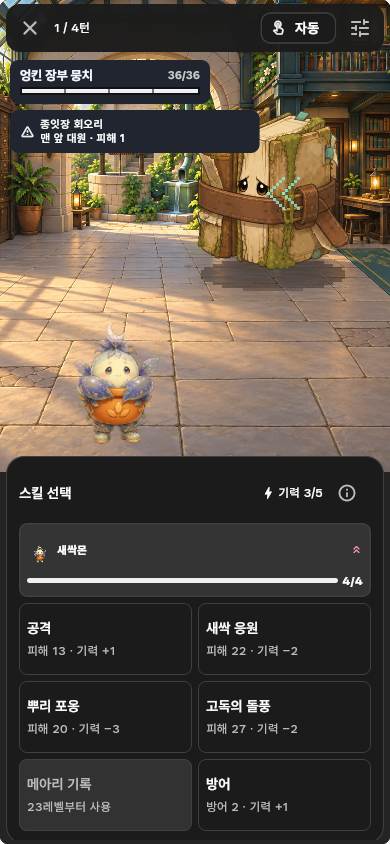
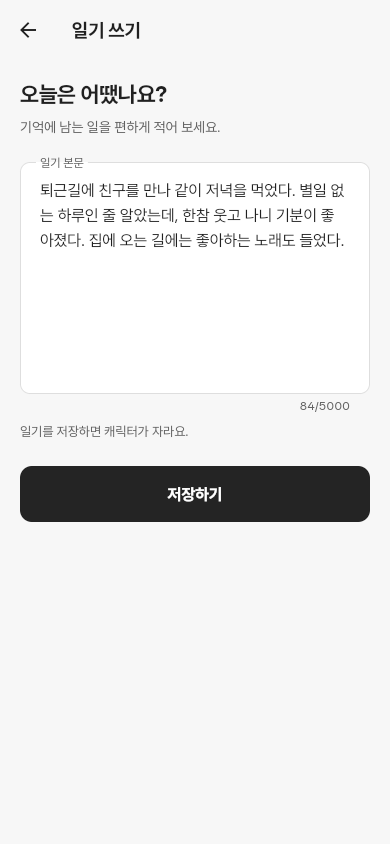
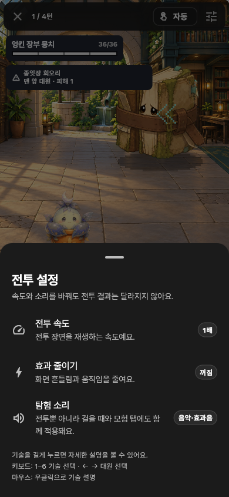
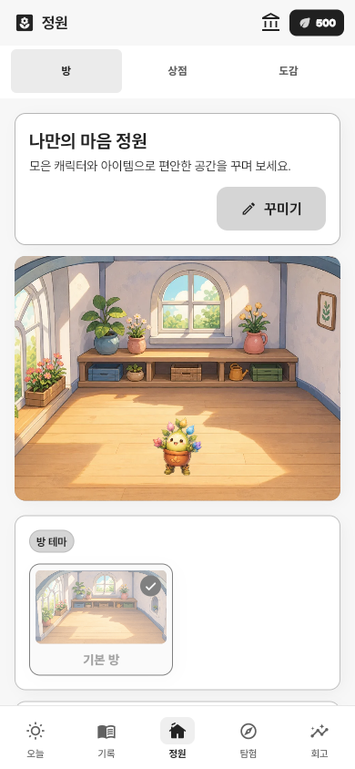

<h1 align="center">몽그루</h1>
<p align="center"><strong>일기를 쓰며 캐릭터를 키우고, 함께 탐험하는 게임</strong></p>

<p align="center">
  오늘 있었던 일을 적고, 자라난 캐릭터와 낯선 곳으로 떠나 보세요.<br>
  방을 꾸미고 새로운 캐릭터를 모으는 재미도 있어요.
</p>

<table>
  <tr>
    <td width="33%"></td>
    <td width="33%"></td>
    <td width="33%"></td>
  </tr>
  <tr>
    <td align="center"><strong>일기로 키우고</strong></td>
    <td align="center"><strong>지도를 따라 떠나고</strong></td>
    <td align="center"><strong>함께 싸워요</strong></td>
  </tr>
</table>

<sub>2026년 9월 22일 버전을 브라우저에서 직접 실행한 화면입니다. 캡처에는 테스트 계정을 사용했습니다.</sub>

## 어떤 게임인가요?

몽그루는 일기와 캐릭터 육성, 탐험을 함께 즐기는 게임입니다. 기분을 점수로 고를 필요 없이 오늘 있었던 일을 적으면 됩니다. 글에 담긴 감정에 따라 캐릭터의 모습과 성격이 달라지고, 키운 캐릭터로 탐험대를 꾸릴 수 있어요.

- **키우기** — 씨앗부터 다 자랄 때까지, 18종 캐릭터의 여러 모습을 만나요.
- **탐험하기** — 네 지역의 32개 스테이지를 걷고, 길에서 만난 사건을 해결해요.
- **전투하기** — 적의 다음 공격과 약점을 보고 공격·방어·스킬을 골라요.
- **꾸미고 모으기** — 씨앗으로 방과 의상을 꾸미고, 다 키운 캐릭터는 박물관에 남겨요.

## 한 줄부터 시작해요

기억에 남는 일을 편하게 적어 보세요. 일기를 저장하면 경험치를 받고 캐릭터가 자랍니다. 슬픈 날이나 화난 날의 기록도 성장에 불이익을 주지 않아요.

<p align="center">
  
</p>

남긴 일기는 달력에서 다시 읽고 고칠 수 있습니다. 주간·월간 돌아보기에서는 자주 기록한 감정과 지난 일기를 함께 볼 수 있어요.

## 같은 씨앗도 다르게 자라요

캐릭터는 다섯 단계를 거칩니다. 어떤 감정이 쌓였는지에 따라 여섯 타입으로 나뉘고, 모습과 말투가 달라져요. 특정 감정을 적는다고 더 빨리 자라거나 더 좋은 보상을 받지는 않습니다.


다 자란 캐릭터를 박물관에 보낸 뒤에는 새 씨앗을 심을 수 있습니다. 모은 캐릭터로 탐험대를 바꾸거나 서로 다른 스킬을 써 보는 재미도 있어요.

## 직접 걷고, 보고, 선택해요

탐험은 그림 지도에서 시작합니다. 이끼 기억서고, 메아리 우물정원, 별빛 씨앗 보관고, 마음나무 관측실을 차례로 방문해요. 필드에서는 캐릭터를 직접 움직여 길을 찾고, 장소마다 다른 이야기와 보상을 만납니다.

전투에서는 적이 누구를 공격할지 먼저 보여 줍니다. 스킬의 피해와 필요한 기력을 보고 행동을 고르세요. 스킬을 길게 누르면 자세한 설명을 볼 수 있어요.

<table>
  <tr>
    <td width="50%"></td>
    <td width="50%"></td>
  </tr>
  <tr>
    <td align="center">공격이 닿는 순간에 맞춰 움직임·소리·체력이 반응해요.</td>
    <td align="center">자동 전투와 배속을 쓸 수 있고, 움직임과 소리도 조절할 수 있어요.</td>
  </tr>
</table>

## 내 방도 꾸며 보세요

기록과 활동으로 모은 씨앗은 상점에서 씁니다. 방 테마, 소품, 의상, 새 캐릭터를 직접 골라 얻을 수 있어요. 가격과 필요한 조건을 미리 보여 주며 확률 뽑기는 없습니다.

<p align="center">
  
</p>

## 먼저 체험할 수 있어요

로그인 화면에서 **회원가입 없이 3분 체험**을 누르면 일기와 캐릭터 성장을 살펴볼 수 있습니다. 체험 기록은 서버에 보내지 않고 현재 기기에만 저장해요. 가입 후 계정으로 자동으로 옮겨지지는 않습니다.

몽그루는 현재 출시를 준비하고 있습니다. 아래 방법으로 로컬에서 실행할 수 있으며, 앱스토어 배포본은 아직 제공하지 않습니다.

<details>
<summary><strong>직접 실행하기</strong></summary>

Flutter와 Python 환경이 필요합니다. 저장소 루트에서 데모 서버를 실행한 뒤 앱을 실행하세요.

```powershell
scripts\start_demo.ps1 -AiMode fake

cd app
flutter pub get
flutter run -d chrome --dart-define=API_BASE_URL=http://127.0.0.1:8000/api/v1
```

위 명령은 외부 AI 서비스 없이 동작하는 데모 설정입니다. 실제 AI 연결과 환경별 실행 방법은 [앱 실행 안내](app/README.md), 서버 운영은 [배포 안내](docs/deployment.md)를 참고하세요.

</details>

<details>
<summary><strong>프로젝트 구성과 검수 자료</strong></summary>

Flutter · FastAPI · MySQL

- [화면·글꼴·한국어 표현의 적용 기준](design-system/2026-09-22-interface-research.md)
- [이번 버전의 검수 결과](docs/release-review-2026-09-22.md)
- [전투와 캐릭터 성장](docs/combat_system_design_v8.md)
- [배포 안내](docs/deployment.md)
- [Wanted Sans 출처와 라이선스](app/assets/fonts/README-WantedSans.md)

</details>
