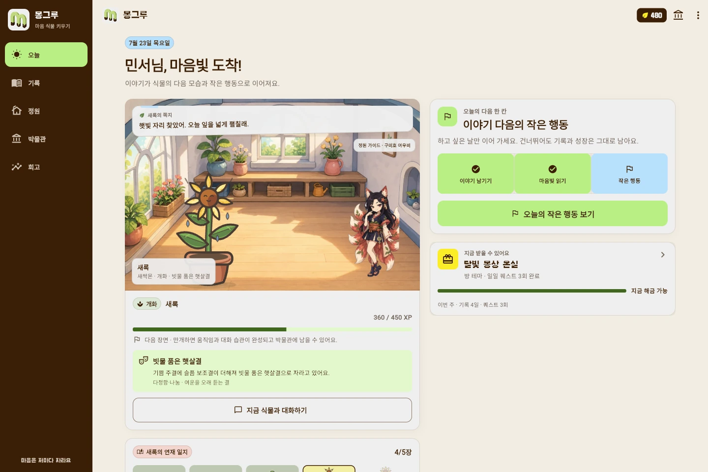
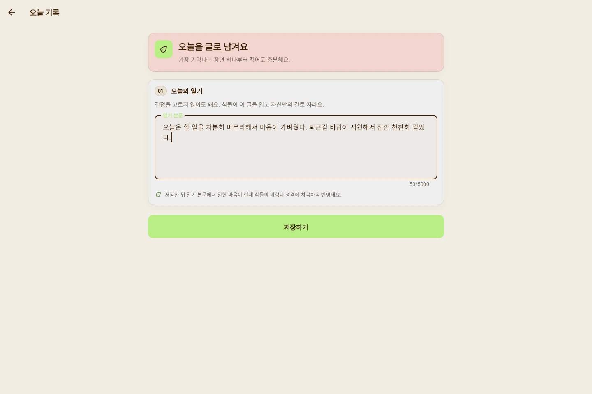
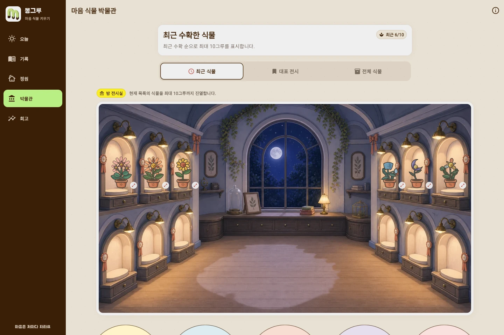

<p align="center">
  
</p>

<h1 align="center">몽그루</h1>

<p align="center">
  오늘 있었던 일을 적으면, 그 마음을 닮은 캐릭터가 자라요.
</p>

<p align="center">
  <code>Flutter</code> · <code>FastAPI</code> · <code>MySQL</code> · <code>Local AI</code>
</p>



몽그루는 감정을 직접 고르는 대신 일기를 쓰는 서비스다. 기록에서 읽힌 감정은
캐릭터의 성장 방향과 말투에 쌓이고, 가볍게 실천할 수 있는 오늘의 퀘스트로
이어진다. 꾸준히 기록하면 씨앗을 모아 새로운 캐릭터와 방 테마, 소품을 해금할
수 있다.

## 하루 기록이 자라는 과정

| 1. 기록 | 2. 성장 | 3. 회고 |
| --- | --- | --- |
| 오늘 있었던 일을 편하게 적는다. | 감정의 비중에 따라 같은 캐릭터가 다른 모습으로 자란다. | 달력과 리포트에서 마음의 흐름을 다시 본다. |

### 오늘을 적어요

기쁨이나 슬픔을 먼저 고르지 않는다. 일기 내용을 분석한 결과가 기록에 남기
때문에, 쓰는 순간에는 있었던 일에만 집중할 수 있다.

<table>
  <tr>
    <td width="50%">
      
    </td>
    <td width="50%">
      
    </td>
  </tr>
  <tr>
    <td align="center">오늘의 일기</td>
    <td align="center">월간 기록 달력</td>
  </tr>
</table>

### 같은 캐릭터가 다르게 자라요

마음 식물과 정원 캐릭터를 따로 나누지 않았다. 씨앗에서 시작한 한 캐릭터가
새싹, 유아기, 성장기를 지나 사람형 성인 캐릭터가 되고 홈과 정원에서 계속
함께한다.

기쁜 기록이 많이 쌓이면 밝고 쾌활한 모습으로, 슬픈 기록이 많으면 차분하고
우아한 모습으로 자란다. 분노, 불안, 놀람, 여러 감정이 섞인 기록도 각자 다른
성장 경로를 가진다.


현재 뽀또, 로제온, 블루미, 가시로, 시들잎, 여우비, 그림싹, 별솔, 설화, 하루까지
10개 계보를 만들었다. 캐릭터마다 고유 씨앗 1개와 여섯 감정별 성장 스프라이트를
사용하며, 앱에는 총 250개의 투명 WebP 에셋이 들어간다.

<details>
<summary>캐릭터 10종의 전체 성장 에셋 보기</summary>


</details>

## 기록을 이어 가는 장치

일기를 쓴 뒤 부담이 적은 일일 퀘스트를 하나 제안한다. 퀘스트와 기록으로 모은
씨앗은 성장 계보, 방 테마, 정원 가이드와 소품을 해금할 때 사용한다.

<table>
  <tr>
    <td width="33%">
      
    </td>
    <td width="33%">
      
    </td>
    <td width="33%">
      
    </td>
  </tr>
  <tr>
    <td align="center">오늘의 퀘스트</td>
    <td align="center">상점과 씨앗 재화</td>
    <td align="center">나만의 정원</td>
  </tr>
</table>

상점은 완성된 캐릭터 한 장을 판매하지 않는다. 씨앗부터 감정별 성인 모습까지
확인한 다음 새로 키울 성장 계보를 해금하는 방식이다.


## 쌓인 마음을 다시 봐요

다 자란 캐릭터는 박물관에 남는다. 성장 단계와 그때 쌓인 감정을 다시 확인할 수
있고, 주간·월간 리포트에서는 자주 나타난 감정과 기록을 돌아볼 질문을 제공한다.

<table>
  <tr>
    <td width="50%">
      
    </td>
    <td width="50%">
      
    </td>
  </tr>
  <tr>
    <td align="center">마음 식물 박물관</td>
    <td align="center">주간·월간 회고</td>
  </tr>
</table>

> 몽그루는 감정 기록과 회고를 돕는 서비스다. 의료 진단이나 상담을 대신하지
> 않는다.

## 구현 범위

- 이메일 로그인과 회전형 refresh token 기반 세션
- 일기 작성·수정·삭제, 감정 분석과 기록 달력
- 감정 누적값을 반영한 캐릭터 성장과 대화
- 일일 퀘스트, 경험치, 씨앗 보상과 연속 기록
- 성장 계보·방 테마·가이드·소품 상점
- 정원 꾸미기와 캐릭터·아이템 도감
- 수확한 캐릭터 박물관과 주간·월간 리포트
- 위험 표현 감지와 도움받기 안내

## 프로젝트 구성

```text
app/             Flutter 앱
server/          FastAPI API와 백그라운드 worker
ai/              감정 분류기와 대화 모델 실험
design-system/   캐릭터 원화, 성장 규칙, 에셋 빌드 도구
docs/            설계, API, 배포, 품질 문서와 실제 화면 캡처
```

<details>
<summary>로컬 실행</summary>

로컬 데모는 MySQL, API, AI worker를 실행한 뒤 Flutter 앱을 연결한다.

```powershell
scripts\start_demo.ps1 -AiMode fake

cd app
flutter pub get
flutter run -d chrome --dart-define=API_BASE_URL=http://127.0.0.1:8000/api/v1
```

실제 로컬 모델을 사용할 때는 `-AiMode local`로 실행한다. Android 에뮬레이터와
배포 환경 설정은 [앱 실행 문서](app/README.md)와
[배포 문서](docs/deployment.md)에 정리해 두었다.

</details>
