<p align="center">
  
</p>

<h1 align="center">몽그루</h1>

<p align="center">
  <strong>나쁜 감정은 없어요.</strong><br>
  오늘의 마음을 적으면, 그 마음을 닮은 캐릭터가 함께 자랍니다.
</p>

<p align="center">
  감정 일기&nbsp;&nbsp;·&nbsp;&nbsp;캐릭터 성장&nbsp;&nbsp;·&nbsp;&nbsp;마음 회고&nbsp;&nbsp;·&nbsp;&nbsp;함께하는 탐험
</p>

<p align="center">
  
</p>

<p align="center"><sub>마음을 적고, 돌보고, 함께 살아가는 과정을 담았습니다.</sub></p>

## 기록이 곧 성장입니다

감정을 좋고 나쁨으로 평가하거나 먼저 고르게 하지 않습니다. 있었던 일을 편하게
적으면 기록 속 마음이 성장 방향에 쌓이고, 같은 캐릭터도 서로 다른 모습과 성격으로
자랍니다.

<table>
  <tr>
    <td width="33%">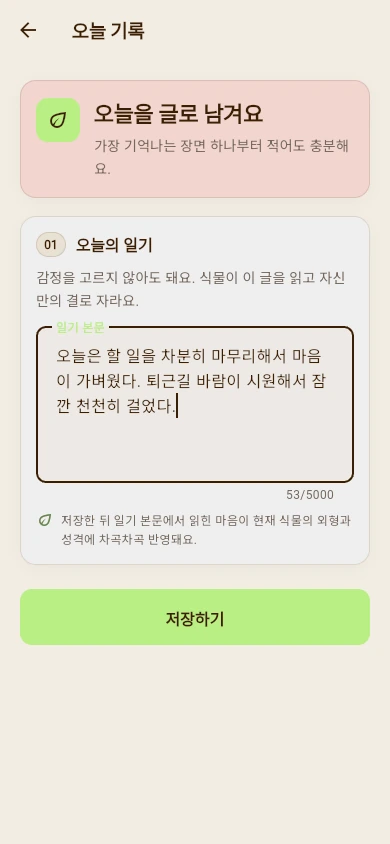</td>
    <td width="33%"></td>
    <td width="33%">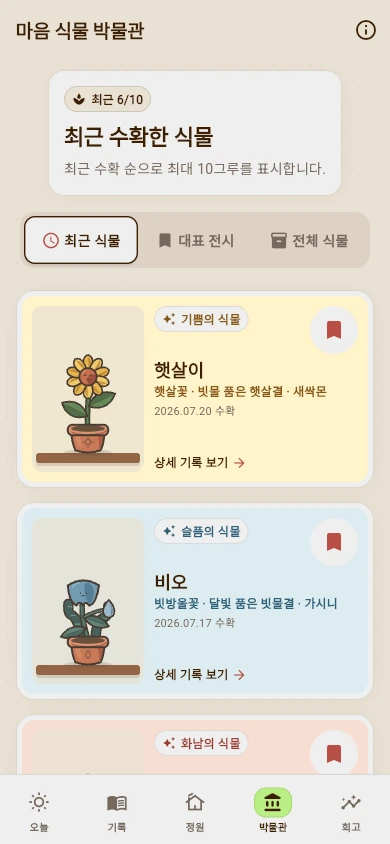</td>
  </tr>
  <tr>
    <td align="center"><strong>1. 마음 기록</strong><br><sub>있었던 일을 편하게 적어요</sub></td>
    <td align="center"><strong>2. 함께 성장</strong><br><sub>감정의 결을 닮아 자라요</sub></td>
    <td align="center"><strong>3. 오래 간직</strong><br><sub>성장 과정과 추억을 남겨요</sub></td>
  </tr>
</table>

<table>
  <tr>
    <td width="50%">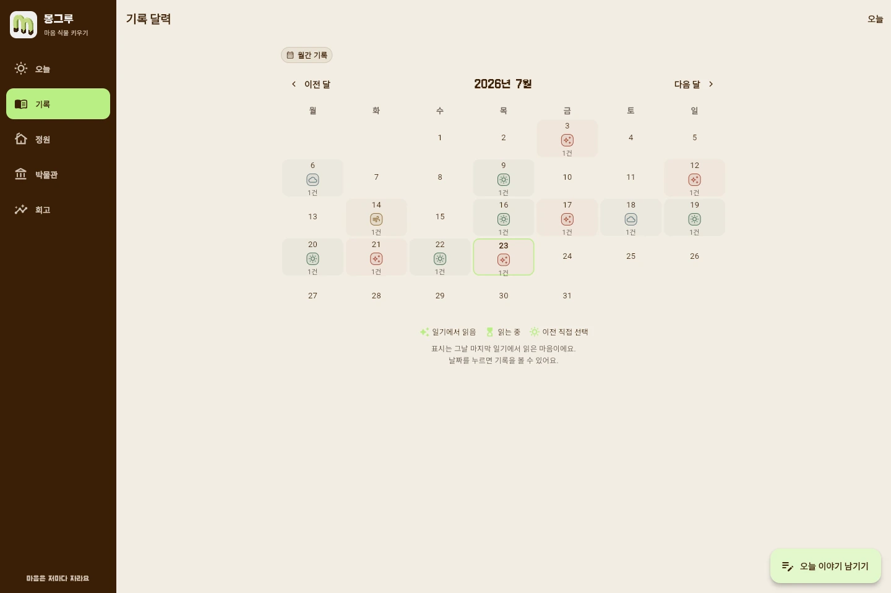</td>
    <td width="50%">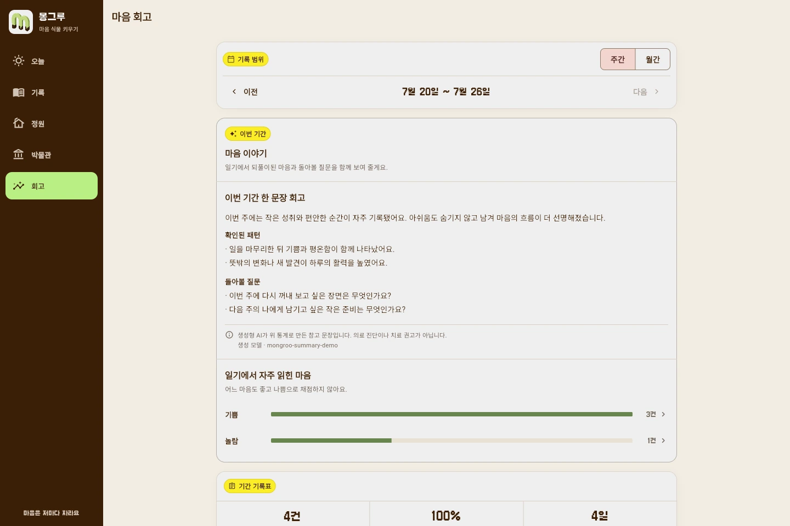</td>
  </tr>
  <tr>
    <td align="center">날짜별로 다시 보는 마음 달력</td>
    <td align="center">흐름을 돌아보는 주간·월간 리포트</td>
  </tr>
</table>

## 감정마다 다른 모습으로 자라요

기쁨이 많이 쌓인 캐릭터와 슬픔, 분노, 불안, 놀람, 복합 감정이 많이 쌓인
캐릭터는 성장 후의 분위기와 표정, 움직임이 달라집니다. 씨앗부터 성인 모습까지
한 계보로 이어지며 홈과 정원에서도 계속 함께합니다.

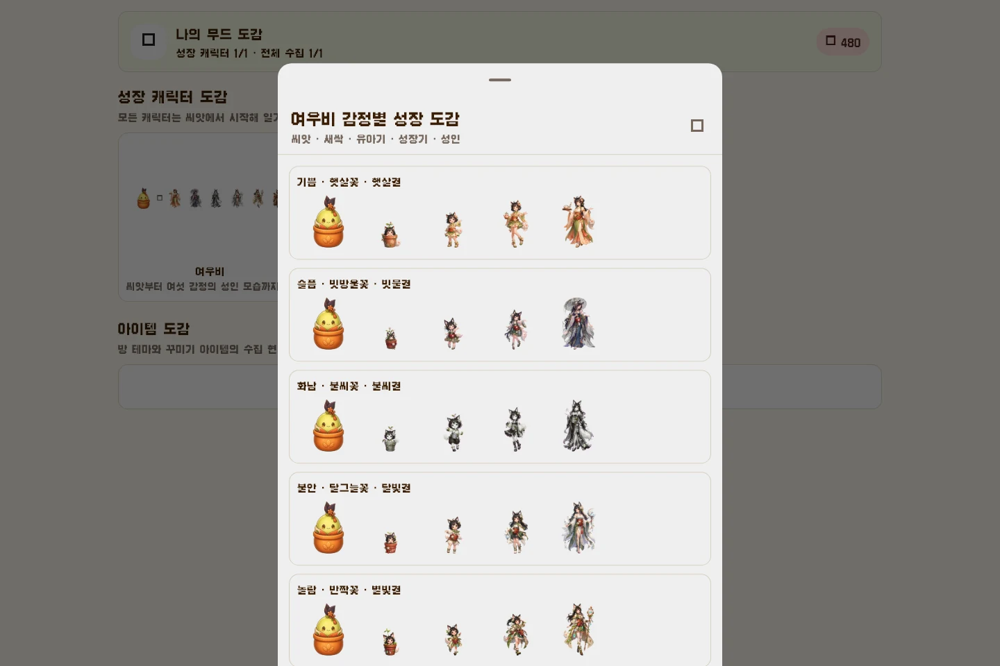

뽀또, 로제온, 블루미, 가시로, 시들잎, 여우비, 그림싹, 별솔, 설화, 하루에
백의 수호사 백화와 공명 지휘자 세렌, 황혼 복원사 에단, 잎귀 담비 모루,
스타일 메이커 리아가 합류해 15개 성장 계보가 준비되어 있습니다.

<details>
<summary><strong>기존 10종 캐릭터의 전체 성장 경로 보기</strong></summary>


</details>

### 위기의 순간을 바꾸는 두 지원가

<table>
  <tr>
    <td width="50%"></td>
    <td width="50%"></td>
  </tr>
  <tr>
    <td align="center"><strong>백의 수호사 백화</strong><br><sub>치료와 보호, 성장 후에는 쓰러진 동료의 생명선까지 다시 이어요</sub></td>
    <td align="center"><strong>공명 지휘자 세렌</strong><br><sub>행동 순서를 지휘해 뒤따르는 동료를 강화하고 적의 박자를 끊어요</sub></td>
  </tr>
</table>

백화의 `순백 트리아주`, 세렌의 `미드나잇 레조넌스`는 캐릭터를 만날 때 함께
열리는 전용 기본 복장입니다. 큰 장식과 과한 반짝임 대신 각자의 역할이 읽히는 색과
실루엣에 집중했습니다. 백화는 끊어진 생명선을 다시 잇는 백색 정원의 수호사,
세렌은 위험한 감정 소음을 한 박자 끊어 다음 행동을 여는 야상 공명홀의 지휘자입니다.

### 서로 다른 방식으로 길을 여는 세 캐릭터

<table>
  <tr>
    <td width="33%"></td>
    <td width="33%"></td>
    <td width="33%"></td>
  </tr>
  <tr>
    <td align="center"><strong>황혼 복원사 에단</strong><br><sub>공격을 흘리고 갈라진 기억을 금빛으로 다시 이어요</sub></td>
    <td align="center"><strong>잎귀 담비 모루</strong><br><sub>약점을 먼저 찾아 달리고 동료가 돌아올 길을 지켜요</sub></td>
    <td align="center"><strong>스타일 메이커 리아</strong><br><sub>약점색과 행동 순서를 엮어 파티의 다음 움직임을 살려요</sub></td>
  </tr>
</table>

세 캐릭터 모두 씨앗부터 다섯 단계로 자라며, 구매할 때 각자의 전용 기본 복장도
함께 열립니다. 에단은 40세까지 이어지는 사람형 성장, 모루는 새끼 담비에서
둥지지기로 자라는 동물형 성장, 리아는 만들기를 좋아하던 아이가 스타일 메이커가
되는 성장으로 서로 다른 시간을 보여 줍니다.

## 회원가입 전에 먼저 만나 보세요

<table>
  <tr>
    <td width="38%">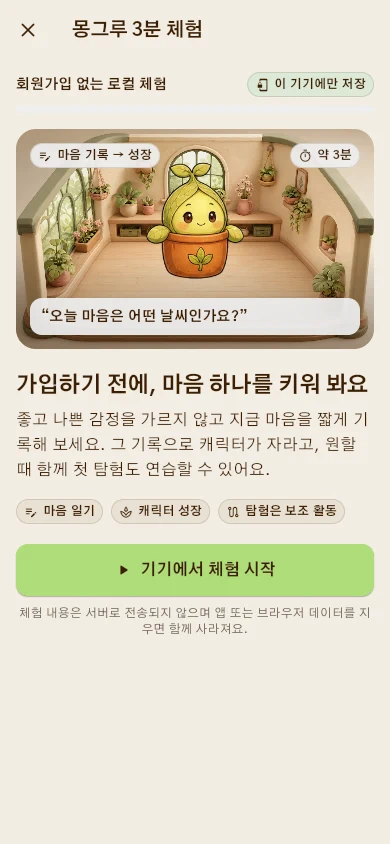</td>
    <td valign="top">
      <h3>기기 안에서 시작하는 3분 체험</h3>
      <p>가입하기 전에 마음 하나를 기록하고, 캐릭터가 자라는 과정과 짧은 탐험까지 직접 확인할 수 있습니다.</p>
      <ul>
        <li>체험 기록은 서버로 전송하지 않습니다.</li>
        <li>같은 기기에서는 중단한 단계부터 이어집니다.</li>
        <li>체험 기록이 가입 계정에 자동으로 합쳐지지 않습니다.</li>
      </ul>
    </td>
  </tr>
</table>

## 키운 캐릭터와 일상을 이어 가요

마음 일기가 가장 큰 성장과 보상의 출발점입니다. 기록을 마친 뒤에는 부담이 적은
일일 미션을 실천하고, 모은 씨앗으로 새 성장 계보와 의상, 방 테마와 소품을
해금할 수 있습니다.

<table>
  <tr>
    <td width="33%">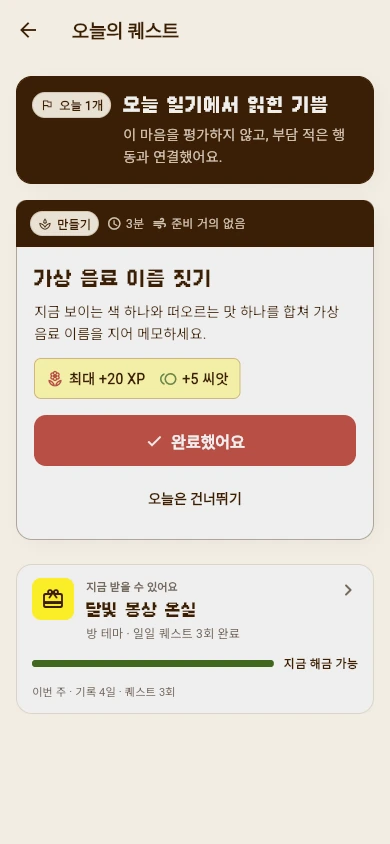</td>
    <td width="33%">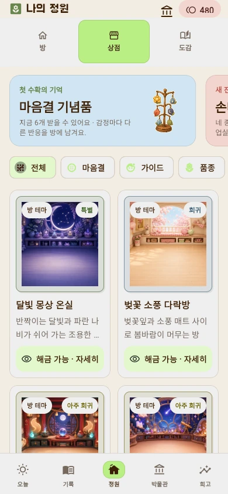</td>
    <td width="33%"></td>
  </tr>
  <tr>
    <td align="center"><strong>오늘의 미션</strong><br><sub>마음에서 이어지는 작은 행동</sub></td>
    <td align="center"><strong>상점과 의상</strong><br><sub>씨앗으로 넓히는 선택지</sub></td>
    <td align="center"><strong>나만의 공간</strong><br><sub>캐릭터와 꾸미는 방과 정원</sub></td>
  </tr>
</table>

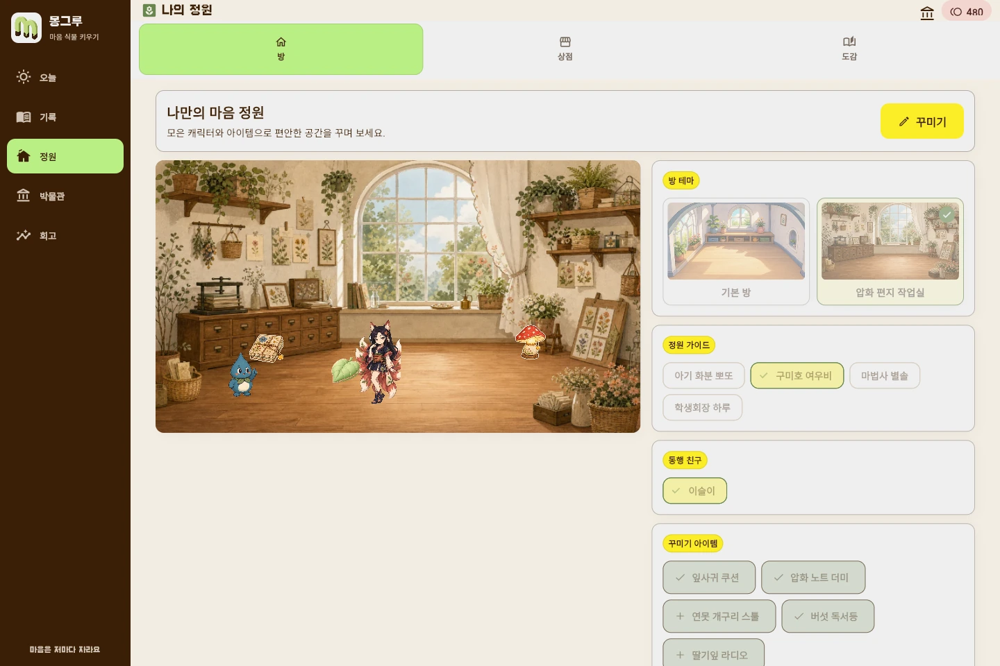

## 키운 캐릭터와 함께, 오늘의 모험

모험은 일기를 대신하는 콘텐츠가 아니라, 정성껏 키운 캐릭터와 더 오래 함께하기
위한 RPG 콘텐츠입니다. 오늘 갈 곳은 언제나 하나 — `이어서 모험하기`를 누르면
기억서고의 스테이지 지도가 열리고, 전투·사건·쉼터·수호전이 여덟 걸음으로
이어집니다.

<table>
  <tr>
    <td width="33%">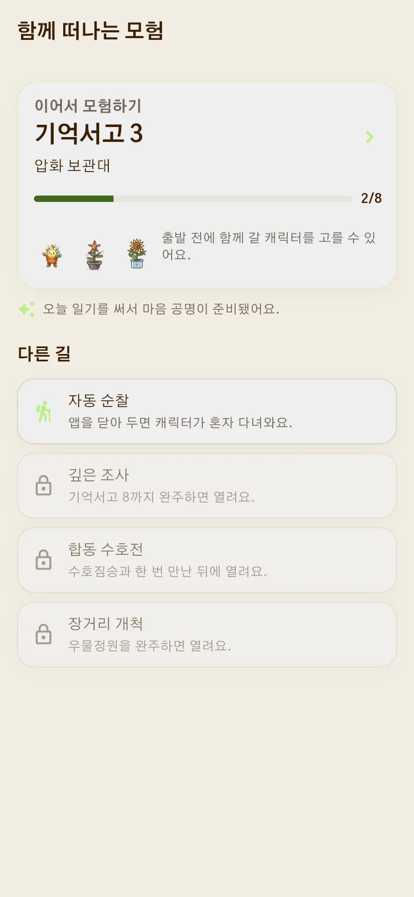</td>
    <td width="33%">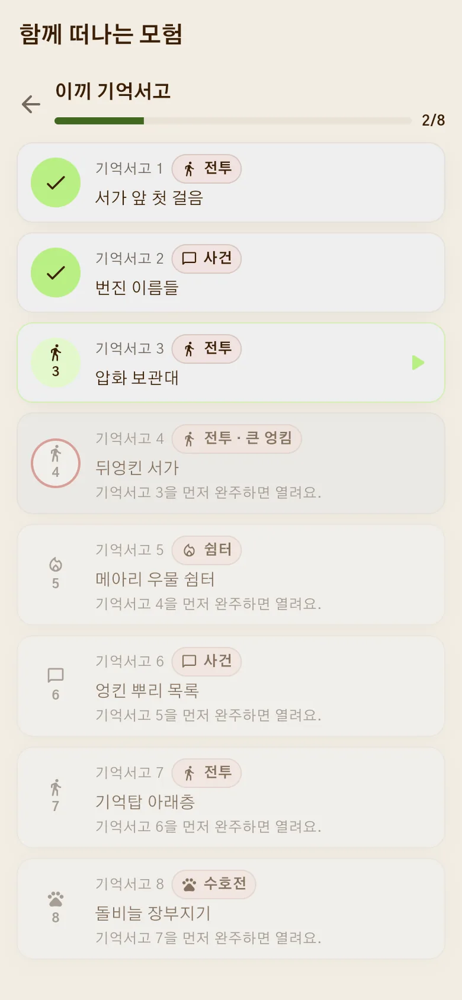</td>
    <td width="33%">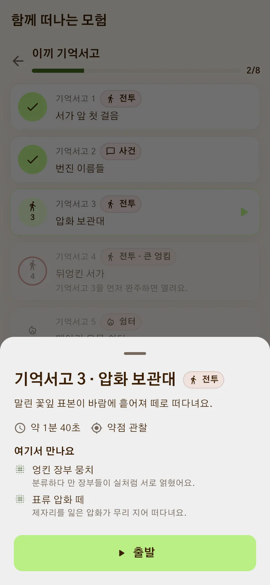</td>
  </tr>
  <tr>
    <td align="center"><strong>오늘 갈 곳 하나</strong><br><sub>허브는 다음 스테이지만 크게 보여 줘요</sub></td>
    <td align="center"><strong>여덟 걸음의 지도</strong><br><sub>전투·사건·쉼터·수호전이 한 길로</sub></td>
    <td align="center"><strong>떠나기 전에 미리</strong><br><sub>누굴 만나고 얼마나 걸리는지 먼저 확인</sub></td>
  </tr>
</table>

### 약점은 보이고, 선택은 한 장으로 끝나요

전투가 시작되면 `새싹이는 무엇을 할까요?` 하고 물어 옵니다. 적이 다음에 누구를
노리는지, 어떤 성장결에 약하고 강한지를 먼저 보여 주기 때문에 결과를 모른 채
카드를 고를 필요가 없습니다. 햇살결·달빛결, 빗물결·불씨결, 별빛결·모아결은
서로 마주 보는 세 쌍이라 몇 번만 플레이해도 자연스럽게 익힐 수 있습니다.

<table>
  <tr>
    <td width="50%">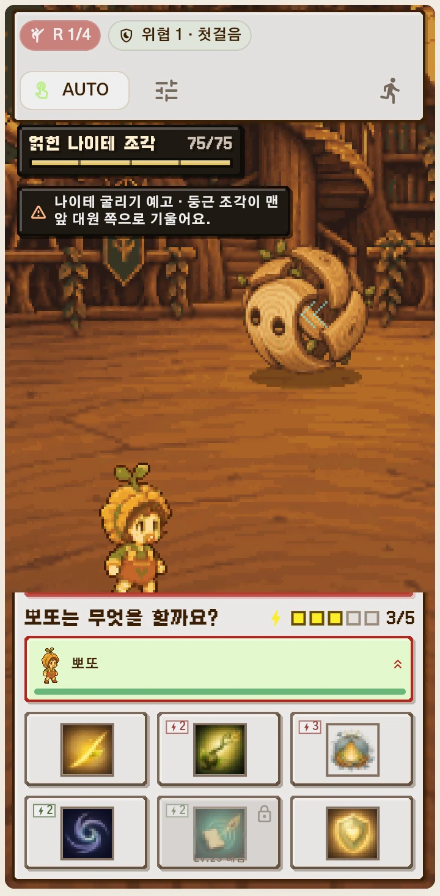</td>
    <td width="50%">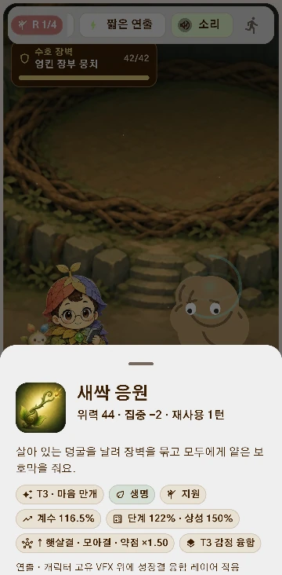</td>
  </tr>
  <tr>
    <td align="center"><strong>한눈에 읽는 전장</strong><br><sub>적의 예고·약점·집중력·현재 차례를 한곳에</sub></td>
    <td align="center"><strong>길게 눌러 자세히</strong><br><sub>계수·성장 단계·상성·재사용 대기시간까지</sub></td>
  </tr>
</table>

카드 여섯 장의 자리는 전투 내내 바뀌지 않습니다. 사용할 수 없는 스킬은 남은
턴 수가 바로 표시되고, 약점을 찌르는 카드는 붉은 테두리와 화살표로 알려 줍니다.
카드를 누르면 별도의 확인창 없이 캐릭터가 움직이고, 효과가 실제 대상에게 닿은
뒤 다음 대원에게 차례가 넘어갑니다.

15종 모두 서로 다른 고유 기술을 두 개씩 갖습니다. 성장하면 Lv3과 Lv7에 하나씩
열리고, Lv16·25에는 피해만 오르는 대신 회복·보호·집중 회수·약화·소생·정밀
마무리 같은 기믹과 소리, 접촉 연출도 함께 깊어집니다. Lv25 고유 기술은 캐릭터의
공격 형태를 유지한 채 지금까지 자란 감정의 색과 재질을 한 겹 더 입습니다.
수호전의 마지막 보스는 장벽 66%와 33%에서 약점과 공격 흐름이 바뀝니다.

<table>
  <tr>
    <td width="50%">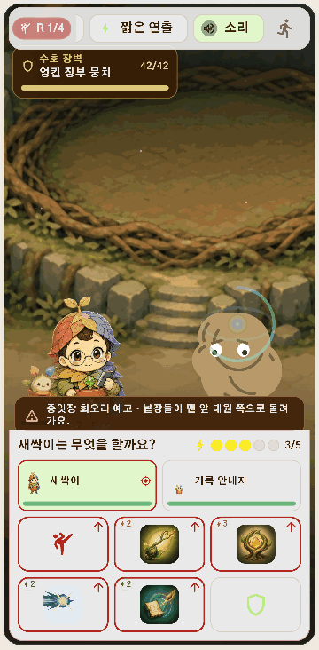</td>
    <td width="50%">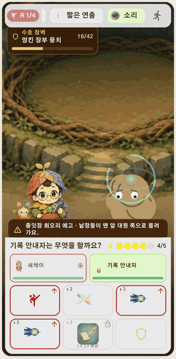</td>
  </tr>
  <tr>
    <td align="center"><strong>누르면 바로 행동</strong><br><sub>준비 동작부터 이동·접촉·피격까지 이어져요</sub></td>
    <td align="center"><strong>예고를 보고 대비</strong><br><sub>방어로 받아 내고 다음 라운드를 준비해요</sub></td>
  </tr>
</table>

대원이 모두 행동하면 예고했던 적의 차례가 시작됩니다. 자동 지휘와 2배속,
짧은 연출 모드는 화면 위에 항상 있으니 바쁜 날에는 맡기고, 중요한 전투만 직접
지휘해도 됩니다.

### 무찌르는 게 아니라, 풀어 주는 거예요

길을 막는 상대는 괴물이 아니라 돌보는 손이 모자라 엉켜 버린 서고의 물건들 —
**엉킴**입니다. 장벽을 다독여 풀어 내면 엉킨 장부와 압화는 제자리로 돌아가고,
다음 엉킴이 이어서 나타납니다. 선반 세 칸이 통째로 엉킨 **큰 엉킴**도 있지만,
탐험에 실패해도 캐릭터가 다치거나 사라지는 일은 없습니다.

<table>
  <tr>
    <td width="38%">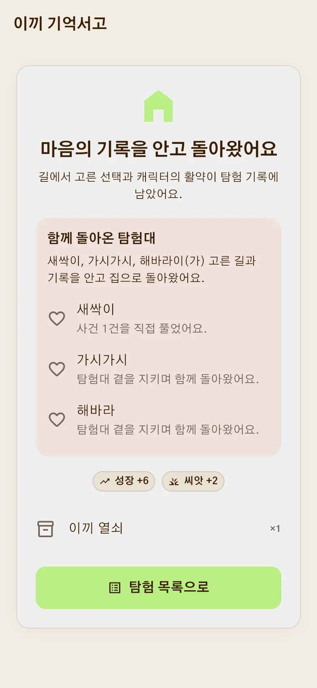</td>
    <td valign="top">
      <h3>함께 돌아온 기록</h3>
      <p>스테이지를 마치면 누가 어떤 활약을 했는지, 무엇을 주워 왔는지가 한 장으로 남습니다. 오늘 일기를 썼다면 성장과 씨앗도 함께 돌아옵니다.</p>
      <ul>
        <li>져도 잃는 것은 없어요. 캐릭터는 다치거나 사라지지 않아요.</li>
        <li>클리어한 스테이지는 언제든 다시 걸을 수 있어요.</li>
        <li>보상의 중심은 언제나 마음 일기 — 모험이 일기를 앞지르지 않아요.</li>
      </ul>
    </td>
  </tr>
</table>

## 마음을 안심하고 남길 수 있도록

| 가입 전 체험 | 내 기록 관리 | 위험 신호 안내 |
| --- | --- | --- |
| 서버 전송 없이 기기에만 저장 | 계정 데이터 내보내기와 앱 안에서 영구 삭제 | 도움이 필요한 표현을 감지하면 지원 안내 제공 |

> 몽그루는 감정 기록과 회고를 돕는 서비스이며, 의료 진단이나 전문 상담을
> 대신하지 않습니다.

## 몽그루에서 이어지는 하루

| 구분 | 제공 기능 |
| --- | --- |
| 마음 기록 | 일기 작성·수정·삭제, 감정 성장 반영, 달력, 주간·월간 회고 |
| 캐릭터 | 15종 성장 계보, 감정별 성장, 캐릭터별 고유 기술 30종, 표정·부분 모션, 의상 교체 |
| 생활 콘텐츠 | 일일 미션, 씨앗 재화, 상점, 방·정원 꾸미기, 박물관 |
| 모험 | 스테이지 지도(전투·사건·쉼터·수호전), 1~3명 편성, 카드 한 장으로 즉시 행동하는 전투, 엉킴 웨이브, 자동 지휘·배속 |
| 시작 방식 | 이메일 계정 또는 서버 전송 없는 비회원 체험 |

<details>
<summary><strong>로컬에서 실행하기</strong></summary>

MySQL, API, 분석 작업자를 실행한 뒤 Flutter 앱을 연결합니다.

```powershell
scripts\start_demo.ps1 -AiMode fake

cd app
flutter pub get
flutter run -d chrome --dart-define=API_BASE_URL=http://127.0.0.1:8000/api/v1
```

Android 에뮬레이터와 환경별 설정은 [앱 실행 문서](app/README.md), 운영 배포는
[배포 문서](docs/deployment.md)에서 확인할 수 있습니다.

</details>

<details>
<summary><strong>기술 구성과 상세 문서</strong></summary>

- Flutter · FastAPI · MySQL
- [직접 탐험 설계](docs/interactive_adventure_design.md)
- [수동 전투 규칙](docs/expedition_manual_combat.md)
- [전투·캐릭터 성장 시스템](docs/combat_system_design_v8.md)
- [성능 기준](docs/performance.md)
- [품질 점검 기준](docs/quality.md)

</details>
