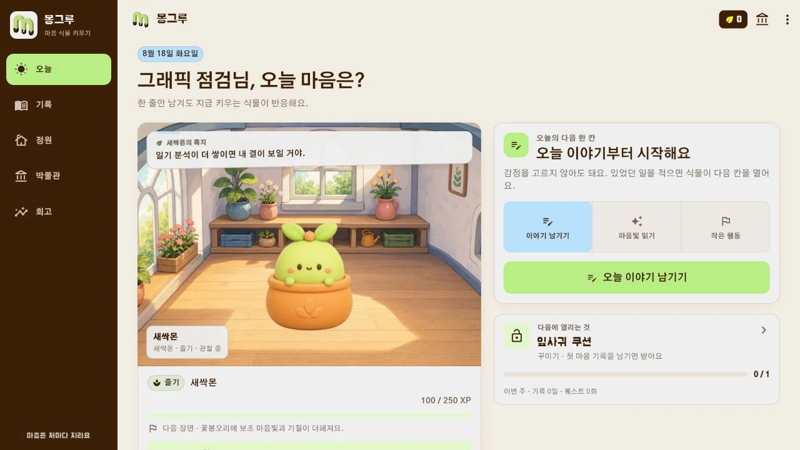
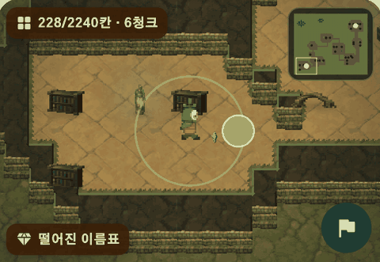
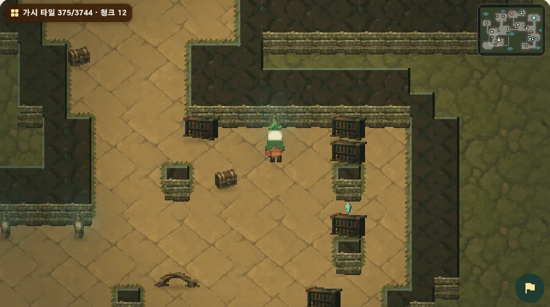
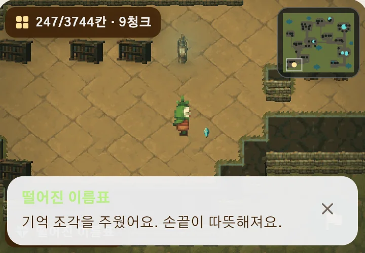
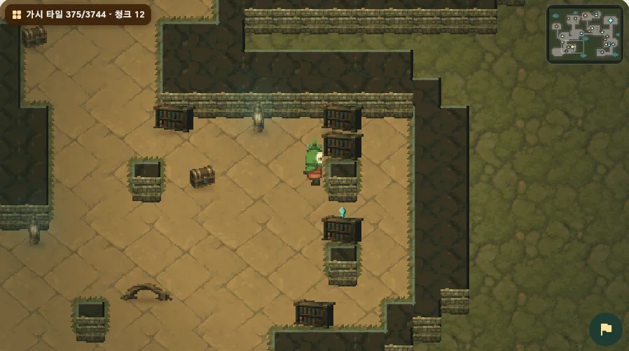
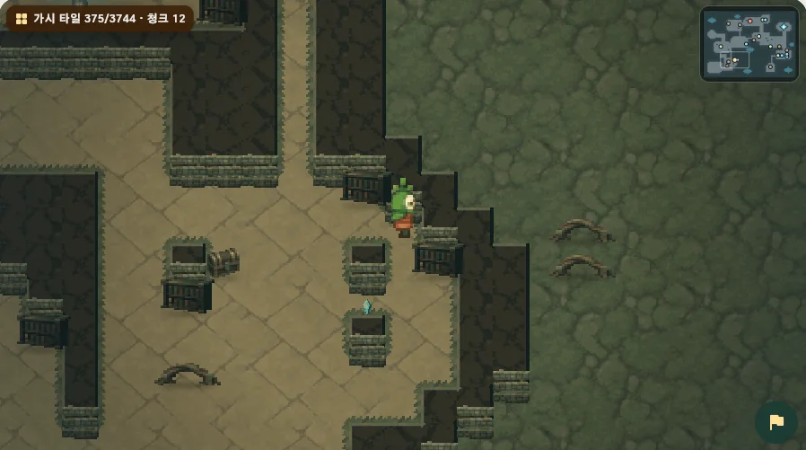
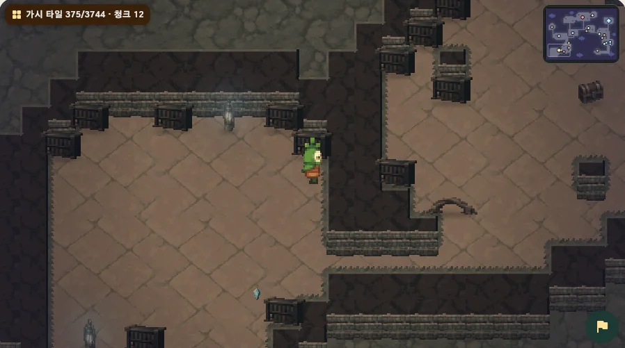
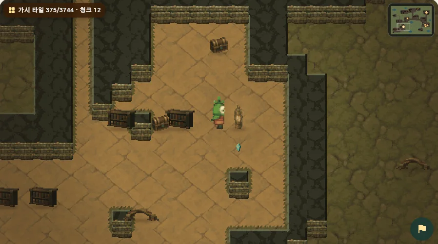

<p align="center">
  
</p>

<h1 align="center">몽그루</h1>

<p align="center">
  <strong>나쁜 감정은 없어요.</strong><br>
  오늘의 마음을 적으면, 그 마음을 닮은 캐릭터가 함께 자랍니다.
</p>

<p align="center">
  감정 일기&nbsp;&nbsp;·&nbsp;&nbsp;캐릭터 성장&nbsp;&nbsp;·&nbsp;&nbsp;마음 회고&nbsp;&nbsp;·&nbsp;&nbsp;함께하는 탐험
</p>

<p align="center">
  
</p>

<p align="center"><sub>홈 화면. 오늘 적은 마음과 지금 함께 자라는 캐릭터가 한눈에 보입니다.</sub></p>

## 기록이 곧 성장입니다

감정을 좋고 나쁨으로 평가하거나 먼저 고르게 하지 않습니다. 있었던 일을 편하게
적으면 기록 속 마음이 성장 방향에 쌓이고, 같은 캐릭터도 서로 다른 모습과 성격으로
자랍니다.

<table>
  <tr>
    <td width="33%"></td>
    <td width="33%"></td>
    <td width="33%"></td>
  </tr>
  <tr>
    <td align="center"><strong>1. 마음 기록</strong><br><sub>있었던 일을 편하게 적어요</sub></td>
    <td align="center"><strong>2. 함께 성장</strong><br><sub>감정의 결을 닮아 자라요</sub></td>
    <td align="center"><strong>3. 오래 간직</strong><br><sub>성장 과정과 추억을 남겨요</sub></td>
  </tr>
</table>

<table>
  <tr>
    <td width="50%"></td>
    <td width="50%"></td>
  </tr>
  <tr>
    <td align="center">날짜별로 다시 보는 마음 달력</td>
    <td align="center">흐름을 돌아보는 주간·월간 리포트</td>
  </tr>
</table>

## 감정마다 다른 모습으로 자라요

기쁨이 많이 쌓인 캐릭터와 슬픔, 분노, 불안, 놀람, 복합 감정이 많이 쌓인
캐릭터는 성장 후의 분위기와 표정, 움직임이 달라집니다. 씨앗부터 성인 모습까지
한 계보로 이어지며 홈과 정원에서도 계속 함께합니다.


뽀또, 로제온, 블루미, 가시로, 시들잎, 여우비, 그림싹, 별솔, 설화, 하루, 백화,
세렌, 에단, 모루, 리아까지 15개 성장 계보가 있고, 캐릭터마다 성장 방식과 전투에서
맡는 역할이 다릅니다. 새 캐릭터를 만나면 전용 기본 복장도 함께 열립니다.

<details>
<summary><strong>10종 캐릭터의 전체 성장 경로 보기</strong></summary>


</details>

## 키운 캐릭터와 일상을 이어 가요

마음 일기가 가장 큰 성장과 보상의 출발점입니다. 기록을 마친 뒤에는 부담이 적은
일일 미션을 실천하고, 모은 씨앗으로 새 성장 계보와 의상, 방 테마와 소품을
해금할 수 있습니다.

<table>
  <tr>
    <td width="33%"></td>
    <td width="33%"></td>
    <td width="33%"></td>
  </tr>
  <tr>
    <td align="center"><strong>오늘의 미션</strong><br><sub>마음에서 이어지는 작은 행동</sub></td>
    <td align="center"><strong>상점과 의상</strong><br><sub>씨앗으로 넓히는 선택지</sub></td>
    <td align="center"><strong>나만의 공간</strong><br><sub>캐릭터와 꾸미는 방과 정원</sub></td>
  </tr>
</table>


## 키운 캐릭터와 함께, 오늘의 모험

오늘 갈 곳은 언제나 하나입니다. 허브는 다음에 갈 곳 하나만 크게 보여 주고,
떠나기 전에 누굴 만나는지와 걸리는 시간을 먼저 알려 줍니다. 한 지역은 여덟
걸음의 지도로 이어지고, 마지막 이야기가 다음 지역으로 이어집니다.

<table>
  <tr>
    <td width="33%"></td>
    <td width="33%"></td>
    <td width="33%"></td>
  </tr>
  <tr>
    <td align="center"><strong>오늘 갈 곳 하나</strong><br><sub>허브는 다음 스테이지만 크게 보여 줘요</sub></td>
    <td align="center"><strong>여덟 걸음의 지도</strong><br><sub>전투·사건·쉼터·수호전이 한 길로</sub></td>
    <td align="center"><strong>떠나기 전에 미리</strong><br><sub>누굴 만나고 얼마나 걸리는지 먼저 확인</sub></td>
  </tr>
</table>

### 던전을 직접 걸어요

목적지를 목록에서 고르지 않습니다. 키운 캐릭터를 한 칸씩 움직여 던전을
돌아다닙니다. 화면을 누른 채 가고 싶은 쪽으로 밀면 그쪽으로 한 칸 걷고, 벽이나
물에 막히면 그 자리에서 방향만 바뀝니다.



길은 하나가 아닙니다. 갈림길에서 위로 돌아갈지 가운데를 가로지를지 고를 수
있고, 복도에서 갈라져 나간 곁방은 굳이 들르지 않아도 되지만 들르면 얻을 것이
있습니다. 방마다 놓인 것도 다릅니다. 석주가 두 줄로 선 주랑, 결정이 빛나는
정원, 서가가 줄지어 선 서고, 물이 고인 뜰, 뿌리가 무너져 들어온 폐허를 지나며
기록함을 열고 떨어진 조각을 줍습니다.



물건과 사람 앞에 서면 말을 걸 수 있습니다. 기록지기와 정원지기는 그 지역에서만
들을 수 있는 이야기를 해 주고, 엉킴과 눈이 마주치면 그 자리에서 전투가
시작됩니다.



### 네 지역, 네 개의 다른 땅

이끼 기억서고에서 시작해 메아리 우물정원, 별빛 씨앗 보관고, 마음나무 관측실까지
네 곳이 순서대로 열립니다. 지역마다 지형과 빛, 밟는 소리와 배경음이 다르고,
같은 지역의 같은 스테이지는 언제 다시 가도 같은 땅이라 `여기 와 봤다`는 감각이
쌓입니다.

<table>
  <tr>
    <td width="50%"></td>
    <td width="50%"></td>
  </tr>
  <tr>
    <td align="center"><strong>이끼 기억서고</strong><br><sub>숨 쉬는 장부와 새벽 우편의 흔적</sub></td>
    <td align="center"><strong>메아리 우물정원</strong><br><sub>보낸 답장이 자꾸 되돌아오는 물의 정원</sub></td>
  </tr>
  <tr>
    <td width="50%"></td>
    <td width="50%"></td>
  </tr>
  <tr>
    <td align="center"><strong>별빛 씨앗 보관고</strong><br><sub>이름표를 잃은 씨앗들이 잠들지 못한 곳</sub></td>
    <td align="center"><strong>마음나무 관측실</strong><br><sub>기록은 가득한데 읽어 줄 사람이 없던 곳</sub></td>
  </tr>
</table>

### 전투는 카드 한 장으로 끝나요

전투가 시작되면 적이 다음에 누구를 노리는지, 어떤 성장결에 약하고 강한지를 먼저
보여 줍니다. 결과를 모른 채 카드를 고를 일이 없고, 약점을 찌르는 카드는 붉은
테두리로 표시되며, 누르면 확인창 없이 바로 움직입니다. 캐릭터마다 자기만의
기술을 갖고 성장하면서 하나씩 열리고, 마음결 기록서를 끼우면 같은 캐릭터라도
오늘 갈 곳에 맞게 꾸릴 수 있습니다.

<table>
  <tr>
    <td width="50%"></td>
    <td width="50%"></td>
  </tr>
  <tr>
    <td align="center"><strong>한눈에 읽는 전장</strong><br><sub>적의 예고·약점·현재 차례를 한곳에</sub></td>
    <td align="center"><strong>누르면 바로 행동</strong><br><sub>준비 동작부터 이동·접촉·피격까지 이어져요</sub></td>
  </tr>
</table>

바쁜 날에는 자동 지휘와 2배속을 켜 두고 맡겨도 됩니다. 길을 막는 상대는 괴물이
아니라 돌보는 손이 모자라 엉켜 버린 서고의 물건들, 엉킴입니다. 다독여 풀어 내면
엉킨 장부와 압화는 제자리로 돌아가고, 탐험에 실패해도 캐릭터가 다치거나
사라지는 일은 없습니다.

<table>
  <tr>
    <td width="38%"></td>
    <td valign="top">
      <h3>함께 돌아온 기록</h3>
      <p>스테이지를 마치면 누가 어떤 활약을 했는지, 무엇을 주워 왔는지가 한 장으로 남습니다. 오늘 일기를 썼다면 성장과 씨앗도 함께 돌아옵니다.</p>
      <ul>
        <li>져도 잃는 것은 없어요. 캐릭터는 다치거나 사라지지 않아요.</li>
        <li>클리어한 스테이지는 언제든 다시 걸을 수 있어요.</li>
        <li>보상의 중심은 언제나 마음 일기 — 모험이 일기를 앞지르지 않아요.</li>
      </ul>
    </td>
  </tr>
</table>

## 회원가입 전에 먼저 만나 보세요

<table>
  <tr>
    <td width="38%"></td>
    <td valign="top">
      <h3>기기 안에서 시작하는 3분 체험</h3>
      <p>가입하기 전에 마음 하나를 기록하고, 캐릭터가 자라는 과정과 짧은 탐험까지 직접 확인할 수 있습니다.</p>
      <ul>
        <li>체험 기록은 서버로 전송하지 않습니다.</li>
        <li>같은 기기에서는 중단한 단계부터 이어집니다.</li>
        <li>체험 기록이 가입 계정에 자동으로 합쳐지지 않습니다.</li>
      </ul>
    </td>
  </tr>
</table>

## 마음을 안심하고 남길 수 있도록

| 가입 전 체험 | 내 기록 관리 | 위험 신호 안내 |
| --- | --- | --- |
| 서버 전송 없이 기기에만 저장 | 계정 데이터 내보내기와 앱 안에서 영구 삭제 | 도움이 필요한 표현을 감지하면 지원 안내 제공 |

> 몽그루는 감정 기록과 회고를 돕는 서비스이며, 의료 진단이나 전문 상담을
> 대신하지 않습니다.

## 몽그루에서 이어지는 하루

| 구분 | 제공 기능 |
| --- | --- |
| 마음 기록 | 일기 작성·수정·삭제, 감정 성장 반영, 달력, 주간·월간 회고 |
| 캐릭터 | 15종 성장 계보, 감정별 성장, 캐릭터별 고유 기술, 전투 기록서, 의상 교체 |
| 생활 콘텐츠 | 일일 미션, 씨앗 재화, 상점, 방·정원 꾸미기, 박물관 |
| 모험 | 네 지역 각 8스테이지, 갈림길과 곁방이 있는 던전 걷기, 1~3명 편성, 카드 한 장으로 끝나는 전투, 자동 지휘·배속 |
| 시작 방식 | 이메일 계정 또는 서버 전송 없는 비회원 체험 |

<details>
<summary><strong>로컬에서 실행하기</strong></summary>

MySQL, API, 분석 작업자를 실행한 뒤 Flutter 앱을 연결합니다.

```powershell
scripts\start_demo.ps1 -AiMode fake

cd app
flutter pub get
flutter run -d chrome --dart-define=API_BASE_URL=http://127.0.0.1:8000/api/v1
```

Android 에뮬레이터와 환경별 설정은 [앱 실행 문서](app/README.md), 운영 배포는
[배포 문서](docs/deployment.md)에서 확인할 수 있습니다.

</details>

<details>
<summary><strong>기술 구성과 상세 문서</strong></summary>

- Flutter · FastAPI · MySQL
- [직접 탐험 설계](docs/interactive_adventure_design.md)
- [수동 전투 규칙](docs/expedition_manual_combat.md)
- [전투·캐릭터 성장 시스템](docs/combat_system_design_v8.md)
- [성능 기준](docs/performance.md)
- [품질 점검 기준](docs/quality.md)

</details>
