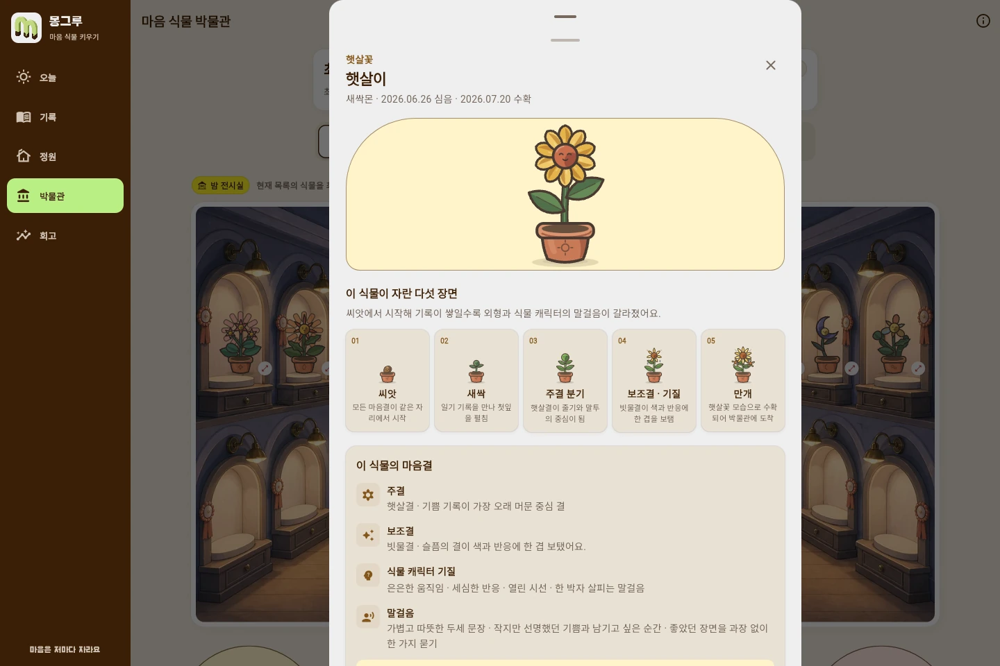

  

<h1 align="center">몽그루</h1>

  오늘 있었던 일을 적으면, 그 마음을 닮은 식물이 자라요.

## 어떤 서비스인가요?

감정을 따로 고르지 않고 오늘 있었던 일을 편하게 적어요. 일기에서 읽힌 마음은 성장 캐릭터의 모습과 말투에 남고, 기록 뒤에는 가볍게 해 볼 수 있는 오늘의 퀘스트가 이어져요. 모은 씨앗으로 새로운 품종과 방 소품을 해금할 수 있어요.

## 기록을 남겨요

일기를 쓴 뒤에는 그날의 기록을 달력에서 다시 볼 수 있어요. 달력의 표시는 직접 고른 기분이 아니라 일기에서 읽힌 마음이에요.

## 같은 캐릭터를 씨앗부터 키워요

마음 식물과 정원 캐릭터는 따로 나뉘지 않아요. 화분 속 씨앗이 팔다리와 식물 의상을 얻어 사람형 완전체까지 자라고, 같은 캐릭터가 홈에서 대화하고 정원에도 함께 있어요. 일기에 기쁜 마음이 많이 쌓이면 밝고 쾌활하게, 슬픔이 많이 쌓이면 차분하고 우아하게, 분노가 많이 쌓이면 자신감 있는 모습으로 자라요. 불안·놀람·여러 마음이 섞인 기록도 각각 다른 성장 루트로 이어져요.

기존 캐릭터 10종도 완전체 한 장으로 끝나지 않아요. 뽀또·로제온·블루미·가시로·
시들잎·여우비·그림싹·별솔·설화·하루마다 고유한 씨앗이 있고, 여섯 감정별로
새싹·유아기·성장기·성인 모습이 모두 달라져요.

상점은 완성 캐릭터를 따로 팔지 않아요. 성장 계보 카드에서 씨앗과 완전체 모습을 함께 확인한 뒤 새로 키울 씨앗을 해금할 수 있어요.

## 다 자란 식물은 박물관에 남아요

수확한 식물은 박물관에 남아요. 씨앗부터 만개까지 어떻게 달라졌는지, 어떤 마음이 모습과 말투에 담겼는지도 함께 볼 수 있어요.

## 한 주를 천천히 돌아봐요

기록이 쌓이면 주간·월간 회고에서 자주 나타난 마음과 다시 생각해 볼 질문을 확인할 수 있어요.

> 몽그루는 감정 기록과 회고를 돕는 서비스입니다. 의료 진단이나 상담을 대신하지 않습니다.

로컬에서 실행하기

[앱 실행 방법](app/README.md)

