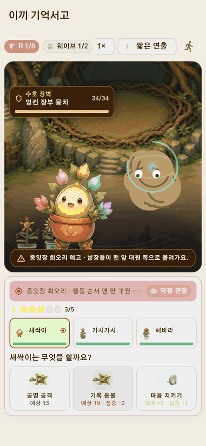
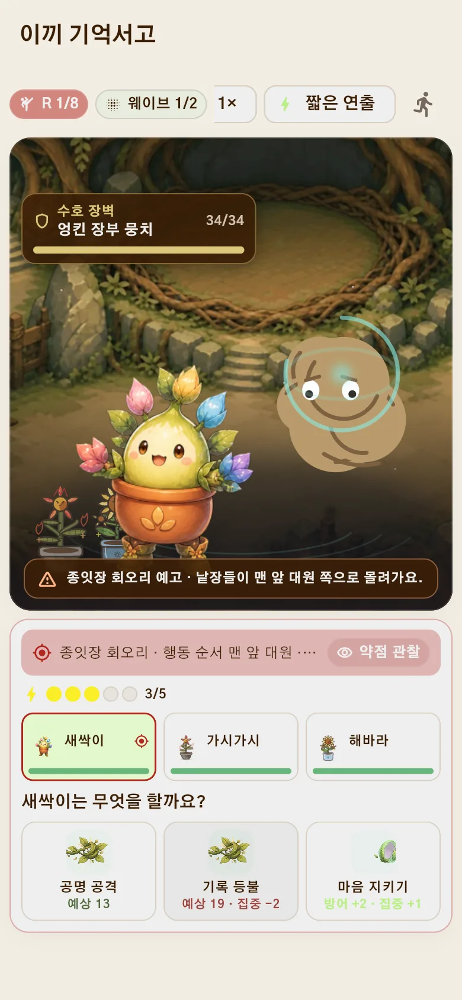
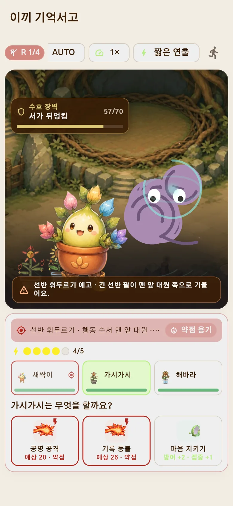
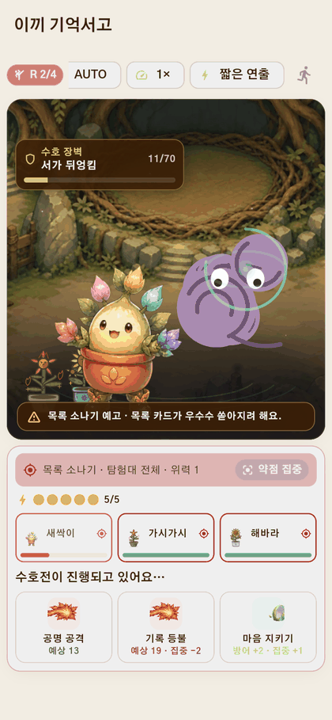

<p align="center">
  
</p>

<h1 align="center">몽그루</h1>

<p align="center">
  <strong>나쁜 감정은 없어요.</strong><br>
  오늘의 마음을 적으면, 그 마음을 닮은 캐릭터가 함께 자랍니다.
</p>

<p align="center">
  감정 일기&nbsp;&nbsp;·&nbsp;&nbsp;캐릭터 성장&nbsp;&nbsp;·&nbsp;&nbsp;마음 회고&nbsp;&nbsp;·&nbsp;&nbsp;함께하는 탐험
</p>

<p align="center">
  
</p>

<p align="center"><sub>마음을 적고, 돌보고, 함께 살아가는 과정을 담았습니다.</sub></p>

## 기록이 곧 성장입니다

감정을 좋고 나쁨으로 평가하거나 먼저 고르게 하지 않습니다. 있었던 일을 편하게
적으면 기록 속 마음이 성장 방향에 쌓이고, 같은 캐릭터도 서로 다른 모습과 성격으로
자랍니다.

<table>
  <tr>
    <td width="33%"></td>
    <td width="33%"></td>
    <td width="33%"></td>
  </tr>
  <tr>
    <td align="center"><strong>1. 마음 기록</strong><br><sub>있었던 일을 편하게 적어요</sub></td>
    <td align="center"><strong>2. 함께 성장</strong><br><sub>감정의 결을 닮아 자라요</sub></td>
    <td align="center"><strong>3. 오래 간직</strong><br><sub>성장 과정과 추억을 남겨요</sub></td>
  </tr>
</table>

<table>
  <tr>
    <td width="50%"></td>
    <td width="50%"></td>
  </tr>
  <tr>
    <td align="center">날짜별로 다시 보는 마음 달력</td>
    <td align="center">흐름을 돌아보는 주간·월간 리포트</td>
  </tr>
</table>

## 감정마다 다른 모습으로 자라요

기쁨이 많이 쌓인 캐릭터와 슬픔, 분노, 불안, 놀람, 복합 감정이 많이 쌓인
캐릭터는 성장 후의 분위기와 표정, 움직임이 달라집니다. 씨앗부터 성인 모습까지
한 계보로 이어지며 홈과 정원에서도 계속 함께합니다.


현재 뽀또, 로제온, 블루미, 가시로, 시들잎, 여우비, 그림싹, 별솔, 설화, 하루까지
10개 성장 계보가 준비되어 있습니다.

<details>
<summary><strong>10종 캐릭터의 전체 성장 경로 보기</strong></summary>


</details>

## 회원가입 전에 먼저 만나 보세요

<table>
  <tr>
    <td width="38%"></td>
    <td valign="top">
      <h3>기기 안에서 시작하는 3분 체험</h3>
      <p>가입하기 전에 마음 하나를 기록하고, 캐릭터가 자라는 과정과 짧은 탐험까지 직접 확인할 수 있습니다.</p>
      <ul>
        <li>체험 기록은 서버로 전송하지 않습니다.</li>
        <li>같은 기기에서는 중단한 단계부터 이어집니다.</li>
        <li>체험 기록이 가입 계정에 자동으로 합쳐지지 않습니다.</li>
      </ul>
    </td>
  </tr>
</table>

## 키운 캐릭터와 일상을 이어 가요

마음 일기가 가장 큰 성장과 보상의 출발점입니다. 기록을 마친 뒤에는 부담이 적은
일일 미션을 실천하고, 모은 씨앗으로 새 성장 계보와 의상, 방 테마와 소품을
해금할 수 있습니다.

<table>
  <tr>
    <td width="33%"></td>
    <td width="33%"></td>
    <td width="33%"></td>
  </tr>
  <tr>
    <td align="center"><strong>오늘의 미션</strong><br><sub>마음에서 이어지는 작은 행동</sub></td>
    <td align="center"><strong>상점과 의상</strong><br><sub>씨앗으로 넓히는 선택지</sub></td>
    <td align="center"><strong>나만의 공간</strong><br><sub>캐릭터와 꾸미는 방과 정원</sub></td>
  </tr>
</table>


## 키운 캐릭터와 함께, 오늘의 모험

모험은 일기를 대신하는 콘텐츠가 아니라, 정성껏 키운 캐릭터와 더 오래 함께하기
위한 RPG 콘텐츠입니다. 오늘 갈 곳은 언제나 하나 — `이어서 모험하기`를 누르면
기억서고의 스테이지 지도가 열리고, 전투·사건·쉼터·수호전이 여덟 걸음으로
이어집니다.

<table>
  <tr>
    <td width="33%"></td>
    <td width="33%"></td>
    <td width="33%"></td>
  </tr>
  <tr>
    <td align="center"><strong>오늘 갈 곳 하나</strong><br><sub>허브는 다음 스테이지만 크게 보여 줘요</sub></td>
    <td align="center"><strong>여덟 걸음의 지도</strong><br><sub>전투·사건·쉼터·수호전이 한 길로</sub></td>
    <td align="center"><strong>떠나기 전에 미리</strong><br><sub>누굴 만나고 얼마나 걸리는지 먼저 확인</sub></td>
  </tr>
</table>

### 카드 한 장이 곧 행동이에요

전투가 시작되면 `새싹이는 무엇을 할까요?` 하고 물어 옵니다. 캐릭터를 고르고
카드를 누르면 그 자리에서 바로 움직입니다. 적의 다음 공격과 약점은 언제나
먼저 공개되니, 누가 먼저 움직여 집중력을 모으고 누가 결정타를 넣을지만
정하면 됩니다.

<table>
  <tr>
    <td width="52%"></td>
    <td width="48%"></td>
  </tr>
  <tr>
    <td align="center"><strong>탭 두 번이면 한 행동</strong><br><sub>캐릭터를 고르고 카드를 누르면 즉시 실행</sub></td>
    <td align="center"><strong>읽고 정하는 전투</strong><br><sub>예고·약점·집중력이 확정 전에 전부 보여요</sub></td>
  </tr>
</table>

자동 지휘와 2배속, 짧은 연출 모드는 화면 위에 항상 있습니다. 바쁜 날에는
맡기고, 중요한 전투만 직접 지휘해도 됩니다.

### 무찌르는 게 아니라, 풀어 주는 거예요

길을 막는 상대는 괴물이 아니라 돌보는 손이 모자라 엉켜 버린 서고의 물건들 —
**엉킴**입니다. 장벽을 다 두드리면 엉킨 장부와 압화는 스르르 풀려 제자리로
돌아가고, 다음 엉킴이 이어서 나타납니다. 선반 세 칸이 통째로 엉킨 **큰 엉킴**
스테이지도 있습니다.

<table>
  <tr>
    <td width="33%"></td>
    <td width="33%"></td>
    <td width="33%"></td>
  </tr>
  <tr>
    <td align="center"><strong>이어지는 웨이브</strong><br><sub>하나를 풀면 다음 엉킴이 나타나요</sub></td>
    <td align="center"><strong>큰 엉킴</strong><br><sub>더 단단한 매듭은 예고 위력도 달라요</sub></td>
    <td align="center"><strong>풀려나는 순간</strong><br><sub>사라지는 게 아니라 제자리로 돌아가요</sub></td>
  </tr>
</table>

<table>
  <tr>
    <td width="38%"></td>
    <td valign="top">
      <h3>함께 돌아온 기록</h3>
      <p>스테이지를 마치면 누가 어떤 활약을 했는지, 무엇을 주워 왔는지가 한 장으로 남습니다. 오늘 일기를 썼다면 성장과 씨앗도 함께 돌아옵니다.</p>
      <ul>
        <li>져도 잃는 것은 없어요. 캐릭터는 다치거나 사라지지 않아요.</li>
        <li>클리어한 스테이지는 언제든 다시 걸을 수 있어요.</li>
        <li>보상의 중심은 언제나 마음 일기 — 모험이 일기를 앞지르지 않아요.</li>
      </ul>
    </td>
  </tr>
</table>

## 마음을 안심하고 남길 수 있도록

| 가입 전 체험 | 내 기록 관리 | 위험 신호 안내 |
| --- | --- | --- |
| 서버 전송 없이 기기에만 저장 | 계정 데이터 내보내기와 앱 안에서 영구 삭제 | 도움이 필요한 표현을 감지하면 지원 안내 제공 |

> 몽그루는 감정 기록과 회고를 돕는 서비스이며, 의료 진단이나 전문 상담을
> 대신하지 않습니다.

## 현재 구현 범위

| 구분 | 제공 기능 |
| --- | --- |
| 마음 기록 | 일기 작성·수정·삭제, 감정 성장 반영, 달력, 주간·월간 회고 |
| 캐릭터 | 10종 성장 계보, 감정별 성장, 표정·부분 모션, 의상 교체 |
| 생활 콘텐츠 | 일일 미션, 씨앗 재화, 상점, 방·정원 꾸미기, 박물관 |
| 모험 | 스테이지 지도(전투·사건·쉼터·수호전), 1~3명 편성, 카드 한 장으로 즉시 행동하는 전투, 엉킴 웨이브, 자동 지휘·배속 |
| 시작 방식 | 이메일 계정 또는 서버 전송 없는 비회원 체험 |

<details>
<summary><strong>로컬에서 실행하기</strong></summary>

MySQL, API, 분석 작업자를 실행한 뒤 Flutter 앱을 연결합니다.

```powershell
scripts\start_demo.ps1 -AiMode fake

cd app
flutter pub get
flutter run -d chrome --dart-define=API_BASE_URL=http://127.0.0.1:8000/api/v1
```

Android 에뮬레이터와 환경별 설정은 [앱 실행 문서](app/README.md), 운영 배포는
[배포 문서](docs/deployment.md)에서 확인할 수 있습니다.

</details>

<details>
<summary><strong>기술 구성과 상세 문서</strong></summary>

- Flutter · FastAPI · MySQL
- [직접 탐험 설계](docs/interactive_adventure_design.md)
- [수동 전투 규칙](docs/expedition_manual_combat.md)
- [성능 기준](docs/performance.md)
- [품질 점검 기준](docs/quality.md)

</details>
