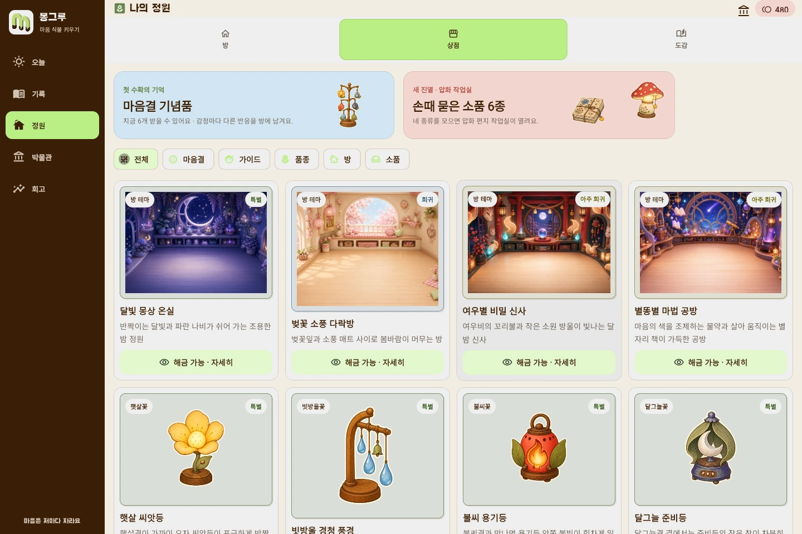

  

<h1 align="center">몽그루</h1>

  오늘 있었던 일을 적으면, 그 마음을 닮은 식물이 자라요.

## 어떤 서비스인가요?

감정을 따로 고르지 않고 오늘 있었던 일을 편하게 적어요. 일기에서 읽힌 마음은 식물의 모습과 말투에 남고, 기록 뒤에는 가볍게 해 볼 수 있는 오늘의 퀘스트가 이어져요. 모은 씨앗은 캐릭터와 방을 꾸미는 데 쓸 수 있어요.

## 기록을 남겨요

일기를 쓴 뒤에는 그날의 기록을 달력에서 다시 볼 수 있어요. 달력의 표시는 직접 고른 기분이 아니라 일기에서 읽힌 마음이에요.

## 식물을 키우고 정원을 꾸며요

같은 씨앗도 어떤 마음과 함께 자랐는지에 따라 모습과 성격이 달라져요. 자라는 동안 식물과 대화할 수 있고, 퀘스트로 모은 씨앗으로 캐릭터와 방을 꾸밀 수 있어요.

## 다 자란 식물은 박물관에 남아요

수확한 식물은 박물관에 남아요. 씨앗부터 만개까지 어떻게 달라졌는지, 어떤 마음이 모습과 말투에 담겼는지도 함께 볼 수 있어요.

## 한 주를 천천히 돌아봐요

기록이 쌓이면 주간·월간 회고에서 자주 나타난 마음과 다시 생각해 볼 질문을 확인할 수 있어요.

> 몽그루는 감정 기록과 회고를 돕는 서비스입니다. 의료 진단이나 상담을 대신하지 않습니다.

로컬에서 실행하기

[앱 실행 방법](app/README.md)

