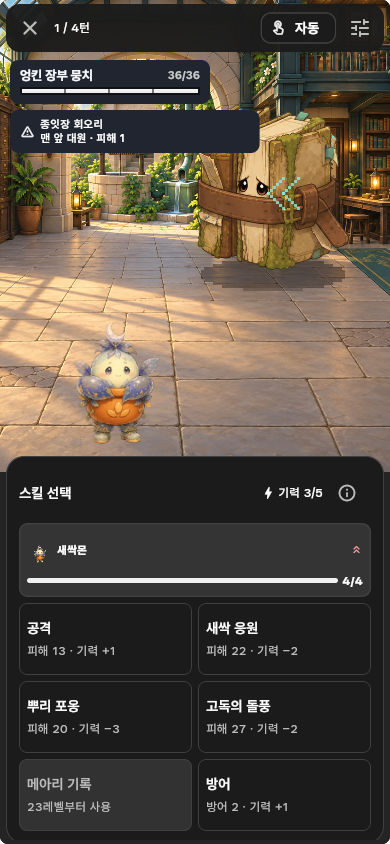
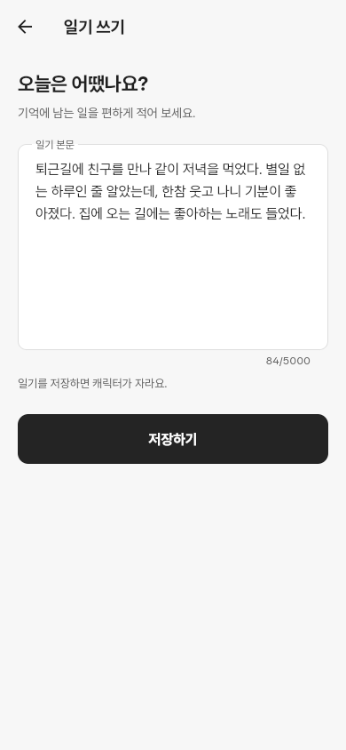
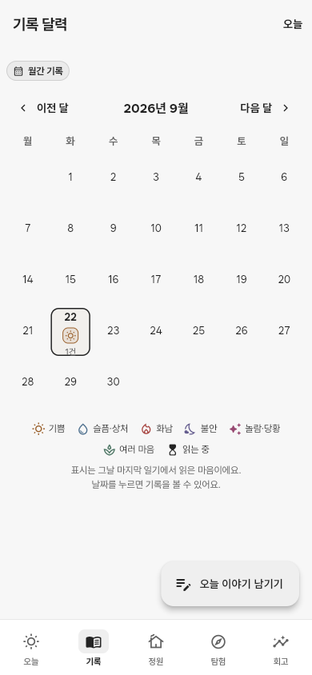
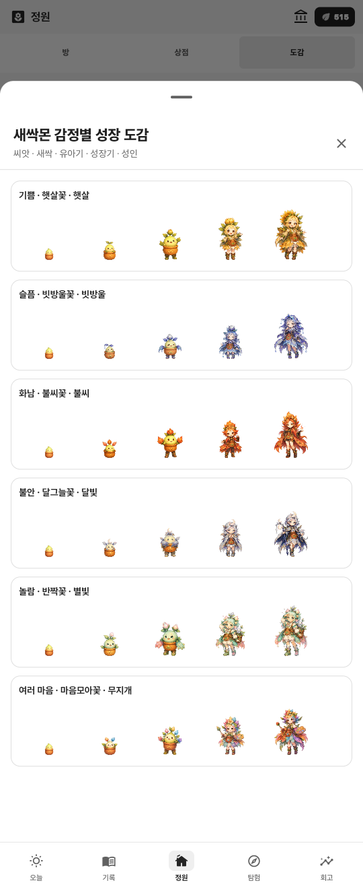
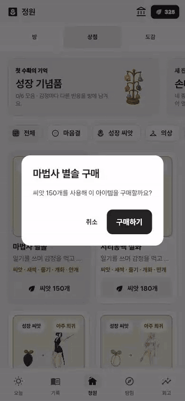
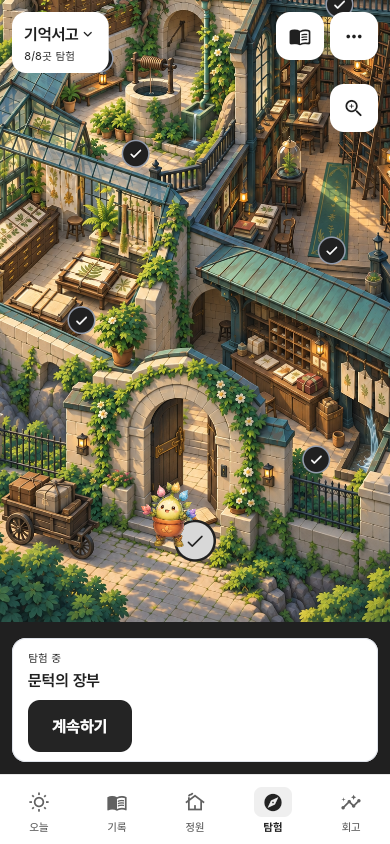
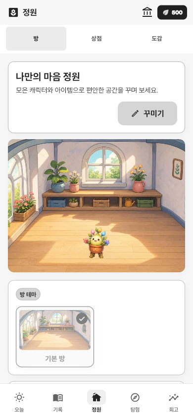

**한국어** · [English](docs/i18n/README.en.md) · [日本語](docs/i18n/README.ja.md) · [简体中文](docs/i18n/README.zh-CN.md)

# 몽그루

**일기를 쓰며 캐릭터를 키우고, 함께 탐험하는 게임입니다.**

오늘 있었던 일을 적으면 캐릭터가 조금씩 자랍니다. 키운 캐릭터와 탐험을 떠나고, 새 캐릭터를 모으거나 방을 꾸밀 수도 있어요.

  
  

현재 출시를 준비하고 있으며, 앱스토어 배포본은 아직 없습니다. 앱 화면과 대화는 한국어로 제공됩니다. 이 소개는 위에서 언어를 골라 읽을 수 있어요.

## 일기는 짧게 써도 괜찮아요

기억에 남는 일을 편하게 적어 보세요. 일기를 저장하면 경험치를 받고 캐릭터가 자랍니다. 슬프거나 화난 날의 일기를 썼다고 경험치나 보상이 줄어들지는 않아요.

지난 일기는 달력에서 날짜를 눌러 다시 읽고 고칠 수 있습니다. 일주일이나 한 달 동안 어떤 기분으로 지냈는지도 모아서 볼 수 있어요.

  
  

## 18종의 캐릭터를 키우고 모아요

캐릭터는 씨앗부터 다 자랄 때까지 다섯 단계를 거칩니다. 일기에 담긴 감정에 따라 여섯 타입으로 나뉘고, 모습과 말투도 달라져요. 어떤 감정을 적느냐에 따라 성장 속도나 보상이 달라지지는 않습니다.

다 키운 캐릭터는 박물관에 남기고 새 씨앗을 심을 수 있어요. 모은 캐릭터로 탐험대를 꾸리고, 서로 다른 스킬을 써 보세요.

  

## 퀘스트를 깨고, 원하는 캐릭터를 골라요

오늘 할 일을 완료하면 경험치와 게임 재화인 **씨앗**을 받습니다. 씨앗을 모아 새 캐릭터나 꾸미기 아이템을 살 수 있어요. 가격과 구매 조건을 보고 직접 고르는 방식이며, 확률형 뽑기는 없습니다.

  
  

## 키운 캐릭터와 탐험을 떠나요

네 지역, 32개 스테이지가 준비돼 있습니다. 지도에서 목적지를 고른 뒤 캐릭터를 직접 움직여 길을 찾고, 곳곳의 이야기를 만나 보세요.

전투에서는 적의 다음 공격을 보고 공격·방어·스킬을 고릅니다. 스킬을 길게 누르면 자세한 설명을 볼 수 있어요. 자동 전투와 배속을 사용할 수 있고, 음악·효과음·화면 움직임도 설정에서 조절할 수 있습니다.

  

## 내 취향대로 방을 꾸며요

방 테마를 바꾸고 소품과 의상을 골라 보세요. 캐릭터를 키우며 모은 씨앗으로 하나씩 장만할 수 있습니다.

  

## 가입 전에 먼저 둘러보세요

앱을 실행한 뒤 로그인 화면에서 **회원가입 없이 3분 체험**을 누르면 일기 쓰기와 캐릭터 성장을 체험할 수 있습니다. 체험 기록은 서버로 보내지 않고 사용 중인 기기에만 저장합니다. 나중에 가입해도 계정으로 자동 이전되지는 않아요.

화면과 GIF는 테스트 계정으로 직접 플레이하며 촬영했습니다.

[직접 실행하기](app/README.md) · [버그 제보](https://github.com/easygap/mongroo/issues)
