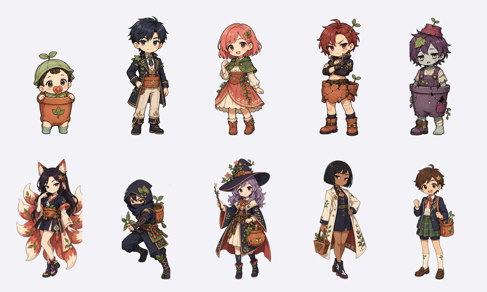
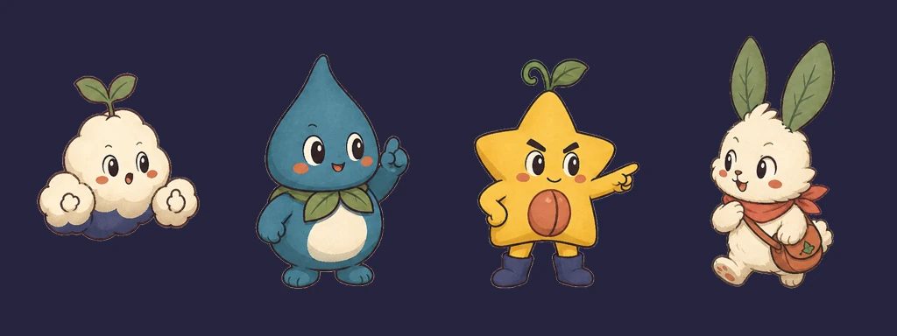

# 캐릭터 아트 기준

## 공통 형태

- 전신이 들어오는 3.5~4등신 실루엣
- 짙은 자주빛 갈색 외곽선과 2~3단 셀 채색
- 광택 없는 종이·과슈 질감
- 투명 배경 `512×768` WebP
- 남색, 코랄, 꽃가루 노랑, 식물 초록, 테라코타 안에서 배색
- 120px로 줄였을 때 얼굴과 대표 소품이 남아야 한다.

피부는 노란색 한 톤으로 통일하지 않는다. 21N에 가까운 중성 베이지를 중심으로
로지, 쿨, 미디엄 브라운까지 캐릭터 성격에 맞춰 나눈다. 화분색은 피부가 아니라
옷, 가방, 보호구에만 쓴다.

## 기본 명단

| 파일 | 이름 | 한눈에 보이는 특징 |
|---|---|---|
| `baby-pot.webp` | 뽀또 | 쪽쪽이, 잎 보닛, 화분 롬퍼 |
| `handsome-pot.webp` | 로제온 | 남색 머리, 식물 학교 코트, 차분한 표정 |
| `pretty-pot.webp` | 블루미 | 코랄 단발, 초록 케이프, 밝은 표정 |
| `tsundere-pot.webp` | 가시로 | 녹슨 빨강 머리, 팔짱, 깨진 화분 보호구 |
| `zombie-pot.webp` | 시들잎 | 세이지 회색 피부, 졸린 눈, 보랏빛 화분 멜빵 |
| `gumiho-pot.webp` | 여우비 | 현대 한복, 장난스러운 눈매, 아홉 꼬리 |
| `ninja-pot.webp` | 그림싹 | 잎 후드, 수리검, 화분 배낭 |
| `magical-pot.webp` | 별솔 | 덩굴 마법모자, 새싹 지팡이, 화분 가방 |
| `aloof-pot.webp` | 설화 | 짙은 피부, 검은 단발, 흰 식물 연구 코트 |
| `student-pot.webp` | 하루 | 교복, 새싹 배지, 화분 책가방 |

## 친구 캐릭터

| 파일 | 이름 | 특징 |
|---|---|---|
| `mongle.webp` | 몽글이 | 새싹이 난 구름, 커다란 구름 손 |
| `dewdrop.webp` | 이슬이 | 물방울 몸, 잎 목도리 |
| `star-bean.webp` | 별콩이 | 별 모양 씨앗, 남색 장화 |
| `fluffy-bunny.webp` | 보송이 | 잎 귀, 코랄 스카프, 씨앗 가방 |

## 앱에서 쓰는 방식

- 원본은 `app/assets/characters/`에 둔다.
- 홈, 상점, 도감, 방 편집은 같은 파일을 사용한다.
- 목록에서는 정지 상태로 두고, 홈과 방에서는 탭하거나 대사가 바뀔 때만 짧게
  반응시킨다.
- 잠긴 캐릭터도 실루엣과 이름은 보여 주되 해금 조건을 같이 적는다.
- 캐릭터 그림 안에 이름, 등급, 가격을 넣지 않는다.
