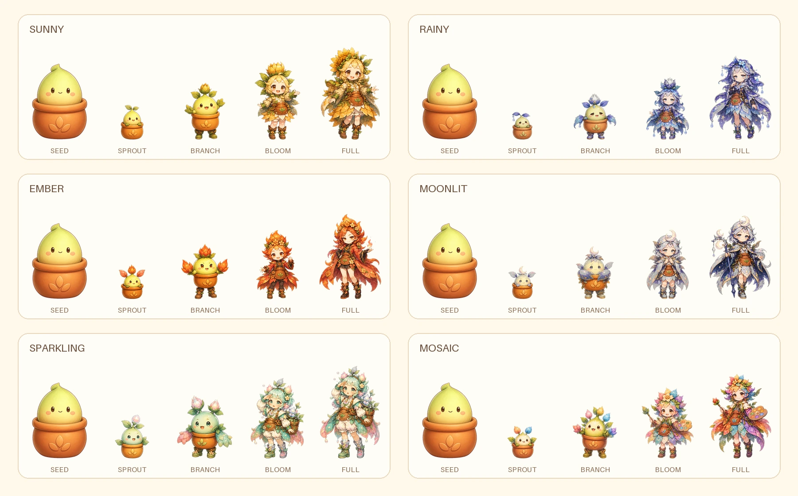
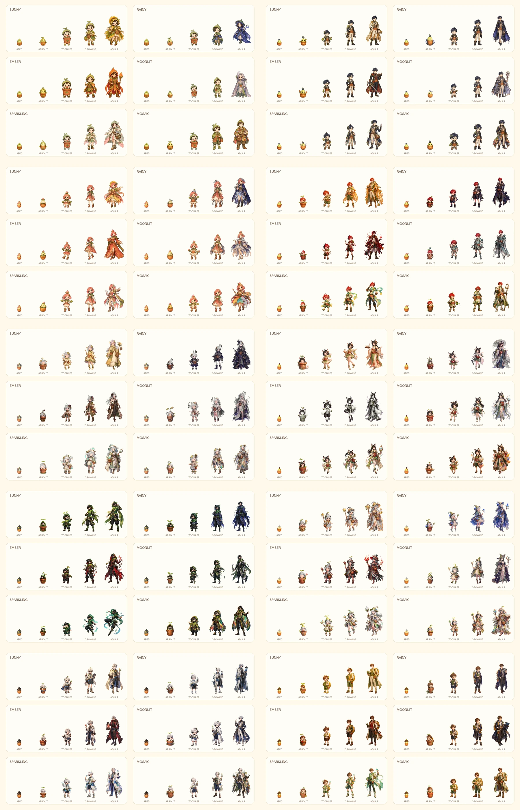

# 캐릭터 자산 분류

몽그루의 핵심 캐릭터는 `design-system/MONGROO_GROWTH_ART.md`에서 관리한다.
마음 식물, 대화 상대, 정원 중앙 캐릭터, 도감의 성장 캐릭터는 같은 개체이며
모든 품종이 씨앗부터 만개까지 다섯 단계로 성장한다.

## 핵심 성장 캐릭터

- 파일 위치: `app/assets/plants/`
- 규격: 512×768 투명 WebP
- 단계: `seed`, `sprout`, `branching`, `bloom`, `full-bloom`
- 스타일: 한 명의 원화가가 그린 것처럼 통일한 2.5D 동화풍 셀 셰이딩
- 상점 노출: 완전체가 아니라 1단계 성장 씨앗
- 홈·채팅·정원 노출: 현재 활성 개체의 같은 단계 sprite
- 도감 노출: 품종별 공통 씨앗과 여섯 감정 성장 루트
- 기본 품종 구성: 공통 씨앗 1장 + 관찰 중 새싹 1장 + 여섯 루트의 2~5단계 24장
- 기존 캐릭터 계보 구성: 고유 씨앗 1장 + 여섯 루트의 새싹·유아기·성장기·성인 24장

## 동행 소품

`companion`은 정원 장식에 가까운 작은 동행 소품이다. 성장 경험치, 감정
프로필, 채팅 페르소나를 갖지 않으며 핵심 성장 캐릭터 슬롯을 대체하지 않는다.

| 파일 | 이름 | 역할 |
|---|---|---|
| `mongle.webp` | 몽글이 | 구름형 동행 소품 |
| `dewdrop.webp` | 이슬이 | 물방울형 동행 소품 |
| `star-bean.webp` | 별콩이 | 별씨앗형 동행 소품 |
| `fluffy-bunny.webp` | 보송이 | 잎귀 토끼형 동행 소품 |

동행 소품 원본은 `app/assets/characters/` 또는 `app/assets/companions/`에 둔다.
상점·도감·정원은 같은 cutout과 `motion_key`를 사용한다.

## 사람형 성장 계보

`app/assets/characters/*-pot.webp`에서 출발한 사람형 캐릭터 10종은 모두
씨앗에서 자라는 감정 식물의 성장 계보다. 완제품 캐릭터와 마음 식물을 서로
다른 분류로 나누지 않는다.

- 기존 `main_character` 타입은 서버 호환용으로 유지하되 앱에서는 성장 계보로 읽는다.
- 각 계보는 고유 씨앗 1장과 감정별 4단계 24장, 총 25장의 투명 WebP를 사용한다.
- 단계 이름은 씨앗·새싹·유아기·성장기·성인으로 통일한다.
- 같은 캐릭터 안에서도 여섯 감정 루트의 의상·식물·표정·실루엣이 서로 달라야 한다.
- 기계 판독 원본은 `growth-assets/character-lineages.json`, ImageGen 원본은
  `concepts/character-lineages-v1/`, 앱 에셋은 `app/assets/plants/`에 둔다.
- 새 캐릭터는 완전체 한 장만 추가하지 않고 씨앗부터 완전체까지의 성장 계약을 함께 만든다.

