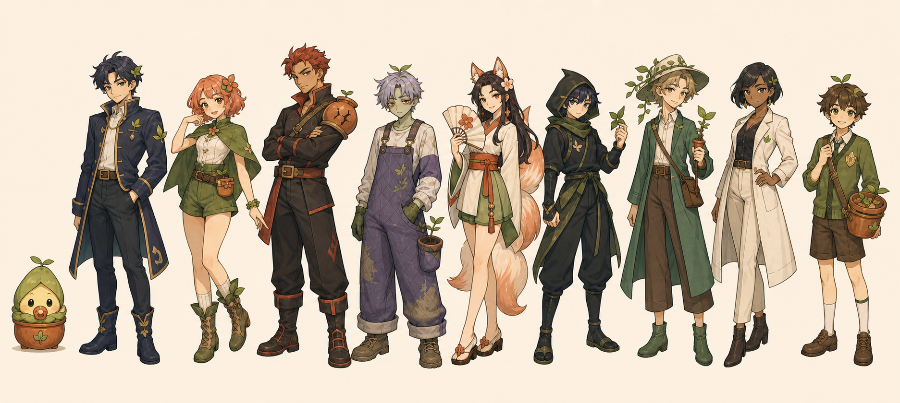

# 몽그루 디자인 기준

## 방향

몽그루는 감정 기록 앱이면서 캐릭터 수집 게임이다. 기본 인상은 따뜻하고 귀엽게
잡되, 모든 화면을 파스텔 카드로 채우는 전형적인 웰니스 앱 모양은 피한다.

어떤 감정도 보상과 성장에서 손해를 보지 않아야 한다. 기분 점수나 감정 종류로
보상, 희귀도, 성장 속도, 문장의 친절함을 바꾸지 않는다.

- 큰 제목과 형태 대비는 화면의 주요 동작을 드러낼 때만 쓰고, 같은 카드 구성을
  화면마다 반복하지 않는다.
- 일기와 긴 문장은 불투명한 밝은 면에 올린다. 반투명 효과는 내비게이션이나 잠깐
  뜨는 컨트롤에만 사용한다.
- 장식보다 사용자가 고른 식물, 캐릭터, 방이 화면의 개성을 만든다.
- 캐릭터는 탭 반응, 말풍선, 방 배치처럼 실제 상호작용이 있을 때 등장시킨다.
- 840px 이상에서는 하단 내비게이션을 레일로 바꾸고 본문 너비를 제한한다.

### 2026년 7월 개편: 포켓 식물도감

제품의 화면 비유는 `포켓 식물도감 + 꾸미는 온실 + 오래 쓴 문구류`다. 유행하는
효과를 한 화면에 모으지 않고, 사용자가 직접 모은 식물과 소품이 시간이 지나며
한 권의 도감처럼 보이게 한다.

- 디지털 유리보다 무광 종이, 압화, 잉크, 과슈, 나무처럼 손에 잡히는 재료를 쓴다.
- 완벽한 좌우 대칭과 균일한 파스텔 배분 대신 한두 개의 스티커, 비뚤어진 압화,
  크기가 다른 표본처럼 통제된 비대칭을 쓴다.
- `B9EE84`는 선택과 주요 행동, `FAED27`은 실제 보상 순간에만 쓴다. 화면의 큰
  영역을 노랑과 짙은 색으로 번갈아 칠하지 않는다.
- 같은 카드 안에 카드·태그·버튼을 반복하지 않는다. 화면마다 하나의 주인공
  오브젝트를 정하고 나머지 정보는 같은 종이 면 위에서 위계만 나눈다.
- 모바일 오늘 화면은 식물 장면을 먼저 보여 주고, 오늘의 행동은 세 칸짜리 작은
  진행 표식으로 접는다. 앱의 첫인상은 체크리스트가 아니라 키우는 식물이어야 한다.

## BI

몽그루 심볼은 **초록 성장층과 갈색 흙층이 이어지는 입체 소문자 `m`**이다.
상단은 부드러운 식물 젤라토 같은 반무광 재질, 하단은 곱게 다듬은 흙 같은
무광 재질이며, 갈색은 앞면 높이의 약 30%를 차지한다. 가운데와 오른쪽의 서로
다른 드립, 왼쪽이 조금 높은 봉우리, 왼쪽으로 튼 입체 방향이 고정 특징이다.

- 투명 기준본은 `design-system/brand/mongroo-symbol-master.png`, 앱 아이콘
  기준본은 `design-system/brand/mongroo-app-icon.png`다. 모든 플랫폼 래스터는
  `scripts/render_brand_assets.py`로 이 원본에서 파생한다.
- 기본 BI는 서명 연두 `#B9EE84`, 흙 `#3B1F06`, 배경 `#EFEFEF`를 쓴다.
  노랑·하늘색·감정색은 제품 콘텐츠 팔레트이지 BI 구성색이 아니다.
- 3D는 한 방향의 카메라, 넓은 자연광, 호환되는 두 재질을 유지한다. 랜덤
  노이즈, 플라스틱 광택, 풍선 비례, 과한 외곽선과 장식은 추가하지 않는다.
- 작은 아이콘에서도 같은 렌더를 사용하되 파비콘은 실루엣을 92%까지 키우고,
  maskable 아이콘은 안전영역 안에서 62%로 줄인다. 별도의 변형 심볼을 만들지 않는다.
- `몽그루`는 앱 이름으로 심볼 옆에 조판하되, 심볼 안에 글자를 다시 넣지 않는다.
  `Galmuri11`은 제품 화면 제목용이며, BI 자체의 형태로 간주하지 않는다.

## 캐릭터

캐릭터마다 실루엣, 표정, 옷, 말투와 움직임이 달라야 한다. 같은 얼굴에 의상만
바꾼 변형은 만들지 않는다. 96px 크기에서도 이름을 읽지 않고 구분되는지 확인한다.

- 인간형 피부는 캐릭터의 주된 매력에 따라 한국 파운데이션 호수에 가까운
  밝기로 구분한다. 예쁨 중심 여성은 21C/21N, 잘생김 중심 남성은 23N,
  성인 섹시 중심 캐릭터는 성별과 관계없이 19C/19N을 기준으로 한다.
  테라코타색은 실제 화분 재질에만 사용한다.
- 1~2단계는 화분형 새싹, 3단계는 잎 장갑과 뿌리 부츠가 생긴 분화형,
  4~5단계는 식물 의상과 화분 표식을 유지한 사람형으로 자란다. 사실적인 아기
  신체나 불쾌한 식물·인체 결합 표현은 그리지 않는다.
- 아기 캐릭터는 쪽쪽이, 잎 포대기처럼 바로 알아볼 수 있는 소품을 둔다.
- 냉미남, 아이돌, 츤데레, 구미호 같은 성격은 연출 차이일 뿐 능력치 차이가 아니다.

### 의상과 매력 연출

캐릭터의 매력은 장식 개수가 아니라 얼굴, 자세, 실루엣과 옷의 핏에서 만든다.
성인형은 귀엽고 예쁘거나 잘생긴 인상을 기본으로 하며, 섹시함이 주된 캐릭터는
눈매, 시선, 어깨선과 허리선에 더해 쇄골·어깨·허리·다리의 노출과 시스루 소재를
제한적으로 사용한다. 시스루 아래의 가슴과 속옷은 불투명하게 가리고 핀업 포즈는
사용하지 않는다. 아기형과 학생형 캐릭터에는 성적 연출을 사용하지 않는다.

- 한 의상은 주된 옷 2~3벌과 대표 식물 모티프 1개로 끝낸다.
- 캐릭터마다 주색 1개와 보조색 1개를 우선하고, 감정색은 작은 포인트로 쓴다.
- 금장, 보석, 꽃, 리본, 망토, 발광 효과를 한 의상에 중첩하지 않는다.
- 식물 모티프는 큰 실루엣이나 한 군데의 표식으로 읽히게 하고 잔장식처럼 흩뿌리지 않는다.
- 천의 솔기, 여밈, 주머니와 신발 구조를 분명히 해 실제로 입을 수 있는 옷처럼 그린다.
- 같은 미형 얼굴을 복제하지 않고 눈매, 턱선, 체형과 자세로 성격을 구분한다.
- 피부와 천은 무광에 가깝게 칠하고 과한 광택, 에어브러시 피부와 무작위 비대칭을 피한다.
- 가시로의 23N 피부는 평상시에 붉히지 않는다. 홍조는 호감이나 예상 밖의 칭찬에
  당황한 반응에서만 볼 중심으로 짧게 나타난다.
- 여우비는 모든 성체 감정 의상에서 열린 목선·어깨선·허리선·다리선과 시스루
  소재를 기본으로 유지하고 `ember`에서 한 단계 더 대담해진다. `moonlit`은
  검정 반투명 스타킹과 힐을 사용한다.
- 블루미의 `ember`는 검정 반투명 스타킹과 가는 힐로 걸크러시 무대 인상을 만든다.

### 기본 캐릭터 10종

| 캐릭터 | 성격 | 구분되는 요소 | 기본 움직임 |
|---|---|---|---|
| 뽀또 | 아기 스타터 | 잎 보닛, 코랄 쪽쪽이, 화분 롬퍼 | 앉아서 통통 튀기 |
| 로제온 | 차분한 주인공 | 남색 머리, 식물 학교 코트 | 소매 정리 |
| 블루미 | 자신감 있는 아이돌 | 코랄 단발, 초록 케이프 | 가볍게 돌기 |
| 가시로 | 츤데레 | 붉은 머리, 팔짱, 깨진 화분 보호구 | 고개 돌리기 |
| 시들잎 | 느긋한 좀비 | 세이지 피부, 졸린 눈, 보랏빛 멜빵 | 졸린 흔들림 |
| 여우비 | 장난스러운 구미호 | 현대 한복, 비대칭 아홉 꼬리 | 꼬리 원호 |
| 그림싹 | 닌자 정찰꾼 | 잎 수리검, 화분 배낭 | 짧은 대시 |
| 별솔 | 마법 학교 우등생 | 덩굴 모자, 새싹 지팡이 | 공중 부유 |
| 설화 | 도도한 라이벌 | 21C 피부, 검은 단발, 흰 연구 코트 | 곁눈질 |
| 하루 | 학생회장 | 교복, 새싹 배지, 화분 책가방 | 자세 고치기 |

### 감정별 성체 원형

5단계 성체는 같은 캐릭터의 색놀이가 아니다. 누적 일기의 우세 감정에 따라
얼굴, 체형 인상, 의상 실루엣, 자세와 반응 방식이 함께 달라진다.

- 기쁨·즐거움·애정은 다정한 온미남·온미녀형으로 성장한다.
- 슬픔·상처·외로움은 냉미남·냉미녀와 절제된 고딕 우울미로 성장한다.
- 분노·좌절·저항은 섹시하고 강인한 걸크러쉬·눈나·존잘형으로 성장한다.
- 불안·두려움은 경계심과 보호적 실루엣이 강한 다크 로맨스형으로 성장한다.
- 놀람·호기심은 귀엽고 장난스러운 탐험가형으로 성장한다.
- 혼합 감정은 따뜻함과 차가움을 함께 다루는 성숙한 전략가형으로 성장한다.

각 분기는 평상시 `idle`, 일기 확인 `diary`, 성장·수확 축하 `grow` 자세를
사용한다. 자세별 동작과 표정은 캐릭터 고유 움직임 위에서 다시 구분한다.

## 색

| 토큰 | 밝은 화면 | 어두운 화면 | 용도 |
|---|---:|---:|---|
| brand sprout / primary | `#B9EE84` | `#B9EE84` | BI 바탕, 주요 동작 |
| brand soil | `#3B1F06` | `#3B1F06` | BI 하단의 흙 표현 |
| brand paper | `#EFEFEF` | `#EFEFEF` | BI 여백, 밝은 읽기 면 |
| secondary | `#B84F46` | `#E9978D` | 감정 반응, 선택 강조 |
| tertiary | `#68864D` | `#A8D984` | 식물과 성장 상태 |
| currency | `#FAED27` | `#F4DE52` | 씨앗 재화, 보상에만 제한 |
| sky note | `#B9E0FD` | `#9CCAE8` | 안내, 현재 진행 단계 |
| background | `#F2EDE3` | `#17130F` | 화면 바탕 |
| surface | `#EFEFEF` | `#221C16` | 입력과 읽기 면 |
| ink | `#3B1F06` | `#EFEFEF` | 제품 본문 글자 |
| muted ink | `#75685D` | `#CDBFB0` | 보조 글자 |
| error | `#B3261E` | `#FFB4AB` | 오류 |

연두 위의 글자와 아이콘은 항상 `#281E2B`을 쓴다. 밝은 브랜드색을 본문 글자색이나
파괴 동작에 사용하지 않는다.

감정색은 BI와 별개의 콘텐츠 색이다. 감정 칩과 식물 형태에는 색과 함께 이름을
적고, BI 색으로 일괄 치환하지 않는다.

## 모양과 간격

- 4px 단위를 기준으로 8, 12, 16, 24, 32px 간격을 주로 쓴다.
- 컨트롤 반지름은 10~12px, 일반 패널은 14~16px, 한 화면의 컬렉션 배너는
  18px까지 쓴다. 작은 스티커 라벨만 완전한 pill을 사용한다.
- 터치 영역은 최소 48×48 logical pixel이다.
- 면 구분은 옅은 1px 테두리와 낮은 불투명도의 4~14px 그림자로 끝낸다. 모든
  패널에 같은 그림자를 넣지 않고, 떠 있어야 하는 표면에만 사용한다.
- 한 화면의 가장 중요한 동작은 하나만 두고 나머지는 위계를 낮춘다.

## 글자

- 본문과 입력은 플랫폼 한국어 산세리프를 쓴다. `Galmuri11`은 앱 이름, 화면 제목,
  재화 숫자, 작은 게임 라벨에만 제한해서 쓴다.
- 화면 제목 28~34/700~800, 섹션 제목 20~24/700, 본문 16/1.55,
  레이블 13~14/600을 기준으로 한다.
- 큰 한글 화면 제목과 내비게이션에는 시스템 산세리프를 쓴다. 픽셀 글꼴은 BI,
  재화 숫자, 한두 단어짜리 게임 라벨에만 남긴다.
- 재화와 진행도 숫자는 고정폭 숫자를 쓴다.
- 글자 크기를 200%로 키워도 주요 버튼과 문장이 잘리지 않아야 한다.

## 움직임

- 누름 반응은 100ms 안에 시작하고 짧은 전환은 180~260ms로 끝낸다.
- 일반 전환은 opacity와 transform 위주로 만든다.
- 한 화면에서 계속 움직이는 캐릭터는 1~2명만 둔다. 목록 안 캐릭터는 눌렀을 때만
  움직인다.
- 기본 대기 동작은 3.6~4.8초로 느리게 반복한다.
- 퀘스트 완료 연출은 입력을 막지 않는 짧은 확대·페이드 한 번이면 충분하다.
- 움직임 줄이기 설정에서는 이동 대신 교차 페이드나 즉시 전환을 사용한다.

## 화면별 기준

- 오늘: 현재 식물과 동반자, 기분 기록 버튼, 오늘의 퀘스트, 씨앗 잔액을 보여 준다.
- 캐릭터 장면: 대표 캐릭터 한 명, 이름과 성격, 짧은 말풍선, 탭 반응을 둔다.
- 퀘스트: 예상 시간, 부담도, 같은 보상, 완료와 건너뛰기를 함께 보여 준다.
- 정원: 방, 상점, 도감이 서로 바로 연결되어야 한다. 잠긴 항목은 해금 조건을 적는다.
- 방 편집: 보유한 항목만 놓을 수 있다. 모바일은 눈에 보이는 이동·회전 버튼을,
  Web은 포인터와 키보드 조작을 함께 제공한다.
- 안전 화면: 도움 안내가 필요한 동안 퀘스트와 축하 연출을 숨긴다.

## 마음 식물 박물관

박물관은 카드 목록보다 밤의 개인 표본실에 가깝게 보이도록 만든다. 짙은 남색,
달빛, 노란 전시 라벨과 크기가 다른 식물 배치로 위계를 만든다.

| 코드 | 이름 | 기록에서 담는 감정 | 시각 요소 |
|---|---|---|---|
| `sunny` | 햇살꽃 | 기쁨 | 해바라기 왕관, 위로 열린 잎, 밝은 미소 |
| `rainy` | 빗방울꽃 | 슬픔·상처 | 남청 벨벳 잎 망토, 이슬, 우아한 반눈 |
| `ember` | 불씨꽃 | 분노 | 산호색 불꽃 망토, 곧은 실루엣, 자신 있는 시선 |
| `moonlit` | 달그늘꽃 | 불안 | 감싸는 은보라 잎, 초승달, 보호적인 실루엣 |
| `sparkling` | 반짝꽃 | 당황·놀람 | 비대칭 진주 봉오리, 별꽃, 프리즘 빛 |
| `mosaic` | 마음모아꽃 | 혼합·동률·불확실 | 질서 있게 균형을 이룬 여러 색과 잎 모양 |

- 여섯 형태의 보상과 노출 비중은 같다. 슬픈 얼굴, 시든 잎, 저등급 테두리로
  감정의 가치를 나누지 않는다.
- 여섯 형태는 모두 같은 2.5D 아트 바이블, 화분, 얼굴 문법과 조명을 사용한다.
  `rainy`와 `ember`의 성숙한 분위기는 완전체에서만 시선과 잎 실루엣으로 표현한다.
- 카드에는 형태 이름과 짧은 설명을 적어 색만으로 구분하지 않는다.
- 최근 식물과 대표 식물은 각각 최대 10그루를 한 번에 렌더링한다.
- 대표 전시는 비용이나 확인 창 없이 선택하고 해제할 수 있다.
- `app/assets/rooms/night-museum-ink.webp`는 넓은 화면의 박물관 장면에 쓰는
  16:9 배경이다. 식물, 이름, 버튼, 포커스 표시는 Flutter 위젯으로 그린다.
  작은 화면에서는 배경을 디코딩하지 않고 세로 선반 UI로 최대 10그루를 보여 준다.

홈의 낮 장면은 `app/assets/rooms/day-greenhouse-ink.webp`를 사용한다. 두 배경은
같은 잉크 외곽선과 무광 셀 셰이딩을 공유하고, 낮의 기록과 밤의 회고를 색으로 나눈다.

## 압화 작업실 컬렉션

`압화 편지 작업실`은 소품을 모은 행위가 새로운 방으로 이어지는 첫 세트다. 네 종류를
모으면 방을 해금하고, 여섯 소품은 각각 씨앗으로 구매한다. 이미지의 흰 스티커 테두리는
화풍이 다른 기존 캐릭터와 방을 한 화면에서 묶는 의도적인 콜라주 장치다.

| 코드 | 이름 | 역할 |
|---|---|---|
| `deco_books_pressed` | 압화 노트 더미 | 기록/바닥 소품 |
| `deco_stool_frog` | 연못 개구리 스툴 | 휴식/바닥 소품 |
| `deco_lamp_mushroom` | 버섯 독서등 | 밤 기록/조명 |
| `deco_radio_strawberry` | 딸기잎 라디오 | 활기/탁상 소품 |
| `deco_planter_teacup` | 찻잔 덩굴 화분 | 휴식/식물 소품 |
| `deco_mobile_moon_seed` | 달씨앗 모빌 | 밤/벽 소품 |
| `room_pressed_studio` | 압화 편지 작업실 | 아이템 4종 수집 해금 |

방은 `app/assets/rooms/pressed-flower-studio.webp`, 소품은
`app/assets/decorations/`의 동일 이름 WebP를 쓴다. 모든 목록 이미지는 표시 크기에
맞춰 축소 디코딩하며, 상점에서는 유휴 애니메이션을 재생하지 않는다.

## 접근성과 성능

- WCAG AA 대비, 키보드 포커스, 의미 레이블, 색 이외의 상태 표시를 확인한다.
- 내비게이션은 아이콘과 글자를 같이 쓰고 최상위 목적지는 다섯 개 이하로 둔다.
- 이미지 비율을 미리 확보하고 목록 자산은 필요할 때 디코딩한다. 래스터는 WebP나
  AVIF를 우선한다.
- 타이머나 드래그 때문에 화면 전체를 다시 빌드하지 않는다.
- 360px, 390px, 839px, 840px, 1024px, 1440px, 가로 화면, 키보드, 움직임
  줄이기, 글자 200%에서 확인한다.

## 사용하지 않는 표현

- 구조용 이모지, 진단 표현, 연속 기록을 압박하는 문구, 감정별 보상 차이
- 화면 전체 유리 효과, 의미 없는 그라데이션 머리말, 같은 모양의 카드 반복
- 사진, 위치, 건강 데이터를 퀘스트 완료 증명으로 요구하는 흐름
- 인간형 캐릭터의 노란·주황 피부, 같은 얼굴의 의상 교체, 사실적인 아기 손발
- 아무 반응 없이 카드 안에만 놓인 캐릭터 그림
