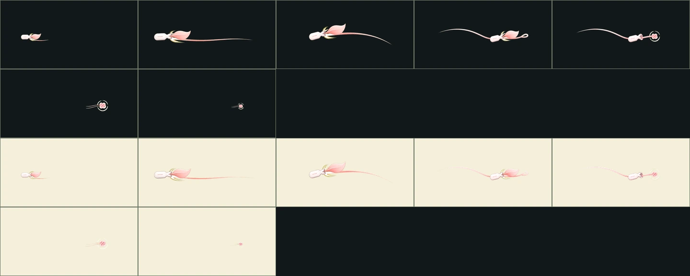
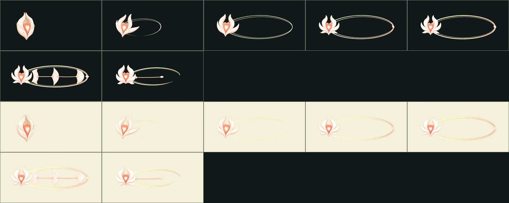
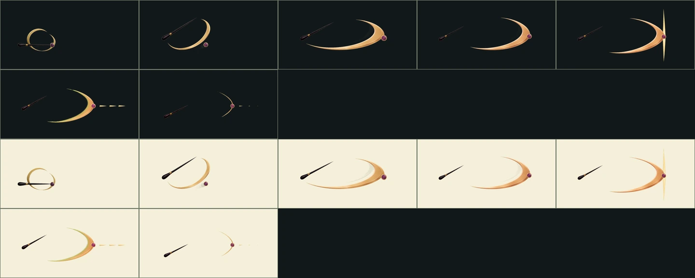
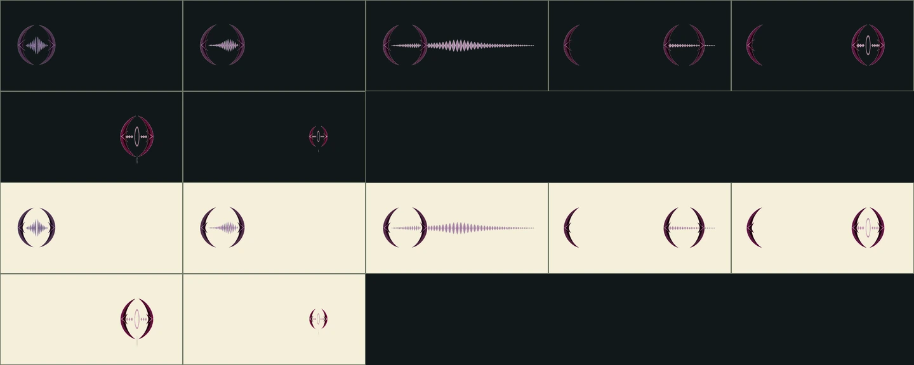

# 프리미엄 지원가 고유 스킬 VFX v7

백화와 세렌의 고유 스킬 4종을 전투 런타임에 연결하기 위한 포즈별 원본,
투명 알파, QA 시트와 애니메이션 미리보기입니다.

| 캐릭터 | 스킬 | 런타임 | 모션 합계 | 대상 |
|---|---|---:|---:|---|
| 백화 | 응급 개화 | `triage-bloom-v1` | 780ms | 최저 체력 동료 |
| 백화 | 백의정원 선서 | `white-garden-oath-v1` | 760ms | 아군 전체 |
| 세렌 | 황금 첫박 | `golden-downbeat-v1` | 720ms | 수호자·후속 아군 |
| 세렌 | 침묵의 코다 | `silent-coda-v1` | 760ms | 수호자 |

각 효과는 Imagegen으로 포즈 7장을 따로 만든 뒤 크로마를 제거했다. 런타임은
원본을 576×288 투명 WebP로 정규화할 뿐, 공격 본체를 코드로 다시 그리지 않는다.
감정별 색은 Flutter에서 낮은 농도의 보조 블렌딩으로만 더한다.

실제 기기에서 접촉 프레임과 GPU 비용을 확인하기 전까지 네 family는
`production_ready:false`를 유지합니다.
