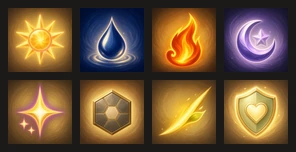

# 전투 벨트 아이콘 v15

상태: **번들 검사·실기 재생 확인 통과**

설계서 8.1의 `아이콘 8종 후보 / A·Q 잔여`가 이것이다.

## 여기까지 오기 전 상태

6아이콘 벨트에서 고유 스킬과 감정 스킬은 전용 아이콘을 쓰는데, **기본 공격과
마음 지키기는 머티리얼 기본 아이콘**이 그대로 나가고 있었다.

```dart
Icon(actionCode == 'guard'
    ? Icons.shield_outlined
    : Icons.sports_martial_arts_rounded)
```

손그림 동화풍 화면 한가운데에 안드로이드 기본 아이콘이 둘 섞여 있었다는 뜻이다.
설계서 4.2는 이 두 자리에도 `공격 glyph`·`방패 glyph`를 요구한다.

성장결 여섯은 더 나빴다. 화면에서 성장결은 **글자 + `Icons.hub_outlined` 하나**로만
표시됐다. 여섯이 같은 그림이라, 색과 글자를 못 읽으면 구분할 방법이 없었다.



| 아이콘 | 모양 | 팔레트 |
|---|---|---|
| `kel/sunny` | 햇살 원반과 곧은 빛살 | 금빛·꿀빛·연분홍 |
| `kel/rainy` | 물방울 하나와 잔물결 고리 | 짙은 남색·크림 |
| `kel/ember` | 위로 솟은 불꽃 한 갈래 | 잉걸 주황·진홍 |
| `kel/moonlit` | 두꺼운 초승달과 품은 별 | 라벤더·보랏빛 남색 |
| `kel/sparkling` | 네 갈래 별빛과 작은 불티 둘 | 금빛·보라·크림 |
| `kel/mosaic` | 결이 나뉜 육각 타일 | 흑연빛·황동 |
| `action/attack` | 잎끝이 걸린 비스듬한 획 | 금빛·연둣빛 |
| `action/guard` | 하트를 품은 둥근 방패 | 세이지·크림 |

## 색 없이도 갈리게

여섯을 **실루엣만으로** 구분되게 잡았다. 해·물방울·불꽃·초승달·별·육각 타일은
까맣게 칠해 놓아도 헷갈리지 않는다. 예고 아이콘에 이미 같은 계약이 걸려
있고(`앞열·전체·최저 체력 예고는 색 없이도 서로 다른 형태를 쓴다`), 성장결에도
같은 잣대를 건다.

## 검사는 사고만 잡는다 — 판단은 넘보지 않는다

`build_belt_icons.py`가 재는 것은 **같은 그림이 두 번 들어갔는가** 하나다.

처음에는 실루엣을 뽑아 겹쳐 보려 했는데 **잣대가 틀렸다.** 이 아이콘들은
비네트 배경 위의 불투명 그림이고 광채까지 밝아서, 여섯 다 `꽉 찬 덩어리`로
이진화됐다(채움 52~73%). 그 값으로는 해와 불꽃이 0.06 차이로 나와 멀쩡한
그림이 반려됐다. 이 저장소에서 픽셀 휴리스틱을 세우려다 실패한 **세 번째**
경우다(앞의 둘은 크로마 잔류 잣대와 스필 기준).

그래서 범위를 좁혔다. 표준적인 average hash로 중복만 본다. 실측하면 —

| | 값 |
|---|---|
| 같은 그림 두 번 | 0.000 |
| 가장 닮은 진짜 짝(`sparkling` ↔ `sunny`) | 0.074 |
| 중앙값 | 0.191 |

그 사이인 **0.03**에 선을 그으면 사고는 잡히고 판단은 넘보지 않는다.

**모양이 서로 갈리는지는 눈으로 본다.** 위 대조 시트가 그 자리다. 가장 닮은
짝은 `별빛`과 `햇살`인데, 둘 다 금빛으로 뻗는 모양이라 그렇다. 40dp에서 해는
가운데가 꽉 찬 원반이고 별빛은 속이 빈 네 갈래라 갈린다.

## Imagegen 생성 기록

- 모드: `/gpt-image` 배치, 신규 이미지 8회. 재작업 없음.
- 스타일 참조: 기존 감정 스킬 아이콘 `emotion/sunny-radiant-heart-v1.webp`.
- 프롬프트 전문은 `jobs-1.json`~`jobs-3.json`에 그대로 있다.
- 규격은 기존 스킬 아이콘과 같다 — 256×256 불투명 WebP.

## 실기 확인

합동 수호전 벨트에서 1번 자리에 잎끝 달린 획, 6번 자리에 하트 품은 방패가
나온다. 길게 눌러 연 상세의 성장결 태그에는 햇살 마크가 붙는다. 네트워크
로그에 `action/attack-v1.webp`·`action/guard-v1.webp`·`kel/sunny-v1.webp`가
200으로 찍혔고 콘솔 오류는 없었다.

성장결 마크는 지연 로딩이라 **화면에 나온 것만** 받는다. 이번 판에서 확인한
것은 햇살결 하나이고, 나머지 다섯은 그 성장결 대원이 나오는 판을 깔아야 한다.
