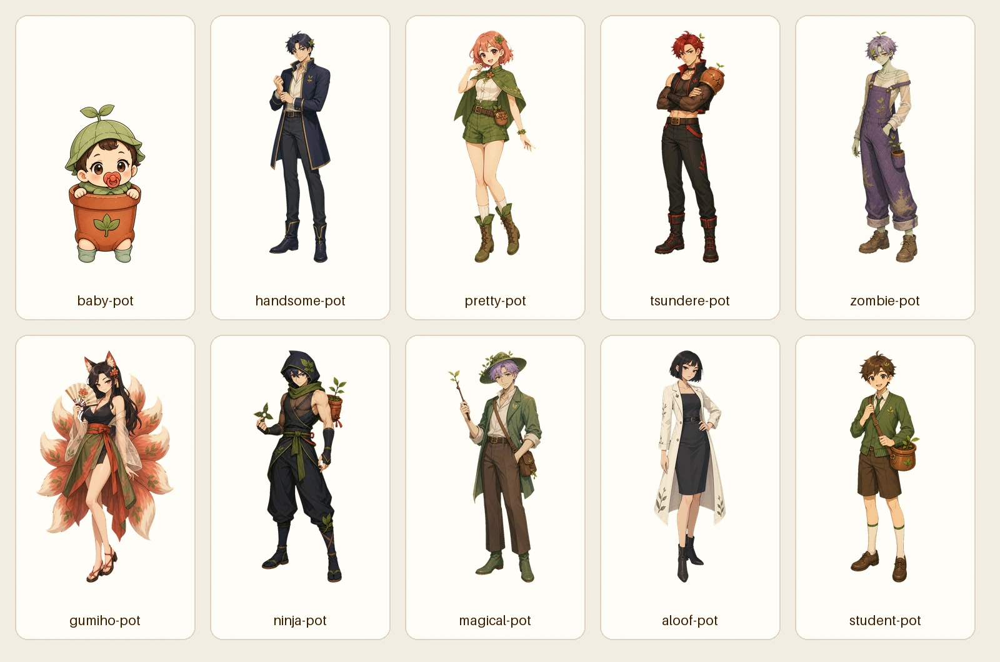
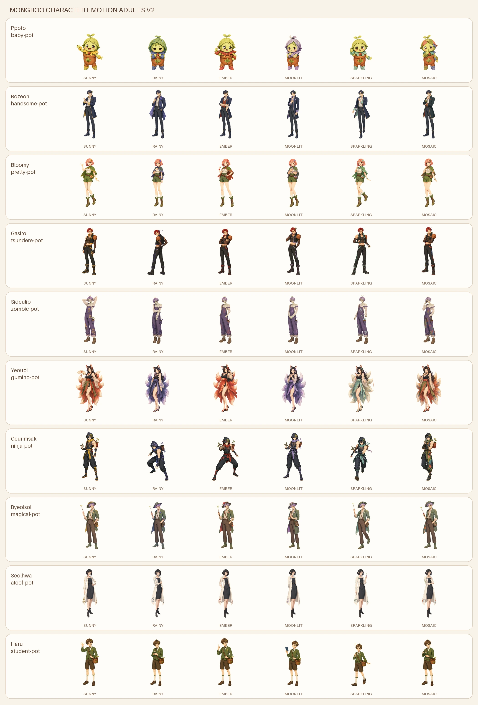

# 핵심 캐릭터 절제형 리디자인 v2

기존 10종의 머리색, 성격, 화분과 식물 모티프는 유지하고 의상 장식 밀도를 낮춘
아트 디렉션이다. 얼굴, 체형, 의상 핏과 실루엣을 캐릭터별 독립 스프라이트로
제작해 앱의 상점·도감·정원 캐릭터에 연결한다.

## 피부 톤과 매력 기준

| 캐릭터 | 주된 인상 | 피부 기준 | 의상 방향 |
|---|---|---|---|
| 뽀또 | 귀여운 마스코트 | 해당 없음 | 잎 보닛과 화분 |
| 로제온 | 잘생김 | 23N | 열린 칼라의 몸에 맞는 코트 |
| 블루미 | 예쁨 | 21C/21N | 민소매 블라우스와 쇼츠 |
| 가시로 | 섹시함 | 19N | 크롭 조끼와 시스루 이너 |
| 시들잎 | 나른한 섹시함 | 19호 밝기의 세이지 | 느슨한 멜빵과 시스루 니트 |
| 여우비 | 우아한 섹시함 | 19C/19N | 시스루 소매와 다리선이 보이는 현대 한복 |
| 그림싹 | 날렵한 섹시함 | 19N | 한쪽 어깨와 메시 패널이 보이는 닌자복 |
| 별솔 | 잘생김 | 23C/23N | 열린 칼라의 식물학자 코트 |
| 설화 | 예쁨 | 21C | 몸에 맞는 원피스와 흰 연구 코트 |
| 하루 | 건전한 호감형 | 23N | 단정한 학생회 가디건 |

## 적용 원칙

- 의상은 2~3개의 주된 옷과 한 개의 대표 식물 모티프로 구성한다.
- 귀여움과 미형은 표정과 얼굴형에서, 성인 캐릭터의 절제된 섹시함은 시선,
  자세와 옷의 핏에서 만든다.
- 뽀또는 아기 식물 마스코트로만 연출한다.
- 하루는 건강하고 단정한 학생회장 인상으로 유지하며 성적 연출을 하지 않는다.
- 감정 루트는 의상 전체를 갈아입히기보다 표정, 주색, 대표 식물과 작은 소품을
  바꾸는 방식으로 확장한다.
- 여섯 감정은 같은 얼굴의 색상 변형이 아니라 표정, 손동작, 무게 중심과
  실루엣이 서로 다른 포즈로 만든다.
- 금장, 보석, 꽃잎, 리본, 망토, 발광 입자와 무지개색을 동시에 사용하지 않는다.

## 성장·감정 스프라이트

기존 1~4단계 190장은 그대로 유지하고, 10캐릭터 × 6감정의 성인 단계 60장을
v2로 교체했다. 한 캐릭터는 고유 씨앗 1장과 여섯 감정별 4단계 24장으로 총
25장을 사용하며, 전체 성장 계약은 250장이다.

성인 단계 파일은
`app/assets/plants/{slug}-25d-full-bloom-{form}-v2.webp` 규칙을 사용한다.
앱은 최고 성장 단계에서 v2를 먼저 선택하고, 파일이 없으면 기존 성장
스프라이트와 벡터 렌더 순으로 안전하게 내려간다.

## 생성 방식

기존 전체 성장 도감과 캐릭터별 운영 이미지는 정체성 참고 이미지로만 사용했다.
ImageGen 기본 도구로 캐릭터를 각각 생성하고 `#ff00ff` 크로마키를
`extract_magenta_sprite.py`로 제거한 뒤 투명 512×768 무손실 WebP로
정규화했다. 기존 파일은 보존하고 `-v2.webp` 파일을 추가해 앱의 기존 캐릭터
키가 새 파일을 사용하도록 연결했다.

감정 완전체 원본은 `emotion-adult-sources/`에 보존한다.
`build_character_emotion_adults_v2.py`가 각 여섯 칸 시트를 분리해 앱 자산과
검수용 contact sheet를 재현한다.
