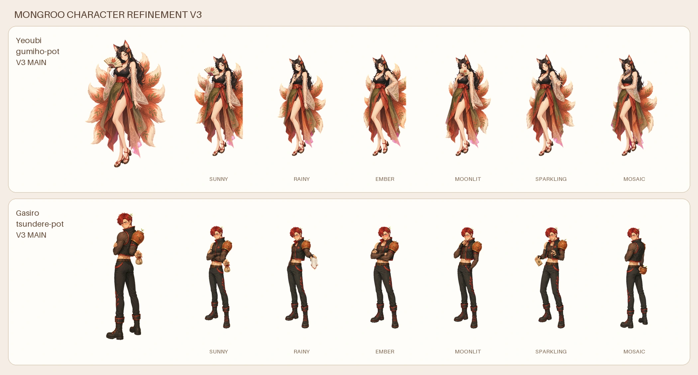

# 여우비·가시로 정체성 보강 v3

## 여우비

여우비는 단순히 우아한 구미호가 아니라 첫눈에 요염함이 읽히는 성인
캐릭터로 보강했다. 19C/19N 피부, 반쯤 감긴 직접 시선, 살짝 올라간 입매,
S자 무게 중심, 입술 아래 부채, 한쪽 다리선과 시스루 오간자 소매를 핵심으로
쓴다. 노출 자체보다 시선과 자세가 색기를 만든다.

6감정은 같은 얼굴의 색상 변형이 아니다. 햇살은 눈을 맞추는 유혹적인 미소,
빗방울은 외로운 요염함, 불씨는 도발적인 자신감, 달그늘은 비밀스러운 시선,
반짝은 여우 윙크, 마음모아는 느긋한 이야기꾼 자세를 사용한다.

## 가시로

가시로가 기존 츤데레 담당 캐릭터다. v3에서는 전투형 인상을 줄이고 외면,
팔짱과 작은 삐친 입을 강화했다. 동시에 씨앗주머니·손수건·수선 화분을 몰래
건네는 행동을 넣어 “말은 차갑지만 행동은 다정한” 츤데레의 모순이 한눈에
보이게 했다.

> v4에서는 v3의 상시 홍조를 폐기했다. 기본 얼굴은 23N의 자연스러운 피부로
> 유지하고, 호감이나 예상 밖의 칭찬에 당황하는 일부 반응에서만 옅은 홍조를
> 사용한다.

## 자산과 빌드

- 대표: `app/assets/characters/{gumiho-pot|tsundere-pot}-v3.webp`
- 감정 성체:
  `app/assets/plants/{slug}-25d-full-bloom-{form}-v3.webp`
- 원본: `sprite-sources/`, `emotion-adult-sources/`
- 재빌드: `design-system/scripts/build_character_refinements_v3.py`

ImageGen 기본 도구로 기존 v2 정체성을 참조해 생성했다. `#ff00ff` 크로마를
투명화하고, 연결되지 않은 이웃 패널 조각을 제거한 뒤 512×768 무손실 WebP로
정규화한다. 기존 v2는 fallback으로 보존한다.
