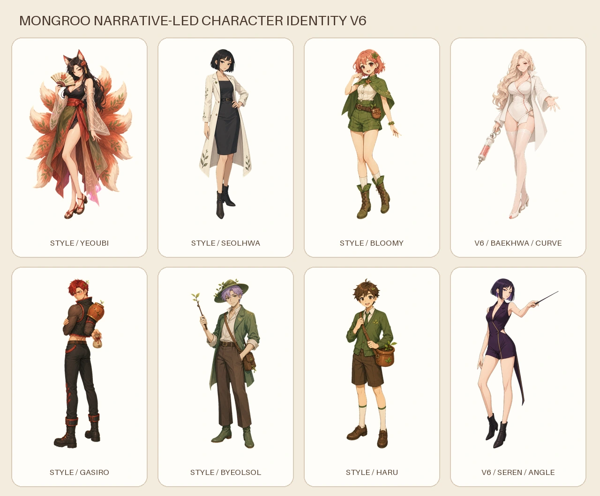

# 프리미엄 지원가 서사 기반 재설계 v6

`docs/premium_support_character_bible_v6.md`의 서사를 먼저 확정한 뒤 백화와 세렌을
서로 다른 도형 언어로 다시 제작했습니다. 기존 로스터는 선화·셀 채색의 밀도만
참고했으며 얼굴, 머리, 체형, 의상과 포즈는 복제하지 않았습니다.

- 백화: 원과 곡선, 펄 블론드 장발, 풍만하고 안정적인 체형, 짧은 백색 현장 코트,
  대형 앰플 인젝터
- 세렌: 삼각형과 직선, 잉크 바이올렛 단발, 길고 각진 체형, 무소매 테일러드 롬퍼,
  흑단 지휘봉
- 공통: 또렷한 애니메이션 선화, 2~3단 셀 채색, 장식·파티클·후광 없는 전신 원화

`sources/`는 Imagegen 크로마 원본, `alpha/`는 로컬 크로마 제거 마스터입니다.
앱용 512×768 WebP는 `design-system/scripts/build_premium_character_v6.py`로
재생성합니다.



## 성장 시트 생성 규격

만개만 있던 두 사람의 씨앗~개화 네 단계를 채우기 위한 규격이다. 각 단계가
어떤 모습인지는 `docs/premium_support_character_bible_v6.md`의 `성장 계보`
절이 단일 원본이고, 여기서는 파일 규격과 프롬프트만 다룬다.

- 캐릭터당 **시트 한 장**이면 된다. 씨앗·새싹·가지·개화 네 칸을 왼쪽부터
  한 줄로 담는다. 만개는 이미 있는 `{slug}-v6.png`를 그대로 쓴다.
- 크로마 원본은 균일한 `#00FF00`, `sources/{slug}-growth-chroma.png`.
  크로마를 제거한 투명 마스터는 `alpha/{slug}-growth.png`.
- 칸 사이는 캐릭터 폭의 10% 이상 비운다. 자동 분할이 빈 세로 구간에서
  칸을 가른다 - 붙여 놓으면 두 칸을 하나로 읽는다.
- 네 칸의 **상대 크기가 곧 성장 곡선**이다. 같은 배율로 캔버스에 앉히므로
  칸마다 크기를 맞춰 그리면 씨앗이 성인만큼 커진다. 한 시트 안에서 키 차이를
  실제 비율대로 그린다.
- 발끝을 한 줄에 맞춘다. 바닥선, 그림자, 텍스트, 패널 테두리, 번호는 넣지
  않는다.
- 감정 여섯 결은 만들지 않는다. 빌드가 중립본에서 파생한다.

빌드는 이렇게 돈다. numpy가 필요해 `design-system/requirements.txt` 환경에서
실행한다.

```
python design-system/scripts/build_premium_character_v6_growth.py
```

캐릭터당 런타임 28개(중립 4단계 + 감정 6결x4단계)와 6결x5단계 검수 시트를
`qa/`에 남기고, 원본과 산출물 해시를 `qa/premium-character-v6-growth.json`에
적는다. 만개 중립본은 다시 만들지 않는다 - 배율 기준이 달라(468 대 448)
지금 빌드에 들어간 파일이 소리 없이 바뀐다.

시트를 넣고 빌드한 뒤 `app/test/plant_sprite_coverage_test.dart`의 `knownGaps`
에서 `maestro-pot`·`nurse-pot` 여덟 줄을 지운다. 안 지우면 테스트가 실패해서
알려 준다.

### ImageGen 프롬프트

캐릭터마다 한 번씩 돌린다. 입력 1은 그 캐릭터의 만개 마스터
(`alpha/{slug}-v6.png`), 입력 2는 연령 가독성 참고용으로 v7 성장 시트
(`design-system/concepts/character-expansion-v7/alpha/restorer-pot-growth.png`)
를 넣되 얼굴·의상은 참고하지 않는다.

```text
Use case: character-growth-sheet
Asset type: one four-panel age-progression sheet of a single mobile game character for 2D cleanup
Input images: Image 1 is the exact approved adult identity for this character. Image 2 is age-progression pacing reference only - do not copy its face, hair, clothing, or props.
Primary request: draw the same character at four ages in one row, left to right - {stage_1}, {stage_2}, {stage_3}, {stage_4}.
Identity lock: preserve the character's base shape language, hair color, eye color, skin tone, signature prop family, accent color, warm ink outline weight, and soft upper-left key light from Image 1. The adult in Image 1 must read as the grown-up version of the fourth panel.
Age readability: larger head and rounder eyes when young; head-to-body ratio lengthens with each panel. Draw the real height difference between panels - do not fit each figure to the same box.
Coverage rule: panels two through four are fully covered practical clothing. No adult exposure, no sheer fabric, no sensual posing at any panel. Mature styling belongs only to the separate adult master.
Prop progression: panel two holds a small stand-in, panel three holds a small real version, panel four holds the adult version.
Style/medium: Mongroo 2D mobile game character illustration, crisp ink outline, two to three step cel shading, simple readable face and hands, hair as large masses with few interior lines.
Screen: exactly four full-body figures in one horizontal row, feet on one shared baseline, gaps of at least 10% of a figure width between panels, solid #00FF00 background, no floor, no cast shadow, no text, no numbers, no panel borders, no particles, no halo.
Avoid: identity drift between panels, same height across panels, adult proportions on the young panels, extra fingers or limbs, realistic anatomy, glossy 3D toy rendering, neon rim light, ornate accessories, cropped hair, cropped feet.
```

`{stage_n}`에는 바이블 `성장 계보` 표의 해당 줄을 그대로 넣는다. 안전 필터에
막히면 같은 프롬프트를 반복하거나 표현을 바꿔 우회하지 않는다.
