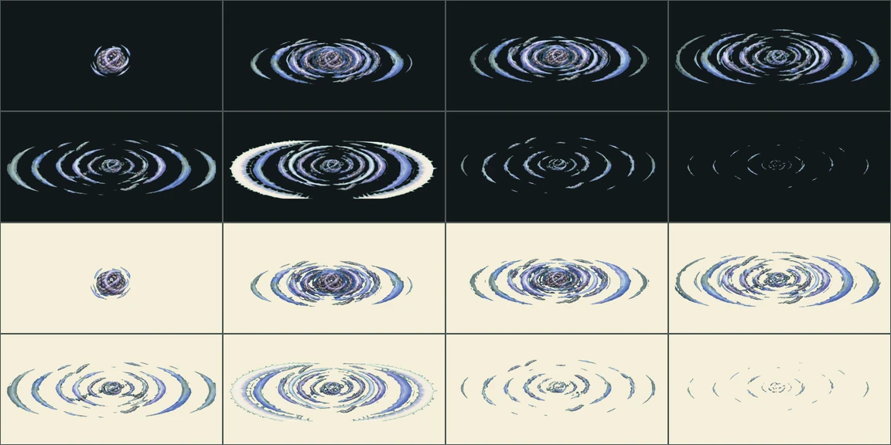

# 메아리 우물정원 적 공격 VFX v10

상태: **자동 검수·프레임 타임 통과 — 저사양 실기기만 남음**

메아리 우물정원의 엉킴 3종이 쓰던 공격 6종을 8프레임 전용 연출로 제작했다.
이 지역의 엉킴 의도는 이제 모두 자기 family를 쓴다 — 여기까지 오기 전에는
여섯 의도 전부가 성장결별 공용 연출(`kel.*`)로 떨어지고 있었고, 그것이
설계서 9장이 금지한 `적 12종을 공용 연출로 끝내는 것`이었다.

| family | 공격 | 엉킴 | 대상 | 실루엣·판정 |
|---|---|---|---|---|
| `knotted-echo.echo-ring` | 겹울림 | 매듭진 메아리 | 전원 | 겹친 울림이 모두의 귓가로 번져요. |
| `knotted-echo.sharp-note` | 날카로운 한 음 | 매듭진 메아리 | 맨 앞 | 높은 음 하나가 맨 앞 대원을 겨눠요. |
| `splashing-droplets.splash-wave` | 물보라 | 튀는 물방울 떼 | 전원 | 물방울들이 한꺼번에 튀어 오르려 해요. |
| `splashing-droplets.water-pop` | 물방울 터뜨리기 | 튀는 물방울 떼 | 가장 지친 대원 | 큰 방울 하나가 지친 대원 위에서 흔들려요. |
| `bell-knot-swirl.bell-spin` | 종줄 휘감기 | 소용돌이 종매듭 | 맨 앞 | 감긴 종줄이 맨 앞 대원 쪽으로 풀려 나가요. |
| `bell-knot-swirl.deep-toll` | 깊은 울림 | 소용돌이 종매듭 | 전원 | 낮은 종소리가 바닥을 타고 모두에게 번져요. |

## Imagegen 생성 기록

- 모드: `/gpt-image` 배치, 신규 이미지 6회. 기존 이미지를 수정하지 않았다.
- 스타일 참조: 승인된 v9 시트 `moss-archive-enemy-attacks-v9/shelf-sweep`
  한 장을 매 요청에 붙여 선 굵기와 칸 프레이밍을 이었다.
- 공통 프롬프트와 지역별 프롬프트 전문은 이 디렉터리의 `jobs.json`에 그대로 있다.
  1536×1024 2열 4행 시트, anticipation→release→travel→travel→pre-contact→
  contact→reaction→dissipation, 캐릭터·배경·UI·문자 제외, 균일한 시안 크로마.

## 추출·블렌딩 계약

`design-system/scripts/register_enemy_attack_effects.py`가 시트를 받아
`build_boss_pattern_assets.py`로 자르고, 그 결과를 앱이 읽는 효과 manifest에
등록한다. 등록에 쓰는 family·성장결·이펙트 키는 **서버 엉킴 카탈로그에서
읽는다** — 손으로 옮기면 어긋나고, 어긋나면 앱은 조용히 공용 연출로 떨어진다.

- 런타임: `app/assets/adventure/effects/{effect-key}-v1`
- 각 8프레임, 합계 780ms
- **접촉 프레임은 5다.** v9 시트는 5번째 칸에서 부딪히도록 그려져 굽는
  스크립트가 `4`를 박아 두는데, v10 시트는 프롬프트가 6번째 칸을 접촉 정점으로
  지정해 한 칸 뒤다. 이 값이 어긋나면 타격 정지와 피해 숫자가 그림보다 한
  프레임 먼저 튄다.
- 앱은 exact family를 먼저 찾고, 없을 때만 성장결 fallback을 쓴다.
- `production_ready:true`: `verify_effect_production_gate.py`의 검사를 통과했다 —
  프레임 무결성, 크로마 잔류, **실제 지역 전투 배경 위 가독성**(밝은 쪽·어두운
  쪽), 디코딩 피크. 잰 값은 manifest 각 항목의 `gate`에 붙어 있다.
- 재생 프레임 타임은 `design-system/benchmarks/effect-frame-time`이 Windows
  데스크톱 profile에서 쟀다 — 연출 한 프레임에 래스터 0.6ms·빌드 0.5ms로,
  60Hz 예산 16.7ms의 4% 남짓이다(`docs/performance.md` 5장).
- 남은 것은 **저사양 Android·iOS 실기기**다. 이 기계에 Android SDK도 실기기도
  없어서 잴 수 없고, manifest의 `gate_profile.pending`에 이름으로 적혀 있다.

## 팔레트 재작업 (2026-09-01)

첫 판에서 다섯 연출이 **시안 키 위에 올라탄 색**으로 나왔다. 물·소리·별가루를
차가운 청록으로 적었더니 그림과 배경이 같은 색이 되어, 크로마를 걷으면 그림에
구멍이 나고 남기면 배경이 샜다. `lens-glare`의 빛줄기 주변 청록 조각을 어두운
배경에 올려 놓고서야 보였다.

움직임은 그대로 두고 팔레트만 키 색에서 떼어 다시 만들었다(`jobs-fix.json`) —
소리는 라벤더·인디고, 물은 남색과 크림 거품, 별가루는 보라와 금빛. 프롬프트에
`시안·청록·하늘색을 쓰지 말 것`을 못 박았다.

| family | 프레임에 남은 배경 (전 / 후) |
|---|---|
| `knotted-echo.sharp-note` | 그림 대비 42.6% → 0.05% |
| `splashing-droplets.splash-wave` | 27.6% → 0.09% |
| `snarled-stardust.dust-lash` | 19.2% → 0.13% |
| `snarled-stardust.dust-flare` | 9.0% → 0.30% |
| `knotted-echo.echo-ring` | 8.3% → 0.16% |

`design-system/scripts/verify_enemy_attack_effects.py`가 이 값을 잰다. 비율이
아니라 **프레임에서 배경이 차지하는 넓이**로 세는데, 소멸 프레임처럼 남은
그림이 몇백 픽셀뿐인 곳에서는 잔류 60픽셀도 16%로 찍혀 비율이 거짓말을 하기
때문이다. 지금 실려 있는 69종 전부 기준(1%) 아래다.

