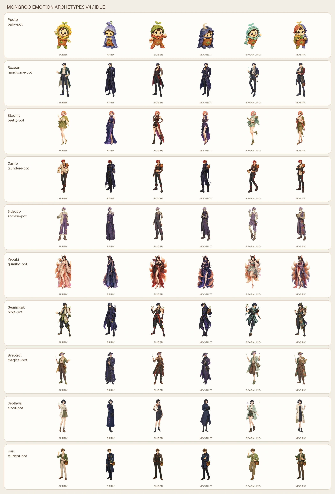

# 감정 원형 성장 성체 v4



누적 마음 일기의 우세 감정이 5단계 성체의 색만 바꾸는 것이 아니라 얼굴,
실루엣, 의상 밀도, 표정, 자세와 반응 방식까지 바꾸는 세트다.

## 구성

- 10개 캐릭터
- 6개 감정 원형: `sunny`, `rainy`, `ember`, `moonlit`, `sparkling`, `mosaic`
- 3개 자세: `idle`, `diary`, `grow`
- 앱용 투명 WebP: 180개
- 캔버스 512×768, 바닥선 y=718

각 캐릭터 폴더에는 ImageGen 원본인 `{state}-chroma.png`, 배경을 제거한
`{state}-alpha.png`, 18개 결과를 한눈에 보는 `preview.webp`가 있다.

## 감정 원형

| form | 누적 감정 | 성체 방향 |
|---|---|---|
| `sunny` | 기쁨·즐거움·애정 | 온미남·온미녀, 열린 미소와 다정한 자세 |
| `rainy` | 슬픔·상처·외로움 | 냉미남·냉미녀, 고딕과 절제된 우울미 |
| `ember` | 분노·좌절·저항 | 섹시함, 강인함, 걸크러쉬·눈나·존잘 |
| `moonlit` | 불안·두려움·경계 | 보호적 다크 로맨스와 집착계 미스터리 |
| `sparkling` | 놀람·흥분·호기심 | 귀엽고 장난스러운 반전 매력 |
| `mosaic` | 혼합·양가감정 | 성숙하고 분석적인 이중 매력 |

`rainy`와 `moonlit`은 허구적 고딕·다크 로맨스 어휘만 사용하며 실제 감정을
질환으로 진단하지 않는다. `baby-pot`은 모든 분기에서 비성적 마스코트다.

## 캐릭터별 보정 규칙

- 가시로는 23N의 자연스러운 피부를 기본으로 하며 평상시에는 홍조가 없다.
  홍조는 `sunny diary`, `sparkling idle`, `sparkling diary`처럼 호감이나
  당황이 직접 드러나는 츤데레 순간에만 볼 중심으로 옅게 나타난다.
- 여우비는 모든 감정 분기에서 열린 목선, 어깨선, 잘록한 허리, 한쪽 다리선과
  시스루 소매를 기본 정체성으로 유지한다. `ember`는 이 기본값보다 어깨·허리·
  다리선이 더 강한 최고 노출 단계다.
- 여우비의 `moonlit`은 높은 비대칭 슬릿 아래로 검정 반투명 스타킹과 검정 힐을
  사용해 다크 로맨스 분위기를 만든다.
- 블루미의 `ember`는 불투명한 롱부츠 대신 검정 반투명 스타킹과 가는 힐을
  사용해 자신감 있는 성인 무대 의상을 만든다.

## 생성 방식

원화는 내장 ImageGen으로 만들었다. 캐릭터별 기존 디자인과 바로 앞의
승인된 v4 시트를 참조하는 이미지-투-이미지 방식이며, 각 시트에 정확히 여섯
명의 전신 컷아웃을 같은 순서로 배치했다.

공통 프롬프트 세트는 다음을 고정했다.

1. 캐릭터의 얼굴, 머리, 식물 모티프와 분기별 의상 유지
2. `sunny → rainy → ember → moonlit → sparkling → mosaic` 순서 유지
3. `idle`은 원형 정체성, `diary`는 일기 확인 반응, `grow`는 성장 축하 동작
4. 성인형만 매력·노출 표현 허용, 노골적 성행위·나체·자해 상징 제외
5. 단색 `#FF00FF` 배경, 텍스트·패널선·추가 인물 제외

## 빌드

```powershell
python design-system/scripts/extract_magenta_sprite.py `
  --input <state-chroma.png> `
  --out <state-alpha.png>

python design-system/scripts/build_emotion_archetype_sprites_v4.py `
  --source-root design-system/concepts/emotion-archetype-growth-v4 `
  --output-dir app/assets/plants `
  --idle-preview design-system/concepts/emotion-archetype-growth-v4/emotion-archetypes-v4-idle-preview.webp
```

앱 파일 이름은 다음 규칙을 따른다.

```text
{slug}-25d-full-bloom-{form}-v4-{idle|diary|grow}.webp
```
