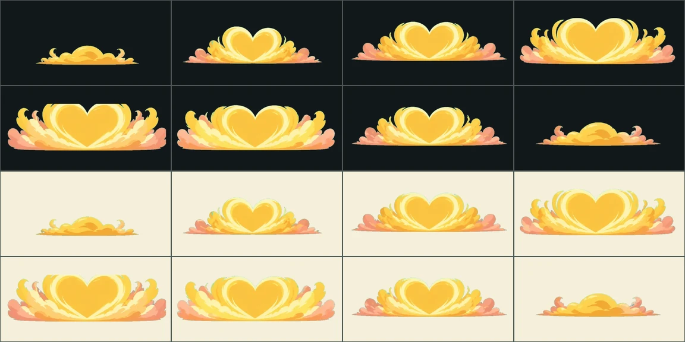

# T3 감정층 VFX v14

상태: **자동 검수·프레임 타임 통과 — 저사양 실기기만 남음**

설계서 8.1에서 마지막까지 `A·Q 미완료`로 남아 있던 줄이다.

## 무엇이 잘못돼 있었나

T3 고유기는 캐릭터 고유 연출을 **바꾸지 않고** 그 위에 감정층을 두 번째
레이어로 겹친다. 그 레이어가 가리키는 family가 여섯 다 `kel.*`였는데, 그건
아직 자기 연출이 없는 행동이 떨어지는 **성장결 공용 연출**이다.

- `kel.sunny` → `care-vines-v2` — **아기화분의 고유기 연출**
- `kel.mosaic` → `echo-wave` — **전역 fallback과 같은 디렉터리**

즉 햇살결 캐릭터가 T3를 쓰면 자기 연출 위에 아기화분 덩굴이 26%로 겹쳐
나오고 있었다. 검사도 있었는데 `kel.{form}`을 보고 있어서 **늘 통과하면서
아무것도 확인하지 않았다.**

| family | 층 이름 | 접촉 재질 | 런타임 색(주·보조) |
|---|---|---|---|
| `fusion.sunny` | 햇살 심광층 | 금빛 심광과 하트 광륜 | `#FFD48A` · `#FF8FA8` |
| `fusion.rainy` | 빗물 빙류층 | 물막과 얇은 결빙 파편 | `#8FD8F2` · `#B7C8FF` |
| `fusion.ember` | 불씨 투혼층 | 압축 화염과 격투 충격륜 | `#FF7B61` · `#FFC05C` |
| `fusion.moonlit` | 달그늘 폭풍층 | 초승달 바람과 긴 고독 잔광 | `#9DA7E8` · `#71C6C8` |
| `fusion.sparkling` | 별빛 전격층 | 번개 가지와 짧은 음파 고리 | `#C6A8FF` · `#FFE37A` |
| `fusion.mosaic` | 무채 강철층 | 강철 편린과 안정 역장 | `#A8C5BE` · `#D8C9B7` |

## 이 시트는 브리프가 다르다

앱은 이 레이어를 `opacityScale: .26`, `scale: 1.04`로 얹는다. 26%까지 내려가면
가는 선과 잔무늬는 그냥 사라진다. 그래서 **넓고 단순한 큰 실루엣으로, 두 번째
공격이 아니라 재질과 정서로 읽히게** 그린다. 채도도 눌러 둔다 — 런타임이
성장결 색으로 한 번 더 물들이기 때문이다.

**넓고 단순한 것과 옅은 것은 다르다.** 1차 프롬프트에 `속이 비치게(OPEN)`라고
적은 것이 아래 재작업의 원인이었다. 형태는 넓고 성기게, 칠은 불투명하게.

## Imagegen 생성 기록

- 모드: `/gpt-image` 배치, 신규 이미지 6회 + 재작업 2회.
- 스타일 참조: 승인된 v9 시트 `moss-archive-enemy-attacks-v9/shelf-sweep`.
- 프롬프트 전문은 `jobs-1.json`·`jobs-2.json`·`jobs-fix.json`에 그대로 있다.

## 재작업 2회 — 옅게 그리면 청록이 앉는다

`햇살`과 `무채` 1차가 걸렸다. **26%라는 말을 시트에까지 적용해 옅게 그린 것이
원인이다.** 반투명하게 칠하면 키 색이 그림 속으로 섞여 들어오고, 걷어 내면
따뜻한 팔레트 한가운데가 청록으로 앉는다. 햇살은 하트 속까지 회청색이 됐고,
무채는 안개 테두리가 통째로 청록이었다. **투명도는 런타임이 준다 — 시트는
불투명하게 그린다.** 길잡이 등불에서 한 번 당하고도 또 당했다.

`무채`는 색만이 아니라 물건도 틀렸다. 강철 편린이 나무판자로 나왔다.
`리벳이 박힌 금속판이고 나무판자가 아니다`를 못 박아 다시 만들었다.

크로마 검사는 두 번 다 통과했다. 옅게 섞인 색이라 키 색 범위에 안 들기
때문이다. 이 결함은 **밝은·어두운 QA 시트를 눈으로 보는 것 말고 검사가 없다.**
새 잣대를 만들려던 시도는 앞서 두 번 다 버렸다 — 초록·파랑 비율로 재면 승인된
파랑 연출이 100%로 걸리고, 스필 기준을 낮추면 얼음 연출이 92% 뭉개진다.

## 서버도 같이 고쳤다

`fusion_production_ready`가 호출부에 `True`로 박혀 있었다. 프로필이 자기 승격
여부를 데이터로 들고, 단위 테스트가 그 값을 manifest와 맞춰 본다. 검사도
`fusion.*`를 보도록 다시 썼고, **공용 연출과 다른 디렉터리를 쓰는지**까지
확인한다 — family 이름만 바꾸고 같은 그림을 가리키면 고친 것이 아니다.

성장결 공용 연출(`kel.*`)은 원래 자리에 그대로 뒀다. 아직 자기 연출이 없는
기본 공격 6종이 거기로 떨어져야 한다.

## 등록·검수

`design-system/scripts/register_combat_effects.py`가 굽고 등록한다. family와
성장결은 **서버 `FUSION_LAYER_PROFILES`에서 읽는다**.

- 런타임: `app/assets/adventure/effects/{effect-key}-v1`, 각 8프레임 780ms
- 접촉 프레임 5 (v10~v13과 같은 이유)
- `verify_effect_production_gate.py` 통과 후 `production_ready:true`
- 4.7 납품 묶음도 `build_effect_delivery.py`로 함께 만든다
- 남은 것은 저사양 Android·iOS 실기기이고 `gate.pending`에 적혀 있다

