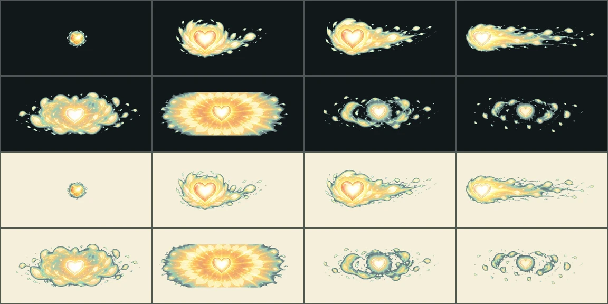

# 감정 스킬 VFX v12

상태: **자동 검수·프레임 타임 통과 — 저사양 실기기만 남음**

S3A가 적어 둔 아트 항목의 **마지막 줄**이다. 엉킴 24종, 수호짐승 12종,
대원 고유기 30종이 차례로 자기 연출을 갖는 동안 감정 스킬 여섯만 남아 있었다.

## 여기까지 오기 전 상태

여섯 다 `emotion.*` family를 콘텐츠에 적어 두고 있었다. 그런데 그 family가
manifest에 **없어서**, 앱은 순서대로 찾다가 성장결 공용 연출(`kel.*`)로
떨어뜨렸다. 적어 둔 것과 나가는 것이 달랐다는 뜻이다.

서버가 보내는 `effect_key`는 한 겹 더 뭉개져 있었다. 감정 스킬은
`ELEMENT_RUNTIME_EFFECTS[element]`를 보냈는데 이 표는 **원소별**이라
빛(light)과 번개(lightning)가 똑같이 `prism_burst`다. `찬란한 하트`와
`경이의 전격`이 같은 키를 받고 있었다.

| family | 스킬 | 감정 | 원소 | 동작 원형 | anchor |
|---|---|---|---|---|---|
| `emotion.sunny-radiant-heart` | 찬란한 하트 | 햇살 심광 | light | 펼쳐 비추기 | `stage_center` |
| `emotion.rainy-frozen-tide` | 얼어붙은 파도 | 빗물 빙류 | water | 낮게 밀기 | `stage_center` |
| `emotion.ember-rage-breaker` | 분노 파쇄권 | 불씨 투혼 | fire | 앞으로 파고들기 | `actor_center` |
| `emotion.moonlit-lonesome-tempest` | 고독의 돌풍 | 달그늘 폭풍 | wind | 돌며 감기 | `stage_center` |
| `emotion.sparkling-shock-wonder` | 경이의 전격 | 별빛 전격 | lightning | 끊어 치기 | `stage_center` |
| `emotion.mosaic-steel-equilibrium` | 강철 평형장 | 무채 강철 | steel | 버티고 서기 | `actor_center` |

## 결이 다르다

엉킴은 덤벼들고 짐승은 뒤척이지만, 이건 **우리 대원이 스스로 내는 힘**이다.
그래서 프롬프트에 `이것은 주인공 자신의 기술이고, 위협이 아니라 결심으로
읽혀야 한다`를 못 박았다. 여덟째 칸이 아무것도 없이 사라지지 말라는 조건도
같이 적었다 — v11에서 소멸 칸이 비어 굽는 스크립트에 거절당한 적이 있다.

## 색을 키에서 떼는 일이 특히 어려웠다

여섯 중 셋이 가만두면 전부 청록으로 나온다.

- **얼어붙은 파도** — 얼음은 기본값이 하늘색이다. `얼음을 흰색과 연보라로
  그리고, 청록이나 얼음빛 파랑은 쓰지 말 것`으로 지정했다.
- **경이의 전격** — 번개도 기본값이 푸른 흰빛이다. 금색·보라 번개에 크림빛
  중심으로 돌렸다.
- **강철 평형장** — 강철도 기본값이 푸른 회색이다. 따뜻한 흑연빛과 황동으로
  돌렸다.

엉킴 1차에서 이걸 몰라 다섯 장을 다시 만들었다. 이번에는 프롬프트에서 막았다.

## Imagegen 생성 기록

- 모드: `/gpt-image` 배치, 신규 이미지 6회.
- 스타일 참조: 승인된 v9 시트 `moss-archive-enemy-attacks-v9/shelf-sweep`.
- 프롬프트 전문은 `jobs-1.json`·`jobs-2.json`에 그대로 있다.

## 등록·검수

`design-system/scripts/register_combat_effects.py`가 굽고 등록한다. family와
성장결은 **서버 감정 스킬 카탈로그에서 읽는다** — 엉킴·짐승과 같은 경로다.
`anchor`만 스크립트가 정하는데, 대원 스킬 쪽 콘텐츠에는 anchor 칸이 없기
때문이다. 기존 대원 고유기와 같은 규칙을 쓴다: 스스로에게 두르는 것은
`actor_center`, 무대를 건너가는 것은 `stage_center`.

서버도 함께 고쳤다. `source in ("signature", "emotion")`이면 자기 코드를
보낸다 — manifest만 채우고 서버가 계속 공용 키를 보내면, 만들어 놓고 안 쓰는
상태가 조용히 남는다.

- 런타임: `app/assets/adventure/effects/{effect-key}-v1`, 각 8프레임 780ms
- 접촉 프레임 5 (v10·v11과 같은 이유)
- `verify_effect_production_gate.py` 통과 후 `production_ready:true`
- 남은 것은 저사양 Android·iOS 실기기이고 `gate.pending`에 적혀 있다

