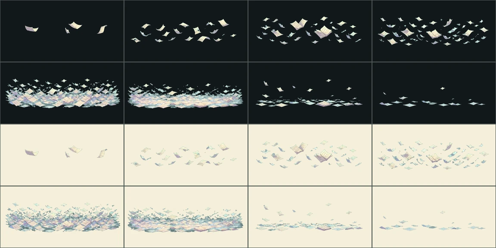

# 수호짐승 공격 VFX v11

상태: **자동 검수·프레임 타임 통과 — 저사양 실기기만 남음**

합동 수호전에 나오는 짐승 넷의 의도 12종을 8프레임 전용 연출로 제작했다.
S3A가 적어 둔 `수호짐승 공격 8종`은 각 짐승의 주 의도 둘씩이고, 여기에
**잠꼬대 4종**을 더했다. 잠꼬대도 자기 이름과 대상을 가진 의도라, 빼 두면
그것만 공용 연출로 남아 고치려던 문제가 넷 남는다.

## 여기까지 오기 전 상태

열두 의도 전부가 `guardian.enemy-wave` **하나**를 나눠 썼다. 페이지 눈보라와
두레박 기울이기와 나이테 파동이 같은 그림이었다는 뜻이다. 짐승들은 `vfx_family`
자체가 없어서 `present_intent`의 호환 계층으로 떨어졌는데, 그 함수의 docstring이
스스로를 `아직 전용 연출이 없는 일반 수호자`용이라고 적어 두고 있었다. 설계서
9장이 금지한 `공용 연출로 끝내는 것`이 바로 그 상태다.

| family | 공격 | 짐승 | 대상 | 예고 |
|---|---|---|---|---|
| `ledger-keeper.page-snow` | 페이지 눈보라 | 돌비늘 장부지기 | 전원 | 잠결에 페이지가 눈처럼 쏟아져요. |
| `ledger-keeper.spine-lean` | 책등 기대기 | 돌비늘 장부지기 | 맨 앞 | 책등이 맨 앞 대원 쪽으로 기울어요. |
| `ledger-keeper.margin-murmur` | 여백의 잠꼬대 | 돌비늘 장부지기 | 가장 지친 대원 | 여백에 적힌 말이 작게 새어 나와요. |
| `echo-keeper.ripple-hug` | 파문 껴안기 | 물거울 메아리지기 | 전원 | 물결이 둥글게 번져 모두를 감싸요. |
| `echo-keeper.well-lean` | 두레박 기울이기 | 물거울 메아리지기 | 맨 앞 | 두레박이 맨 앞 대원 쪽으로 기울어요. |
| `echo-keeper.half-echo` | 반쪽 메아리 | 물거울 메아리지기 | 가장 지친 대원 | 돌아오지 못한 메아리가 가장 지친 쪽에 머물러요. |
| `seed-keeper.stardust-drift` | 별가루 흩날림 | 별가루 씨앗지기 | 전원 | 쌓인 별가루가 잠결에 흩날려요. |
| `seed-keeper.shelf-tilt` | 씨앗함 기울기 | 별가루 씨앗지기 | 맨 앞 | 씨앗함이 맨 앞 대원 쪽으로 기울어요. |
| `seed-keeper.sprout-sigh` | 새싹 한숨 | 별가루 씨앗지기 | 가장 지친 대원 | 아직 못 깬 씨앗이 작게 숨을 뱉어요. |
| `record-keeper.ring-wave` | 나이테 파동 | 옹이등 기록지기 | 전원 | 나이테가 물결처럼 번져 나가요. |
| `record-keeper.lamp-lean` | 옹이등 기울기 | 옹이등 기록지기 | 맨 앞 | 등불이 맨 앞 대원 쪽으로 기울어요. |
| `record-keeper.unfinished-line` | 미완의 한 줄 | 옹이등 기록지기 | 가장 지친 대원 | 쓰다 만 한 줄이 가장 지친 쪽을 맴돌아요. |

## 결이 다르다

엉킴은 덤벼들지만 **짐승은 자고 있다.** 페이지가 쏟아지고 두레박이 기울고
씨앗함이 넘어지는 것은 공격이 아니라 뒤척임이다. 그래서 프롬프트에
`잠든 큰 짐승이 꿈결에 뒤척여 생긴 일이고, 공격자의 동작이 아니다`를 못 박고,
동작 원형도 달려들거나 내리치는 `dash`가 아니라 기울고(`brace`) 번지고
(`channel`) 흩뿌리는(`cast`) 쪽으로만 골랐다.

## Imagegen 생성 기록

- 모드: `/gpt-image` 배치, 신규 이미지 12회 + 재작업 1회.
- 스타일 참조: 승인된 v9 시트 `moss-archive-enemy-attacks-v9/shelf-sweep`.
- 프롬프트 전문은 `jobs-1.json`~`jobs-3.json`과 `jobs-fix.json`에 그대로 있다.
- 색은 시안 키에서 떼어 적었다. 엉킴 1차에서 물·소리·별가루를 청록으로 적었다가
  그림이 배경에 올라타 다섯 장을 다시 만든 적이 있다.

## 재작업 1회

`ripple-hug`의 마지막 소멸 칸이 거의 비어서 굽는 스크립트가 거절했다
(`suspicious alpha coverage 0.0002`). 키잉 문제가 아니라 그림이 너무 사라진
것이라, `소멸 프레임도 형태가 남아 있어야 한다`를 프롬프트에 더해 다시 만들었다.
검사가 잡아 준 것이지 눈으로 본 것이 아니다.

## 등록·검수

`design-system/scripts/register_combat_effects.py`가 굽고 등록한다.
family·성장결·이펙트 키는 **서버 짐승 카탈로그에서 읽는다** — 엉킴과 같은
경로를 쓰고, 스크립트는 어느 쪽인지 알 필요가 없다.

- 런타임: `app/assets/adventure/effects/{effect-key}-v1`, 각 8프레임 780ms
- 접촉 프레임 5 (v10과 같은 이유)
- `verify_effect_production_gate.py` 통과 후 `production_ready:true`
- 남은 것은 저사양 Android·iOS 실기기이고 `gate.pending`에 적혀 있다

