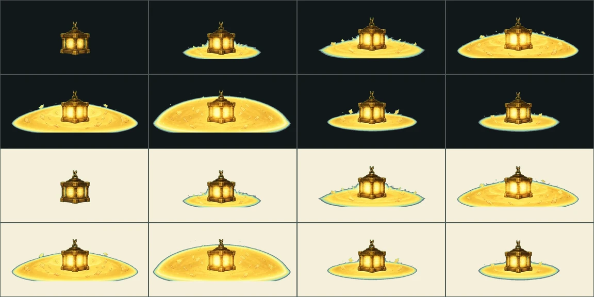

# 길잡이·기록서 VFX v13

상태: **자동 검수·프레임 타임 통과 — 저사양 실기기만 남음**

서버가 보내는 전투 행동 중 **자기 연출이 없는 마지막 세 자리**다.

## 실기에서 보고 만들었다

감정 스킬 6종을 채운 날 합동 수호전을 실제로 돌려 봤는데, 여섯 자리 중
**다섯이 길잡이**였다. 화분을 하나만 가진 계정이면 그게 보통이다. 그런데
길잡이의 `기록 등불`·`기록 봉인`은 `archive-guide.*` family를 적어 두고도
manifest에 없어서 성장결 공용 연출로 떨어졌고, 기록서 `되울림`은 네트워크
로그에서 `echo-wave`를 받는 것이 그대로 찍혔다.

| family | 스킬 | 누구 | 원소 | 효과 | anchor |
|---|---|---|---|---|---|
| `archive-guide.lantern` | 기록 등불 | 길잡이 | light | shield_all | `party_all` |
| `archive-guide.archive-seal` | 기록 봉인 | 길잡이 | seal | shield_all | `stage_center` |
| `skillbook.field-note-echo` | 현장 기록: 되울림 | 기록서(선택 II) | ink | study_refund | `stage_center` |

## 기본 공격 6종은 넣지 않았다

`emotion.sunny-light`처럼 성장결별 기본 공격 여섯도 manifest에 없다. 그건
**설계대로**다 — 4.2가 기본 공격 자리를 `공격 glyph + 성장결`로 정해 뒀다.
그 자리에서는 성장결 연출이 나가는 것이 맞고, 전용 시트를 만들면 오히려
설계서와 어긋난다. 안 만든 것과 못 만든 것을 같이 적지 않으려고 여기 남긴다.

## 결

길잡이는 싸우러 온 사람이 아니라 **기록을 지키는 사람**이다. 그래서 프롬프트에
`기록을 관리하는 사람의 일이고, 조심스럽고 질서 있고 지키는 쪽으로 읽혀야
한다`를 못 박았다. 등불은 때리지 않고 덮고(`party_all`), 봉인은 펼쳐 세우고,
되울림은 기록한 파형을 되돌려 보낸다.

## Imagegen 생성 기록

- 모드: `/gpt-image` 배치, 신규 이미지 3회 + 재작업 1회.
- 스타일 참조: 승인된 v9 시트 `moss-archive-enemy-attacks-v9/shelf-sweep`.
- 프롬프트 전문은 `jobs.json`과 `jobs-fix.json`에 그대로 있다.

## 재작업 1회 — 수치가 못 본 결함

등불 1차는 돔이 **반투명**이었다. 시안 배경이 안쪽으로 비쳐 들어와서, 키를
걷고 나니 따뜻한 팔레트 한가운데 청록 웅덩이가 남았다. 크로마 검사는 통과한다 —
옅게 섞인 색이라 키 색 범위에 안 든다.

새 잣대를 두 번 만들어 봤고 **두 번 다 버렸다.**

- `초록·파랑이 빨강보다 높은 픽셀 비율` — 승인된 파랑 연출들이 100%로 걸렸다.
  중앙값이 26%다. 이 그림(27%)과 구분이 안 된다.
- `스필 기준을 40에서 24로` — 얼음 연출 `absolute-zero`의 92.6%, `kel.moonlit`의
  76.5%를 덧칠하게 된다. 진짜 차가운 그림을 망가뜨린다.

그래서 **눈으로 보고 그림을 고쳤다.** `돔은 속까지 불투명한 금빛으로 칠하고,
안팎 어디에도 초록·청록을 두지 말 것`을 프롬프트에 더해 다시 만들었다. 웅덩이는
사라졌다.

바닥 테두리에 1~2픽셀짜리 청록 선이 남아 있다. 3배로 확대해야 보이고, 실제
크기에서는 안티에일리어싱 수준이다. 지금 실려 있는 다른 연출들에도 같은 정도로
있다. **못 재는 것을 잰 척하지 않으려고 여기 적어 둔다** — 이건 통계가 아니라
밝은·어두운 QA 시트를 눈으로 보는 자리다.

## 서버도 같이 고쳤다

`효과 키`는 선택 슬롯에서 코드로 못 가른다. **기록서를 장착하면 코드만 그 책
것으로 바뀌고 연출은 바탕 스킬 것을 그대로 물려받는다.** 그래서 책 코드를
그대로 보내면 manifest에 없는 키가 나가고, 앱은 family로 그림은 맞게 찾아도
키를 타는 소리·타격 정지가 어긋난다.

`SELECTED_SLOT_EFFECT_KEYS`가 `family → 그 연출을 가진 스킬 코드`를 콘텐츠에서
만들어 두고, 선택 슬롯은 그걸로 되짚는다. 고치기 전후로 대원 행동 1,920건의
`(family, effect_key)`를 전부 뽑아 비교했고 **바뀐 것은
`skillbook.field-note-echo`의 `echo_wave` → `field_note_echo` 하나뿐**이다.

## 등록·검수

`design-system/scripts/register_combat_effects.py`가 굽고 등록한다. 성장결은
길잡이·기록서 쪽 콘텐츠에 안 적혀 있어서 **서버의 `ELEMENT_KEL`로 원소에서
끌어온다** — 손으로 옮기면 어긋난다.

- 런타임: `app/assets/adventure/effects/{effect-key}-v1`, 각 8프레임 780ms
- 접촉 프레임 5 (v10~v12와 같은 이유)
- `verify_effect_production_gate.py` 통과 후 `production_ready:true`
- 남은 것은 저사양 Android·iOS 실기기이고 `gate.pending`에 적혀 있다

