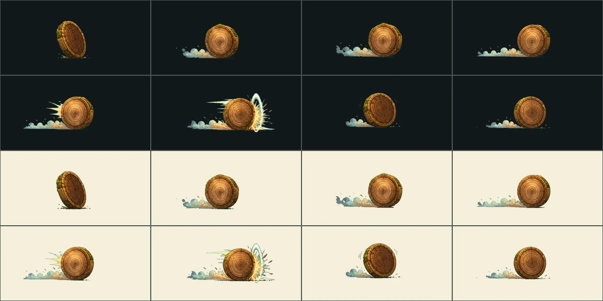

# 심재 관측실 적 공격 VFX v10

상태: **production candidate — 실기 프로파일·최종 아트 승인 전**

심재 관측실의 엉킴 3종이 쓰던 공격 6종을 8프레임 전용 연출로 제작했다.
이 지역의 엉킴 의도는 이제 모두 자기 family를 쓴다 — 여기까지 오기 전에는
여섯 의도 전부가 성장결별 공용 연출(`kel.*`)로 떨어지고 있었고, 그것이
설계서 9장이 금지한 `적 12종을 공용 연출로 끝내는 것`이었다.

| family | 공격 | 엉킴 | 대상 | 실루엣·판정 |
|---|---|---|---|---|
| `ring-shard-tangle.ring-spin` | 나이테 굴리기 | 얽힌 나이테 조각 | 맨 앞 | 둥근 조각이 맨 앞 대원 쪽으로 기울어요. |
| `ring-shard-tangle.shard-scatter` | 조각 흩날리기 | 얽힌 나이테 조각 | 전원 | 잔조각들이 모두에게 흩어지려 해요. |
| `scattered-records.page-storm` | 낱장 폭풍 | 흩어진 기록 낱장 | 전원 | 기록 낱장이 모두의 시야를 덮으려 해요. |
| `scattered-records.paper-cut` | 종이 모서리 | 흩어진 기록 낱장 | 가장 지친 대원 | 빳빳한 모서리가 지친 대원을 스치려 해요. |
| `matted-observatory.lens-glare` | 렌즈 눈부심 | 헝클어진 관측기 | 전원 | 굴절된 빛이 모두의 눈앞에서 번쩍이려 해요. |
| `matted-observatory.tape-whip` | 줄자 휘두르기 | 헝클어진 관측기 | 맨 앞 | 긴 줄자가 맨 앞 대원 쪽으로 풀려 나가요. |

## Imagegen 생성 기록

- 모드: `/gpt-image` 배치, 신규 이미지 6회. 기존 이미지를 수정하지 않았다.
- 스타일 참조: 승인된 v9 시트 `moss-archive-enemy-attacks-v9/shelf-sweep`
  한 장을 매 요청에 붙여 선 굵기와 칸 프레이밍을 이었다.
- 공통 프롬프트와 지역별 프롬프트 전문은 이 디렉터리의 `jobs.json`에 그대로 있다.
  1536×1024 2열 4행 시트, anticipation→release→travel→travel→pre-contact→
  contact→reaction→dissipation, 캐릭터·배경·UI·문자 제외, 균일한 시안 크로마.

## 추출·블렌딩 계약

`design-system/scripts/register_enemy_attack_effects.py`가 시트를 받아
`build_boss_pattern_assets.py`로 자르고, 그 결과를 앱이 읽는 효과 manifest에
등록한다. 등록에 쓰는 family·성장결·이펙트 키는 **서버 엉킴 카탈로그에서
읽는다** — 손으로 옮기면 어긋나고, 어긋나면 앱은 조용히 공용 연출로 떨어진다.

- 런타임: `app/assets/adventure/effects/{effect-key}-v1`
- 각 8프레임, 합계 780ms
- **접촉 프레임은 5다.** v9 시트는 5번째 칸에서 부딪히도록 그려져 굽는
  스크립트가 `4`를 박아 두는데, v10 시트는 프롬프트가 6번째 칸을 접촉 정점으로
  지정해 한 칸 뒤다. 이 값이 어긋나면 타격 정지와 피해 숫자가 그림보다 한
  프레임 먼저 튄다.
- 앱은 exact family를 먼저 찾고, 없을 때만 성장결 fallback을 쓴다.
- `production_ready:false`: 실제 지역 배경, 저사양 Android/iOS p95,
  320/390/430dp 접촉 위치를 통과한 뒤에만 승격한다.

