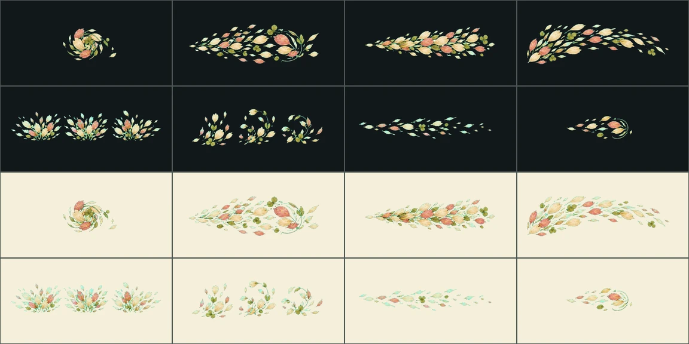

# 이끼 기억서고 적 공격 VFX v9

상태: **production candidate — 실기 프로파일·최종 아트 승인 전**

1지역 엉킴과 돌비늘 장부지기의 잔여 공격 5종을 8프레임 전용 연출로 제작했다.
기존 `종잇장 회오리`, `잉크 안개`, `꽃잎 살촉`, `장부 발톱`, 보스 2종과 합치면
현재 플레이 가능한 이끼 기억서고의 적 의도 12종은 모두 고유 family를 사용한다.

| family | 공격 | 실루엣·판정 |
|---|---|---|
| `drifting-pressings.petal-gust` | 꽃잎 돌풍 | 원형 압축 → 광역 꽃잎 파동 |
| `shelf-snarl.shelf-sweep` | 선반 휘두르기 | 짧은 서가 → 전열 수평 타격 |
| `shelf-snarl.catalogue-rain` | 목록 소나기 | 목록 카드 상승 → 전원 낙하 |
| `guardian.record-wave` | 기록 파동 | 푸른 색인 고리 → 광역 파동 |
| `guardian.seal-crush` | 봉인 압쇄 | 붉은 봉인 양분 → 최저 체력 대상 압착 |

## Imagegen 생성 기록

- 모드: 내장 Imagegen, 신규 이미지 5회. 기존 이미지를 수정하지 않았다.
- 스타일 참조: 프로젝트의 `paper-flurry-v1`, `ledger-claw-v2`, 수호짐승 원화와
  이끼 기억서고의 따뜻한 동화책 질감·짙은 외곽선·절제한 잔광.
- 공통 프롬프트: 1536×1024 2×4 프레임 시트, anticipation→release→travel→
  precontact→contact→reaction→recovery, 캐릭터·배경·UI·문자 제외, 균일한 시안
  크로마 배경. 각 공격은 이름이 아닌 표적과 파훼법이 실루엣에서 읽히게 했다.
- 프로젝트 원본:
  - 꽃잎 돌풍: `petal-gust/sources/petal_gust-sheet-chroma.png`
  - 선반 휘두르기: `shelf-sweep/sources/shelf_sweep-sheet-chroma.png`
  - 목록 소나기: `catalogue-rain/sources/catalogue_rain-sheet-chroma.png`
  - 기록 파동: `record-wave/sources/record_wave-sheet-chroma.png`
  - 봉인 압쇄: `seal-crush/sources/seal_crush-sheet-chroma.png`

## 추출·블렌딩 계약

`design-system/scripts/build_boss_pattern_assets.py`가 시트의 실제 행·열 구분선을
검출해 셀을 자른다. 시안 키 제거, 가장자리 RGB 확장, 576×288 WebP, SHA-256,
밝은/어두운 QA, 애니메이션 미리보기를 한 번에 만든다. 프레임마다 본체를 같은
크기로 다시 키우지 않고 셀 기준 비율을 보존해 예고와 접촉의 크기 변화가 남는다.

- 런타임: `app/assets/adventure/effects/{effect-key}-v1`
- 각 8프레임, 합계 800ms, contact frame 4
- 앱은 exact family를 우선하고, 누락 시에만 감정결 fallback을 사용한다.
- `production_ready:false`: 실제 이끼 서고 배경, 저사양 Android/iOS p95,
  320/390/430dp 접촉 위치를 통과한 뒤에만 승격한다.

