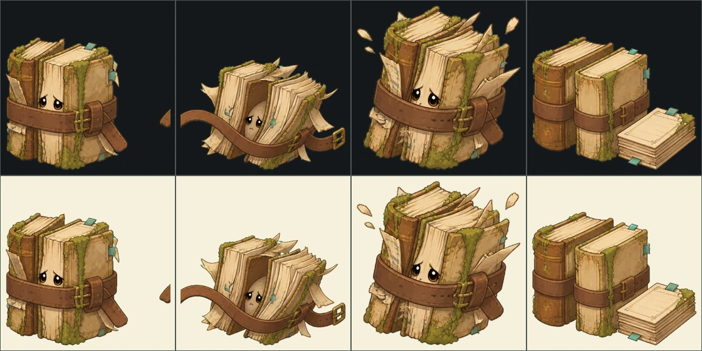

# 이끼 기억서고 엉킴 몸체 v9

상태: **production candidate — 실기 프로파일·최종 아트 승인 전**

네 지역 엉킴 12종의 절차적 도형 몸체를 전용 알파 원화로 교체했다. 지역별 재질
문법은 공유하되, 각 엉킴의 외곽선과 공격·피격·해방 자세는 서로 겹치지 않는다.

| 엉킴 | 서사 실루엣 | 4상태 |
|---|---|---|
| `tangled-ledger` | 닳은 장부와 금빛 실의 낮은 묶음 | idle / attack / hit / release |
| `drifting-pressings` | 압화와 청록 실이 만드는 가벼운 군집 | idle / attack / hit / release |
| `shelf-snarl` | 선반·서랍·뿌리가 엉킨 넓은 큰 매듭 | idle / attack / hit / release |
| `knotted-echo` | 투명한 메아리 고리가 겹친 청록 매듭 | idle / attack / hit / release |
| `splashing-droplets` | 수로를 벗어난 물방울 가족 | idle / attack / hit / release |
| `bell-knot-swirl` | 종줄과 청동 종이 감긴 무거운 소용돌이 | idle / attack / hit / release |
| `snarled-stardust` | 자주빛 별가루 실타래 | idle / attack / hit / release |
| `rolling-seedbox` | 황동 바퀴가 달린 이끼 씨앗함 | idle / attack / hit / release |
| `backwound-clockspring` | 되감긴 태엽·톱니·회중시계 매듭 | idle / attack / hit / release |
| `ring-shard-tangle` | 덩굴에 묶인 나이테 조각 | idle / attack / hit / release |
| `scattered-records` | 흩어진 관측 기록과 제본 끈 | idle / attack / hit / release |
| `matted-observatory` | 황동 관측기·자·케이블의 큰 엉킴 | idle / attack / hit / release |

## Imagegen 생성 기록

- 모드: 내장 Imagegen. 기존 3종의 시각 문법을 참조해 신규 9종을 만들고, 각
  결과를 다시 2×2 상태 시트로 정리했다.
- 스타일 참조: 프로젝트 전투 화면, 돌비늘 장부지기 원화, 먼저 승인한 장부 엉킴의
  따뜻한 손그림 동화책 질감과 굵은 외곽선만 참조했다.
- 공통 프롬프트: 2×2 상태 시트, 일관된 3/4 시점과 발밑 기준선, idle→attack→hit→
  release, 캐릭터·배경·UI·문자·셀 침범 제외, 완전 균일 `#00FFFF` 크로마 배경.
- `tangled-ledger`: 닳은 장부 묶음, 금빛 색인 실, 무기가 아니라 분류되지 못해
  웅크린 서고 물건이라는 인상.
- `drifting-pressings`: 말린 압화 꽃잎 군집, 청록 기록실, 가벼운 비행·흩어짐과
  표본첩으로 돌아가는 release.
- `shelf-snarl`: 선반 조각·서랍·황동 표찰·뿌리 매듭, 큰 엉킴다운 넓고 무거운
  외곽선과 선반을 펴는 release.
- 신규 9종 공통 프롬프트: 기존 idle 콘셉트의 정체성을 정확히 유지하고, 참고
  시트와 같은 사분면 순서로 idle / attack / hit / release를 한 칸씩 배치한다.
  따뜻한 손그림 동화책·2.5D 셀 셰이딩·재질별 명암·굵고 깨끗한 외곽선을 쓰며,
  문자·UI·그림자·셀 침범 없이 균일한 cyan 크로마만 배경으로 사용한다.
- 지역별 재질 지시: 우물정원은 유리 같은 물·청록 밧줄·노화한 청동, 씨앗
  보관고는 보랏빛 별가루·호두나무·황동 태엽, 관측실은 나이테·압화 종이·황동
  광학기와 짙은 녹색 케이블의 질감을 강조했다.
- 프로젝트 원본:
  - `tangled-ledger/sources/tangled-ledger-sheet-chroma.png`
  - `drifting-pressings/sources/drifting-pressings-sheet-chroma.png`
  - `shelf-snarl/sources/shelf-snarl-sheet-chroma.png`
  - 나머지 9종도 각 `<code>/sources/<code>-sheet-chroma.png`에 동일하게 보존

## 알파·런타임·블렌딩

`design-system/scripts/build_tangle_body_assets.py`가 시트 크기에 맞춰 2×2 셀을 자르고,
크로마 제거·edge RGB dilation·동일 발밑 정렬·SHA-256·밝은/어두운 QA를 만든다.

- 알파 마스터: 각 엉킴의 `alpha/*.png`
- 런타임: `app/assets/adventure/tangles/tangle-*-{state}-v1.webp`
- 원본 768×768, 모바일 파생본 576×576, 총 96 WebP
- 앱은 현재 상태 한 장만 디코드·표시해 매 프레임 반투명 4장을 겹치지 않는다.
- `production_ready:false`: 저사양 Android/iOS p95, 320/390/430dp 바닥 정렬,
  실제 이끼 서고 밝은/어두운 구간의 잔여 크로마 검수 뒤에만 승격한다.

