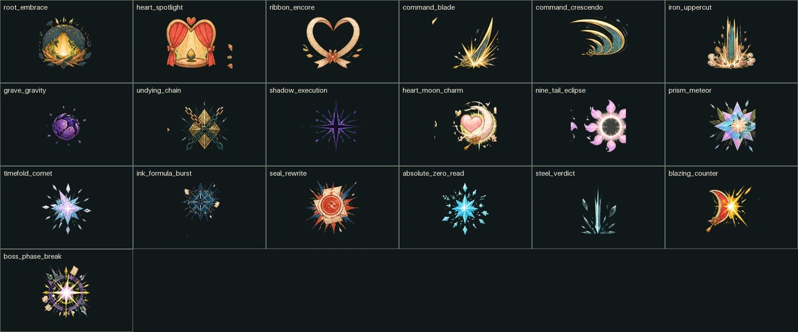

# 탐험 전투·캐릭터 성장 시스템 v8

작성 기준일: 2026-08-12
구현 기준: `battle-state-v3` · `combat-kit-v8` · `signature-skill-completion-v8`

이 문서는 현재 코드와 런타임 에셋을 기준으로 한 전투 시스템의 단일 현행 명세다.
이전 v6·v7 문서의 10종/12종 수치와 제작 예정 표기는 당시 개발 기록이며, 서로
다를 경우 이 문서와 서버 판정을 우선한다.



## 1. 현재 완료 범위

| 항목 | 현재 상태 | 런타임 증거 |
|---|---:|---|
| 플레이 가능 성장 계보 | 15종 | 서버 전투 카탈로그·상점·성장 계보 |
| 캐릭터 고유 스킬 | 30종 | 캐릭터당 고유 I·II, 30개 고유 code/family |
| 전용 이펙트 | 30/30 | 스킬별 7프레임 이상 WebP와 manifest `production_ready:true` |
| 전용 아이콘 | 30/30 | 스킬 code와 1:1 대응하는 128~256px 정사각 WebP |
| 감정 융합 | 180종 | 15캐릭터×6감정×고유 2, T3에서만 합성 |
| 레벨별 스킬 | Lv3·7·9·23 | 고유 I·II, 감정 스킬, 기록서 스킬 순차 해금 |
| 연출 단계 | T1·T2·T3 | VFX 강도·SFX·카메라·감정 융합 차등 |
| 출시 플레이 구간 | 이끼 기억서고 8스테이지 | 일반·혼합·큰 엉킴·3페이즈 수호전 |
| 적 카탈로그 | 12종·의도 24종 | 4지역 수치/기믹 설계, 런타임은 1지역 3종 |
| 1지역 적 연출 | 본체 3종·의도 12종 | 4상태 몸체와 공격별 exact VFX family |
| 보스 | 1종·3페이즈 | 100%·66%·33%에서 상성·패턴·규칙·연출 전환 |
| 밸런스 검증 | 44,550전 | 9개 출시 게이트 전부 통과 |

“구현 완료”는 이름과 계수만 존재한다는 뜻이 아니다. 서버 판정, 잠금, 집중 비용,
쿨타임, 효과 수치, 모션, 런타임 VFX, 아이콘, SFX, 감정색, 클라이언트 재생까지
이어진 상태를 말한다.

## 2. 설계 판단과 2026 기준

2026 GDC의 Stadium 회고는 단순 공격력 상승이 후반 전투를 지나치게 짧고
정신없게 만들 수 있으며, 좋은 성장 효과는 캐릭터 판타지를 강화하고 작동 방식이
직관적이며 시각·음향 신호가 분명해야 한다고 정리한다. 또한 희귀도에 따라 단순
강화→역할 강화→약점 보완→빌드를 바꾸는 핵심 효과로 복잡도를 올리는 계층을
제시했다. 이 프로젝트는 그 원칙을 T1/T2/T3에 맞게 축소 적용한다.

- T1은 캐릭터의 기본 역할을 한 문장으로 이해시키는 단계다.
- T2는 보호·회복·자원·조건부 보상으로 운용 방식을 넓힌다.
- T3는 쿨타임 단축, 감정 융합, 소생이나 파티 증폭처럼 전투 계획을 바꾼다.
- 성장 연출은 화면을 덮는 파티클보다 contact 모양, 한 겹 추가되는 소리와 짧은
  카메라 강조로 구분한다.
- 상성은 강하지만 하드 카운터가 되지 않도록 내성에서도 최소 피해와 우회 기믹을
  남긴다.

GDC의 보스전 설계 원칙처럼 보스는 지금까지 익힌 스킬과 판단을 평가하면서 서사를
드러내는 종합 시험으로 둔다. 일반 전투에 없던 규칙을 마지막에 갑자기 요구하지
않고, 앞선 웨이브에서 배운 예고·상성·순서 선택을 페이즈마다 다시 조합한다.

근거 자료:

- [GDC 2026 — Designing Stadium](https://media.gdcvault.com/gdc2026/Slides/Hwang_Scott_DesigningStadium.pdf)
- [GDC 2026 — Ghost of Yōtei 전투 확장](https://schedule.gdconf.com/session/honing-the-blade-evolving-combat-for-ghost-of-yotei/913736)
- [Diablo IV 2.6 — 보스 저항·패턴 가시성 조정](https://news.blizzard.com/en-gb/article/24266869/diablo-iv-patch-notes-2-6)
- [Path of Exile 2 0.2 — 보스 스케일·테마 상성 조정](https://www.pathofexile.com/forum/view-thread/3740562/page/1)

## 3. 15종 역할·가격·고유기

`위력/집중/CD`는 스킬 원본값이다. 최종 위력은 레벨·희귀도·감정·상성·역할
스탯을 적용한 뒤 결정된다.

| 가격 | 캐릭터·역할 | 고유 I | 고유 II |
|---:|---|---|---|
| 0 | 뽀또 · 새싹 수호 | 새싹 응원 `14/2/1` | 뿌리 포옹 `12/3/3` |
| 50 | 로제온 · 지휘 검격 | 지휘검 일섬 `17/2/1` | 지휘의 크레센도 `14/3/3` |
| 50 | 블루미 · 무대 회복 | 하트 스포트라이트 `15/2/1` | 리본 앙코르 `13/3/3` |
| 80 | 가시로 · 반격 전위 | 홍련 카운터 `16/2/1` | 철벽 어퍼컷 `15/3/3` |
| 90 | 시들잎 · 불사 압박 | 묘지 중력장 `20/2/1` | 불사의 사슬 `18/3/3` |
| 120 | 여우비 · 매혹 제어 | 심월 매혹 `16/2/1` | 구미 월식 `13/3/3` |
| 120 | 그림싹 · 약점 암살 | 맹독 틈베기 `18/2/1` | 무영 처형 `14/3/3` |
| 누적 기록 | 하루 · 집중 순환 | 먹빛 공식탄 `14/2/1` | 봉인식 재작성 `12/3/3` |
| 150 | 별솔 · 상성 폭발 | 프리즘 메테오 `20/3/1` | 시공 접힌 혜성 `18/4/3` |
| 170 | 모루 · 발자국 전위 | 포실발 급습 `12/2/1` | 둥지지기 포효 `13/4/4` |
| 180 | 설화 · 안정 제어 | 절대영도 간파 `17/2/1` | 강철 판결 `15/3/3` |
| 240 | 세렌 · 공명 지휘 | 황금 첫박 `17/2/1` | 침묵의 코다 `15/4/4` |
| 260 | 에단 · 금빛 복원 | 파티나 패리 `13/3/2` | 금빛 이음새 `11/5/5` |
| 280 | 백화 · 백의 수호 | 응급 개화 `16/2/1` | 백의정원 선서 `12/4/4` |
| 320 | 리아 · 스타일 촉매 | 패치워크 릴레이 `18/2/1` | 런웨이 리버설 `18/4/4` |

가격은 전투력 숫자 하나의 서열이 아니다. 최고가 리아는 수동 상성·행동 순서에서
가장 높은 파티 상한을, 백화는 생존과 소생을, 에단은 실패 억제와 복원을 제공한다.
무료·저가 캐릭터만으로도 전 콘텐츠를 끝낼 수 있고 프리미엄은 역할 압축, 운용
상한과 실패 복구에 비용을 받는다. 외형 선호를 성능 독점으로 연결해 특정 캐릭터를
강제하지 않는다.

## 4. 레벨 해금과 성장 기믹

| 레벨 | 변화 | 사용자가 느끼는 차이 |
|---:|---|---|
| 1 | 기본 공격·마음 지키기 | 집중력과 상성 학습 |
| 3 | 고유 I T1 | 대표 판타지와 짧은 쿨타임 기술 |
| 7 | 고유 II T1 | 결정기·지원·제어의 두 번째 축 |
| 9 | 감정 선택 I | 현재 성장 감정에 따른 전술 추가 |
| 16 | 고유 I·II T2, 위력 110% | 보조 기믹과 full SFX, contact 강화 |
| 23 | 기록서 선택 II | 감정과 별개인 장착형 선택지 |
| 25 | 고유 I·II T3, 위력 122% | CD 1 감소, 감정 융합, signature 연출 |
| 26~30 | 역할 스탯·계수 성장 | 장기 공략 상한 확장 |

잠긴 슬롯은 숨기지 않고 같은 자리에 `Lv.N 해금`을 표시한다. 서버는 조작된 해금 전
요청을 `EXPEDITION_COMBAT_LEVEL_LOCKED`로 거절한다.

### 4.1 숫자 대신 운용을 바꾸는 기믹

- 뽀또·블루미·백화: 전원 보호, 최저 체력 회복, T3 소생으로 위기 복구.
- 로제온·가시로: 약점 적중 또는 정확한 마무리 때 다음 선택을 위한 집중 회수.
- 시들잎: 체력 임계치에서 적 위력 억제·자가 회복으로 최후 저항 강화.
- 여우비·설화: 내성에 막힌 상황에서 집중·보호를 되찾아 하드 카운터 완화.
- 그림싹·별솔·하루: 약점·정밀 마무리를 자원과 다음 행동으로 연결.
- 세렌·리아: 자신보다 뒤에 행동하는 대원을 강화해 순서 선택을 공략으로 만듦.
- 에단·모루: 피해를 흘리거나 취약 표식을 남기고 파티 보호로 전환.

효과 수치는 `effect_values`, 사용자 문장은 `mechanic_summary`로 같은 서버 원본에서
생성한다. 화면 설명과 실제 판정이 따로 관리되지 않는다.

## 5. 전투 스탯과 계수

일기 성장 능력치 `care/focus/courage/insight`와 별도로 캐릭터 체질을 네 값으로 둔다.

- 공격: 기본·고유 위력 보정
- 생존: 최대 HP와 마음 지키기 보호량
- 지원: 회복·전원 보호·파티 증폭
- 제어: 적 위력 감소·취약 보정

```text
combat_stat = base + round_half_up((level - 1) × growth_tenths / 10)
            + floor((rarity - 1) / 2) + emotion_bonus

raw       = 스킬 위력 + 관련 일기 능력치 + 공격 스탯 보정
growth    = round_bp(raw, 희귀도·레벨 고유 계수)
tiered    = round_bp(growth, T1 100% / T2 110% / T3 122%)
matched   = round_bp(tiered, 약점 150% / 중립 100% / 내성 60%)
final     = round_bp(matched, 스킬 조건 배수 × 후속 증폭 × 취약)
```

프리즘 기술은 현재 약점으로 굴절돼 항상 맞출 수 있는 대신 약점 배율이 130%다.
치명타·회피 같은 숨은 확률을 두지 않아 카드를 누르기 전에 결과를 예측할 수 있다.

## 6. 쿨타임·집중력·행동 순서

- 라운드 `r`에 CD `N` 스킬을 쓰면 `r + N + 1` 라운드에 다시 준비된다.
- T3 고유기는 원래 CD에서 1을 줄이되 최소 1을 지킨다.
- 집중력은 파티가 공유하며 시작 3, 최대 5다. 평균 Lv18부터 시작 집중 1을 더 준다.
- 쿨타임은 대원별이며 웨이브가 바뀌어도 초기화하지 않는다.
- 집중 부족·대기 중인 슬롯도 숨기지 않고 이유와 남은 라운드를 표시한다.
- 한 라운드의 첫 행동자가 `front` 공격의 대상이 된다.
- 후속 증폭·취약·적 위력 약화는 같은 라운드의 행동 순서에 따라 실제 적용된다.

## 7. 감정 상성과 T3 색층

20개 서사 원소를 햇살·빗물·불씨·달빛·별빛·모아의 여섯 결로 묶는다. 햇살↔달빛,
빗물↔불씨, 별빛↔모아가 서로 마주 보는 세 쌍이다.

| 감정 성장 | 주 재질 | 색상 primary / secondary | 역할 보너스 |
|---|---|---|---|
| 햇살 | 빛·생명·하트 | `#FFD48A` / `#FF8FA8` | 지원 +2 |
| 빗물 | 물·얼음 | `#8FD8F2` / `#B7C8FF` | 생존 +1, 제어 +1 |
| 불씨 | 불·격투 | `#FF7B61` / `#FFC05C` | 공격 +2 |
| 달빛 | 바람·달 | `#9DA7E8` / `#71C6C8` | 제어 +2 |
| 별빛 | 번개·음파 | `#C6A8FF` / `#FFE37A` | 공격 +1, 제어 +1 |
| 모아 | 강철·역장 | `#A8C5BE` / `#D8C9B7` | 생존 +2 |

T3에서는 `{species}.{form}.{slot}.t3` 형태의 180개 고유 키를 만든다. 전용 스킬
본체를 먼저 재생하고 감정 family를 0.26 opacity, 1.04 scale의 얇은 두 번째 층으로
합성한다. 캐릭터 얼굴·복장 전체에 hue rotate를 적용하거나 화면을 반짝이로 덮지
않는다. 움직임 줄이기에서도 접촉 시점과 피해 정보는 남긴다.

## 8. 모션·VFX·SFX

```text
anticipation → release → travel → precontact → contact → reaction → recovery
```

| tier | VFX | SFX | 카메라 |
|---|---|---|---|
| T1 | intensity 0.86, 고유 본체 | `skill-tier-light.wav` | steady |
| T2 | 1.00, trail·contact 보강 | `skill-tier-full.wav` | impact |
| T3 | 1.14, 감정 융합층 | `skill-tier-signature.wav` | impact/ultimate |

30종 모두 고유 family와 7프레임 이상 런타임 WebP, 전용 아이콘을 가진다. 앱은 스킬 code를
우선 조회하고, 누락된 경우에만 감정결 fallback을 사용한다. 약점 적중음은 본체 위에
짧게 겹치며 보스 페이즈는 별도 `boss-phase-break.wav`를 사용한다. 적 행동 시작에는
재질별 120ms 예고음을, contact frame에는 잎·종이·물·나무·돌·방어 접촉음을 재생한다.
엉킴이 풀리면 승리 팡파르 대신 지역별 두 음 cadence로 제자리로 돌아감을 알린다.

에셋 원본·알파·프레임·검수 이미지는
`design-system/concepts/signature-skill-completion-v8`에, 런타임 파일은
`app/assets/adventure/effects`와 `app/assets/adventure/skill-icons`에 보관한다.

## 9. 던전 상승과 보스전

지역이 진행될수록 장벽, 적 의도 위력, 웨이브 수와 라운드 압박이 함께 오른다.
파티 성장지수에 따라 적 장벽도 최대 1.30배로 시작 시점에 고정해 고레벨 파티가
모든 전투를 한 번에 지우지 않게 한다. 초반 10% 성장 구간은 장벽 보정을 유예해
레벨업 직후 오히려 불리해지는 역성장을 막는다.

적 공격력은 플레이어 레벨을 읽어 몰래 오르지 않는다. 같은 스테이지는 항상 같은
`difficulty_code`를 쓰고, 후반은 고정 장벽 배율·기믹 단계·패턴 깊이로 강해진다.
적 한 번의 공격은 대상 최대 HP의 67%를 넘지 않아 예고를 읽고도 즉사하는 상황을
막는다. 큰 엉킴은 기본 장벽 약 2배와 기믹 2단계가 이미 있어 추가 장벽은 1.05배로
제한한다.

| 위협 코드 | 역할 | 장벽 배율 | 기믹 단계 | 패턴 깊이 |
|---|---|---:|---:|---:|
| `stage_1` | 첫걸음 | 1.00 | 0 | 1 |
| `stage_3` | 표준 | 1.05 | 1 | 2 |
| `stage_4` | 큰 엉킴 | 1.05 | 2 | 2 |
| `stage_7` | 혼합 숙련 | 1.18 | 3 | 3 |
| `stage_8` | 수호짐승 | 1.20 | 3 | 3 |

| 장벽 | 보스 페이즈 | 검증하는 판단 |
|---:|---|---|
| 100~67% | 색인 수호 | 기본 예고·상성 읽기 |
| 66~34% | 뿌리 봉쇄 | 약점·내성·패턴 변경, 적 위력 +1 |
| 33~1% | 최종 말소 | 재변경된 상성과 적 위력 +2, 최종 자원 운용 |

각 페이즈는 화면에 예고한 대표 공격을 한 번 해결해야 다음 경계를 넘을 수 있다.
잠긴 동안 큰 피해는 경계 바로 위에서 멈추고, 열린 뒤에도 한 행동으로 둘 이상의
페이즈를 건너뛰지 않는다. 경계를 넘긴 명령은 즉시 종료돼 앱이 새 상성·규칙·공격을
보여 준 뒤 다음 명령을 받는다. 따라서 사용자가 보지 못한 새 페이즈 공격에 같은
응답에서 맞는 일이 없다. 장벽 0은 최종 페이즈 대표 공격 뒤에만 허용된다.

### 9.1 몬스터 기믹 문법

공격 이름과 판정 code를 분리해 같은 문법을 다른 서사 연출에 재사용한다.

| 판정 | 발동 | 효과 | 대응 |
|---|---|---|---|
| 집중 누수 | 피해를 모두 못 막음 | 집중 -1 | 보호막·마음 지키기 |
| 빈틈/이중 노출 | 실제 HP 피해 발생 | 다음 피격 위력 +1 | 피해 완전 차단 |
| 상성 압박/역감기 | 라운드 약점 적중 없음 | 이번 공격 위력 +1 | 약점 1회 적중 |
| 대열/공명 압박 | 지키기 행동 없음 | 이번 공격 위력 +1 | 한 명 이상 지키기 |
| 살아 있는 색인 | 약점 적중 없음 | 적 장벽 2 복구 | 약점 1회 적중 |

현재 런타임 1지역은 3종 몸체·6개 일반 의도와 보스 6개 의도를 전용 에셋으로
재생한다. 나머지 세 지역의 9종·18개 의도는 스탯, 상성, 기믹, 문구와 안전한
감정결 fallback까지 카탈로그에 있지만 아직 던전 콘텐츠와 전용 본체/VFX가 없어
출시 완료로 보지 않는다.

## 10. 재화 캐릭터·복장 정책

백화·세렌·에단·모루·리아는 상점 구매와 성장 계보 해금이 같은 트랜잭션으로
처리된다. 구매 시 포함되는 전용 기본 복장도 도감에 이름과 함께 표시된다.

| 캐릭터 | 가격 | 포함 기본 복장 | 성능 가치 |
|---|---:|---|---|
| 모루 | 170 | 잎길 탐험 하네스 | 기동·취약·파티 보호 |
| 세렌 | 240 | 미드나잇 레조넌스 | 후속 증폭·적 제어 |
| 에단 | 260 | 블루그레이 복원 워크웨어 | 패리·회복·보호 |
| 백화 | 280 | 순백 트리아주 | 최고 생존 잔여 체력·T3 소생 |
| 리아 | 320 | 코랄 란제리 워크 스트리트 | 상성 전환·최고 파티 운용 상한 |

재화 가격은 사용자의 외형 선호를 벌주는 수단이 아니다. 가격이 높을수록 역할 압축과
숙련 상한을 높이되 무료·저가 캐릭터의 공략 가능성을 없애지 않는다. 전수 검증에서
프리미엄 4종 평균은 접근형 11종보다 파훼 승률 +2.50%p, 공략 0.08라운드 단축,
생존 승률 +1.64%p, 잔여 HP +4.00%p를 기록했다. 최고가 리아는 평균 최단 공략,
전담 힐러 백화는 접근형 평균보다 잔여 HP +6.23%p다.

## 11. 밸런스 결과와 출시 게이트

결정론적 엔진으로 15종×6감정×5희귀도×4지역×권장 레벨 2개×스테이지 형태
4개를 세 정책으로 계산하고, 실제 1지역 보스 450셀도 세 정책으로 검증했다. 총
44,550전이며 결과 원본은
`docs/expedition_combat_balance_report.json`이다.

| 게이트 | 결과 |
|---|---:|
| 보스 숙련 | 파훼 100%·생존 99.78%·무상성 30.22%, P50 4라운드 |
| 튜토리얼 | 승률 100%, P90 2라운드 |
| 일반 | 승률 100%, P50 3라운드, 1라운드 클리어 0 |
| 엘리트 | 파훼 승률 90.25%, P50 3라운드, 1라운드 클리어 0 |
| 혼합 숙련 | 생존 정책 승률 74.50%, P50 5라운드 |
| 상성 실효값 | 약점 행동 피해 +43.00%, 적중률 +17.15%p |
| 캐릭터 편차 | 전체 승률 격차 12.19%p, 프리미엄 평균 게이트 통과 |
| 슬롯 활용 | 기본·고유·선택·지키기 모두 기회 대비 5% 이상 사용 |

9개 게이트는 모두 통과했다. 이 수치는 새 캐릭터나 계수를 바꿀 때 리포트를 다시
생성해야 하며, checked-in 리포트가 하나라도 실패하면 테스트가 배포를 막는다.

## 12. 완료 기준과 남은 실기 QA

1지역 코드와 제작 후보 에셋은 연결됐다. 다음 항목이 끝나기 전까지 신규 적 에셋은
`production_ready:false`이며, 나머지 지역은 콘텐츠 구현 범위 밖이다.

- 저사양 Android와 iOS에서 전용 VFX+감정층 동시 재생 p95 프레임 측정
- 무음·이어폰·스피커에서 T1/T2/T3 음량 위계와 약점 cue 마스킹 검수
- TalkBack/VoiceOver로 쿨타임·상성·페이즈 순서 읽기 확인
- 320/390/430dp 화면에서 contact 위치와 보스 페이즈 가독성 영상 검수
- 메아리 우물정원·별빛 씨앗고·심재 관측소의 던전, 보스, 본체 9종, 의도 18종 제작

실기 QA에서 실패한 family만 `production_ready:false`로 되돌리고 개별 수정한다.
전체를 공용 이펙트로 회귀시키지 않는다.
