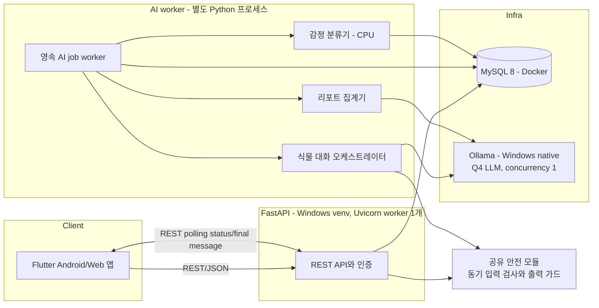
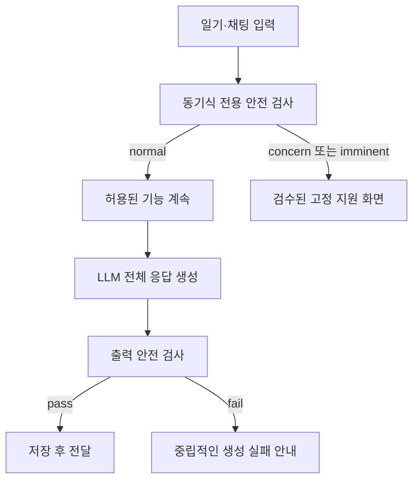

# 몽그루(Mongroo) 구현 설계서

> 2022년 공모전 기획을 바탕으로 감정 성장 서비스 몽그루를 실제 구현하기 위한 기술 설계 문서다.
> 기획 배경과 시장 분석은 원 기획서를 참조하고, 이 문서는 구현 범위와 계약만 다룬다.
>
> 검증 기준일: 2026-08-06

## 1. 제품 정의

식물 성장 게임 요소로 일기 기록을 이어 가게 하고, 사용자가 남긴 일기 본문에서 감정의
흐름을 읽어 회고용 리포트를 제공하는 모바일 앱이다. 내가 키우는 식물과 대화한다는 원 기획의
정서적 경험은 유지하되, 제품의 위치는 **진단·치료 서비스가 아닌 성인용 자기 기록 및 일반적 웰니스
도구**로 한정한다.

제품 원칙은 다음과 같다.

- 기록한 행동을 보상하고 감정의 긍정·부정에는 차등을 두지 않는다. “세상에 나쁜 감정은 없다”는
  원 기획의 메시지를 성장 규칙에도 그대로 적용한다.
- 식물의 성장 단계는 돌봄 행동으로 쌓은 경험치가 정하고, 외형·성격의 결은 일기 본문의 누적 분석이
  정한다. 어떤 감정도 성장 속도, 보상, 희귀도에 영향을 주지 않는다.
- 일기 본문이 기록의 원본이다. 분류 결과는 수정·숨김할 수 있는 회고용 표시이지만, 식물 분기에는
  사용자가 고친 표시가 아닌 보존된 원 분류 결과만 사용한다. 어느 결과도 임상적 판단에 쓰지 않는다.
- LLM은 대화 흐름 전체를 결정하지 않는다. 서버가 안전 검사, 대화 단계, 허용 행동을 통제하고 LLM은
  허용된 단계의 문장 생성만 맡는다.
- 분류 기능을 사용할 수 없을 때도 인증, 일기 기록, 경험치 성장과 수확의 기본 흐름은 막히지 않는다.
- 가입 여부를 결정하기 전에 핵심 재미를 판단할 수 있어야 한다. 가입 전 체험은 서버 계정을
  만들지 않고 기기 저장소만 사용하며, **마음 기록 → 성장**을 먼저 완주한 뒤 사용자가 원할 때만
  직접 탐험을 연습한다. 첫 화면의 대표 이미지·제목·주 CTA를 탐험 지도로 시작하지 않는다.
- 홈과 온보딩의 1순위 행동은 언제나 감정 일기다. 탐험·전투·상점·미션은 일기로 애지중지 키운
  캐릭터와 더 오래 관계 맺게 하는 보조 활동이며, 일기를 건너뛰게 만드는 더 큰 XP·씨앗 보상이나
  시각적 우선순위를 갖지 않는다.
- 탐험에서 감정 성장형은 전투의 해결 방식·표정·대사·이펙트를 바꾸지만 승패 등급이나 보상 총량을
  바꾸지 않는다. 수호전은 생명체 처치가 아니라 장벽 해제·진정·안전 이탈을 다루고, 어느 선택도
  사용자가 기록한 감정을 좋고 나쁨으로 평가하지 않는다.
- 현재 목표는 로컬 포트폴리오 데모다. P0에서는 합성·테스트 데이터만 사용한다.

### 1.1 핵심 기술 결정

| 항목 | 결정 | 비고 |
|------|------|------|
| 클라이언트 | Flutter | Android 우선. iOS 빌드 검증은 범위 밖 |
| 백엔드 | FastAPI, Python 3.11+ | API, 안전 처리, 로컬 모델 연동을 한 언어로 통합 |
| DB | MySQL 8 | 영속 작업 큐와 트랜잭션까지 같은 DB로 관리 |
| ORM/마이그레이션 | SQLAlchemy 2 + Alembic | async 세션 사용, 마이그레이션을 유일한 스키마 변경 경로로 사용 |
| 감정 분류 | KcELECTRA 계열 파인튜닝 후보 | 인도메인 평가 후 확정. 기본 추론 장치는 CPU |
| 생성 모델 | Ollama + 로컬 LLM | 외부 호스팅 LLM API는 사용하지 않음 |
| 배포 목표 | Windows 로컬 데모 | MySQL만 Docker, FastAPI와 Ollama는 Windows 네이티브 |
| 시간 기준 | DB UTC, 사용자 날짜 Asia/Seoul | 데모는 KST 고정. 확장 시 사용자별 timezone 적용 |

FastAPI를 선택한 이유는 모델 서빙 코드와 API를 한 프로세스 언어로 유지할 수 있고, OpenAPI 계약을
Flutter DTO 생성에 활용할 수 있기 때문이다. 다만 무거운 AI 작업을 요청 처리 코루틴이나
`BackgroundTasks`에 직접 맡기지는 않는다. 작업 상태와 재시도를 보존하는 MySQL 기반 작업 큐를 둔다.

### 1.2 단계별 완료 기준

| 게이트 | 범위 | 완료 조건 |
|--------|------|-----------|
| Alpha 데모 | M0~M2 | 가입 → 일기 기록 → 경험치 반영 → 식물 성장 → 수확 사이클이 분류 기능 장애에도 완주됨 |
| P0 데모 | M0~M5a | 감정 보조 태깅, 안전한 식물 대화, 주간/월간 리포트를 포함한 전체 흐름이 동작함 |
| P1 게임 확장 | M5b~M6a | 퀘스트, 상점/도감, 캐릭터와 마이팜 구현 |
| P1 설문 확장 | M6b 이후 | 판본·권리와 안전 검토를 마친 자가설문(현재 미구현) |

P0와 P1은 의존 방향을 분리한다. P0 식물 성장은 감정 기록·일기·첫 채팅 시작만으로 완결되고, P1 퀘스트나
상점이 없어도 데모가 막히지 않는다.

### 1.3 개발 장비와 초기 자원 예산

- GPU: RTX 4060 Ti 8GB, RAM 32GB, CPU 12코어
- 7~8B Q4 모델 파일은 약 5GB 수준이지만 KV cache와 런타임 메모리가 추가된다. 따라서 `num_ctx=4096`,
  LLM 동시 요청 1개를 초기값으로 두고 실제 VRAM, OOM, 응답 속도를 M0에서 측정한다.
- LLM 실행 중 감정 분류기는 CPU에 둔다. 학습할 때는 Ollama 모델을 내린다.
- “8GB에서 가능”은 보장 조건이 아니다. 컨텍스트 길이, 배치, 양자화 방식별 실측 결과를
  `docs/benchmarks/`에 남기고 모델을 확정한다.

## 2. 전체 아키텍처



### 2.1 정식 로컬 데모 토폴로지

| 구성 요소 | 실행 위치 | 기본 주소 | 원칙 |
|-----------|-----------|-----------|------|
| MySQL | Docker Compose | `127.0.0.1:3306` | 호스트 외부에 공개하지 않음 |
| FastAPI | Windows venv | `127.0.0.1:8000` | Uvicorn worker 1개 |
| AI worker | Windows venv 별도 프로세스 | 내부 DB queue | 동시 job 1개, 차단 작업을 API와 격리 |
| Ollama | Windows native | `127.0.0.1:11434` | `OLLAMA_HOST=0.0.0.0` 사용 금지 |
| Android emulator | Android Studio | `http://10.0.2.2:8000` | debug 빌드에서만 HTTP 허용 |
| Android 실기기 | USB + `adb reverse` | `http://127.0.0.1:8000` | `adb reverse tcp:8000 tcp:8000` 사용 |

LAN 실기기 데모가 꼭 필요하면 별도 `-Lan` 프로파일에서만 FastAPI를 호스트의 사설 LAN IP에 bind하고,
Windows 방화벽 허용 범위를 private subnet으로 제한한 뒤 종료 스크립트에서 규칙을 제거한다. 공용망에는
열지 않는다. FastAPI를 컨테이너에 넣는 구성은 현재 범위 밖이며, 이후 컨테이너화하면 Ollama 주소를
`host.docker.internal:11434`로 분리한다.

### 2.2 장애 격리

- `AI_MODE=disabled|fake|local`을 지원한다. `disabled`와 `fake`에서는 M1~M2와 CI가 모델 파일 없이 뜬다.
- 감정 분류기나 Ollama가 준비되지 않아도 인증·기록·식물 API는 정상 동작한다.
- `/health/ready`는 DB, 감정 분류기, Ollama, AI worker heartbeat 상태를 각각 반환한다. 일부 AI 의존성이 꺼져도
  서버 전체를 `down`으로 표시하지 않고 `degraded`로 구분한다.
- 모델 가중치는 저장소에 커밋하지 않는다. `models/manifest.yaml`과 설치 스크립트로 모델 ID, revision,
  license, 파일 SHA-256을 재현한다.

## 3. 기능 범위

### 3.1 P0 — 구현 대상

0. **가입 전 로컬 체험과 플레이형 튜토리얼**
   - 로그인 화면에서 회원가입 없이 약 3분 체험에 진입
   - 짧은 마음 기록 → 감정에 따른 새싹 성장 → 갈림길·사건 선택 → 발견물 귀환을 직접 조작
   - 체험 일기와 선택은 `flutter_secure_storage` 기반 기기 저장소에만 보관하고 API로 보내지 않음
   - 중단 후 같은 기기에서 이어 하기, 저장소 실패 시 메모리 진행과 정확한 소실 안내 제공
   - 정식 가입 때 체험 일기를 자동 전송하지 않음. 실제 기록은 동의가 끝난 계정에서 새로 시작
   - 가입 사용자도 계정 화면에서 가이드를 다시 열 수 있고 처음부터 재시작 가능
1. **회원가입과 로그인**
   - email/password, access token + 회전형 refresh token
   - 로그아웃과 refresh token 재사용 감지
2. **감정 기록**
   - 감정을 다시 고르게 하지 않고 오늘의 일을 적는 일기 본문 한 필드
   - 하루 여러 건 기록, 월간 캘린더 집계, 목록/상세/수정/삭제
   - 저장 직전 동기식 안전 검사, 저장 후 영속 큐를 통한 본문 감정 분석
3. **식물 키우기**
   - 가입 시 기본 품종의 활성 식물 1개 생성
   - 일기·퀘스트·하루 첫 채팅 시작이 경험치가 되어 5단계로 성장
   - 만개 → 생애 감정 표현형 확정 → 마음 식물 박물관 전시 → 새 식물 심기의 반복
   - 박물관은 최근 수확 10개 또는 사용자가 고른 대표 식물 10개를 한 번에 보여 주며,
     밝거나 무거운 감정에서 자란 형태에 가치·보상 차이를 두지 않음
   - 마음 식물, 성장 캐릭터, 정원에 놓인 캐릭터, 대화 상대는 **같은 사용자 소유 개체**다.
     씨앗을 해금해 심으면 모든 개체가 일기 감정과 활동 경험치로 씨앗 → 새싹 → 줄기 →
     개화 → 만개의 다섯 단계를 거친다.
   - 상점은 완성 캐릭터를 판매하지 않는다. 새 성장 품종의 씨앗, 방 테마, 소품,
     동행 소품만 해금한다. 도감은 품종마다 다섯 단계와 사용자가 실제로 키운 감정
     표현형을 함께 기록한다.
   - 마이팜 중앙에는 별도 `정원 가이드`가 아니라 현재 활성 성장 캐릭터를 그대로
     배치한다. 채팅의 이름·말투·감정 프로필도 이 활성 개체를 참조한다.
4. **식물 대화**
   - CBT에서 아이디어를 얻은 구조화된 자기성찰 흐름. 치료 또는 상담으로 표현하지 않음
   - 서버 상태머신, 입력 안전 검사, LLM 전체 응답 생성, 출력 검사 후 전달
   - P0는 202 응답 후 run 상태를 polling하고 안전 검사를 마친 최종 `message`만 표시
5. **감정 회고 리포트**
   - 주간/월간 일기 감정 분포, 기록 스트릭, 시간대 패턴, 키워드
   - 통계는 결정적 계산, 자연어 요약은 선택적 LLM 작업
   - 진단·질병 예측·자체 합성 위험등급을 제공하지 않음

### 3.2 P1 — P0 이후 선택 구현

6. **데일리 퀘스트** — 당일 일기에서 읽힌 마음과 검수된 실생활 행동 카탈로그를 연결하는 룰 기반 추천
7. **씨앗 포인트와 상점** — 퀘스트/누적 기록 보상, 품종·데코 해금
8. **마이팜 꾸미기** — 현재 성장 캐릭터·수확 캐릭터와 보유 데코 배치
9. **PHQ-9 자가설문** — 18세 이상, 정확한 한국어 판본과 사용 근거를 확인한 뒤 제공

### 3.2.1 성장 캐릭터 도메인 불변식

- `plant_species`는 외형·기본 성향·단계별 에셋을 정의하는 품종 템플릿이다.
- `plants`는 사용자가 실제로 심고 키우는 성장 캐릭터 인스턴스다. 활성 개체는 한 명당
  하나이며 이름, 경험치, 성장 단계, 누적 감정 프로필, 대화 페르소나를 가진다.
- 상점의 성장 상품은 완전체가 아니라 `species_unlock`이다. 구매·조건 달성은
  `user_species_unlocks`만 추가하며 새 캐릭터 인스턴스는 사용자가 씨앗을 심을 때 생성한다.
- 홈, 채팅, 마이팜의 중앙 캐릭터는 모두 같은 활성 `plants.id`를 사용한다. 화면별로
  별도 캐릭터를 장착하거나 서로 다른 페르소나를 만들지 않는다.
- 수확하면 해당 `plants` row가 박물관 개체가 되고 최종 단계·감정 표현형·성격 스냅샷이
  고정된다. 도감은 품종의 5단계 기본 모습과 수확된 실제 변형을 구분해 보여 준다.
- `companion`은 성장·대화 주체가 아니라 정원에 놓는 작은 동행 소품이다. 핵심 성장
  캐릭터와 같은 카테고리나 슬롯으로 취급하지 않는다.
- 과거 `main_character` 아이템과 `farm_layouts.layout.main_character_user_item_id`는
  데이터 마이그레이션 동안 읽는 호환 필드다. 신규 UI는 사람형 원화를 숨기지 않고
  씨앗에서 도달하는 완전체 계보 미리보기로 보여 준다. 별도 완제품 캐릭터 슬롯은
  만들지 않으며, 실제 성장 상태와 장착 상태는 활성 `plants.id`가 결정한다.

PHQ-9 결과는 우울 증상 **선별용 자가설문**으로만 표시하며 일반 감정 추세나 감정 분류 결과와 합쳐
위험 점수를 만들지 않는다. 9번 문항 응답이 0보다 크면 총점과 별개로 안전 리소스 화면을 표시한다.
CES-D는 한국어 판본·번안 권리와 중복 효용을 추가 확인할 때까지 범위에서 제외한다.

### 3.3 명시적 범위 제외

- 전문가 매칭, 병원·상담사에게 기록 전달, B2B/B2G 데이터 제공
- 결제, 구독, 광고, FCM 푸시, 스토어 출시, iOS 빌드 검증
- 실제 사용자 운영, 인터넷 공개, 다중 서버 확장
- 수동 센서 데이터를 이용한 디지털 표현형, 질병 진단·예측·치료 추천
- 사용자 기록을 이용한 모델 학습. 별도 명시적 opt-in과 검토 없이는 학습/평가에 재사용하지 않음
- 웰니스 대화 데이터 기반 QLoRA. P0는 프롬프트와 상태머신 베이스라인으로 완료

### 3.4 핵심 사용자 시나리오

| 시나리오 | 시작 | 성공 조건 |
|----------|------|-----------|
| 가입 전 체험 | 로그인 화면 | 서버 호출 없이 마음 기록 → 성장 → 갈림길·사건 선택 → 귀환 완주 → 같은 기기에서 진행 복원 |
| 첫 사용 | 가입 | 기본 식물 생성 → 첫 감정 기록 → 경험치 1회 반영 → 홈에서 성장 변화 확인 |
| 반복 사용 | 로그인 | 캘린더에서 여러 기록 확인 → 일기 작성 → 본문에서 읽힌 감정과 분석 상태 확인 |
| 식물 박물관 | 수확 완료 | 생애 기록의 최종 형태 확인 → 최근 전시 관람 → 오래 볼 식물을 대표 전시에 선택 |
| 대화와 회고 | 활성 식물 보유 | 안전 검사 → 구조화 대화 → 종료 후 이력 확인 → 주간 리포트 생성/조회 |
| 장애 복구 | Ollama 중지 | 기록과 식물 기능 유지 → 대화/요약만 재시도 가능한 오류 → 재기동 후 job 회수 |

제품의 기본 흐름은 `일기 작성 → 본문 감정 분석 → 동일한 기록 XP → 단계별 성장과 안정 분기 → 수확 → 마음
식물 박물관 → 캘린더/리포트 회고`다. P1에서는 건너뛸 수 있는 실생활 퀘스트와 씨앗 포인트를 이 흐름에
붙인다. 퀘스트 완료를 위치·사진으로 검증하지 않고 자기보고로 처리한다.

주 대상은 기록을 꾸준히 유지하기 어려운 성인이다. 기록 화면은 감정을 다시 고르게 하지 않고 일기
본문 한 필드에 집중한다. 중년 사용자와 낮은 디지털 숙련도를 고려해 작은 아이콘에만 의존하지 않고
핵심 동작에 텍스트 라벨을 붙인다.

## 4. 데이터 모델

아래 ERD는 핵심 컬럼만 표시한다. 상태가 갱신되는 entity table은 `created_at`, `updated_at`을 UTC로
갖고, append-only ledger/event table은 `created_at`만 갖는다. 상태값은 Python enum과 DB `CHECK`
제약을 같은 값으로 유지한다.

```mermaid
erDiagram
    users ||--o{ auth_sessions : owns
    auth_sessions ||--o{ refresh_tokens : rotates
    users ||--o{ mood_entries : records
    users ||--o{ plants : grows
    plant_species ||--o{ plants : classifies
    users ||--o{ reward_events : earns
    plants o|--o{ reward_events : receives
    users ||--o{ chat_sessions : starts
    plants ||--o{ chat_sessions : speaks_as
    chat_sessions ||--o{ chat_messages : contains
    chat_sessions ||--o{ chat_runs : generates
    users ||--o{ reports : owns
    users ||--o{ safety_events : triggers
    users ||--o{ user_quests : receives
    quests ||--o{ user_quests : assigns
    users ||--o{ user_items : owns
    items ||--o{ user_items : catalog
    users ||--o| farm_layouts : arranges
    users ||--o{ user_species_unlocks : unlocks
    plant_species ||--o{ user_species_unlocks : available_as
    users ||--o{ assessments : submits

    users {
        bigint id PK
        varchar email UK
        varchar password_hash
        varchar nickname
        varchar timezone
        int seed_balance
        datetime created_at
        datetime updated_at
    }
    auth_sessions {
        bigint id PK
        bigint user_id FK
        varchar session_family UK
        datetime expires_at
        datetime revoked_at
        datetime created_at
    }
    refresh_tokens {
        bigint id PK
        bigint session_id FK
        varchar jti_hash UK
        datetime expires_at
        datetime used_at
        datetime revoked_at
        bigint replaced_by_id
        datetime created_at
    }
    mood_entries {
        bigint id PK
        bigint user_id FK
        date local_date
        datetime recorded_at_utc
        tinyint mood_level
        boolean mood_level_explicit
        json emotion_tags
        text content
        int edit_version
        int input_version
        int analysis_version
        varchar analysis_status
        varchar ai_emotion
        json ai_scores
        varchar ai_emotion_override
        tinyint ai_label_hidden
        varchar analysis_model_version
        datetime analyzed_at
        varchar analysis_error_code
        datetime created_at
        datetime updated_at
    }
    plants {
        bigint id PK
        bigint user_id FK
        bigint species_id FK
        varchar name
        int exp
        varchar status
        datetime planted_at
        datetime harvested_at
        varchar final_form
        json emotion_profile
        varchar growth_branch
        datetime branch_decided_at
        tinyint museum_featured
        datetime created_at
        datetime updated_at
    }
    plant_species {
        bigint id PK
        varchar code UK
        varchar name
        varchar persona_key
        json asset_manifest
        tinyint rarity
        int unlock_price
    }
    reward_events {
        bigint id PK
        bigint user_id FK
        bigint plant_id FK
        varchar event_type
        varchar source_type
        bigint source_id
        varchar dedupe_key UK
        int exp_delta
        int seed_delta
        int seed_balance_after
        datetime created_at
    }
    chat_sessions {
        bigint id PK
        bigint user_id FK
        bigint plant_id FK
        varchar reflection_stage
        varchar safety_state
        varchar status
        datetime started_at
        datetime ended_at
        datetime last_message_at
    }
    chat_messages {
        bigint id PK
        bigint session_id FK
        varchar role
        text content
        varchar safety_status
        varchar ai_emotion
        varchar model_version
        datetime created_at
    }
    chat_runs {
        bigint id PK
        bigint session_id FK
        bigint user_message_id FK
        bigint assistant_message_id FK
        varchar client_message_id UK
        varchar status
        varchar error_code
        datetime created_at
        datetime finished_at
    }
    reports {
        bigint id PK
        bigint user_id FK
        varchar period_type
        date period_start
        date period_end
        varchar input_hash
        varchar status
        json stats
        decimal analysis_coverage
        json summary
        varchar summary_model_version
        varchar error_code
        datetime created_at
        datetime updated_at
    }
    safety_events {
        bigint id PK
        bigint user_id FK
        varchar source
        varchar resource_type
        bigint resource_id
        varchar severity
        json reason_codes
        varchar detector_version
        varchar action_taken
        datetime created_at
    }
    quests {
        bigint id PK
        varchar code UK
        varchar title
        varchar description
        varchar trigger_rule
        varchar category
        tinyint burden_level
        int estimated_minutes
        json safety_tags
        int reward_exp
        int reward_seeds
    }
    user_quests {
        bigint id PK
        bigint user_id FK
        bigint quest_id FK
        date quest_date
        varchar status
        datetime completed_at
    }
    assessments {
        bigint id PK
        bigint user_id FK
        varchar instrument_code
        varchar instrument_version
        varchar locale
        varchar question_set_version
        varchar scoring_version
        json answers
        int score
        varchar consent_version
        datetime completed_at
    }
    items {
        bigint id PK
        varchar code UK
        varchar type
        varchar name
        int price_seeds
    }
    user_items {
        bigint id PK
        bigint user_id FK
        bigint item_id FK
        tinyint equipped
    }
    farm_layouts {
        bigint user_id PK
        int version
        json layout
        datetime updated_at
    }
    user_species_unlocks {
        bigint id PK
        bigint user_id FK
        bigint species_id FK
        datetime unlocked_at
    }
```



ERD 밖의 운영 테이블은 다음과 같다.

| 테이블 | 목적 | 핵심 제약 |
|--------|------|-----------|
| `ai_jobs` | 감정 분석, 대화 생성, 리포트 요약의 영속 큐 | 사용자 FK `ON DELETE CASCADE`, `UNIQUE(job_type, resource_type, resource_id, input_version)` |
| `idempotency_keys` | 재시도된 쓰기 요청의 최초 응답 재생 | `UNIQUE(user_id, route_scope, idempotency_key)` |

`ai_jobs`는 소유자 `user_id`, `status=pending|running|succeeded|failed`, `attempts`,
`available_at`, `locked_at`, `last_error_code`를 갖는다. 프로세스 시작 시 일정 시간 이상
`running`인 job을 `pending`으로 되돌린다. 계정 삭제 시 처리 완료 여부와 무관하게 소유자의
작업도 함께 삭제해 리소스 id만 남은 고아 작업을 만들지 않는다.

`idempotency_keys`는 `request_hash`, `response_status`, `response_body`, `created_at`을 갖는다.
같은 사용자·route scope·key의 첫 응답을 그대로 재생하며 현재 자동 만료 정책은 없다.

### 4.1 정합성 규칙

- DB의 모든 `datetime`은 UTC다. `local_date`는 인증 사용자의 timezone을 기준으로 서버가 계산한다.
  데모 기본값은 `Asia/Seoul`, 주 시작은 월요일, 기간은 `[start, end)`다.
- 사용자 한 명당 `status='active'` 식물은 최대 1개다. MySQL generated column
  `active_user_id = CASE WHEN status='active' THEN user_id ELSE NULL END`와 unique index로 강제한다.
- 채팅 메시지 전송은 세션 row를 잠근 뒤 `queued|generating` run 존재 여부를 확인해
  세션당 생성 중인 run을 하나로 유지한다. `client_message_id`는 전역 unique이며 같은 ID를
  다른 세션·본문에 재사용하면 409를 반환한다. 확정 실패 run의 재시도는 해당 user message가
  최신 user turn이고 세션 안전 상태가 normal일 때만 허용한다. 동시 재시도는 같은 run으로
  합류하고 SQLite 개발 환경도 commit까지 세션별 프로세스 lock을 유지한다.
- 식물 `stage`는 저장하지 않고 `exp`에서 도메인 함수로 계산한다. `exp`는 기록·퀘스트·대화 같은
  돌봄 행동의 누적이고, 감정의 종류나 강도를 성장 품질로 환산하지 않는다.
- 활성 식물의 `growth_branch`와 `emotion_profile`은 심은 뒤 작성한 일기 본문의 성공한 분석만
  누적한다. 사용자 기분 점수·태그·라벨 교정/숨김 설정은 식물 분기 입력이 아니다.
- 수확 트랜잭션은 `[planted_at, harvested_at]`의 일기 분석을 다시 집계해 활성 분기를 갱신하고,
  사용자가 직전에 보던 마지막 안정 분기와 `emotion_profile`을 스냅샷으로 고정한다. 이후 일기 편집이나
  재분석으로 이미 수확한 식물의 모습은 바꾸지 않는다.
- 대표 전시 변경은 사용자와 식물 row를 잠그고 최대 10개를 검사한다. DB에는 수확 이력을
  모두 보존하고 박물관 응답만 최근/대표 최대 10개로 제한한다.
- `0007_plant_museum` 이전에 수확된 식물은 당시 생애 감정 경계를 재현할 수 없으므로
  빈 v1 프로필의 `mosaic`으로 마이그레이션하고, 새 수확부터 실제 스냅샷을 저장한다.
- `reward_events.dedupe_key`로 같은 보상을 두 번 지급하지 않는다. 잔액·경험치 변경과 원장 insert는
  하나의 트랜잭션에서 수행하고 사용자/활성 식물 row를 `FOR UPDATE`로 잠근다.
- `reports`는 `UNIQUE(user_id, period_type, period_start, input_hash)`로 같은 입력의 중복 생성을 막는다.
- `mood_entries.edit_version`은 사용자 PATCH마다 compare-and-swap으로 올라가는 낙관적 잠금
  버전이며 AI worker가 바꾸는 `updated_at`과 독립이다. `input_version`은 기분·태그·본문처럼
  리포트 통계 입력이 바뀔 때 올라가고 리포트 입력 해시에 사용한다. `analysis_version`은 분류기
  입력인 본문이 바뀔 때만 올라가며 늦게 끝난 본문 분석 job을 폐기한다.
- `user_quests`는 `UNIQUE(user_id, quest_date)`로 사용자당 하루 한 배정만 허용한다.
- 주요 조회 인덱스는 `mood_entries(user_id, local_date, recorded_at_utc)`,
  `mood_entries(user_id, recorded_at_utc, id)`,
  `plants(user_id, museum_featured, harvested_at)`, `chat_messages(session_id, created_at)`,
  `ai_jobs(status, available_at)`다.
- 사용자 소유 데이터 API는 항상 `row.user_id == token.sub`를 확인한다. ID 존재 여부만으로 접근하지 않는다.
- 사용자 삭제 시 소유 데이터는 cascade 삭제하고, 품종·퀘스트·아이템 카탈로그는 restrict한다.

### 4.2 데이터 의미

- `mood_level`과 `emotion_tags`는 구 클라이언트 호환과 사용자의 선택적 메모를 위한 필드다.
  신규 기록 화면은 이를 묻지 않고 일기 본문만으로 저장할 수 있다. `ai_emotion`은 본문 분류기의
  원 출력이며, 사용자가 라벨을 수정하면 `ai_emotion_override`에 남기고 원 출력은 보존한다.
  교정값과 `ai_label_hidden`은 기록·리포트 표시에는 반영할 수 있지만 식물 외형과 성격에는 쓰지 않는다.
- `seed_balance`는 **씨앗 포인트**라는 게임 재화다. 심는 대상은 `plant_species`이며 P0에서는 기본 품종이
  무료다. P1의 `user_species_unlocks`는 `UNIQUE(user_id, species_id)`로 품종 해금을 표현한다.
- `plant_species.asset_manifest.growth`는 품종별 씨앗 모양, 화분/배양관, 희귀도 효과와
  자산 namespace, 다섯 단계 sprite key, 단계별 `motion_key`를 담는다. `PlantView`는
  이 정체성과 5단계·감정 레이어를 조합한다.
  기분 반응은 표시용이며 보상 계산 입력으로 쓰지 않는다.
- 식물 표현형은 감정을 평가하는 점수가 아니다. `sunny`, `rainy`, `ember`, `moonlit`,
  `sparkling`, `mosaic`은 모두 같은 수확 가치와 진행 상태를 가진다. 슬픔·상처는
  `rainy`, 불안은 `moonlit`처럼 서로 다른 시각 언어로 기억할 뿐 희귀도·해금·보상에는
  사용하지 않는다.
- `farm_layouts.layout`은 방 테마·동행 소품·꾸미기 `user_item_id`와
  x/y/rotation/z-index만 저장한다. 중앙 성장 캐릭터는 활성 `plants.id`에서 자동으로
  결정하며 별도 장착 ID를 저장하지 않는다. rotation은
  Flutter 렌더링과 동일한 라디안 단위(`-pi~pi`)다. PUT은 현재 `version`을 요구하고 소유하지
  않은 item instance, 중복 배치, 범위를 벗어난 회전값을 거부한다.
- 현재 연속 기록은 `users.streak_days`와 `last_recorded_local_date`로 표시한다.
  씨앗 30개 마일스톤은 서로 다른 기록 날 누적 7일마다 지급하고,
  `reward_events.dedupe_key`로 누적 경계를 한 번만 반영한다.
- `safety_events`에는 원문을 복제하지 않는다. 이벤트 이유, 검사 버전, 취한 UI 동작만 저장하고 원문은
  원 리소스의 보유정책을 따른다.
- `chat_sessions.safety_state`와 최근 사용자 메시지 최대 4개가 채팅의 다중 턴 안전 문맥이다.
  `safety_events.reason_codes`는 감사 기록이며 매 요청 판정 입력으로 다시 읽지 않는다.
- 실제 데이터 운영 프로파일을 열기 전에는 자유본문·대화·설문 응답을 필드 암호화 대상으로 본다.

## 5. API 설계

Base path는 `/api/v1`, 인증은 `Authorization: Bearer {access_token}`이다.

### 5.1 엔드포인트

| Method | Path | 상태 | 설명 |
|--------|------|------|------|
| POST | `/auth/signup` | 201 | 가입, 기본 품종의 활성 성장 캐릭터 생성. 전환 기간에는 구버전용 starter item도 함께 만들 수 있으나 신규 UI는 사용하지 않음 |
| POST | `/auth/login` | 200 | access/refresh 발급 |
| POST | `/auth/refresh` | 200 | refresh rotation |
| POST | `/auth/logout` | 204 | 현재 세션 폐기 |
| POST | `/auth/logout-all` | 204 | 사용자의 전체 세션 폐기 |
| GET | `/users/me` | 200 | 내 프로필 |
| DELETE | `/users/me` | — | 계획 범위(현재 미구현) |
| GET | `/moods/calendar?year=&month=` | 200 | 날짜별 마지막 기분, 기록 수, pending 수 집계 |
| GET | `/moods?date=&cursor=` | 200 | 날짜별 기록 목록 |
| POST | `/moods` | 201 | 기록 생성, 분석 대상이면 `pending`, 아니면 `not_requested` |
| GET | `/moods/{mood_id}` | 200 | 기록 상세 |
| PATCH | `/moods/{mood_id}` | 200 | 기록 입력은 `input_version`, 본문 분류는 `analysis_version`으로 버전 관리 |
| DELETE | `/moods/{mood_id}` | 204 | 기록 삭제(기존 리포트는 입력 해시 비교 시 stale) |
| GET | `/plant-species` | 200 | 전체 품종과 사용자 해금 상태 |
| GET | `/plants/me` | 200 | 활성 식물과 계산된 성장 단계 |
| GET | `/plants?status=harvested&cursor=` | 200 | 전체 수확 식물 cursor 목록과 표현형 스냅샷 |
| GET | `/plants/museum?mode=recent\|featured&limit=10` | 200 | 최근 또는 대표 식물 최대 10개 전시 |
| POST | `/plants` | 201 | 활성 식물이 없을 때 해금된 품종 심기 |
| POST | `/plants/{plant_id}/harvest` | 200 | 수확 전환과 생애 감정 프로필/최종 형태 고정 |
| PATCH | `/plants/{plant_id}/museum` | 200 | 수확 식물의 대표 전시 여부 변경(최대 10개) |
| POST | `/chat/sessions` | 201 | 대화 세션 시작 |
| GET | `/chat/sessions/{session_id}/messages` | 200 | cursor 기반 대화 이력 |
| POST | `/chat/sessions/{session_id}/messages` | 200/202 | 안전 분기는 `safety_action`, 정상 입력은 `run_id` 반환 |
| GET | `/chat/runs/{run_id}` | 200 | 생성 상태와 최종 메시지 조회 |
| GET | `/chat/runs/{run_id}/events` | 200 | status/message/done/error SSE와 heartbeat |
| POST | `/reports` | 200/202 | 같은 입력은 기존 결과, 새 입력은 생성 job 반환 |
| GET | `/reports` | 200 | 기간별 리포트 목록 |
| GET | `/reports/{report_id}` | 200 | 리포트 상태와 결과 조회 |
| GET | `/quests/today` | 200 | 오늘 배정과 일기 감정 맥락 상태를 함께 반환(P1) |
| POST | `/user-quests/{user_quest_id}/complete` | 200 | 1회 완료와 보상(P1) |
| POST | `/user-quests/{user_quest_id}/skip` | 200 | 이유·페널티 없이 오늘 배정 건너뛰기(P1) |
| GET | `/shop/items` | 200 | 상점 카탈로그(P1) |
| POST | `/shop/items/{item_id}/purchase` | 200 | 씨앗 포인트 구매(P1) |
| GET | `/collection` | 200 | 보유 인벤토리와 잠금 상태를 포함한 전체 아이템·품종 도감(P1) |
| GET | `/shop/plant-species` | 200 | 해금 가능한 품종 카탈로그(P1) |
| POST | `/shop/plant-species/{species_id}/purchase` | 200 | 품종 해금(P1) |
| GET | `/farm` | 200 | 저장된 layout과 배치 가능한 보유 아이템(P1) |
| PUT | `/farm/layout` | 200 | 낙관적 잠금 버전으로 배치 저장(P1) |
| GET | `/assessment-instruments/{code}` | — | 계획 범위(현재 미구현) |
| POST | `/assessments` | — | 계획 범위(현재 미구현) |

주 캐릭터 카탈로그는 애니메이션 키와 대사를 가진 10종이며, 무료 아기 화분만
가입 스타터로 지급한다. 나머지는 씨앗 재화로 해금한다.

`GET`은 데이터를 생성하거나 변경하지 않는다. 리포트 생성은 `POST /reports`로 명시한다.

`POST /moods`는 신규 클라이언트의 `{content}`만으로 기록할 수 있다. `mood_level`을 보내지 않으면
현재 DB의 NOT NULL 구 계약을 위해 내부 저장값 3을 사용하되, 이 값으로 감정이나 식물 분기를
추정하지 않는다. `mood_level_explicit=false`로 구분해 캘린더·리포트 평균·채팅 문맥에서도
사용자가 고른 “보통”으로 세지 않는다. 구 클라이언트의 값은 explicit=true로 계속 수용한다.

`PATCH /moods/{mood_id}`는 `mood_level`, `emotion_tags`, `content`,
`ai_emotion_override`, `ai_label_hidden`의 부분 변경을 받는다. 분류기 입력인 본문이 바뀔 때만
`analysis_version`을 올리고 기존 분석 결과를 비운 뒤 재분석한다. 기분·태그·본문이 바뀌면
리포트용 `input_version`도 올린다. `content: null`은 본문 삭제다. 현재 PATCH는
`edit_version`으로 낙관적 잠금을 처리하며, 라벨 교정·숨김만 바꾼 경우 두 입력 버전은 유지된다.

### 5.2 공통 계약

- JSON 필드는 `snake_case`, 시간은 ISO-8601 UTC `Z`, 사용자 날짜는 `YYYY-MM-DD`다.
- 목록은 cursor pagination을 사용하고 응답에 `items`, `next_cursor`를 반환한다.
- 문자열 최대 길이: nickname 30자, 감정 태그 10개, 일기 5,000자, 채팅 입력 2,000자.
- `X-Request-ID`를 요청에 받거나 서버가 생성해 응답과 로그에 돌려준다.
- 오류 응답은 다음 모양으로 통일한다.

```json
{
  "code": "MOOD_NOT_FOUND",
  "message": "기록을 찾을 수 없습니다.",
  "details": {},
  "request_id": "01J..."
}
```

- 주요 상태 코드는 400, 401, 403, 404, 409, 422, 429, 503이다. 내부 예외나 모델 원문 오류를 클라이언트에
  노출하지 않는다.
- OpenAPI JSON을 버전 관리하고 CI에서 breaking diff를 검사한다.

### 5.3 멱등성과 동시성

다음 쓰기 요청은 `Idempotency-Key`가 필수다.

- 감정 기록 생성
- 채팅 사용자 메시지 전송
- 수확, 퀘스트 완료, 구매
- 리포트 생성

같은 사용자·route scope·key와 같은 `request_hash`의 재시도는 저장된 최초 응답을 반환한다. 같은 key를
다른 body에 재사용하면 409 `IDEMPOTENCY_KEY_CONFLICT`를 반환한다. key 선점, 도메인 변경,
응답 저장은 같은 트랜잭션에서 commit한다. 같은 프로세스의 경합은 key별 비동기 lock으로,
여러 프로세스의 경합은 `idempotency_keys` unique 제약으로 직렬화한다. 부모 user row를 먼저
잠근 뒤 key를 선점해 같은 사용자의 서로 다른 key도 MySQL FK 잠금 순서가 뒤집히지 않게 한다.
채팅은 헤더와 별도로
`chat_runs.client_message_id`를 저장하며 논리적 재시도에서 두 값을 모두 재사용한다.
도메인 단발성 작업은 `reward_events.dedupe_key`, 상태 전이 조건, DB unique 제약으로 한 번 더 방어한다.
보상 원장 key 예시는 다음과 같다.

- `mood_daily:{user_id}:{local_date}`
- `diary_daily:{user_id}:{local_date}`
- `chat_first:{user_id}:{local_date}`
- `record_week:{user_id}:{recorded_days}`
- `quest_daily:{user_id}:{local_date}`
- `purchase:item:{user_id}:{item_id}`
- `purchase:species:{user_id}:{species_id}`

### 5.4 비동기 작업

FastAPI `BackgroundTasks`는 응답 후 실행되는 작은 비핵심 작업에만 적합하고 작업 지속성·재시도·동시성
제어를 제공하지 않는다. P0는 추가 인프라를 늘리지 않기 위해 MySQL `ai_jobs`와 별도 Python 프로세스인
단일 bounded worker를 사용한다. `start_demo.ps1`가 API와 worker를 각각 시작하며 PyTorch CPU 추론과
동기 Ollama 호출은 API 이벤트 루프에서 실행하지 않는다.

1. API 트랜잭션에서 리소스와 `pending` job을 함께 commit한다.
2. worker는 `pending` job을 하나 점유하고 `running`으로 바꾼다.
3. 성공 시 결과와 모델 버전을 저장하고 `succeeded`로 바꾼다.
4. 모델·Ollama 부재나 추론 실패는 안정된 오류 코드와 함께 `pending`으로 되돌리고
   30초/120초/600초 backoff로 최대 3회 시도한 뒤 `failed`로 마감한다.
5. 재시작 시 오래된 `running` job을 회수한다.
6. `AI_MODE=disabled`로 전환하면 남아 있던 `pending/running` job과 대상 리소스를
   terminal failed 상태로 함께 마감해 대기 상태가 영구히 남지 않게 한다.

background job 실패는 HTTP 503이 아니다. 503은 job을 만들기 전 동기 안전 검사처럼 요청 자체를 받을
수 없는 경우에만 사용하고, 수락된 job의 상태는 run/report/mood 조회 응답으로 전달한다.
채팅 UI는 전송 결과 유실이면 동일한 `Idempotency-Key`와 `client_message_id`로 먼저 복구한다.
run이 terminal `failed`로 확정된 뒤에는 같은 `client_message_id`, 새 `Idempotency-Key`,
`retry_failed: true`로 기존 run에 새 job version을 붙인다. 이후 user turn이나 다른 active run이
있으면 순서를 지키기 위해 거절하며, `concern|imminent` 세션은 절대 LLM 경로로 되돌리지 않는다.
동시에 도착한 retry는 상태가 이미 queued/generating/succeeded면 같은 run 응답으로 합류한다.

감정 기록의 본문 수정은 `analysis_version`을 올린다. `ai_jobs.input_version`에는 mood 분석
job에 한해 이 값을 복사한다. 이전 버전 job이 늦게 끝나도 현재 분석 버전과
다르면 성공·실패 어느 경로에서도 상태를 적용하지 않는다. 기록 삭제 뒤 도착한 job은 대상 없음으로
정상 종료하며, 설정 전환으로 이미 끝난 job을 늦은 worker가 다시 열지 않는다.
리포트 `input_hash`는 기간 내 정렬된
`(mood_entry_id, input_version, analysis_model_version)` 목록, 기본값이 아닌 감정 라벨 수정·숨김 설정,
`stats_version`, 기간으로 만든다. 기록 추가·삭제·분석 입력 변경·AI 분석 모델 반영·표시 라벨
수정이나 숨김으로 값이 바뀌면 이전 리포트를 오래된 결과로 본다.

### 5.5 대화 실행과 상태 폴링

P0에서는 안전 검사를 마치지 않은 토큰을 클라이언트에 보내지 않는다.

1. 메시지 POST 시 입력 안전 검사를 동기 수행한다.
2. `concern|imminent`면 user message와 safety event를 저장하고 run/LLM job을 만들지 않은 채
   `200 {run_id: null, user_message, safety_action}`을 반환한다.
3. 정상 입력이면 user message와 `queued` run을 저장하고 `202 {run_id, status}`를 반환한다.
4. 앱은 SSE를 구독하고 연결이 끊기면 재연결한다. 60초가 지나면 `GET /chat/runs/{run_id}`로
   terminal 상태를 한 번 복구 조회한다.
5. worker가 LLM 전체 응답을 만든 뒤 출력 가드를 통과한 답변만 저장한다. assistant message 저장,
   `chat_run` terminal 전이, `ai_job` 완료를 한 트랜잭션으로 처리한다.
6. 앱이 background에서 돌아오면 같은 run을 다시 조회한다. polling이 끊겨도 생성은 취소하지 않는다.

`chat_run.status`는 `queued|generating|succeeded|failed`다. 세션당 진행 중 run은 하나만 허용한다.
UI timeout은 60초지만 서버 run은 terminal 상태까지 유지한다. SSE는 검사를 마친 최종 메시지만
전달하며 LLM의 미검사 토큰은 스트리밍하지 않는다.

## 6. AI 설계

### 6.1 감정 분류기

#### 후보와 데이터

- 1차 후보: `beomi/KcELECTRA-base` 특정 revision. 약 0.1B, MIT 라이선스.
- 비교 기준: TF-IDF + Logistic Regression, 일반 한국어 ELECTRA 계열.
- 데이터: AI Hub 감성 대화 말뭉치 v1.2. 60개 세부 감정을 기쁨/슬픔/분노/불안/상처/당황 6개
  대분류로 매핑하고 매핑표를 버전 관리한다.
- 중립 데이터 출처가 확정되기 전에는 중립 클래스를 임의로 만들지 않는다. confidence와 entropy가
  기준을 만족하지 않으면 `uncertain`으로 abstain한다.

KcELECTRA는 noisy user-generated text를 대상으로 학습된 장점이 있지만 일기 도메인 우위를 보장하지
않는다. 모델 카드의 주장 대신 실제 일기·대화 형태의 별도 인도메인 테스트셋 결과로 선정한다.

보조 평가 데이터는 한국어 온라인 문장의 세분 감정을 다룬
[KOTE](https://aclanthology.org/2024.lrec-main.1499/)와 감정의 원인·요인을 함께 다룬
[KEmoFact](https://pmc.ncbi.nlm.nih.gov/articles/PMC10613607/)를 검토하되, 몽그루의
6개 표시군과 일기 도메인으로 다시 주석한 별도 holdout을 최종 기준으로 쓴다. `ㅠ/ㅜ/ㅋ/ㅎ`는
문맥과 반복에 따라 기능이 달라질 수 있으므로 [한국어 이모티콘 맥락 연구](https://kangchowon.github.io/PDF/KoreanEmoticons.pdf/)처럼
글자 자체를 고정 감정으로 보지 않고 사건 결과·주변 감정 단서와 함께 평가한다.

`AI_MODE=fake`의 `fake-clf-3`은 데모·CI용 결정적 fallback이다. 단어 포함 여부만
세지 않고 사건 결과(분실·취소·경계 침해·연락 두절 등), 부정, 반전, 작품 제목/캐릭터
수식, 강도 표현, 구어체·욕설, 이모티콘 문맥, 명시적 복합 감정을 순서대로 처리한다.
예를 들어 `오늘 자판기 밑에 500원 빠뜨렸는데 결국 못찾음ㅜㅜ`은 슬픔으로 분류한다.
제품 회귀 묶음은 감정 단어가 없는 생활 사건과 판단 보류 문장을 클래스별로 고르게
포함한다. 이 묶음 통과는 실제 정확도 지표가 아니며 production 모델 선정에는 쓰지 않는다.

#### 학습과 평가

- 문장 무작위 분할이 아니라 화자/대화 단위 group split으로 누수를 막는다.
- train/validation/test split, seed, 전처리 코드 SHA, 데이터 버전, base model revision을 model card에 남긴다.
- 평가는 macro-F1, 클래스별 precision/recall, confusion matrix, ECE 또는 Brier score,
  `uncertain` 비율을 함께 본다.
- 전체 정확도 하나로 승인하지 않는다. 구어체 사건 서술, 부정·반전, 복합 감정,
  이모티콘, 인용/작품 수식, 욕설 강도 slice를 따로 보고 각 slice의 회귀 기준을 둔다.
- 다수 클래스와 선형 베이스라인을 이기지 못하거나 특정 클래스가 사실상 동작하지 않으면 추론 감정을
  노출하지 않는다. 일기 저장과 경험치 지급은 유지하고 식물은 감정 근거가 부족한 상태로 둔다.
- 일반 감정 분류 결과를 자살·자해 위험 탐지기로 사용하지 않는다.

#### 서빙

- 기본은 CPU 추론이며 worker의 첫 분석 job에서 lazy load한다. worker 프로세스는
  현재 `ai_mode/classifier_model_dir` 설정별 분류기 인스턴스를 하나만 유지해 이후
  job에서 tokenizer·model·pipeline을 다시 로드하지 않는다.
- `mood_entries.analysis_status`는 `not_requested|pending|running|succeeded|failed`다.
  텍스트가 없거나 안전 경로로 전환된 기록은 `not_requested`로 둔다.
- 모델 artifact가 없으면 job은 backoff 후 최대 시도 횟수에서 `failed`로 끝난다.
  서버 기동과 비 AI 기능은 막지 않는다.
- ONNX 전환은 CPU p95 지연이 실제 병목일 때만 진행한다.

### 6.2 식물 대화 — 로컬 LLM과 구조화된 자기성찰 흐름

대화 흐름은 “CBT 치료”가 아니라 CBT의 질문 구조를 참고한 일반적 자기성찰 경험이다.

```text
GREETING → EMOTION_CHECK → EXPLORE → REFRAME_OPTION → ACTION → CLOSING
```

- `GREETING`: 식물 페르소나로 인사한다.
- `EMOTION_CHECK`: 사용자가 지금 표현하고 싶은 감정을 확인한다.
- `EXPLORE`: 한 번에 질문 하나만 하고 상황·생각·느낌을 구분해 정리하도록 돕는다.
- `REFRAME_OPTION`: 사용자가 원할 때만 다른 관점을 제안한다. 사실을 부정하거나 긍정 강요를 하지 않는다.
- `ACTION`: LLM이 임의 치료를 제안하지 않고 검수된 일반 웰니스 행동 카탈로그에서 하나를 고른다.
- `CLOSING`: 사용자의 표현을 요약하고 세션을 닫는다.

P0 행동 카탈로그는 보상 없는 `server/app/ai/wellness_actions.yaml`로 고정하고 P1 quest table과 분리한다.
P1 퀘스트가 없어도 ACTION 단계가 동작해야 한다.

사용자는 언제든 종료할 수 있다. 세션은 최대 사용자 10턴 또는 30분이며, 생성 프롬프트에는 최근 6개
메시지만 포함한다. 안전 검사는 이 제한과 별개로 현재 입력, 최근 관련 문맥, 이전 안전 신호의 최소 요약을
함께 본다. 프롬프트는 식물 페르소나, 현재 단계, 금지 규칙, 오늘 사용자가 직접 기록한 요약, 최근 대화,
출력 JSON schema로 구성한다.

#### 모델 후보

| 우선순위 | 후보 | 실행 | 라이선스와 조건 |
|----------|------|------|-----------------|
| 기본 | `Qwen/Qwen3-8B`, Ollama `qwen3:8b-q4_K_M` | Ollama | Apache-2.0. 8GB 실측 후 확정 |
| 비교 | `LGAI-EXAONE/EXAONE-3.5-7.8B-Instruct`, `exaone3.5:7.8b` | Ollama | EXAONE 1.1-NC. Model·Derivative·Output의 상업 이용 금지와 공개 시 attribution 조건을 확인한 경우만 사용 |
| 경량 실험 | `naver-hyperclovax/HyperCLOVAX-SEED-Text-Instruct-1.5B` | Transformers 후보 | 전용 라이선스와 표시 의무. 공식 Ollama 호환 확인 전 P0 제외 |

기존 후보의 “HyperCLOVA X SEED 3B”는 텍스트 챗봇 모델이 아니라 Vision-Instruct 계열이므로 사용하지
않는다. Qwen3는 일반 대화에서 thinking 비활성 모드와 짧은 응답을 우선 비교한다.

초기 Ollama 설정은 다음과 같다.

| 설정 | 초기값 |
|------|--------|
| model | `qwen3:8b-q4_K_M` |
| context | 4,096 tokens |
| output | 최대 384 tokens |
| parallel | 1 |
| temperature | 0.2~0.4 실측 비교 |
| keep alive | 데모 중 10분 |

M0 벤치마크는 VRAM, CPU/RAM offload, TTFT, tokens/sec, 전체 지연, timeout, 한국어 반영 품질과 안전
회귀 결과를 기록한다. 모델 파일의 단순 크기로 8GB 적합성을 단정하지 않는다.

#### 파인튜닝 정책

P0에서는 챗봇 파인튜닝을 하지 않는다. AI Hub 웰니스 대화 스크립트는 실제 상담 자료를 바탕으로 한
소규모 응답 데이터이며, CBT 멀티턴 치료 데이터가 아니다. 파인튜닝은 데이터 접근·반출 조건 확인,
도메인 전문가의 안전 검수, 정서적 의존·진단·처방·과도한 확신 표현 제거, 별도 안전 평가 통과 후에만
실험한다. 원문 응답을 제품 답변으로 그대로 채택하지 않는다.

### 6.3 안전 레이어

안전 처리는 LLM 호출 전후에 모두 적용하고, 검사에 실패한 응답은 전달하지 않는다.



내부 라우팅 값 `normal|concern|imminent`는 진단이나 사용자용 위험등급이 아니다.

- 감정 기록은 해당 본문을, 채팅은 현재 입력과 최근 사용자 메시지 최대 4개를 정규식 규칙으로
  동기 검사한다. 채팅의 이전 `safety_state`는 판정 하한이며 한 번 확인한 concern/imminent를
  같은 세션에서 낮추지 않는다. 일반 감정 분류 확률이나 별도 ML 안전 탐지기는 사용하지 않는다.
- `concern` 또는 `imminent`에서는 LLM, 퀘스트 추천, 보상·축하 문구를 중단하고 고정 화면을
  반환한다.
- 즉각적인 생명·신체 위험에는 112/119 또는 가까운 응급실, 자살 생각·위기에는 자살예방상담전화 109,
  일반 정신건강 위기에는 1577-0199를 안내한다. 전화번호와 운영 정보는 데모 전에 공식 출처에서 다시
  확인한다.
- 출력에서는 진단, 처방·복약 지시, 치료 효과 단정, 자해 조장, 거짓 안심, 독점적 관계·정서적 의존,
  비밀 약속, 전문가 도움 회피 유도를 금지한다.
- 출력 가드를 통과하지 못하면 원 LLM 답변을 보내지 않고 비임상적인 기술 실패 안내와 다시 시도
  동작을 제공한다. LLM timeout 같은 기술 실패만으로 위기 연락처 화면을 띄우지 않는다.
- `safety_events`에는 탐지 이유 코드와 취한 조치만 저장하고 원문을 중복 보관하지 않는다.

감정 기록에서 안전 신호가 발견되어도 사용자가 작성한 기록 자체는 저장한다. mood entry와
`safety_event`를 한 트랜잭션으로 저장하고 감정 분류 job은 만들지 않으며 응답의 `safety_action`으로
고정 화면을 연다. 하루 첫 기록 경험치는 다른 감정과 똑같이 지급하되 축하 애니메이션은 안전 화면 뒤로
미룬다. 하루 첫 채팅 시작 경험치는 이후 대화 내용이나 안전 분기와 무관하게 동일하게 반영하고,
안전 화면에서는 축하 연출을 보이지 않는다.

`concern|imminent` safety event와 연결된 감정 기록은 자유본문을 키워드 추출, 식물 성장,
식물 대화 컨텍스트, 리포트 LLM prompt에서 제외한다. 구 버전 기록에 사용자가 명시적으로 고른
mood level과 tag가 있을 때만 그 명시 입력을 결정적 집계에 포함할 수 있다. 이 제외는 이후 안전
상태가 바뀌어도 자동 해제하지 않는다.

안전 회귀셋에는 명시적·간접적 위기 표현, 은어, prompt injection, 긴 문맥, 부정·인용 문장, 제3자 언급,
여러 턴에 나뉜 표현, 필터 오류와 timeout을 포함한다. 미탐을 우선 검토하고 수동 공격 테스트
결과를 M4 산출물로 남긴다.

### 6.4 리포트 생성

#### 결정적 통계

- 구 기록의 명시 감정 태그와 일기 본문에서 읽은 감정 분포를 분리 표시
- 구 기록에 명시 기분 값이 있을 때만 5단계 일별 평균 표시, 전체 기록 수는 별도 표시
- KST 기준 기록 스트릭과 시간대 패턴
- `kiwipiepy` 형태소 분석 후 TF-IDF 키워드. stopword 버전 고정
- 분석 성공 건수 / 텍스트 포함 건수로 `analysis_coverage` 표시
- 안전 경로로 자유본문을 제외한 건수 `excluded_safety_count` 표시

분석 대기 중인 항목은 일기 감정 분포에서 제외하되 전체 기록 수에는 포함하고 분석 범위를 명시한다.
각 통계 bucket은 집계에 사용한 `mood_entry_id` 목록 또는 조회 조건을 함께 보관해, 사용자가 차트에서
원 기록으로 내려갈 수 있게 한다. 리포트 숫자는 설명 불가능한 별도 값으로 복제하지 않는다.

#### 자연어 요약

LLM 입력은 자유본문 전체가 아니라 계산된 통계 JSON과 허용된 키워드만 사용한다. 출력은
`overview`, `patterns`, `reflection_questions` schema로 제한하고 다음을 검증한다.

- 입력에 없는 수치나 인과관계를 추가하지 않음
- 진단, 위험등급, 치료 권고를 생성하지 않음
- 사용자의 모든 감정을 평가 없이 서술함
- 실패하면 통계만 반환하고 고정 안내 문구를 사용함

`reports.status`는 `pending|succeeded|failed` 단일 필드다. 통계는 생성 요청에서 이미 저장되므로
요약이 `pending`이거나 `failed`여도 `stats`는 조회·표시할 수 있다.

부정 감정 지속일수와 PHQ-9를 합친 `risk_level`은 만들지 않는다. PHQ-9 결과와 일상 기록 리포트는
화면과 데이터 모델에서 분리한다.

### 6.5 모델 재현과 변경 관리

`models/manifest.yaml`에는 다음을 기록한다.

- 모델 ID와 exact revision/tag
- 양자화 형식, 컨텍스트 기본값, 파일 SHA-256
- 라이선스와 NOTICE/표시 의무
- 다운로드 명령과 로컬 경로
- 평가 리포트 경로와 알려진 한계

모델을 바꾸면 `analysis_model_version`, `summary_model_version`, `detector_version`이 달라져야 하며 기존
결과를 조용히 덮어쓰지 않는다.

M3 gate는 감정 분류 artifact에 대해 다음 둘 중 하나를 충족해야 한다.

1. 라이선스상 배포 가능한 artifact URL과 SHA-256을 제공한다.
2. 권한 있는 AI Hub 원본과 학습 스크립트로 만든 local artifact bundle을 prerequisite로 명시한다.

`setup_models.ps1`는 private artifact의 자동 다운로드를 가정하지 않고 `MONGROO_MODEL_ROOT`에 있는 파일의
checksum과 manifest 일치만 검증한다.

## 7. 성장과 보상 규칙

자동 순찰 이후의 능동형 3인 파티 탐험은
`docs/interactive_adventure_design.md`를 구현 기준으로 사용한다. 해당 문서는 지도
이동, 이벤트 판정, 캐릭터·성장형 스킬, 서버 상태·API·콘텐츠 팩·에셋·테스트와
구버전 던전 전환 순서를 고정한다.

### 7.1 보상표

| 행동 | 경험치 | 씨앗 포인트 | 중복 방지 기준 |
|------|--------|-------------|----------------|
| 오늘 첫 기록 | +10 | - | 하루 첫 기록 1회 |
| 50자 이상 일기 | +30 | +15 | 하루 첫 충족 1회 |
| 채팅 세션 시작 | +5 | - | 내용·안전 분기와 무관하게 하루 첫 시작 1회 |
| 퀘스트 완료(P1) | +20 | +5 | 배정된 `user_quest` 1회 |
| 순찰 귀환 | - | +3 | 일기 개방 후 하루 한 번 |
| 던전 탐험 | +10 | +4 | 일기 개방·발견된 던전, 하루 한 번 |
| 주간 마음 일기 3일 | - | +20 | 월요일 시작 주차·목표별 한 번 |
| 주간 순찰 귀환 3회 | - | +8 | 월요일 시작 주차·목표별 한 번 |
| 주간 던전 탐험 2회 | - | +6 | 월요일 시작 주차·목표별 한 번 |
| 여분 표본 기증 | - | +2 | 연구 예약분 외 3개, 하루 한 번 |
| 기록한 날 누적 7일 | - | +30 | 서로 다른 기록 날 7일 단위 1회 |

- 하루 경험치 상한은 50이다. 50자 마음 일기 한 편으로 새싹과 탐험이 함께 열린다.
- 마음 일기는 단일 일일 활동 중 경험치와 씨앗을 가장 많이 지급한다. 순찰과 던전은
  일기를 대체하지 않고 발견 장소·수집품을 확장하는 보조 루프다.
- 주간 탐험 약속도 일기 3일 보상을 가장 크게 두며, 순찰·던전 목표에는 XP를 주지
  않는다. 진행도는 기존 일기·순찰·던전 행에서 계산하고 수령 상태만 보상 원장에
  남겨 반복 콘텐츠를 위한 별도 출석 테이블을 만들지 않는다.
- 장기 탐험 발자국은 7일 마음 일기에서 첫 칭호가 열리고 이후 순찰·던전·연구·탐험
  장 완성으로 이어진다. 기존 원장과 영구 연구 행에서 진행도를 계산하는 읽기 전용
  기록이며, 칭호에는 씨앗·XP·스탯·수집량 효과를 붙이지 않는다.
- 완료하지 않은 연구의 요구량은 아이템별로 합산 예약한다. 예약분을 제외하고 3개
  이상 남은 표본만 하루 한 번 기증해 씨앗 2개를 받는다. 기증에는 XP가 없고 일기
  씨앗보다 보상이 작아, 중복 수집품의 사용처가 탐험 보상 우선순위를 역전하지 않는다.
- 수집품은 표본 연구에서 소비한다. 연구는 경험치·씨앗을 주지 않고 이후 탐험의
  수집량만 최대 3개까지 높여, 탐험 성장이 일기 보상 우선순위를 역전하지 않게 한다.
- 던전 입장 전에는 돌봄·집중·용기·관찰 중 한 접근 방식을 고른다. 감정 성장 스탯,
  장소 추천, 의상 성능은 수집 결과에만 반영하고 고정 XP·씨앗은 선택과 무관하게
  유지한다. 서버가 반환한 예상치를 그대로 보여 주어 숨은 확률 선택을 만들지 않는다.
- 네 던전에는 각각 세 가지 내부 장면을 둔다. 사용자·날짜·던전·접근 방식으로 장면을
  결정해 실행 행에 저장하고 결과 메시지와 기록장에 같은 제목·본문을 사용한다. 장면은
  반복 탐험의 서사 변화만 담당하며 공명·아이템 수량·씨앗·XP를 바꾸지 않는다.
- 탐험 개방은 성장 2단계 `온실 가장자리 → 이끼 낀 기억서고`, 3단계
  `달빛 샛길 → 메아리 우물정원`, 4단계 `유리온실 옥상 → 별빛 씨앗 보관고`,
  5단계 `새벽 수관 회랑 → 마음나무 관측실` 순서다.
  4단계 수집품으로 완성하는 별빛 온실 시계는 재화 대신 모든 순찰 시간을 5분
  줄여 장기 성장의 편의 보상으로 사용한다. 마지막 관측실의 표본과 앞선 장소의
  핵심 발견물을 모으면 `온실 밖 탐험 1장`을 완성한다. 이 완주 기록도 XP·씨앗을
  추가 지급하지 않아 마음 일기가 성장과 재화의 중심이라는 원칙을 유지한다.
- 완료한 순찰과 던전은 최근 6건의 탐험 기록장으로 다시 보여 준다. 기록장은 기존
  활동 행을 읽어 구성하며 추가 출석·회수 보상을 붙이지 않는다. 사용자는 어떤
  방식으로 어느 표본을 찾았는지 확인할 수 있고, 일기 작성 전에도 과거 기록은
  열람할 수 있다.
- 탐험 이야기 도감은 네 순찰 경로의 발견 이야기 12개와 네 던전의 내부 장면 12개를
  두 장으로 묶는다. 만난 장면은 최초 스냅샷 그대로 다시 읽고, 아직 만나지 못한
  장면은 장소만 안내한다. 최근 기록의 보존 기간을 늘리는 읽기 전용 기능이며 완성
  보상이나 성능 효과는 두지 않는다.
- 네 순찰 경로에는 각각 세 가지 짧은 발견 이야기를 둔다. 출발 시 사용자·날짜·경로로
  결과를 결정해 순찰 행에 제목과 본문을 저장하고, 귀환 전에는 내용을 숨긴다. 귀환
  순간 공개한 이야기는 탐험 기록장에도 그대로 남기며 어떤 이야기가 선택되어도
  씨앗·XP·수집품 수량은 바뀌지 않는다.
- 같은 발견에도 캐릭터의 출발 당시 성장 결에 맞는 짧은 귀환 반응을 붙인다. 여섯
  성장 결마다 두 문장을 두고 캐릭터 이름·결·문장을 순찰 행에 함께 저장한다. 이후
  일기로 성장 결이 달라져도 과거 대사를 다시 계산하지 않으며, 반응 문구 역시 보상과
  성능에는 영향을 주지 않는다.
- 순찰 카드에는 현재 캐릭터·의상·표본 연구를 반영한 예상 수집량을 먼저 보여 준다.
  열린 경로 중 성능 점수가 가장 높은 하나를 `오늘 잘 맞는 길`로 표시하고, 동률이면
  가장 최근 성장 단계에서 열린 경로를 제안한다. 추천은 수집품 선택을 돕는 정보일
  뿐 XP·씨앗을 늘리지 않으며 사용자는 다른 열린 경로도 그대로 고를 수 있다.
- 하루 여러 기록을 허용하지만 기록 수로 보상을 반복 획득할 수 없다.
- 기록을 수정해 50자 조건을 나중에 충족해도 그날 한 번만 일기 보상을 준다.
- 기록 삭제 후 재작성해도 `dedupe_key`가 남아 같은 보상을 다시 주지 않는다.
- 감정 종류, 기분 점수, 부정적 단어에는 경험치 차이를 두지 않는다.

### 7.2 성장과 수확

| 단계 | 최소 경험치 |
|------|-------------|
| 씨앗 | 0 |
| 새싹 | 20 |
| 줄기 | 100 |
| 개화 | 250 |
| 만개 | 450 |

`stage_from_exp()`를 서버의 단일 도메인 함수로 두고 앱도 API가 반환한 stage만 그린다.
경험치는 사용자가 식물을 돌본 시간과 행동량을 나타내며 감정의 긍정/부정 점수가 아니다.
일기 본문의 분석은 성장 속도가 아니라 같은 단계 안에서 보이는 외형과 성격의 결을 정한다.
성장 곡선은 50자 이상 첫 마음 일기에서 즉시 새싹을 보여 주고, 기록 중심 이용자도 대략 3주 안에 첫 식물을 만개시키는 것을 기준으로 한다.

| 단계 | 서버 분기 | 앱 표현 |
|------|-----------|---------|
| 1 씨앗 | 분기 없음 | 감정 레이어 없이 품종 고유 씨앗·화분/배양관만 표시 |
| 2 새싹 | 분기 확정 없음 | 현재 분석의 색·잎맥 단서만 사용하고 감정명·성격은 숨김 |
| 3 줄기 | 분석 표본 3건 이상에서 첫 분기 가능 | 실루엣·표정·성격과 말투 분기 시작 |
| 4 개화 | 현재 분기를 유지하되 강한 반대 근거에서만 변경 | 고유 장식·꽃봉오리·idle 동작 강화 |
| 5 만개 | 수확 전까지 누적 프로필로 활성 분기 갱신 | 최종 형태를 미리 보여 주고, 수확 시 마지막 안정 모습을 고정 |

감정 프로필 v3의 source는 `diary_text_analysis_scores`다. 식물을 심은 뒤 작성했고
본문이 있으며 `analysis_status='succeeded'`인 기록만 집계한다. 대표 라벨은 호환용
`counts/ratios`에 한 건당 한 표로 남기고, 대표 라벨이 명확한 일기에서 함께 읽힌
`ai_scores`는 합이 1인 분포로 정규화해 `weights/weighted_ratios`에 누적한다. 분류 라벨은
`joy|sadness|anger|anxiety|surprise|mixed`로 정규화하고 상처는 sadness, 당황은
surprise로 묶는다. 저신뢰·고엔트로피·분류 점수 동률은 uncertain을 거쳐 원 점수 대신
mixed 한 표로 포함한다.
`mood_level`, `emotion_tags`, `ai_emotion_override`, `ai_label_hidden`은 집계에서 읽지 않는다.

프로필은 여섯 범주의 `counts/ratios` 외에 다음 상태를 함께 반환한다.

- `total`: 성공적으로 분석해 집계한 본문 수
- `pending_count`: pending/running인 본문 수. 이 값은 어떤 감정으로도 임시 폴백하지 않는다.
- `unavailable_count`: 안전 경로, AI 비활성, 분석 최종 실패처럼 본문은 있지만 분석할 수 없었던 기록 수
- `empty_count`: 본문이 없는 구 호환 기록 수. 수확 표본 충족이나 예외 근거로 사용하지 않음
- `weights/weighted_ratios`: 한 일기 안의 여러 감정 요소를 보존한 성장 분기 근거
- `version`: 현재 계약은 3. 이미 수확한 v1과 활성 캐시 v2도 읽을 수 있어야 한다.

ActivePlant와 MuseumPlant는 프로필을 `growth_profile`로 반환하며 기존
`emotion_profile`도 같은 객체의 별칭으로 유지한다. 단계별 상태는
`growth_phase=seed|sprout|branching|bloom|full_bloom`, 분기 노출은
`branch_phase=unformed|hinting|branched`, 분석 준비 상태는
`profile_state=analyzing|limited|ready`로 분리한다. 결정된 경우에만
`growth_branch`, `growth_form`, `growth_persona`를 제공하고 `visual_key`는
`stage_{stage}_{form|base}`로 만든다. 현재 코드 기반 renderer는 `growth_visual`의
구조화된 용기·씨앗·희귀 효과·cue·form 값을 그리며, 같은 순서의 `render_layers`는
캐시와 향후 래스터 자산 치환에 쓸 안정 식별자다. 품종 manifest의
`growth.seed_shape`, `vessel_style`, `rarity_effect`, `asset_namespace`가 품종별 시작
모습을 정하고, 알 수 없는 code는 generic 씨앗·화분으로 폴백한다. `growth_persona`의 이름·성격 축·대사는
`docs/content_strategy.md`의 한 매핑을 모든 화면에서 함께 사용한다.

첫 활성 분기는 `stage>=3`, 분석 표본 3건 이상, weighted 비율 단독 1위 60% 이상,
2위와 20%p 이상
차이일 때 정한다. 이미 정한 분기는 표본 5건 이상에서 새 후보가 67% 이상이고 기존
분기보다 25%p 이상 앞설 때만 바꾼다. 이 히스테리시스는 홈 화면의 외형·말투가 일기
한 건마다 오락가락하지 않게 하기 위한 활성 식물 전용 규칙이다.

수확은 `exp>=450`, `status='active'`, `pending_count=0`이고 분석 표본 3건 이상일 때
진행한다. 분석 가능한 본문이 있는데 아직 표본이 3건보다 적으면 409
`PLANT_EMOTION_EVIDENCE_REQUIRED`로 최종 성격을 단정하지 않고 수확을 기다리게 한다.
단, `unavailable_count>0`이면 안전 경로 또는 분석 기능 장애 때문에 사용자가 영구히 막히지
않도록 표본 3건 미만에서도 `mosaic`으로 수확할 수 있다. `empty_count`만 있는 경우는 예외가
아니다. 앱은 이를 실패나 낮은 등급이 아니라
“여러 결이 함께 남은 식물”로 설명하며 안전 여부나 분석 실패 원인을 외형으로 드러내지 않는다.

수확 트랜잭션은 plant row와 생애 구간의 mood rows를 잠그고 pending/running이 하나라도
있으면 409 `PLANT_ANALYSIS_PENDING`으로 중단한다. 분석 완료 뒤 같은 멱등 키로 재시도할 수 있다.
생애 기록에서 필요한 열만 `FOR UPDATE`로 잠가 읽은 같은 행 집합을 대기/표본 판정과 최종
스냅샷에 함께 사용한다. MySQL REPEATABLE READ에서도 앞선 일반 조회의 오래된 값을 신뢰하지 않는다.
성공할 때는 수확 직전 전체 프로필로 활성 분기의 히스테리시스를 갱신하고 마지막으로
화면에 보인 안정 분기를 그대로 저장한다. 안정 분기가 끝까지 없으면 `mosaic`이다.
응답의 `active_plant`는 null이고,
사용자는 이후 `POST /plants`에서 해금된 품종을 골라 새 active 식물을 심는다.
만개 단계의 모호한 모아결 미리보기는 응답을 만들 때만 계산하고 안정 분기로
저장하지 않는다. 후속 일기가 최초 임계값을 넘으면 다른 결로 분기할 수 있다.

본문 수정은 `analysis_version`을 올리고 이전 분석을 즉시 프로필에서 제외한다. 새 분석이 성공한
뒤에만 활성 분기 후보가 된다. 본문 삭제는 활성 프로필에서 빠지지만 이미 얻은 경험치와 단계는
되돌리지 않는다. 수확 뒤 원문을 수정·삭제해도 박물관의 `final_form`과 `emotion_profile`은 당시
스냅샷으로 유지한다. 분노·슬픔·불안 형태를 시듦·손상·낮은 희귀도로 표현하지 않으며 여섯 형태의
성장 속도, 수확 가치, 보상과 해금 조건은 같다.

씨앗 포인트처럼 특정 식물에 귀속되지 않는 원장 이벤트가 있으므로 `reward_events.plant_id`는 nullable이다.

#### 성장 분기 검증 매트릭스

| 상황 | 기대 결과 |
|------|-----------|
| 신규 클라이언트가 `{content}`만 저장 | 201, 내부 mood_level=3, 분석 pending, 직접 감정 선택 없이 기록·보상 성공 |
| 구 클라이언트가 mood_level/tags 포함 | 기존 요청 수용. 값이 달라도 식물 성장 프로필은 같은 본문 분석만 사용 |
| mood_level도 본문도 없는 빈 요청 | 422. 빈 기록으로 보상·성장 이벤트를 만들지 않음 |
| 동일 최고 점수, 저신뢰 또는 고엔트로피 | 대표 counts와 weights 모두 mixed 한 표. 라벨군 개수 차이로 특정 감정이 부풀지 않게 한다 |
| stage 1/2에 한 감정만 반복 | stage 1은 품종 고유 씨앗·용기만, stage 2는 시각 단서만. 감정명·성격·말투 분기는 노출하지 않음 |
| stage 3이지만 성공 분석 0~2건 | 분기 없음, 단서 단계·표본 부족 상태. 임의의 mood_level 대체값 금지 |
| 최초 3건이 2:1로 뚜렷함 | 해당 안정 분기·형태·성격과 stage 3 visual_key 반환 |
| 활성 분기 뒤 반대 감정 한 건 추가 | 히스테리시스로 기존 분기 유지. 전환 임계값을 넘을 때만 한 번 변경 |
| 분석 job 대기·실행 중 홈 조회 | 기존 확정 분기는 유지하되 profile_state=analyzing, pending_count 정확히 노출 |
| 본문을 job 완료 전/실행 중 수정 | 이전 analysis_version 결과는 버리고 최신 본문 결과만 한 표 반영 |
| 활성 일기 삭제 | 대기 job은 no-op, 프로필에서는 즉시 제외. exp와 stage는 감소하지 않음 |
| 수확 직전 pending/running 존재 | 409 PLANT_ANALYSIS_PENDING. 완료 뒤 재시도하면 각 기록을 정확히 한 번 집계 |
| exp 충족, 분석 0~2건, unavailable 없음 | 409 PLANT_EMOTION_EVIDENCE_REQUIRED |
| exp 충족, pending=0, unavailable 존재 | 영구 차단 없이 수확하고 명확한 최종 우세가 없으면 mosaic |
| 현재 안정 분기와 단순 1위가 다름 | 수확 직전 전환 완충 규칙을 한 번 적용한 뒤 마지막 안정 분기를 고정. 버튼 탭 순간 외형 점프 없음 |
| 수확과 본문 수정·삭제가 동시 실행 | 잠금 순서에 따라 수정 전 또는 수정 후 중 하나로 직렬화되고 부분 집계는 없음 |
| 수확 완료 뒤 원본 수정·삭제 | 박물관 final_form/profile/persona는 변하지 않음 |
| 여섯 감정 각각 같은 기록·경험치 | stage, harvestability, 보상, 희귀도와 해금 조건이 모두 같음 |
| 홈·성장 알림·상세·박물관에서 같은 branch | persona 이름·성격 축·대표 대사가 동일 매핑을 사용 |

### 7.3 보상 트랜잭션

1. user와 active plant row를 잠근다.
2. `reward_events.dedupe_key` insert를 시도한다.
3. 중복이면 기존 결과를 반환한다.
4. 일일 상한을 계산한 뒤 허용된 `exp_delta`만 식물에 반영한다.
5. `seed_delta`와 `users.seed_balance`를 갱신하고 `seed_balance_after`를 기록한다.
6. 전부 성공해야 commit한다.

잔액은 음수가 될 수 없고, 구매는 잔액 확인·차감·인벤토리 추가를 같은 트랜잭션에서 수행한다.

### 7.4 퀘스트 규칙(P1)

- 퀘스트는 앱 내부 버튼 누르기가 아니라 산책, 물 마시기, 창문 열기, 짧은 정리처럼 검수된 실생활
  행동이다.
- 카탈로그에 category, 부담도, 예상 시간, 적용 조건, 제외 조건, safety tag를 둔다.
- 사용자는 이유를 묻지 않고 건너뛸 수 있으며, 감정 신호가 불확실하면 중립적인 low-burden 항목만
  제안한다.
- 위치, 사진, 건강 데이터로 완료를 검증하지 않는다. 자기보고 완료만 받고 하루 한 번 보상한다.
- concern/imminent 안전 경로에서는 퀘스트를 추천하지 않는다.
- 일일 카탈로그는 36개·10개 category로 운영하며 최근 14일 동일 항목과 직전
  2회 동일 category를 대안이 있으면 피한다. 부담도 2는 약 20%만 배정하고
  모든 항목은 난이도와 무관하게 같은 보상을 준다. 세부 편집 기준은
  `docs/content_strategy.md`를 따른다.

## 8. Flutter 앱 설계

### 8.1 기술 구성

- 상태관리와 DI: Riverpod
- 라우팅: `go_router`
- REST: `dio`, feature별 수동 domain mapper/repository
- 대화 상태: SSE watcher, 재연결, timeout 시 run 단건 복구 조회
- 차트: `fl_chart`
- refresh token: `flutter_secure_storage`; access token은 메모리 우선

401 동시 발생 시 refresh는 single-flight로 한 번만 실행한다. refresh 실패 시 로그인 화면으로 이동하고,
토큰을 URL, 로그, crash report에 넣지 않는다.

### 8.2 feature-first 구조

```text
app/lib/
├─ core/
│  ├─ api/              # dio, auth interceptor, token/SSE client
│  ├─ config/           # dev/demo base URL
│  ├─ error/
│  ├─ routing/
│  ├─ session/          # 계정 전환 시 사용자 전용 provider 폐기
│  └─ theme/
├─ features/
│  ├─ auth/
│  ├─ home/
│  ├─ mood/
│  ├─ chat/
│  ├─ report/
│  ├─ quest/
│  ├─ garden/           # 상점, 도감, 마이팜
│  ├─ expedition/       # 직접 이동·사건·스킬·귀환 탐험
│  ├─ trial/            # 가입 전 기기 저장 체험과 핵심 루프 튜토리얼
│  ├─ gallery/
│  └─ safety/
└─ main.dart
```

각 feature는 다음 세 계층으로 통일한다.

- `data`: API data source, DTO mapper, repository 구현
- `domain`: entity, repository interface, use case
- `presentation`: screen, widget, Riverpod controller/provider

### 8.3 화면 계약

- 로그인/체험: 로그인 폼과 동급의 가시성으로 `회원가입 없이 3분 체험`을 제공한다.
  체험 화면은 4단계 진행도, 현재 해야 할 한 가지 행동, 기기 저장 여부를 항상 글자로
  보여 준다. 단계가 바뀌면 스크롤을 맨 위로 복원하고, 320px·200% 글자에서도 진행
  버튼과 초기화 동작이 가려지지 않아야 한다.
- 홈: 활성 식물, 계산된 stage, 경험치 진행도, 기록 진입 버튼
- 기록: 일기 본문만 입력하며 빈 글은 저장하지 않음. 저장 직후 보상과 본문 분석 대기 상태를 구분 표시
- 캘린더: 날짜별 마지막 일기에서 읽힌 감정과 기록 수. 날짜 선택 시 그날의 여러 기록 목록
- 채팅: 생성형 AI 사용 사실과 비의료 도구 고지를 첫 화면과 답변 영역에 표시
- 리포트: 통계와 AI 요약을 시각적으로 구분하고 coverage와 생성 모델 버전 확인 UI 제공. 차트에서
  집계에 포함된 원 기록으로 이동 가능
- 읽힌 감정: 원 분석 라벨과 사용자 수정값을 구분하고 수정·숨김 버튼 제공
- 마음 식물 박물관: 최근 수확 10개와 대표 전시 10개를 전환해 본다. 식물별 최종 형태,
  감정 분포, 수확일을 표본 라벨처럼 보여 주고 대표 전시 선택/해제를 같은 화면에서 제공한다.
  `mosaic`과 무거운 감정 형태를 실패·낮은 등급·시든 상태로 표현하지 않는다.
- 상점: 완성 캐릭터 대신 성장 씨앗을 보여 준다. 해금 전 카드에는 1단계 씨앗과
  다섯 단계 성장 가능 여부를 표시하고, 구매 후 사용자가 직접 심어 새 개체를 만든다.
- 성장 캐릭터 도감: 품종별 공통 씨앗과 `sunny|rainy|ember|moonlit|sparkling|mosaic`
  여섯 감정 성장 루트를 함께 보여 준다. 씨앗 품종과 수확 캐릭터를 별도 캐릭터
  분류로 나누지 않으며, 실제 수확 개체의 일기·감정 분포·성장 기록은 박물관에서 본다.
- 마이팜: 중앙 캐릭터는 현재 활성 성장 캐릭터와 자동 동기화한다. 방 테마·동행
  소품·데코만 사용자가 배치하고 저장한다.
- 직접 탐험: 준비 화면은 목적지 → 최대 3명 편성 → 출발 방식 순으로 읽힌다. 활성
  탐험은 코드로 그린 경로·노드·상태 UI를 2.5D 지역 배경 위에 올리고, 현재 위치와
  이동 가능한 노드를 크기·색·문구로 함께 구분한다. 튜토리얼은 설명만 넘기는 방식이
  아니라 실제 노드 이동과 사건 선택을 수행해야 다음 단계로 진행된다.
- 안전 화면: 112/119, 109, 1577-0199 원터치 연결과 앱 이탈 경로를 명확히 제공

### 8.4 성장 캐릭터 자산

- 마음 식물 성장 원화는 `design-system/MONGROO_GROWTH_ART.md`의 512×768 규격과
  평면 파일 이름 계약을 따른다. `PlantView`는 품종·단계·주결·보조결에 맞는 2.5D
  WebP를 우선 사용하고, 아직 제작되지 않았거나 디코딩할 수 없는 파일은 이전 래스터와
  `CustomPaint` 5단계 렌더링 순서로 대체한다. 최근 기분은 일시적 화면 반응에만
  쓰며 보상·성장 계산에는 반영하지 않는다.
- 홈의 마음 식물 슬롯은 캐릭터 전신이 작아지지 않도록 2:3 비율을 사용한다.
- 기본 성장 캐릭터는 공통 씨앗 1장, 감정 단서가 없는 관찰 중 새싹 1장,
  여섯 감정 루트의 2~5단계 24장을 한 세트로 검수한다. `basic_sprout`은
  `basic-sprout-25d-{phase}-{form}.webp` 계약을 사용한다. 26장 중 한 장이라도
  다른 그림체·화분·얼굴 비율·광원으로 보이면 출시 세트로 인정하지 않는다.
- 기존 사람형 캐릭터 10종은 캐릭터마다 고유 씨앗 1장과 여섯 감정 루트의
  새싹·유아기·성장기·성인 24장, 총 25장을 사용한다. 전체 250장은
  `design-system/growth-assets/character-lineages.json`에서 관리하며
  `{character-slug}-25d-{phase}-{form}.webp` 계약으로 앱에 연결한다.
- 1단계는 감정과 무관한 공통 씨앗이다. 2단계는 누적 일기의 `leading_cue`를 잎 방향과
  작은 색점으로만 암시하고, 3단계부터 `dominant_form`에 따라 성장 루트가 확실히
  갈린다. 4단계부터 `secondary_form`은 작은 장식 레이어로 합성하며, 5단계 수확 시
  주 루트를 `final_form`으로 고정한다.
- `sunny`는 밝고 쾌활하며 귀엽고 예쁜 완전체, `rainy`는 우아하고 퇴폐적인
  완전체, `ember`는 자신감 있고 성숙한 매력의 완전체로 성장한다. 퇴폐미와 색기는
  5단계의 시선·색·꽃잎 의상으로 표현하고 성장 중인 단계나 노출 표현에는 사용하지
  않는다. 4단계부터 사람형이 분명해지고 5단계는 성인으로 읽히는 사람형 완전체가
  된다. `moonlit`, `sparkling`, `mosaic`도 같은 아트 바이블 안에서
  보호적 섬세함, 호기심, 감정 통합의 성격을 각각 갖는다.
- 상점과 도감은 성장 씨앗/단계 sprite를, 홈·채팅·마이팜은 같은 활성 개체의 현재
  단계 sprite를 사용한다. 서버의 `main_character` 타입은 호환용일 뿐 앱에서
  별도 캐릭터 분류를 만들지 않는다. 뽀또·로제온·블루미·가시로·시들잎·여우비·
  그림싹·별솔·설화·하루는 모두 같은 규칙으로 자라는 감정 식물 계보다.
- 1차 모션은 동일 cutout에 코드 기반 transform을 적용한다. 씨앗은 숨쉬기, 새싹은
  잎 흔들기, 줄기는 가벼운 솟기, 개화는 봉오리 끄덕임, 만개는 감정 형태별 idle을
  사용한다. 프레임별 sprite sheet는 외형 기준이 잠긴 품종부터 추가한다.
- 성장 캐릭터·동행 소품·데코 cutout은 투명 배경, 방 테마는 고정 가로 비율을 사용한다.
- 방 테마는 1024×576 WebP와 중앙의 비어 있는 배치 영역을 공통 계약으로 삼는다.
  `room/sunny_greenhouse`, `room/moonlit_dream`, `room/sakura_loft`,
  `room/fox_star_shrine`, `room/magic_atelier`, `room/cloud_cafe`를 중앙 자산 매핑에서
  상점 카드·미리보기·마이팜이 함께 사용한다.
- 박물관 분위기 자산 `app/assets/rooms/night-museum-ink.webp`는 빈 전시대와
  달빛 창을 가진 잉크·셀 셰이딩 16:9 WebP다. 넓은 전시 장면에 쓸 때는
  코드로 그린 식물·표본 라벨·선택 컨트롤을 전경에 유지하고, 텍스트를 이미지에 굽지 않는다.
  작은 화면에서는 이 자산을 디코딩하지 않고 세로 선반형 코드 UI를 사용한다.
- 이끼 기억서고의 인터랙티브 탐험은
  `app/assets/adventure/expedition-moss-archive-terrain-v3.webp`를 중앙의 주 무대로 쓴다.
  던전 석문·침수 동굴·뿌리 땅굴·우물·보물고·몬스터 소굴·등반 탑·귀환 터널이
  하나의 지형과 실제 보행로에 이어져야 하며, 원형 던전 아이콘을 랜드마크 대신 쓰지
  않는다. 현재 파티 1~3명의 실제 성장 스프라이트가 지형 좌표 사이를 이동하고 장소
  원화는 사건·스킬 때 현장을 확대하는 데 사용한다.
- 지도 템플릿은 간선만 바꾸고 랜드마크 좌표는 바꾸지 않는다. 캐릭터와 발자국은
  원화의 길 중심선을 기록한 같은 polyline을 940ms 동안 이동하며 수풀·건물·수로를
  직선으로 가로지르지 않는다. 이동 후보는 추상 다이아몬드 대신 지면 광륜과 실제
  장소 원화 미리보기로 알린다.
- 서버 노드가 `scene_key`, `scene_label`, `scene_description`, `depth_label`,
  `threat_level`을 제공한다. 첫 지역은 폐허 던전·침수 동굴·뿌리 땅굴·메아리 우물·
  보물고·몬스터 소굴·기억탑 일곱 장면을 사용하며, 숨은 노드는 발견 전에 장면 메타데이터를
  노출하지 않는다.
- 장면 이미지는 탐험 진입 시 전체를 미리 적재하고, 이동 시 이전·다음 원화를 360ms
  교차 전환해 빈 프레임을 만들지 않는다. 움직임 줄이기에서는 교차 전환·시차·광점을 멈춘다.
  기억탑의 `depth_label`은 층수 데이터이므로 후속 등반 콘텐츠가 같은 렌더러를 쓴다.
- 경로·노드·비용·현재 위치·선택 상태는 이미지에 굽지 않고 Flutter가 그린다. 실시간
  3D 엔진은 설치 크기·발열·접근성 비용 대비 핵심인 갈림길 선택을 더 잘 설명하지 못하므로,
  첫 지역은 통일된 고품질 2.5D 원화와 코드 레이어를 조합한다.
- 수호전은 살아 있는 대원 전원의 기본 공격·고유 스킬·마음 지키기와 순서를
  라운드마다 사용자가 직접 정한다. 서버는 공유 집중력, 약점, 적 의도,
  HP·방어·장벽을 명령 순서대로 계산하고 앱은 `last_exchange`를 행동별로 재생한다.
  자동 지휘는 기본 OFF인 선택 기능이다. 정확한 계약은 `docs/expedition_manual_combat.md`를 따른다.
- 테마의 `ambient_motion`은 낮은 빈도의 장식 파티클 키다. 기능 상태를 전달하지
  않으며 `disableAnimations`에서는 ticker와 오버레이를 만들지 않는다.
- 공개 제품에 포함할 모든 생성·원본 자산의 사용 권한과 출처를 릴리스 단위로 기록한다.
- text scaling 200%, 색 대비, reduced motion, 스크린리더 label을 기본 QA에 포함한다.

### 8.5 세션 경계와 정원 UI 상태

- `StatefulShellRoute.indexedStack`가 탭 화면을 보존하므로 앱 루트에서 인증 사용자 ID를
  감시한다. 로그아웃·계정 전환 때 홈, 감정, 채팅, 퀘스트, 상점, 도감, 마이팜,
  갤러리, 리포트 provider를 모두 invalidate해 이전 계정의 메모리 상태를 차단한다.
- 상점·도감의 조밀한 목록은 캐릭터 idle ticker를 끄고 래스터를 512px decode한다.
  홈·마이팜처럼 크게 보이는 자산은 768px을 사용해 선명도와 decode 메모리를 절충한다.
- 방 테마 미리보기는 단일 bottom sheet에서 이미지, 희귀도, 획득 조건, 진행도와
  하나의 주 행동만 보여 준다. 미보유 구매형은 구매, 달성 전 조건형은 비활성 진행,
  달성한 조건형은 해금받기, 보유 항목은 바로 적용으로 CTA를 바꾼다.
- 마이팜은 마지막 서버 layout과 저장 전 local draft를 분리한다. 편집 중 구매한 항목은
  보유 목록에만 merge해 draft를 보존한다. 저장 시 `expected_version` 충돌이 나면 최신
  서버 layout은 비교 기준으로만 갱신하고 local draft는 그대로 보존한다. 사용자가
  `최신 배치 불러오기`를 선택해야 초안을 버리며, `내 배치 다시 저장`을 선택하면 보존한
  초안을 최신 version 위에 명시적으로 재시도한다. 재충돌해도 같은 초안을 다시 보존한다.

## 9. 보안·개인정보·제품 안전

### 9.1 데이터 운영 프로파일

| 프로파일 | 허용 데이터 | 상태 |
|----------|-------------|------|
| `demo` | 합성 계정과 합성 기록만 | 로컬 데모·자동 테스트 전용 |
| `real-data` | 실제 개인의 감정·대화·리포트 | 암호화·동의·권리행사 gate를 통과한 운영 프로파일 |

감정 기록, 대화, 감정 태그, AI 추론 점수, 설문 응답, 리포트, 안전 이벤트는 건강 상태를 드러내거나
추론할 수 있는 민감정보로 취급한다. 로컬 데모라는 이유만으로 실제 사용자 데이터를 받아서는 안 된다.

`real-data` 프로파일은 다음 기술 조건을 서버가 시작·readiness 단계에서 강제한다.

- 처리 목적·항목·보유기간·파기·권리 행사를 적은 개인정보처리방침과 별도 민감정보 동의
- 자유본문·대화·분석 결과·리포트·성장 프로필의 AES-256-GCM 암호화, 필드별 nonce와 key version
- 키를 DB·repository와 분리해 Windows DPAPI 또는 OS secret store에 보관하고 회전·백업·복구 절차 문서화
- TLS, 백업 만료, 앱 내 계정 삭제와 JSON 데이터 내보내기, 사고 대응 절차
- 운영자명·주소·개인정보 문의·호스팅 고지가 없는 Web/AAB 릴리스의 fail-closed 빌드
- 개인정보와 제품 안전에 대한 별도 검토

### 9.2 인증과 권한

- 비밀번호는 Argon2id 해시를 기본으로 하고 설정값을 버전 관리한다.
- access token 기본 TTL 15분, refresh token 30일. `iss`, `aud`, `sub`, `jti`, `exp`를 검증한다.
- refresh token은 원문을 저장하지 않고 jti hash만 저장하며 매 사용 시 rotation한다. 이미 사용한 token이
  다시 오면 같은 session family를 전부 폐기한다.
- Flutter는 refresh token을 OS secure storage에 저장한다.
- 로그인 rate limit, 일정한 오류 문구로 계정 존재 여부 노출을 줄인다.
- 모든 `{id}` endpoint에 객체 단위 소유권 검사를 적용한다.

### 9.3 네트워크와 로그

- MySQL과 Ollama는 loopback 또는 내부 Docker network에만 bind한다.
- 실기기 HTTP 연결은 신뢰된 LAN의 debug 데모에서만 허용하고 배포 빌드에는 cleartext를 금지한다.
- `.env`, JWT key, encryption key, 모델 token을 커밋하지 않는다.
- JSON 로그에는 `request_id`, endpoint, latency, status, job/run ID, model version만 남긴다.
  일기·대화·프롬프트·token·설문 응답·채팅 응답 본문은 기록하지 않는다.
- traceback과 Ollama 오류 원문은 사용자 응답에 노출하지 않는다.

### 9.4 연령, AI 고지, 규제 gate

- 공개 테스트 대상은 18세 이상으로 제한한다. 미성년자는 동의·보호자 확인·안전 설계가 별도로 필요한
  후속 제품 범위다.
- 생성형 AI를 사용하는 화면과 결과에 AI 생성 사실, 한계, 수정·삭제 방법을 명확히 표시한다.
- 몽그루는 감정 기록과 일반적 자기성찰을 돕는 웰니스 도구이며 의료인의 진단·치료·처방·응급대응을
  제공하지 않는다고 고지한다.
- 단순한 면책 문구로 규제 적용이 배제된다고 가정하지 않는다. 공개 배포 전 실제 기능과 홍보 문구를
  기준으로 의료법, 디지털의료제품법, 인공지능기본법상 해당성과 의무를 검토한다.

## 10. 리포지토리 구조

```text
mongroo/
├─ app/                          # Flutter
│  ├─ assets/plants/
│  ├─ assets/rooms/               # 방 테마와 낮 온실·밤 박물관 배경
│  └─ test/
├─ server/                       # FastAPI
│  ├─ app/
│  │  ├─ api/                    # routers, dependencies, error contract
│  │  ├─ core/                   # config, auth, logging, DB
│  │  ├─ models/                 # SQLAlchemy
│  │  ├─ schemas/                # Pydantic
│  │  ├─ services/               # reward, plant, report domain logic
│  │  ├─ ai/                     # providers, classifier, chat, safety
│  │  │  └─ wellness_actions.yaml
│  │  └─ workers/                # persistent job worker
│  ├─ alembic/
│  └─ tests/
│     ├─ unit/
│     ├─ integration/
│     ├─ contract/
│     └─ e2e/
├─ ai/                           # 학습·평가 파이프라인
│  ├─ emotion_classifier/
│  └─ chatbot_experiments/
├─ models/
│  └─ manifest.yaml              # 가중치 대신 ID/revision/license/SHA
├─ docs/
│  ├─ design.md
│  ├─ api.md
│  ├─ safety.md
│  ├─ data_dictionary.md
│  ├─ screenshots/                 # 실제 모바일/넓은 Web 화면 캡처
│  └─ benchmarks/
├─ scripts/
│  ├─ bootstrap.ps1
│  ├─ setup_models.ps1
│  ├─ start_demo.ps1
│  ├─ reset_demo.ps1
│  └─ stop_demo.ps1
├─ docker-compose.yml            # MySQL만 포함
├─ .env.example
└─ README.md
```

AI Hub 원본은 저장소 밖 `AIHUB_DATA_ROOT`, 모델 가중치는 저장소 밖 `MONGROO_MODEL_ROOT`에 둔다.
gitignore만 유출 방지 수단으로 믿지 않고 저장소에는 전처리, 학습, 평가, 모델 manifest만 남긴다.

## 11. 마일스톤

| 단계 | 목표 | 산출물과 종료 조건 |
|------|------|--------------------|
| M0 | 실행 기반 확인 | 저장소 골격, MySQL/Alembic, 환경 설정, `/health`, 가짜 AI, 오류·시간대 계약, Ollama 후보의 VRAM·지연 측정, 실행 스크립트 |
| M1 | 인증과 감정 기록 | refresh token 회전, 기록 CRUD·캘린더, 분석 상태 기본 화면, API·Flutter 계약 테스트 |
| M2 | 식물 기본 흐름 | 보상 원장, active 식물 제약, 성장 단계, 벌점 없는 감정 반응, 수확과 박물관, 생애 감정 스냅샷, 최근·대표 10개 전시, 멱등·동시성 테스트 |
| M3 | 감정 분류 | 데이터 카드, 전처리·분리·평가, 모델 산출물 조건과 체크섬, 모델 매니페스트, 영속 작업 큐, AI 비활성 상태 처리 |
| M4 | 식물 대화 | 상태머신, 전용 안전 처리, Ollama, 대화 실행·상태 조회, 안전 회귀와 수동 공격 테스트 |
| M5a | 리포트 | 결정적 통계, 분석 포함률, 비동기 요약, 캐시 무효화, P0 전체 시나리오 |
| M5b | 퀘스트 | 검수된 카탈로그, 룰 기반 배정, 1회 보상(P1) |
| M6a | 상점과 마이팜 편집 | 품종/데코 해금, 구매 트랜잭션, 자유 배치 저장(P1) |
| M6b | 자가설문과 P1 마무리 | PHQ-9 판본·권리 확인, P1 접근성 점검 |

M0에서는 모델을 실제로 한 번 실행한다. 문서만 보고 VRAM과 응답 속도를 확정하지
않고, M4를 시작하기 전에 사용할 모델·컨텍스트·timeout을 벤치마크 결과로 고정한다.

## 12. 테스트·관측성·완료 기준

### 12.1 테스트 전략

| 층 | 필수 테스트 |
|----|-------------|
| Backend unit | 성장 단계, 일일 상한, 스트릭 표시, 누적 기록 7일 경계, 기간 경계, CBT-inspired 단계 전이, 리포트 통계, 안전 규칙 |
| DB integration | Alembic up/down, FK/unique/check, refresh rotation, job 회수, 보상 트랜잭션 |
| 동시성 | 동일 key 동시 재시도 → 같은 응답, 다른 body → 409. 보상·수확·구매·퀘스트 원장은 1회만 반영 |
| Contract | OpenAPI DTO, 오류 envelope, 날짜/timezone, chat run 상태 전이 |
| Flutter | controller 상태 전이, refresh single-flight, 계정 경계 cache 폐기, 캘린더, SSE 복구, 마이팜 draft |
| E2E | 가입 → 기록 → 퀘스트/XP → 상점/도감/마이팜 → 대화 → 리포트, AI 중단/복구 시나리오 |
| AI eval | 분류 metric/model card, 한국어 대화 품질, VRAM/latency, deterministic prompt set |
| Safety | 위기 표현 변형, prompt injection, 출력 금지 표현, 필터 장애와 timeout, PHQ-9 9번 문항 |

CI는 `AI_MODE=fake`로 실행하고 실제 GPU 모델은 별도 기본 동작·평가 스크립트에서 확인한다.

### 12.2 관측성

- `/health/live`: 프로세스 이벤트 루프 확인
- `/health/ready`: DB, worker, classifier, Ollama의 개별 상태와 degraded 이유
- 구조화 로그: request ID, route, status, latency, job/run ID, retry count, model version
- 메트릭: pending/running/failed 작업 수, 재시도 수, Ollama 전체 지연, 안전 차단 수
- 민감한 원문이나 token은 로그와 메트릭 label에 넣지 않음

### 12.3 P0 완료 기준

- 새로 받은 저장소와 문서화된 외부 데이터·모델만으로 MySQL, 서버, 앱, 모델을 실행할 수 있다.
- 비 AI API는 로컬 예열 상태 p95 300ms 이하를 목표로 하고, 감정 기록 생성은 동기 안전 검사 포함
  p95 500ms 이하를 목표로 한다.
- LLM timeout은 60초이며 실패 시 앱이 멈추지 않고 재시도 가능한 상태를 보여준다. 실제 TTFT와
  tokens/sec는 M0 벤치마크 결과를 README에 기록한다.
- 동일 요청의 재시도와 20개 동시 요청에서 P0 보상·수확이 중복되지 않는다.
- Ollama와 분류기 없이도 Alpha 흐름이 완주되고, 재기동 후 pending job이 복구된다.
- 안전 회귀 테스트가 모두 통과하고 필터 장애 시 원 LLM 출력이 사용자에게 전달되지 않는다.
- 일기·대화·token·설문 응답이 서버/앱 로그에 남지 않는다.
- 합성 데이터로 가입 → 기록 → 성장 → 대화 → 리포트의 P0 데모 시나리오를 완주한다.

## 13. 리스크와 대응

| 리스크 | 대응 |
|--------|------|
| P0와 P1 혼재로 일정 초과 | Alpha/P0/P1 완료 기준 분리, M5a와 M5b 분리, P1 기능이 P0에 의존하지 않게 함 |
| 8GB VRAM OOM 또는 긴 지연 | Q4, context 4K, concurrency 1, 분류기 CPU, M0 실측 후 모델 축소 |
| 로컬 LLM의 부적절한 정신건강 응답 | 서버 상태머신, 전체 응답 검사, 검사 실패 시 차단, 회귀·수동 공격 테스트 |
| 위기 표현 미탐지 | 감정 분류와 분리된 동기식 전용 검사, 공식 연락처 안내, 미탐 우선 평가 |
| AI job 유실·중복 | MySQL 영속 큐, input version, unique key, 재시작 회수, 최대 재시도 |
| 중복 보상·수확·구매 | Idempotency-Key, 원장 unique key, row lock, 단일 트랜잭션, 동시성 test |
| 리포트가 오래된 분석을 사용 | input hash, analysis coverage, stale 처리, GET/POST 분리 |
| 모델·데이터 라이선스 위반 | exact revision/license manifest, AI Hub 원본은 저장소 밖 보관, NC 모델은 사용 목적 체크리스트 승인 후 사용 |
| PHQ-9 문항·번역판 권리 오류 | 정확한 한국어 판본과 사용 근거 확인 전 feature flag 비활성, 문항 임의 수정 금지 |
| 민감정보 유출 | P0 합성 데이터 한정, 본문 로그 금지, loopback 바인딩, 실제 데이터 운영 조건 분리 |
| 의료·디지털의료제품 규제 오판 | 진단·치료·예측 claim 금지, 면책문구에 의존하지 않고 공개 전 기능 기반 검토 |
| 캐릭터 자산 권리 불명확 | 팀 원본과 사용 권한 확인, 불명확하면 placeholder 사용 |

## 14. 원 기획 대비 결정과 검증 출처

### 14.1 원 기획에서 유지한 것

- 감정 기록 → 식물 성장 → 대화 → 리포트/퀘스트의 제품 순환
- 식물의 5단계 성장, 수확과 마이팜 수집 경험
- 감정 캘린더, 기록 상세, 식물 페르소나, 귀여운 캐릭터 중심 UI
- 기록을 이어 가게 돕는 식물 성장과 수집 요소

### 14.2 구현 단계에서 바꾼 것

- 원 기획의 Kotlin/Swift + AWS 구조를 Flutter + FastAPI + 로컬 실행으로 단순화했다.
- 긍정/부정 감정에 따라 성장 속도나 보상을 달리하는 흐름은 제거했다. 감정은 일시적인 표정·색·대사
  반응에만 쓰고 기록 행동을 동일하게 보상한다.
- “디지털 표현형 기반 질병 예측”은 수동 입력 데이터만으로 성립하지 않아 제외했다.
- “전문 정신건강분석”, 질병 조기 발견, 전문가 자동 매칭 표현은 회고용 통계와 일반 웰니스 안내로 낮췄다.
- 구독·광고·전문가 매칭·데이터 판매는 로컬 데모에서 제외했다.
- 토큰 스트리밍보다 출력 안전 검사와 복구 가능한 상태 폴링을 우선해 P0는 검증된 최종 답변만 전달한다.

### 14.3 검증 출처

아래 링크는 2026-07-10 기준으로 확인했으며, 실제 데모와 공개 배포 직전에 다시 확인한다.

#### 안전·법·개인정보

- [보건복지상담센터 — 자살예방상담전화 109와 정신건강상담전화 1577-0199](https://www.129.go.kr/109)
- [보건복지부 — 정신건강 위기상담전화 1577-0199](https://www.mohw.go.kr/menu.es?mid=a10706040100)
- [국가법령정보센터 — 의료법 제27조](https://www.law.go.kr/lsLinkCommonInfo.do?chrClsCd=010202&lsJoLnkSeq=1032850817)
- [식품의약품안전처 — 디지털의료제품 안내](https://emedi.mfds.go.kr/msismext/emd/bif/digitInfoIntrcnView.do)
- [국가법령정보센터 — 인공지능기본법](https://www.law.go.kr/LSW/lsInfoP.do?efYd=20260122&lsiSeq=282791)
- [국가법령정보센터 — 개인정보 보호법 제23조](https://www.law.go.kr/lsLinkCommonInfo.do?chrClsCd=010202&lsJoLnkSeq=1027416043)
- [국가정신건강정보포털 — 자가검진 문항 2차 배포 제한](https://www.mentalhealth.go.kr/portal/mdexmnDtl/mdexmnTypeList.do)
- [Pfizer — PHQ 도구 접근 안내](https://www.pfizer.com/contact/faqs)
- [PHQ 공식 지침 — 9번 문항 양성 시 추가 평가 필요](https://www.phqscreeners.com/images/sites/g/files/g10016261/f/201412/instructions.pdf)

#### 모델·데이터·런타임

- [KcELECTRA model card](https://huggingface.co/beomi/KcELECTRA-base)
- [Qwen3-8B model card와 Apache-2.0](https://huggingface.co/Qwen/Qwen3-8B)
- [Ollama Qwen3 tags](https://ollama.com/library/qwen3/tags)
- [EXAONE 3.5 7.8B model card](https://huggingface.co/LGAI-EXAONE/EXAONE-3.5-7.8B-Instruct)
- [EXAONE 3.5 1.1-NC license](https://huggingface.co/LGAI-EXAONE/EXAONE-3.5-7.8B-Instruct/blob/main/LICENSE)
- [HyperCLOVA X SEED model 목록](https://huggingface.co/naver-hyperclovax)
- [HyperCLOVA X SEED Text 1.5B license](https://huggingface.co/naver-hyperclovax/HyperCLOVAX-SEED-Text-Instruct-1.5B/blob/main/LICENSE)
- [Ollama context length](https://docs.ollama.com/context-length)
- [Ollama GPU support](https://docs.ollama.com/gpu)
- [AI Hub 감성 대화 말뭉치](https://aihub.or.kr/aihubdata/data/view.do?aihubDataSe=&currMenu=&dataSetSn=86&topMenu=)
- [AI Hub 웰니스 대화 스크립트](https://aihub.or.kr/aihubdata/data/view.do?aihubDataSe=&currMenu=115&dataSetSn=267&topMenu=100)
- [AI Hub 데이터 이용정책](https://aihub.or.kr/intrcn/guid/usagepolicy.do?currMenu=151&topMenu=105)
- [FastAPI Background Tasks 주의사항](https://fastapi.tiangolo.com/tutorial/background-tasks/)
