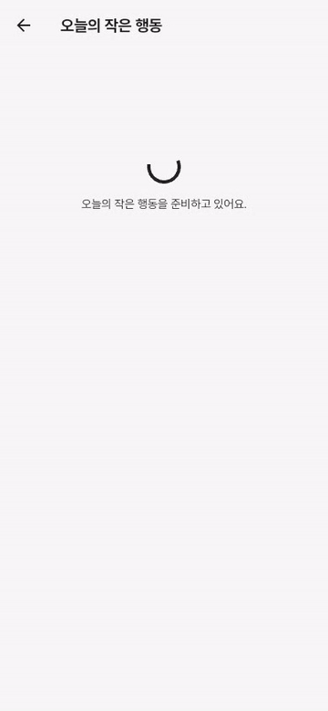
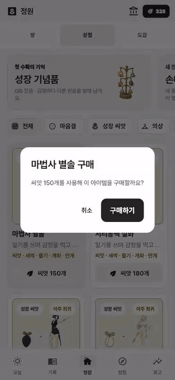
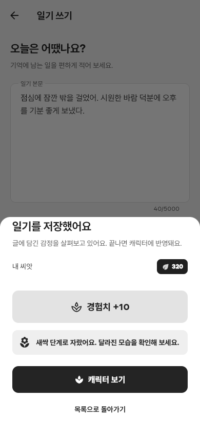
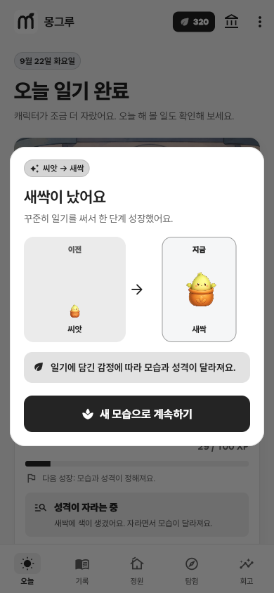

# 보상·해금 연출과 도감 성능 점검

2026년 9월 22일. 재화, 일일 퀘스트, 일기, 성장, 기록 보관, 캐릭터 해금은 서버와 앱에 구현되어 있다. 이번에는 성공 안내에서 끝나던 보상과 해금 화면을 보완하고, 도감이 필요 이상으로 이미지를 읽는 문제를 고쳤다.

## 달라진 부분

| 대상 | 수정 전 | 수정 후 | 이유 |
| --- | --- | --- | --- |
| 퀘스트·일기 보상 | 지급 숫자와 안내 문구만 표시 | 씨앗 아이콘에서 잔액으로 날아가며 도착 순서에 맞춰 숫자 증가 | 받은 재화가 어디로 들어가는지 바로 보이도록 |
| 잔액 | 값이 즉시 교체됨 | 일반 잔액 변경은 짧게 이어지고 보상 화면은 도착 시점에 맞춰 반영 | 획득과 소비를 구분해 읽기 쉽도록 |
| 해금·구매 | 스낵바로 완료 안내 | 실제 획득한 아이템, 남은 씨앗, 등장 동작, 반짝임과 효과음 표시 | 캐릭터를 새로 만나는 순간을 분명히 보여 주도록 |
| 성장·수확 | 정적인 안내창 | 새 모습과 수확한 캐릭터에 짧은 등장 연출 | 한 단계 성장하거나 한 번의 육성이 끝났음을 알리도록 |
| 퀘스트 이후 상점 | 이미 열어 둔 카탈로그의 구매 잔액·해금 조건이 오래 남을 수 있음 | 재화 변경을 구독하고 완료 조건 갱신 | 방금 받은 씨앗으로 바로 구매할 수 있도록 |
| 도감 | 중첩된 목록이 모든 카드를 한꺼번에 생성 | 화면과 가까운 카드만 생성하는 슬리버 목록 | 화면 밖 이미지 요청과 카드 생성 비용을 줄이도록 |
| 미리보기 | 모션을 꺼도 다른 자세의 이미지를 미리 읽음 | 모션을 끈 식물은 자세 선행 로딩 생략, 비활성 영역의 반복 동작 정지 | 지금 사용하지 않는 자원과 프레임을 줄이도록 |
| 좁은 도감 카드 | 긴 설명을 한 줄로 잘라 표시 | 짧은 한국어 설명을 두 줄까지 표시 | 작은 화면에서도 설명이 중간에 끊기지 않도록 |

## 실제 화면

| 퀘스트 보상 | 캐릭터 해금 |
| --- | --- |
|  |  |

실제 Flutter Web 릴리스 빌드와 로컬 API로 촬영했다. 일회용 QA 계정의 초기 재화와 성장 단계만 준비했고, 완료·구매·지급은 앱에서 서버에 요청한 실제 결과다. 그림으로 만든 화면이나 프런트에서 임의로 증가시킨 잔액이 아니다.

<table>
  <tr>
    <td width="50%"></td>
    <td width="50%"></td>
  </tr>
</table>

## 연출이 지급 처리를 방해하지 않게 한 기준

- 지급·구매와 잔액 저장은 서버 응답으로 끝난다. 시트를 닫거나 앱을 백그라운드로 보내도 보상이 사라지지 않는다.
- 완료한 퀘스트를 다시 호출하면 완료 요청을 보내지 않는다. 지급 이벤트가 없는 응답은 비행·보상음을 재생하지 않는다.
- 비행 중 더 최근 응답을 받으면 이전 연출을 끝내고 새 잔액을 표시한다.
- 확인 버튼은 등장 연출 중에도 사용할 수 있다. 연출이 끝날 때까지 입력을 막지 않는다.
- 화면을 닫거나 앱이 비활성화되면 남은 연출과 소리를 정리한다. 늦게 준비된 오디오가 뒤늦게 울리지 않도록 재생 시점을 제한한다.
- 효과음 끄기를 따르고, 시스템의 모션 줄이기에서는 이동 없이 결과를 바로 표시한다. 접근성 안내는 증가 중간 값 대신 확정된 보상과 잔액을 읽는다.

비행체는 지급량과 관계없이 최대 8개다. 파티클은 `CustomPainter(repaint: animation)`로 해당 영역만 다시 그린다. 캐릭터와 문구는 애니메이션의 고정 자식으로 두고, 별도의 `RepaintBoundary`로 분리했다. 보상·해금 연출이 끝나면 반복 타이머나 계속 도는 애니메이션은 남기지 않는다.

## 측정과 검사

Chrome, 390×844 화면, 같은 QA 계정으로 도감을 직접 열고 브라우저 캐시를 비운 뒤 비교했다. Chrome DevTools Protocol, Resource Timing, 5초간의 `requestAnimationFrame` 간격을 사용했다. 전용 DevTools 연결은 기존 프로필 잠금으로 열리지 않아 테스트 브라우저의 CDP 세션으로 측정했다.

| 측정 항목 | 수정 전 | 수정 후 |
| --- | ---: | ---: |
| 도감 첫 화면의 WebP 요청 | 153개 | 44개 |
| 해당 이미지의 전송 용량 | 22,229,830바이트 | 8,431,052바이트 |
| 5초 유휴 구간의 프레임 간격, 95백분위 | 16.8ms | 16.8ms |
| 같은 구간에서 33.4ms를 넘은 프레임 | 0 | 0 |

첫 이미지 다운로드 용량은 약 62% 줄었다. 이 수치는 도감 첫 화면의 비교이며 전체 앱 메모리나 모든 기기의 프레임 성능을 뜻하지 않는다. 스크롤하면 새로 보이는 카드의 이미지는 그때 읽는다.

- Flutter 분석: 오류·경고 없음.
- Flutter 전체 테스트: 563개 통과.
- 보상·일기 성장·퀘스트 관련 서버 검사: 23개 통과.
- 새 검사: 씨앗 도착과 잔액 반영, 보상 없는 응답, 더 최근 잔액, 닫기·백그라운드 전환, 모션 줄이기, 320px·글자 200%, 해금 중 닫기, 고정 자식의 프레임별 재생성 방지, 도감 80종의 지연 생성, 다른 화면에서 받은 재화의 상점 반영.
- Web 릴리스 빌드와 실제 브라우저 보상·구매 확인 완료.

기존 재화 중복 지급 방지, 일일 경험치 상한, 감정에 따른 성장 보상 차등 금지 규칙은 그대로 적용된다. 실제 iPhone·Android의 장시간 플레이, 발열·배터리·진동·음량 확인은 이 브라우저 검사와 별개다.

## 적용 근거

- [Flutter 성능 권장 사항](https://docs.flutter.dev/perf/best-practices): 필요한 범위만 갱신하고 긴 목록은 지연 생성한다.
- [CustomPainter 공식 API](https://api.flutter.dev/flutter/rendering/CustomPainter-class.html): `Listenable`을 통한 재그리기는 위젯 빌드와 레이아웃을 거치지 않는다.
- [RepaintBoundary 공식 API](https://api.flutter.dev/flutter/widgets/RepaintBoundary-class.html): 갱신 빈도가 다른 영역의 그리기를 분리한다.
- [Flutter UI 성능 측정](https://docs.flutter.dev/perf/ui-performance): 측정 환경과 실기기에서의 한계를 구분한다.
- 화면·색·글꼴 기준은 [기존 조사와 적용 기록](../design-system/2026-09-22-interface-research.md)을 따른다.
