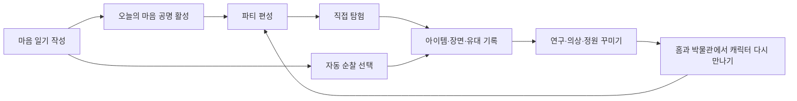
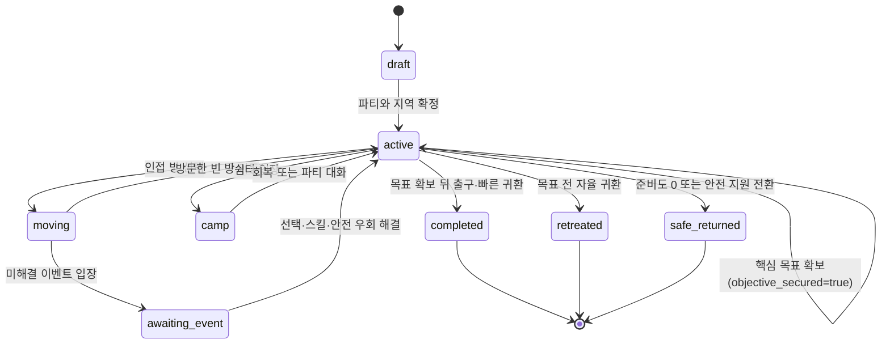
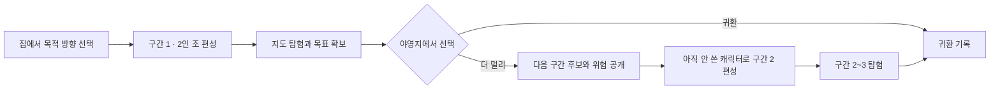

# 몽그루 직접 탐험 확장 설계서

최종 갱신: 2026-08-04
상태: 구현 기준 확정안
대상 버전: `interactive-expedition-v1.4`
관련 문서: `docs/design.md`, `docs/api.md`, `docs/data_dictionary.md`,
`docs/content_strategy.md`, `design-system/ADVENTURE_ASSET_PROMPTS.md`,
`design-system/ADVENTURE_AUDIO.md`, `design-system/EXPEDITION_ASSET_PRODUCTION.md`,
`docs/expedition_skill_tree_catalog.md`, `docs/expedition_player_experience_design.md`

이 문서는 자동 순찰과 한 번의 선택으로 끝나는 기존 던전을 확장해, 사용자가 직접
키운 캐릭터들로 파티를 편성하고 탐험 지도를 이동하며 한 판을 완주하는 콘텐츠의
게임·화면·서버·데이터·에셋 계약을 정의한다. 구현 중 세부 판단이 필요할 때는 이
문서를 우선하고, 기존 일기·성장·경제·안전 계약과 충돌하면 이 문서의 불변식을 지킨다.

## 0. 확정 결정 요약

| 항목 | 결정 |
|---|---|
| 핵심 플레이 | `파티 편성 → 안개 지도의 방 이동 → 이벤트 해결 → 목표 확보 → 자율 귀환` |
| 조작 방식 | 실시간 조이스틱이 아닌 2D 노드 지도. 자유 분기·되돌아가기·숨은 길·선택적 목표를 제공 |
| 한 판 길이 | 첫 지역 기준 8~12분, 후반 지역 10~15분. 모든 행동 뒤 자동 저장 |
| 인원 상한 | 일반 탐험은 동시에 1~3명, 장거리 개척은 원정 명단 최대 6명·구간 활동 2명. 보유 수 자체에는 상한 없음 |
| 성장 관계 | 감정 성장형은 가능한 해결법·스킬·대사를 바꾸지만 XP·씨앗·필수 재료 총량은 바꾸지 않음 |
| 스킬 구성 | 캐릭터당 화면 버튼은 품종 고유 스킬 1개 + 성장형 스킬 1개. stage 3~5 스킬트리는 기존 스킬의 사용법을 바꾸며 새 버튼을 늘리지 않음 |
| 마음 일기 | 50자 일기는 당일 첫 보상 탐험을 열고 +40 XP/+15 씨앗으로 가장 큰 일일 보상을 유지 |
| 거리와 난이도 | 지역별 권장 stage와 능력치 상한을 고정. 새 지역은 숫자가 아니라 지도·연쇄 판정·편성 복잡도로 어려워짐 |
| 새 캐릭터 합류 | 계정 지역 해금은 공유하고, 정원 길잡이 또는 선배의 `동행 공명`으로 최신 지역에서도 권장 stage보다 1단계 낮게 임시 보정 |
| 장거리 개척 | 2~3개 구간에 서로 다른 2인 조를 편성. 같은 캐릭터는 한 개척 안에서 한 구간에만 참가하며 부족한 자리는 무료 길잡이가 채움 |
| 장기 성장 | 개인의 마음 성장은 유지하되 탐험 지식·이동 기술은 계정 공유. 최신 지역 장비는 상위 등급이 아니라 새로운 선택을 여는 수평 도구 |
| 반복 플레이 | 일기 전이나 당일 보상 소진 뒤에도 자유 탐험 가능. 추가 XP·씨앗·경제 재료는 없음 |
| 자동 순찰 | 삭제하지 않고 짧은 보조 수집 기능으로 유지. 직접 탐험을 대체하지 않음 |
| 실패 | 사망·캐릭터 소실 없음. 준비도가 0이 되면 안전 귀환하며 핵심 발견은 모두 보존 |
| 판정 | 숨은 확률 없이 서버가 계산한 수치·비용·예상 결과를 선택 전에 공개 |
| 저장 | 서버 권위 상태, 행동 단위 멱등 처리, `revision` 충돌 검사, 기기 변경 후 이어하기 |
| 서사 | 기존 순찰 12종·던전 12종을 직접 발견 가능한 장면으로 편입하고 최초 스냅샷 보존 |
| 캐릭터 에셋 | stage 2~4 기존 성장 원화 transform, stage 5는 성장형별 7 action의 base/outfit/effect 분리 strip |
| 에셋 배포 | core 17MB, 의상당 8MB, 지역당 6MB versioned pack. 서명·hash·정적 합성 fallback |
| 과금 | 입장권·행동력 판매·확률형 상자·감정별 우대 상품을 만들지 않음 |

## 1. 제품 목표와 불변식

### 1.1 해결하려는 문제

현재 캐릭터는 마음 일기로 성장한 뒤 홈·박물관·정원에서 주로 관상용으로 남는다.
기존 순찰은 경로를 고른 뒤 기다리고, 던전은 접근 방식 하나를 누르면 즉시 끝나므로
사용자가 캐릭터와 함께 무언가를 해냈다는 감각이 약하다.

직접 탐험은 다음 가치를 만들어야 한다.

1. 한 캐릭터를 오래 키운 시간이 실제 플레이의 말투·동작·해결법으로 드러난다.
2. 수확한 캐릭터를 박물관에 보관하는 데서 끝내지 않고 다시 파티로 데려간다.
3. 정답 하나를 누르는 화면이 아니라 지도에서 목적지와 우회로를 스스로 정한다.
4. 짧게 플레이해도 한 편의 모험이 시작·전개·귀환까지 완결된다.
5. 탐험이 커져도 마음 일기가 캐릭터 성장과 재화 획득의 중심으로 남는다.

### 1.2 절대 바꾸지 않는 규칙

- 감정은 좋고 나쁨, 강함과 약함, 성공과 실패의 점수가 아니다.
- `sunny|rainy|ember|moonlit|sparkling|mosaic` 여섯 성장형의 능력 예산은 같다.
- 특정 감정을 쓰거나 감정 분석 결과를 조작해야 경제적으로 유리해지는 경로를 만들지
  않는다.
- 일기 본문, AI 감정 점수, 안전 신호 원문은 탐험 이벤트·로그·분석에 복사하지 않는다.
- 캐릭터가 지치거나 우회할 수는 있지만 죽거나 잃어버리거나 퇴화하지 않는다.
- 탐험 도중 앱을 닫아도 진행도와 확보한 핵심 발견이 사라지지 않는다.
- 모든 유료·무료 의상은 같은 성능 예산을 가지며, 외형 구매가 필수 공략 조건이 되지
  않는다.
- 자동 순찰과 직접 탐험 보상을 합쳐도 50자 마음 일기 한 편의 XP·씨앗을 넘지 않는다.
- 새 지역은 이전 지역 도구와 캐릭터를 수치로 폐기하지 않는다. 지역 능력치 상한과
  도구 효과 예산은 출시 뒤에도 올리지 않는다.
- 특정 품종·성장형·보유 캐릭터 수를 입장 조건으로 만들지 않는다. 부족한 편성은
  무료 정원 길잡이로 완주할 수 있다.
- 탐험 보정은 탐험 안에서만 쓰며 실제 stage, 감정 성장형, 일기 XP를 변경하지 않는다.
- 위기 지원이 활성화된 날에는 새 보상 탐험을 권하지 않는다. 진행 중인 탐험은 캐릭터·
  이야기·도감 발견을 잃지 않고 안전 귀환할 수 있다.

### 1.3 출시 판단 지표

기능 출시 여부는 체류 시간을 늘렸는지가 아니라 다음을 기준으로 판단한다.

| 지표 | 목표 |
|---|---|
| 첫 직접 탐험 자력 완주율 | 시작 사용자의 85% 이상, 핵심 사용자군별 80% 이상 |
| 첫 판 중앙값 | 8~12분 |
| 선택 전 비용·결과 이해 | 관찰 과제 정답 95% 이상 |
| 캐릭터 성격이 플레이에 보임 | 사용자 평가 중앙값 6/7 이상 |
| 파티원 모두 함께한 느낌 | 3인 파티 완료자의 85% 이상 |
| 보상 없이 다른 조로 재탐험 의향 | 70% 이상 |
| 행동 저장 성공률 | 99.9% 이상 |
| 재접속 복구 성공률 | 99.9% 이상 |
| 첫 지도에서 길을 잃고 2분 이상 정체 | 5% 미만 |
| 해결 능력치 편중 | 지역·노출 선택지 보정 뒤 한 능력치 선택이 전체의 45%를 넘지 않음 |
| 보상 탐험 선두 집중도 | 최근 14회 중 같은 식물이 선두인 비율 중앙값 50% 이하 |
| 새 stage 2 캐릭터의 최신 지역 첫 참가 | 사용자가 원하면 첫날 가능, 별도 유료·반복 육성 없음 |
| 보정 후 신·구 캐릭터 완주율 차이 | 같은 지역·난이도에서 15%p 이내 |
| 범용 탐험 도구 독점률 | 한 도구 선택률 40% 이하 |
| 판정별 안전 우회 선택 가능률 | 100% |
| 보상 중복 지급 | 0건 |
| 일기 없이 탐험 때문에 감정 입력을 유도하는 문구 | 0건 |

### 1.4 초기 버전에서 하지 않는 것

- 실시간 액션 전투, 조이스틱, 회피 타이밍, PvP, 순위표
- 캐릭터 사망·소실·부상 치료 대기·장비 내구도
- 끝없이 이어지는 절차 생성 던전과 시즌 초기화
- 다른 사용자와의 실시간 협동 또는 캐릭터 대여
- 런타임 LLM이 만드는 사건·보상·캐릭터 대사
- 위치 정보, 걸음 수, 사진 업로드로 탐험을 검증하는 기능
- 입장권 구매, 행동력 충전, 광고 부활, 확률형 전리품
- 매 시즌 stage·능력치·장비 등급 상한을 올리는 구조
- 특정 품종·성장형·캐릭터 수를 요구하는 주간 출전 제한

초기 범위는 혼자서 8~15분 안에 완주하고 언제든 이어 할 수 있는 서사형 탐험이다.
이 범위를 안정화한 뒤에만 새로운 지역과 수호자 규칙을 콘텐츠 팩으로 확장한다.

## 2. 콘텐츠 구조

### 2.1 네 가지 층

| 콘텐츠 | 사용자의 역할 | 시간 | 보상 | 목적 |
|---|---|---:|---|---|
| 자동 순찰 | 캐릭터 1명과 경로 선택, 귀환 확인 | 10~35분 백그라운드 | 씨앗 3, 수집품 | 바쁜 날의 가벼운 보조 수집 |
| 직접 탐험 | 파티 편성, 이동, 이벤트·스킬 선택, 귀환 | 8~15분 능동 플레이 | 지역별 당일 첫 판 XP 6~10·씨앗 2~5·수집품 | 캐릭터 활용과 핵심 게임 플레이 |
| 장거리 개척 | 구간별 2인 조 편성, 2~3개 지도를 연속 탐험 | 20~35분, 구간 저장 | 직접 탐험의 당일 경제 보상 1회 + 개척 기록 | 여러 캐릭터와 함께하는 장기 탐험 |
| 자유 탐험 | 직접 탐험과 동일 | 제한 없음 | 경제 보상 없음, 이야기·지도 기록만 보존 | 반복 플레이와 미발견 장면 탐색 |

기존의 즉시 결과형 던전 실행은 직접 탐험 출시 뒤 구버전 호환 API로만 남긴다. 최신
앱에서 던전 카드를 누르면 바로 결과를 만들지 않고 파티 준비 화면을 연다.

### 2.2 일일 순환



마음 일기는 탐험의 연료가 아니라 오늘 캐릭터와 연결됐다는 시작점이다. 50자 일기를
쓰면 `오늘의 마음 공명`이 켜지고 그날 첫 직접 탐험이 보상 가능 상태가 된다. 감정
종류나 분석 점수는 공명의 세기와 보상을 바꾸지 않는다.

### 2.3 첫 사용 흐름

1. 활성 캐릭터가 stage 2에 도달하면 `이끼 낀 기억서고`와 직접 탐험 안내가 열린다.
2. 튜토리얼 파티는 인지 부하를 줄이기 위해 활성 캐릭터와 정원 길잡이 한 명만 보여
   준다. 세 번째 슬롯과 전체 파티 편성은 두 번째 탐험부터 연다.
3. 일반 탐험에서 다른 수확 캐릭터가 없으면 빈자리를 능력치 6의 `정원 길잡이`로 채울
   수 있다. 길잡이는 고유 스킬이 없으므로 캐릭터 수집은 선택 폭을 늘리지만 수치상
   필수는 아니다.
4. 첫 지도는 숨은 길 없이 8개 노드의 고정 튜토리얼 템플릿을 사용한다.
5. 이동, 캐릭터 선택, 안전 우회, 스킬 사용, 목표 확보, 빠른 귀환을 한 번씩 경험한다.
6. 결과 화면에서 보상보다 먼저 참여 캐릭터의 귀환 반응과 발견 장면을 보여 준다.

### 2.4 지역 해금

- `moss_archive`: 사용자의 어떤 식물이든 처음 stage 2에 도달하면 열린다.
- `echo_well`: 기억서고 최초 완주와 생애 최고 stage 3을 모두 충족하거나, 기존 자동
  순찰에서 이미 발견했으면 열린다.
- `starlight_seed_vault`: 우물정원 최초 완주와 생애 최고 stage 4를 모두 충족하거나,
  기존 자동 순찰에서 이미 발견했으면 열린다.
- `heartwood_observatory`: 씨앗 보관고 최초 완주와 생애 최고 stage 5를 모두 충족하거나,
  기존 자동 순찰에서 이미 발견했으면 열린다.
- 한 번 발견한 지역은 활성 식물을 새로 심어 stage가 낮아져도 다시 잠기지 않는다.
- 지역 해금은 사용자 계정 진행도다. 나중에 태어난 stage 2 캐릭터도 발견된 모든 지역의
  일반·장거리 탐험 편성 화면에 즉시 나타난다.
- 생애 최고 stage는 수확·활성 식물을 모두 읽어 계산하며 별도 재화 보상을 만들지 않는다.
- 자동 순찰은 지역을 먼저 발견하는 선택 경로일 뿐 직접 탐험의 필수 선행 작업이 아니다.

## 3. 파티 편성

### 3.1 참가 가능한 캐릭터

- 현재 활성 식물: stage 2 이상이면 참가 가능하다.
- 수확한 식물: `status=harvested`, `final_form`이 있으면 언제든 참가 가능하다.
- 같은 식물 인스턴스를 두 칸에 중복 배치할 수 없다.
- 같은 품종의 서로 다른 식물은 함께 배치할 수 있다.
- 진행 중인 자동 순찰에 나간 식물은 직접 탐험에 중복 배치하지 않는다. 기존 자동
  순찰이 활성 식물만 저장하므로 직접 탐험 구현 전에 순찰에도 `plant_id` 잠금 상태를
  공통 조회하도록 정리한다.
- 이미 시작한 탐험의 성장형·단계·능력치·의상은 시작 시점 스냅샷을 유지한다. 탐험
  중 일기를 추가하거나 의상을 바꿔도 진행 중인 판은 바뀌지 않는다.

### 3.2 파티 슬롯

탐험에 ‘데려간다’는 말을 다음 세 수치로 나눈다. 이 셋을 UI·API에서 모두 `party_size`로
뭉치지 않는다.

| 구분 | 자체 캐릭터 상한 | 동시에 조작 | 길잡이 포함 슬롯 | 의미 |
|---|---:|---:|---:|---|
| 보유·수확 캐릭터 | 상한 없음 | 해당 없음 | 해당 없음 | 마음 일기로 만든 캐릭터를 삭제·교체하도록 압박하지 않음 |
| 일반 직접 탐험 | 3명 | 최대 3명 | 총 3칸 | 선두 1 + 지원 2 |
| 장거리 개척 전체 | 6명 | 해당 없음 | 세 구간 총 6칸 | 한 journey에서 사용 가능한 서로 다른 식물 |
| 장거리 개척 한 구간 | 2명 | 최대 2명 | 총 2칸 | 구간마다 새 조 편성 |

일반 탐험의 슬롯 역할은 다음과 같다.

| 슬롯 | 역할 |
|---|---|
| 선두 | 지도 위 대표 캐릭터, 이벤트 기본 행동자, 시작·귀환 대사 담당 |
| 지원 1 | 판정 지원과 고유·성장형 스킬 사용 |
| 지원 2 | 판정 지원과 고유·성장형 스킬 사용 |

이벤트마다 행동자를 세 명 중 다시 고를 수 있다. 선두 캐릭터만 계속 사용하는 것이
최적해가 되지 않도록 방마다 서로 다른 능력치 해결법을 제공한다. 빈 지원 슬롯은
`정원 길잡이`로 계산하며 지원일 때 +1, 행동자일 때 서버가 정한 지역 기본 능력치를
사용한다.

인원 상한은 콘텐츠나 과금으로 늘리지 않는다. 일반 파티를 4명으로 만들면 이벤트마다
행동자 4명과 수동 스킬 버튼 최대 8개를 비교해야 하고, 144px 캐릭터 네 명이 작은
화면에서 겹친다. 반대로 한 명만 고정하면 여러 캐릭터를 키운 의미가 약하다. 따라서
한 화면은 최대 3명, 긴 원정의 전체 명단은 최대 6명으로 고정한다. 향후 협동·레이드형
콘텐츠도 서버와 접근성 검증 없이 6명을 넘기지 않는다.

정원 길잡이는 슬롯 수에는 포함하지만 자체 캐릭터 수에는 포함하지 않는다. 일반 탐험은
보유 식물 1명 + 길잡이 2명, 장거리 구간은 길잡이 2명으로도 시작할 수 있다. 길잡이는
기본 판정과 동행 공명은 제공하지만 고유 스킬·성장형 스킬·스킬트리·개인 기록은 없다.

### 3.3 능력치

기존 네 능력치를 그대로 사용한다.

| 코드 | 표시 이름 | 주로 해결하는 상황 |
|---|---|---|
| `care` | 돌봄 | 다친 식물, 관계, 복원, 동행 생물 |
| `focus` | 집중 | 순서, 소리, 기억, 지속 행동 |
| `courage` | 용기 | 위험한 통로, 수호자, 무거운 장애물 |
| `insight` | 관찰 | 숨은 길, 흔적, 장치, 표본 분석 |

개별 능력치는 현재 공식인 `3 + stage + 성장형 보정`을 유지한다. 성장형별 보정 합은
항상 4다. 품종은 기본 능력치를 추가하지 않고 고유 스킬과 연출만 다르게 한다.

### 3.4 지역 보정과 동행 공명

마음 성장의 차이는 남기되 한 캐릭터가 모든 지역을 압도하거나 새 캐릭터가 최신
지역에서 구경만 하는 상황을 함께 막는다. 서버는 매 판정마다 원래 수치와 탐험용
유효 수치를 모두 계산한다.

| 지역 | 권장 stage | 능력치별 상한 | 필수 판정 DC | 일반 지도 복잡도 |
|---|---:|---:|---:|---|
| 이끼 낀 기억서고 | 2 | 7 | 8~10 | 단일 단서, 12개 노드 |
| 메아리 우물정원 | 3 | 8 | 9~11 | 순서 기억, 14개 노드 |
| 별빛 씨앗 보관고 | 4 | 9 | 10~12 | 지도 상태 변화, 15개 노드 |
| 심재 관측실 | 5 | 10 | 11~13 | 두 행동자 연쇄 판정, 16개 노드 |

```text
raw_stat = 3 + 실제 stage + 성장형 보정
sync_stage = 실제 stage

식물 선배와 동행 공명을 선택했다면:
  sync_stage = max(
    실제 stage,
    min(동행 선배 stage - 1, 지역 권장 stage - 1)
  )

정원 길잡이 공명을 선택했다면:
  sync_stage = max(실제 stage, 지역 권장 stage - 1)

synced_stat = 3 + sync_stage + 성장형 보정
effective_stat = min(synced_stat, 지역 능력치별 상한)
final_score = effective_stat + 지원 + 의상 + 스킬
```

- stage 2 캐릭터와 stage 5 선배가 관측실에 가면 새 캐릭터는 탐험 안에서만 stage 4
  상당으로 계산된다. 성장형 보정은 그대로라 캐릭터 개성은 지워지지 않는다.
- 선배 대신 무료 `정원 길잡이`를 선택해도 그 지역의 권장 stage보다 1단계 낮은 같은
  보정을 제공한다. 오래된 캐릭터를 반드시 데려가야 하는 구조가 아니다.
- 한 파티에서 동행 공명 대상은 한 명이다. 이미 권장 stage 이상이면 적용하지 않는다.
- 상한은 강한 캐릭터가 초기 지역을 자동 통과하는 것을 막지만, 실제 stage·스킬·유대·
  개인 장면은 사라지지 않는다.
- 일반 필수 경로는 공명 없이도 안전 우회로 완주 가능하다. 공명은 새 캐릭터가 적극적으로
  판정에 참여하게 하는 장치이지 입장권이 아니다.
- UI는 `원래 6 → 탐험 보정 9`, `지역 상한 10`처럼 계산 근거를 숨기지 않는다.
- 미래 지역도 일반 필수 DC 13, 능력치 상한 10을 넘지 않는다. 더 먼 지역의 난이도는
  숫자가 아니라 정보 부족, 구간 편성, 자원 배분, 연쇄 사건으로 만든다.

### 3.5 의상과 장비

현재 `farm_layout.wardrobe_user_item_id`는 활성 캐릭터 하나의 화면 표시만 담당한다.
3인 파티를 위해 식물 인스턴스별 `plant_loadouts`를 추가한다.

- 한 식물당 의상 1개를 장착하고 run당 파티 공용 탐험 도구 1개를 고를 수 있다.
- 탐험 의상 loadout은 wardrobe v2가 지원하는 stage 5부터 장착한다. stage 2~4는
  고유 성장 의상을 그대로 사용하고 의상 효과도 적용하지 않는다. UI는 잠금 이유를
  `의상은 만개 뒤 탐험에서 입을 수 있어요`로 설명하고 서버도 같은 규칙을 검증한다.
- 보유 의상은 소모품 한 벌이 아니라 계정에 해금된 외형 라이선스로 취급한다. 같은
  `user_item` 의상을 호환되는 여러 식물에게 동시에 저장할 수 있다.
- 의상은 `asset_manifest.compatible_species` 검증을 서버에서 다시 수행한다.
- 의상 능력치는 행동자일 때만 적용하고 한 판정에 최대 +1이다.
- 모든 의상은 `능력치 +1`, `준비도 손실 1회 방지`, `주변 노드 1개 미리보기` 중
  하나의 동일 예산만 가진다.
- 의상 효과는 XP·씨앗·필수 수집품 수량을 늘리지 않는다.
- 탐험 도구는 연구로 만든 영구 소유 아이템이다. 소비되지 않으며 run 시작 때 파티
  공용 도구 하나만 고른다.
- 시작 이후 장착 변경은 다음 탐험부터 반영한다.

기존 연구와 공용 도구의 연결은 다음으로 고정한다. 원래 순찰·던전 연구 효과도 계속
유지한다.

| 완료 연구 | 도구 코드 | 탐험 도구 | 직접 탐험 효과 |
|---|---|---|---|
| 압화 길잡이 도감 | `pressed_leaf_guide` | 압화 길잡이 | 시작 시 입구에 인접한 미방문 방 종류 1개 공개 |
| 메아리 청음 키트 | `echo_listener` | 메아리 청음기 | 한 판에 한 번 집중 또는 돌봄 판정 +1 |
| 기억 씨앗 표본함 | `memory_case` | 기억 표본함 | 첫 발견 장면의 파티 대사 후보를 2개 보여 주고 선택 |
| 별빛 온실 시계 | `starlight_clock` | 별빛 시계 | 처음 진입하는 비용 2의 깊은 방 하나를 비용 1로 변경 |
| 온실 밖 탐험 지도 | `outside_atlas` | 온실 밖 지도 | 시작 때 목표가 있는 방향만 공개. 정확한 방은 숨김 |

도구는 경제 보상 수량을 바꾸지 않는다. 연구를 하나도 끝내지 않아도 모든 지역의
필수 경로를 완주할 수 있어야 한다. 도구 없이 시작할 때 `tool_code=null`을 사용하며,
서버는 도구 코드와 해당 연구 완료 여부를 검증한다.

## 4. 한 판의 진행

### 4.1 상태 흐름



`moving`은 서버 응답 뒤 재생하는 클라이언트 전용 연출 상태로 저장하지 않는다.
서버 phase는 `exploring|awaiting_event|camp` 세 값만 사용한다. 목표 확보 여부는 어느
phase에서도 유지돼야 하므로 `objective_secured` boolean으로만 표현하고 phase에 중복해서
넣지 않는다. DB의 종료 status는 `completed|retreated|safe_returned`로 고정한다.

active run에는 실시간 제한과 만료일이 없다. 앱을 닫거나 날짜가 바뀌어도 사용자 행동
없이 자동 종료하지 않는다. 사용자당 하나인 active run을 끝내거나 귀환해야 새 run을
시작할 수 있으며, 과거 `content_version` 팩은 active run과 기록 재생이 남아 있는 동안
서버 배포물에서 제거하지 않는다.

### 4.2 탐험 자원

| 자원 | 시작/최대 | 소비 | 회복 | 0이 됐을 때 |
|---|---:|---|---|---|
| 길빛 `trail_light` | 10/12 | 처음 가는 일반 방 1, 깊은 방 2 | 쉼터당 2, 일부 스킬 | 새 방 진입 불가. 방문한 길로 귀환 가능 |
| 준비도 `resolve` | 6/6 | 판정 우회 결과 1, 위험 선택 명시 비용 | 쉼터당 1, 스킬 | 즉시 안전 귀환. 핵심 발견 보존, 경제 후보는 기록만 남김 |
| 고유 스킬 | 캐릭터별 1회 | 품종 고유 행동 | 회복 없음 | 다른 해결법 사용 |
| 성장형 스킬 | 캐릭터별 1회 | 성장형 행동 | 한 판에 한 번 쉼터에서 한 명만 회복 | 다른 해결법 사용 |
| 트리 문맥 노드 | 장착 노드별 1회 | 맞는 이동·사건에서 수동 선택 | 회복 없음, 3단 재배분만 가능 | 기본 행동 사용 |

방문한 노드 사이의 되돌아가기는 길빛을 쓰지 않는다. 지도를 잘못 눌렀다는 이유로
자원을 잃지 않게 미방문 노드 진입 직전에만 비용을 확정한다. 자원은 시간 경과로
회복하지 않고 유료 충전도 없다.

각 쉼터의 자원 회복은 run당 한 번만 가능하고 사용한 쉼터 node를 `resolved`로 바꾼다.
성장형 스킬 회복은 쉼터 수와 관계없이 run 전체에서 한 번만 가능하다. 방문한 쉼터를
오가며 자원이나 스킬을 무한 회복할 수 없다.

### 4.3 확보 슬롯과 귀환

- `핵심 발견`: 이야기·도감·최초 발견 표본 코드. 획득 즉시 계정 기록으로 영구 보존한다.
- `목표 발견`: 목표 방을 찾았다는 도감 코드와 장면. 즉시 보존하지만 경제 아이템은 아니다.
- `확보 재료`: 당일 보상 탐험에서 얻을 수 있는 경제 아이템 후보. 기본 3칸이며 목표
  재료 후보는 첫 칸에 들어가지만 `completed` 트랜잭션 전에는 인벤토리에 없다.
- `현장 표본`: 자유 탐험 중 화면에서만 확인하는 연출용 기록. 경제 인벤토리에
  들어가지 않는다.
- `completed`: 목표 발견 후 출구 또는 빠른 귀환. 보상 자격이 있으면 그때만 당일 원장을
  만들고 reward band 안의 확보 재료·XP·씨앗을 한 번 지급한다. 자유 탐험은 항상 0이다.
- `retreated`: 목표 전에 자율 귀환. 발견 장면은 보존하지만 XP·씨앗·경제 재료 없음.
- `safe_returned`: 준비도 0 또는 안전 지원 전환. 발견 장면과 목표 발견 기록은 보존하되
  경제 재료·XP·씨앗은 지급하지 않고 당일 보상 자격도 소진하지 않는다. 페널티 문구를
  사용하지 않는다.

종료 상태 진실표는 다음 하나를 구현 원본으로 삼는다.

| 종료 status | 허용 조건 | 영구 이야기·도감 | 경제 후보 | 일일 원장 | 재도전 자격 |
|---|---|---|---|---|---|
| `completed` | `objective_secured=true` | 보존 | 보상 모드만 지급, 자유 탐험은 기록만 | 보상 모드만 생성 | 소진 |
| `retreated` | `objective_secured=false`, 사용자 선택 | 보존 | 전부 `recorded` | 생성 안 함 | 유지 |
| `safe_returned` | 어느 목표 상태든 안전 전환 | 보존 | 전부 `recorded` | 생성 안 함 | 유지 |

장거리 개척의 각 leg도 같은 규칙으로 후보만 만든다. 경제 지급과 원장 생성은 journey
`completed`에서 가장 먼 확보 지역 band로 한 번만 수행하며, journey `retreated` 또는
`safe_returned`에서는 모든 후보를 `recorded`로 종결한다.

목표를 확보하면 방문한 쉼터나 입구에서 `빠른 귀환`을 쓸 수 있다. 더 탐색하고 싶은
사용자는 선택 방을 계속 돌 수 있다. 출구까지 같은 길을 반복해 걷게 하지 않는다.

## 5. 지도와 이동

### 5.1 지도 표현

탐험 지도는 확대·이동 가능한 2D 노드 그래프다. 캐릭터 토큰은 연결선을 따라 이동하고
미방문 구역은 안개로 가린다. 자유도는 픽셀 단위 이동이 아니라 다음에서 만든다.

- 목표까지 최소 두 경로
- 막다른 곳의 선택 발견
- 능력치 또는 스킬로 여는 지름길
- 무료 되돌아가기
- 목표 확보 뒤 추가 탐색 또는 즉시 귀환
- 매 판 달라지는 방·사건 배치

실시간 조이스틱을 사용하지 않는 이유는 작은 모바일 화면, 스크린리더, 200% 글자,
네트워크 재접속에서 동일한 판정을 보장하기 위해서다. 지도와 같은 정보를 순서형
목록으로도 조작할 수 있어야 한다.

### 5.2 지도 크기

| 지도 | 노드 | 목표 경로 | 선택 분기 | 예상 시간 |
|---|---:|---:|---:|---:|
| 첫 튜토리얼 | 8 | 4 | 2 | 5~8분 |
| stage 2 기억서고 | 12 | 6 | 4 | 8~12분 |
| stage 3 우물정원 | 14 | 7 | 5 | 10~13분 |
| stage 4 씨앗 보관고 | 15 | 8 | 5 | 10~15분 |
| stage 5 관측실 | 16 | 8 | 6 | 12~15분 |

### 5.3 생성 방식

완전 무작위 미로를 만들지 않는다. 지역마다 디자이너가 검수한 토폴로지 템플릿 3개를
두고, 서버가 방 슬롯에 이벤트를 결정적으로 배치한다.

1. 서버 비밀 `MAP_SEED_KEY`로
   `HMAC-SHA256(user_id|run_id|region_code|content_version)`을 계산해 `map_seed`를 만든다.
   사용자 식별자를 역추정할 수 있는 무염 hash는 쓰지 않는다.
2. seed로 지역의 토폴로지 템플릿 하나를 선택한다.
3. 시작·쉼터·목표·출구처럼 고정된 슬롯을 먼저 배치한다.
4. 나머지 4~6개 사건 슬롯은 최근 10회 기록을 참고해 배치한다. 최근 2회에 나온 사건의
   가중치는 `0.25`, 그 밖에는 `1.0`이며, 지역에 미관람 사건이 둘 이상 있으면 최소 2개를
   우선 배치한다. 후보가 부족할 때는 반복을 허용해 생성 불능을 만들지 않는다.
5. 최근 3판에 쓰지 않은 지역 `run_thread`를 우선 골라 seed는 첫 2개 사건, echo는 중간
   분기, payoff는 목표 또는 선택 발견에 연결한다.
6. 실제 소유 파티원마다 고유·성장형·트리·상위 능력치 중 하나를 쓸 수 있는 서로 다른
   선택 spotlight를 하나 배치한다. 사용하지 않아도 완주되고 경제 총량은 같다.
7. 파티가 사용할 수 있는 해결 능력치가 하나도 없는 필수 이벤트가 없는지 검사한다.
8. 시작에서 목표와 출구까지 도달 가능하고, 목표까지 서로 다른 첫 간선 경로가 2개
   이상인지 검사한다.
9. 필요한 길빛 최솟값이 시작 길빛 이하인지 검사한다.
10. 검증 실패 시 `HMAC-SHA256(map_seed|retry_index)`로 최대 20회 다시 만들고, 계속
   실패하면 숨은 간선을 끈 지역별 `safe-linear` fallback을 사용한다.

클라이언트는 좌표와 연결을 그릴 뿐 지도를 생성하지 않는다. 같은 run을 다른 기기에서
열어도 동일해야 한다.

템플릿 코드는 아래 13개로 고정한다. 좌표·간선은 콘텐츠 팩이 단일 원본이며, 같은
`구조 서명`의 템플릿을 이름만 바꿔 늘릴 수 없다.

| 템플릿 | 노드 | 구조 서명 | 지역 장치 |
|---|---:|---|---|
| `tutorial-path-a` | 8 | 단일 고리 1, 선택 막다른 길 2 | 비용·되돌아가기 학습 |
| `archive-loop-a` | 12 | 중앙 고리 1, 첫 분기 2 | 라벨 방향 |
| `archive-fork-b` | 12 | 비대칭 Y, 재합류 1 | 잘린 표식 |
| `archive-braid-c` | 12 | 교차 경로 2, 숨은 간선 1 | 표본 기호 |
| `well-loop-a` | 14 | 이중 고리, 쉼터 중앙 | 메아리 순서 |
| `well-fork-b` | 14 | 삼지 분기, 재합류 2 | 소리 방향 |
| `well-braid-c` | 14 | 왕복 다리 2, 숨은 간선 1 | 물결 상태 |
| `vault-loop-a` | 15 | 회전 고리, 가변 간선 1 | 별빛 회전 |
| `vault-fork-b` | 15 | 목표 전 병렬 판정 2 | 무게 고정 |
| `vault-braid-c` | 15 | 세 경로 교직, 가변 간선 2 | 노드 위치 변경 |
| `heartwood-loop-a` | 16 | 외곽 고리+중앙 관측실 | 연쇄 판정 |
| `heartwood-fork-b` | 16 | 구간형 삼지 분기 2 | 파티 역할 교대 |
| `heartwood-braid-c` | 16 | 이중 교직, 숨은 간선 2 | 이전 상태 참조 |

각 지역 fallback은 해당 `loop-a`에서 선택 분기 하나와 모든 숨은·가변 간선을 끈 검증된
좌표 집합이다. fallback 사용률이 전체 생성의 `0.1%`를 넘으면 배포를 중단한다.

#### 5.3.1 아트 제작 전 그레이박스 게이트

지도 원화와 전용 모션 제작은 클릭 가능한 회색 상자 프로토타입이 아래를 통과한 뒤에만
시작한다. 수치 미달을 아트로 덮지 않는다.

1. 신규 사용자 5명의 관찰형 튜토리얼 테스트: 5명 모두 도움 없이 이동·되돌아가기·
   안전 우회·귀환을 설명한다.
2. 대상 사용자 12명이 각 3판, 총 36판: 첫 판 완주율 70% 이상, 행동 선택 중앙값
   8~25초, 길을 잃고 2분 정체 5% 미만이다.
3. 템플릿별 첫 분기 정규화 entropy가 `0.65` 이상이고 한 경로 선택률이 75%를 넘지
   않는다. 넘으면 보상이 아니라 정보·비용·경로 구조를 조정한다.
4. 비공개 beta 100판에서 목표 도달 경로가 템플릿당 2개 이상 실제 사용되고 fallback
   0.1% 이하, 진행 불능·저장 유실·안전 선택 누락이 0건이다.
5. 각 테스트는 완료 여부뿐 아니라 `왜 그 길을 골랐는지`, `다음에 무엇이 일어날 것으로
   예상했는지`를 기록한다. 일기 본문·감정 분류는 수집하지 않는다.

### 5.4 노드 종류

| 종류 | 아이콘 | 수량 | 역할 |
|---|---|---:|---|
| `entrance` | 문 | 1 | 시작·목표 전 귀환 |
| `event` | 잎 물음표 | 4~6 | 능력치 선택과 캐릭터 대사 |
| `discovery` | 반짝 표본 | 2~3 | 도감 장면·세계관 기록 |
| `resource` | 씨앗 주머니 | 1~2 | 당일 확보 재료 또는 자유 탐험 연출 |
| `camp` | 작은 등불 | 1~2 | 길빛·준비도 회복, 파티 대화 |
| `guardian` | 문양 | 1 | 지역의 다단계 핵심 판정 |
| `objective` | 지역 상징 | 1 | 목표 확보 |
| `exit` | 온실 문 | 1 | 완료 귀환. 입구와 겸할 수 있음 |

숨은 연결은 한 판에 최대 2개다. 못 찾아도 목표 완주와 필수 보상에는 영향이 없고,
장면 수집과 지름길만 제공한다.

## 6. 이벤트와 판정

### 6.1 이벤트 화면 순서

1. 방 배경과 짧은 환경 문장을 보여 준다.
2. 행동할 캐릭터를 선택한다. 추천 캐릭터는 표시하지만 자동 확정하지 않는다.
3. 2~4개의 해결법을 보여 준다.
4. 각 해결법에 사용 능력치, 현재 점수, 기준치, 자원 비용, 예상 결과를 공개한다.
5. 필요하면 고유 스킬이나 성장형 스킬을 먼저 사용한다.
6. 확인 뒤 서버가 결과를 확정하고 행동 로그와 node 상태를 같은 트랜잭션에 저장한다.
7. 캐릭터 동작 → 결과 문장 → 새 길·발견·표본 순서로 공개한다.

### 6.2 점수 공식

```text
판정 점수 = 행동자 능력치
          + 지원 보너스(0~2)
          + 행동자 의상 보너스(0~1)
          + 도구 보너스(0~1)
          + 이번 판정에 사용한 스킬 보너스(0~3)
          + 이벤트 상태 보정(-2~2)
```

- 지원 캐릭터의 해당 능력치가 8 이상이면 한 명당 +1, 최대 +2다.
- 빈 슬롯의 정원 길잡이는 +1을 제공한다.
- 한 판정에는 고유 스킬과 성장형 스킬 중 하나만 적용한다.
- 일반·수호자 필수 기준치는 8~13, 깊은 조사의 선택 도전만 14~15다.
- 콘텐츠 파일은 기준치만 저장하고 서버가 현재 파티의 점수를 계산한다.

### 6.3 결과 단계

| 조건 | 결과 코드 | 의미 |
|---|---|---|
| 점수 ≥ 기준치 + 2 | `flourish` | 준비도 손실 없이 해결하고 추가 대사·지름길 중 하나 공개 |
| 점수 ≥ 기준치 | `clear` | 정상 해결 |
| 점수 < 기준치 | `detour` | 준비도 1을 쓰고 안전한 다른 방식으로 진행 |
| 안전 선택 | `safe` | 판정 없이 준비도 0~1 또는 장면 안의 우회를 택하고 진행 |

`flourish`는 XP·씨앗·필수 재료를 더 주지 않는다. 성장형에 맞는 선택을 잘했을 때
더 자연스러운 연출과 짧은 길을 제공하되 경제 효율로 감정 기록을 유도하지 않는다.
모든 필수 이벤트에는 `safe` 선택을 하나 둔다. 안전 선택은 길빛을 소비하지 않고
준비도 비용이 0 또는 1이어야 한다. 준비도가 0이라 선택할 수 없으면 즉시 안전 귀환이
가능하므로 사건 안에 갇히지 않는다.

### 6.4 확률을 사용하지 않는 이유

초기 버전은 명중률, 치명타, 랜덤 주사위를 사용하지 않는다. 사용자는 선택 전에 결과
단계를 알 수 있고, 서버는 같은 상태와 행동에 항상 같은 결과를 준다. 반복성은 지도와
이벤트 배치, 파티 대사, 숨은 길에서 만든다. 향후 확률을 추가하더라도 별도 실험 플래그와
명시적 확률 표시가 필요하며 경제 보상에는 적용하지 않는다.

### 6.5 수호자 이벤트

수호자는 전투 HP를 깎는 대상이 아니라 지역의 규칙을 이해했는지 확인하는 2~3단계
사건이다.

- 단계마다 서로 다른 능력치 해결법을 최소 3개 제공한다.
- 같은 캐릭터가 연속 두 단계를 맡으면 다음 단계 지원 보너스가 1 줄어든다.
- 한 단계를 우회해도 수호자는 사라지거나 다치지 않고 다른 길을 열어 준다.
- 모든 단계 해결 뒤 목표 방이 열린다.
- 수호자 결과는 `clear|detour`만 기록하며 등급·별점·랭킹을 만들지 않는다.

## 7. 캐릭터 스킬과 개성

### 7.1 성장형 스킬

성장형 스킬은 품종과 무관하게 같은 성장 결에서 공통으로 사용한다. 캐릭터당 한 판에
1회이며 쉼터 한 곳에서 파티원 한 명의 사용 횟수만 회복할 수 있다.

| 성장형 | 스킬 | 효과 | 연출 방향 |
|---|---|---|---|
| `sunny` | 온기 나누기 | 돌봄 판정 +3 또는 준비도 1 회복 | 먼저 손을 내밀고 밝게 길을 연다 |
| `rainy` | 잔향 듣기 | 집중/관찰 판정 +3, 인접 사건 태그 공개 | 작은 소리와 흔적을 오래 듣는다 |
| `ember` | 막힌 길 열기 | 용기 판정 +3, 이번 `detour` 준비도 손실 방지 | 단호하게 앞을 막은 것을 치운다 |
| `moonlit` | 미리 살피기 | 관찰 판정 +3, 연결된 두 방의 비용·종류 공개 | 위험을 조용히 확인하고 준비한다 |
| `sparkling` | 뜻밖의 샛길 | 집중/용기 판정 +3, 숨은 연결 후보 하나 공개 | 예상하지 못한 방향을 먼저 시험한다 |
| `mosaic` | 마음결 잇기 | 선택한 능력치를 다른 능력치 하나로 대체, +1 | 서로 다른 단서를 한 해결법으로 묶는다 |

어느 성장형도 필수 장면을 독점하지 않는다. 성장형 전용 대사는 있을 수 있지만 같은
장면의 핵심 정보는 다른 파티도 얻는다.

### 7.2 품종 고유 스킬

품종 고유 스킬은 소유 캐릭터마다 일반 run 또는 장거리 구간에서 1회 쓴다. 같은 품종의
서로 다른 식물을 편성하면 각자 한 번씩 쓸 수 있지만, 같은 사건·이동 확정에 같은
`stack_group`의 고유 스킬이나 트리 효과를 두 개 겹칠 수 없다. 같은 품종을 중복 편성해
사용 횟수를 얻는 대신 다른 품종의 해결법을 포기하는 선택이 된다.

| 품종 | 캐릭터 | 고유 스킬 | 정확한 효과 |
|---|---|---|---|
| `baby-pot` | 뽀또 | 새싹 응원 | 준비도 손실 1회를 취소하고 파티 전용 응원 동작 재생 |
| `handsome-pot` | 로제온 | 정돈된 지휘 | 행동자를 다시 고른 뒤 해당 판정 +2. 자원 소비 없음 |
| `pretty-pot` | 블루미 | 무대 전환 | `social\|performance` 사건 한 단계를 `clear`로 전환 |
| `tsundere-pot` | 가시로 | 가시 울타리 | 이번 사건의 `detour` 준비도 손실을 막고 안전 경로 공개 |
| `zombie-pot` | 시들잎 | 야간 감각 | `dark\|dream` 방 진입 길빛을 0으로 만들고 인접 방 하나 공개 |
| `gumiho-pot` | 여우비 | 여우불 유인 | 숨은 연결 하나를 열거나 수호자 단계의 안전 우회 비용 1 감소 |
| `ninja-pot` | 그림싹 | 그림자 답사 | 최대 두 칸 앞 노드의 종류·비용을 방문 없이 공개 |
| `magical-pot` | 별솔 | 별잎 변환 | 현재 장애물의 요구 능력치를 사용자가 고른 다른 능력치로 변경 |
| `aloof-pot` | 설화 | 표본 분석 | 현재 기준치 -2, 장면의 표본·서사 결과를 선택 전에 공개 |
| `student-pot` | 하루 | 현장 정리 | 사용한 성장형 스킬 하나를 회복하거나 길빛 2 회복 중 선택 |

고유 스킬의 수치 효과는 `판정 +2~3`, `자원 2`, `방 정보 2개`, `우회 손실 1회`를
동일 예산으로 본다. 콘텐츠 QA에서 한 스킬만 평균 이동 수를 10% 이상 줄이면 수치를
낮춘다.

### 7.3 캐릭터별 탐험 스킬트리

같은 품종·같은 성장형의 식물도 사용자가 다른 탐험 습관으로 키울 수 있게 식물
인스턴스별 스킬트리를 둔다. 탐험 레벨을 별도로 만들지 않고 마음 일기로 실제 stage가
올랐을 때만 포인트가 열린다.

90개 노드의 이름·효과·발동 문맥·서버 module·정확한 소모 규칙은
`docs/expedition_skill_tree_catalog.md`가 단일 원본이다. 본문의 역할 표는 기획 의도를
설명할 뿐, 구현자가 효과를 추정해 만들지 않는다.

| 실제 stage | 상태 | 누적 트리 포인트 | 탐험에서 달라지는 것 |
|---:|---|---:|---|
| 2 | 품종 고유 스킬 뿌리 자동 해금 | 0 | 기본 고유 스킬·성장형 스킬 사용 |
| 3 | 1단 노드 선택 가능 | 1 | 세 갈래 중 한 사용법 선택 |
| 4 | 2단 노드 선택 가능 | 2 | 한 갈래 심화 또는 두 갈래 혼합 |
| 5 | 3단 노드 선택 가능 | 3 | 한 갈래 완성, 2+1 혼합, 1+1+1 범용형 중 선택 |

- 품종 하나의 트리는 `뿌리 1 + 세 갈래 × 3단 = 총 10노드`다. 10품종이므로 출시
  콘텐츠는 뿌리 10개와 배분 노드 90개를 가진다.
- 같은 갈래의 2단은 그 갈래 1단, 3단은 1·2단을 모두 요구한다.
- 노드 비용은 모두 1이고 실제 stage로 열린 누적 포인트보다 많이 배분할 수 없다.
- 동행 공명으로 계산 stage가 4가 돼도 실제 stage 2 캐릭터의 트리 포인트는 0이다.
- 탐험 XP·친숙도·재료로 포인트를 사거나 노드를 강화하지 않는다. 마음 성장이 유일한
  해금 원본이다.
- 배분은 진행 중인 run 밖에서 무료로 언제든 바꿀 수 있다. 초기화 재화·대기 시간·
  아이템은 없고 이미 시작한 run은 시작 당시 구성을 스냅샷으로 유지한다.

세 갈래는 품종마다 이름과 연출이 다르지만 역할 예산은 다음 세 축을 조합한다.

| 갈래 역할 | 허용 효과 | 플레이 의미 |
|---|---|---|
| 길 읽기 | 인접 미방문 노드 태그·비용·숨은 연결 방향 중 1개 공개 | 더 멀리 보기 |
| 상황 바꾸기 | 이동 비용 1 완화, 준비도 손실 1회 방지, 요구 능력치 1회 대체 중 1개 | 현재 문제를 다르게 풀기 |
| 동행 잇기 | 다음의 다른 행동자 지원 +1, 고유 스킬 비수치 효과 대상 변경, 쉼터 재배분 중 1개 | 다른 캐릭터에게 차례 넘기기 |

품종별 세 갈래의 정체성은 다음으로 고정한다. 실제 node code는
`{species}.{branch}.{tier}` 형식을 사용한다.

| 품종 | 갈래 A | 갈래 B | 갈래 C |
|---|---|---|---|
| 뽀또 | `cheer` 응원을 이어 주는 동행형 | `shelter` 손실을 막는 보호형 | `curiosity` 작은 단서를 찾는 정찰형 |
| 로제온 | `command` 행동 순서를 바꾸는 지휘형 | `order` 비용·정보를 정리하는 분석형 | `trust` 다음 행동자에게 맡기는 연계형 |
| 블루미 | `stagecraft` 사건의 무대를 바꾸는 전환형 | `rapport` 사회적 해결을 넓히는 교감형 | `spotlight` 숨은 선택을 비추는 관찰형 |
| 가시로 | `guard` 우회 손실을 막는 방어형 | `breakthrough` 막힌 연결을 여는 돌파형 | `quiet_care` 다른 행동자를 보호하는 연계형 |
| 시들잎 | `night_sense` 어두운 방을 읽는 정찰형 | `afterimage` 지나온 흔적을 쓰는 기록형 | `persistence` 되돌아가기 비용을 다루는 지속형 |
| 여우비 | `foxfire` 숨은 길을 찾는 유인형 | `illusion` 사건 태그를 바꾸는 변환형 | `charm` 관계 사건의 행동자를 잇는 교감형 |
| 그림싹 | `scout` 앞 노드를 읽는 정찰형 | `mark` 빠른 귀환 지점을 남기는 표식형 | `relay` 다음 행동자를 돕는 연계형 |
| 별솔 | `transmute` 요구 능력치를 바꾸는 변환형 | `starlight` 지도 상태를 고정하는 제어형 | `ward` 준비도 손실을 막는 보호형 |
| 설화 | `analysis` 정확한 결과를 읽는 분석형 | `archive` 발견·서사 단서를 남기는 기록형 | `shared_insight` 다음 행동자에게 정보를 주는 연계형 |
| 하루 | `review` 이전 선택 정보를 다시 쓰는 복습형 | `field_notes` 방·사건을 정리하는 기록형 | `group_study` 다른 행동자의 스킬 사용을 돕는 연계형 |

노드는 새 고정 스킬 버튼을 추가하지 않는다. 각 노드는 카탈로그에 정의된 지도·이동·
사건·기본 스킬·쉼터 문맥에서 1회 나타나는 선택 칩이다. 캐릭터 화면에 노드를 3개
장착해도 수동 버튼은 계속 다음 두 개뿐이다.

1. 품종 고유 스킬 — 캐릭터당 1회
2. 성장형 스킬 — 캐릭터당 1회

문맥 행동은 `가시로 · 숨은 배려 사용` 같은 한 줄 칩으로 나타나며 사용자가 눌러
확정한다. 자동으로 소모하지 않는다. 지도 정보·귀환 표식처럼 독립적인 문맥 행동은
`tree-actions` 한 요청에서 처리하고, 이동·선택·쉼터에 붙는 노드는 해당 원자 요청의
`skill_node_code`로 함께 보낸다. 기본 스킬을 변형하는 `signature_retarget`만 같은
`skills` 요청에 포함되며, 고유 스킬 charge와 해당 노드 사용 횟수를 함께 소모한다.
그 밖의 경우 고유 스킬·성장형 스킬·트리 노드를 한 행동에 겹치지 않는다.

#### 7.3.1 트리 밸런스 계약

- 각 노드는 `effect_budget: 1`, `uses_per_leg: 1`, `reward_affecting: false`다.
- 노드는 XP·씨앗·loot 가치·친숙도·유대 획득량을 바꾸지 않는다.
- 노드로 고유·성장형 스킬 충전 횟수를 추가하거나 stage·stat cap·DC를 영구 변경하지
  않는다.
- 한 확정 행동에서 트리 노드로 얻는 숫자 효과는 최대 지원 +1, 길빛 1, 준비도 손실
  방지 1회 중 하나다. 두 효과를 한 노드에 넣지 않는다.
- 3단은 1·2단 효과를 수치로 강화하지 않고 적용 대상·타이밍·다음 구간 재배분처럼
  선택 폭을 넓힌다.
- 동일 `stack_group` 효과가 둘 이상 가능하면 UI가 하나를 고르게 하며 서버도 하나만
  소비한다.
- 깊게 찍은 빌드와 세 갈래 혼합 빌드의 10,000개 지도 평균 이동 수·준비도 손실 차이는
  각각 10% 이내여야 한다.

### 7.4 유대 기록

직접 탐험에 참여한 식물은 `adventure_bond_points`를 얻는다. 유대는 탐험을 함께한
기억을 표시할 뿐 전투력이나 보상을 높이지 않는다.

| 유대 단계 | 누적 일수 | 열리는 것 |
|---|---:|---|
| 1 함께 걷기 | 0 | 기본 탐험 대사 |
| 2 익숙한 발걸음 | 3 | 쉼터 대사 2종, 결과 포즈 1종 |
| 3 믿고 맡기는 길 | 10 | 품종별 지도 토큰 반응 1종, 명찰 테두리 |
| 4 오래된 탐험 친구 | 25 | 귀환 대사 2종, 박물관 탐험 배지 |

파티원마다 한 로컬 날짜에 최대 1점만 받는다. 자유 탐험도 완주했다면 유대 일수에는
포함되지만 같은 날 반복해서 올릴 수 없다. 수확 이후에도 식물 인스턴스 ID에 유지된다.

### 7.5 대사 조합 규칙

런타임 생성형 AI로 대사를 만들지 않는다. 검수한 다음 세 층을 조합하고 결과를 행동
로그에 스냅샷으로 저장한다.

1. 품종 말투: 10종의 어휘, 문장 길이, 행동 습관
2. 성장형 결: 6종의 반응 방향
3. 사건 태그: `discovery|hazard|social|puzzle|guardian|camp|return`

초기 콘텐츠 최소치는 품종당 사건 태그 7개 × 2문장, 총 140문장이다. 같은 문장을
최근 5회 안에 반복하지 않는다. 사용자 일기 원문이나 진단 표현을 대사 변수로 쓰지
않는다.

## 8. 네 지역의 플레이 정체성

기존 네 던전의 이름·배경·수집품·12개 내부 장면을 유지하고 직접 탐험의 지역으로
확장한다.

### 8.1 이끼 낀 기억서고 — stage 2

- 핵심 동사: 닦기, 분류하기, 뿌리 사이를 관찰하기
- 주 능력치: 집중·관찰. 돌봄·용기 우회도 항상 제공
- 지역 장치: 젖은 라벨 순서를 맞추면 지름길이 열린다.
- 수호자: `뿌리 사서`. 흩어진 표본을 원래 서랍으로 돌려놓는 2단계 사건
- 목표: 이끼 열쇠로 중앙 표본함 열기
- 기존 장면: 뒤집힌 표본 서랍, 뿌리로 잠긴 문, 숨을 쉬는 장부
- 최초 완주가 가르칠 것: 이동, 행동자 교체, 안전 우회, 빠른 귀환

### 8.2 메아리 우물정원 — stage 3

- 핵심 동사: 듣기, 대답하기, 물길 바꾸기
- 주 능력치: 돌봄·용기. 집중·관찰 우회 제공
- 지역 장치: 먼저 들은 소리를 다른 방에서 올바른 순서로 되돌려준다.
- 수호자: `물결 종지기`. 파티원 셋이 서로 다른 음을 맡는 3단계 사건
- 목표: 물 아래 메아리 씨앗 건지기
- 기존 장면: 돌아온 작은 속삭임, 물 아래의 종, 소리로 놓인 계단
- 새 자유도: 같은 목표에 수면 길·뿌리 길·숨은 종길 세 접근 경로

### 8.3 별빛 씨앗 보관고 — stage 4

- 핵심 동사: 정렬하기, 빛 돌리기, 발아 장치 재가동하기
- 주 능력치: 돌봄·집중. 용기·관찰 우회 제공
- 지역 장치: 별빛 거울 방향에 따라 연결선 두 개가 번갈아 열린다.
- 수호자: `발아 시계지기`. 제한 시간이 아니라 행동 순서로 시계를 맞춘다.
- 목표: 별빛 꽃가루가 든 씨앗함 안정화
- 기존 장면: 거꾸로 선 씨앗함, 멈춘 발아 시계, 별자리를 닮은 새싹
- 새 자유도: 지도 상태를 한 번 바꿔 이전에 닫힌 분기로 돌아갈 수 있음

### 8.4 마음나무 관측실 — stage 5

- 핵심 동사: 비교하기, 연결하기, 함께 기록하기
- 주 능력치: 집중·관찰. 돌봄·용기 우회 제공
- 지역 장치: 앞선 세 지역에서 본 표본 태그를 조합해 지도 층을 연다.
- 수호자: `나이테 관측자`. 파티 세 명이 서로 다른 기록을 한 장으로 묶는 3단계 사건
- 목표: 심재 씨앗 표본과 온실 밖 첫 지도 확보
- 기존 장면: 비어 있는 나이테, 뿌리 아래 보관함, 온실 밖 첫 지도
- 완주 결과: 기존 `온실 밖 탐험 1장` 연구와 연결. 추가 XP·씨앗 없음

### 8.5 초기 콘텐츠 수량

| 항목 | 지역당 | 전체 |
|---|---:|---:|
| 지도 템플릿 | 3 + 튜토리얼 1 | 13 |
| run thread | 3 | 12, 각 seed/echo/payoff·payoff 3변형 |
| 일반 사건 | 10 | 40 |
| 발견 사건 | 5 | 20 |
| 쉼터 대화 훅 | 4 | 16 |
| 수호자 | 1, 2~3단계 | 4 |
| 목표·귀환 장면 | 3 | 12 |
| 기존 도감 장면(발견 사건에 포함) | 3 | 12 |
| 품종 반응 문장 | 사건 태그당 2 | 140 |
| 성장형 반응 문장 | 사건 태그당 2 | 84 |
| 품종 관계 beat | 품종 55조합 × 3종 | 165 |
| 귀환 사진 구도 | 3, 장거리 공용 4 | 16 |

같은 지역의 일반 사건 10개 중 한 판에는 4~6개만 등장한다. 지도 템플릿과 사건 조합,
파티 대사로 반복성을 만들되 경제 재료를 얻기 위해 특정 장면을 뽑을 필요는 없다. 모든
run은 `docs/expedition_player_experience_design.md`의 지역 `run_thread` 하나를 배정해
초반 seed, 중간 echo, 목표/선택 발견 payoff를 하나의 이야기로 연결한다.

### 8.6 초기 일반 사건 카탈로그

아래 40개는 v1에 반드시 들어가는 일반 사건이다. `선택`의 숫자는 기준치이며 표에 없는
세 번째 선택으로 준비도 0~1의 안전 우회를 항상 제공한다. `flourish` 효과는 길·정보·
대사만 바꾸고 경제 보상을 추가하지 않는다.

#### 이끼 낀 기억서고

| 코드 | 상황 | 선택 1 | 선택 2 | `flourish` 효과 |
|---|---|---|---|---|
| `wet_label_order` | 물에 번진 이름표 세 장 | 관찰 10: 잉크 흔적 잇기 | 집중 9: 서랍 순서 비교 | 중앙 지름길 공개 |
| `root_catalogue` | 뿌리가 감싼 식물 색인 | 돌봄 9: 뿌리 결 풀기 | 용기 10: 색인함 받치기 | 발견 방 방향 공개 |
| `leaking_drawer` | 물이 새는 표본 서랍 | 돌봄 9: 젖은 표본 옮기기 | 집중 10: 누수 순서 막기 | 준비도 손실 없는 샛길 |
| `faded_seed_stamp` | 거의 지워진 씨앗 도장 | 관찰 10: 눌린 자국 읽기 | 집중 9: 날짜 대조 | 사건 태그 2개 공개 |
| `snail_librarian` | 색인표를 등에 진 달팽이 | 돌봄 9: 천천히 길 비키기 | 집중 10: 이동 순서 따라가기 | 쉼터 대사 후보 추가 |
| `spore_curtain` | 통로를 가린 포자 막 | 용기 10: 한쪽부터 걷기 | 관찰 10: 바람 틈 찾기 | 다음 이동 길빛 1 감소 |
| `reversed_shelf` | 뒤집혀 꽂힌 기록 선반 | 집중 11: 규칙대로 재배열 | 관찰 10: 먼지 자국 비교 | 숨은 연결 후보 공개 |
| `quiet_greenhouse_guest` | 말없이 기다리는 작은 잎손님 | 돌봄 10: 자리를 마련하기 | 용기 9: 먼저 인사하기 | 품종 대사 1개 추가 |
| `root_bridge` | 갈라진 바닥 위 뿌리 다리 | 용기 11: 앞에서 균형 잡기 | 돌봄 10: 약한 뿌리 묶기 | 되돌아가기 연결 개방 |
| `lost_index_card` | 바람에 섞인 색인 카드 | 관찰 9: 잎맥 무늬 찾기 | 집중 10: 번호 순서 맞추기 | 목표 방향 공개 |

#### 메아리 우물정원

| 코드 | 상황 | 선택 1 | 선택 2 | `flourish` 효과 |
|---|---|---|---|---|
| `three_note_echo` | 세 음으로 돌아오는 메아리 | 집중 10: 음 순서 기억 | 관찰 10: 물결 간격 보기 | 종길 연결 공개 |
| `reed_valve` | 물길을 막은 갈대 밸브 | 돌봄 10: 뿌리 상하지 않게 풀기 | 용기 11: 물살 앞에서 돌리기 | 다음 깊은 방 비용 1 감소 |
| `whispering_steps` | 밟을 때마다 속삭이는 돌 | 관찰 11: 안전한 무늬 찾기 | 집중 10: 소리 순서 따라가기 | 발견 방 1개 공개 |
| `sleeping_bellfish` | 종을 품고 잠든 작은 물고기 | 돌봄 10: 물결을 가라앉히기 | 용기 10: 가까이 손 내밀기 | 파티 대사 후보 추가 |
| `circular_echo` | 같은 방으로 돌아오는 소리 | 집중 11: 첫 음 고정 | 관찰 10: 반사면 찾기 | 순환 연결 하나 해제 |
| `silent_flowerbed` | 아무 소리도 돌아오지 않는 화단 | 돌봄 11: 마른 흙 정돈 | 관찰 10: 작은 떨림 찾기 | 준비도 1 회복 선택 |
| `water_chime_gate` | 물방울 풍경으로 잠긴 문 | 집중 11: 박자 맞추기 | 용기 10: 흐름 사이 통과 | 수호자 첫 단계 정보 공개 |
| `echo_seedling` | 다른 목소리를 흉내 내는 새싹 | 돌봄 10: 원래 소리 들려주기 | 집중 11: 반복 규칙 끊기 | 성장형 대사 1개 추가 |
| `deep_ripple` | 바닥이 보이지 않는 둥근 물결 | 용기 12: 가장자리 먼저 건너기 | 관찰 11: 얕은 선 찾기 | 목표까지 짧은 간선 공개 |
| `broken_tone_marker` | 한 음이 빠진 길 표식 | 집중 10: 빠진 음 채우기 | 돌봄 11: 주변 생물의 소리 빌리기 | 쉼터 위치 공개 |

#### 별빛 씨앗 보관고

| 코드 | 상황 | 선택 1 | 선택 2 | `flourish` 효과 |
|---|---|---|---|---|
| `tilted_star_mirror` | 기울어진 별빛 거울 | 관찰 11: 반사각 계산 | 용기 11: 높은 받침 바로잡기 | 거울 연결 2개 미리보기 |
| `warm_seed_latch` | 아직 따뜻한 씨앗함 걸쇠 | 돌봄 11: 온도 낮추기 | 집중 12: 맥박 같은 진동 맞추기 | 발견 장면 방향 공개 |
| `pollen_current` | 통로를 도는 꽃가루 흐름 | 관찰 12: 빈 틈 읽기 | 용기 11: 흐름 앞을 열기 | 다음 이동 길빛 1 감소 |
| `backward_clock_hand` | 거꾸로 움직이는 발아 시계 | 집중 12: 반복 주기 세기 | 관찰 11: 그림자 기준 찾기 | 수호자 순서 단서 공개 |
| `constellation_tubes` | 별자리 모양의 발아관 | 돌봄 11: 약한 새싹 받치기 | 집중 12: 관 연결 순서 맞추기 | 쉼터 회복 선택지 추가 |
| `floating_seed_drawer` | 천장으로 떠오른 씨앗 서랍 | 용기 12: 사다리 고정 | 관찰 11: 무게 중심 찾기 | 되돌아가기 연결 개방 |
| `prism_dust_lock` | 색이 바뀌는 프리즘 자물쇠 | 집중 12: 한 색 유지 | 돌봄 11: 빛을 부드럽게 나누기 | 품종 대사 1개 추가 |
| `dormant_sprout_array` | 잠든 새싹 배열 | 돌봄 12: 잎마다 빛 나누기 | 관찰 11: 먼저 깰 새싹 찾기 | 준비도 1 회복 선택 |
| `roof_wind_switch` | 바람에 흔들리는 옥상 스위치 | 용기 12: 바람 앞에서 고정 | 집중 11: 멈추는 순간 맞추기 | 목표 방향 공개 |
| `missing_star_slot` | 별 하나가 비어 있는 제어판 | 관찰 12: 주변 흔적 대조 | 집중 12: 별자리 규칙 완성 | 숨은 연결 하나 개방 |

#### 마음나무 관측실

| 코드 | 상황 | 선택 1 | 선택 2 | `flourish` 효과 |
|---|---|---|---|---|
| `split_growth_ring` | 둘로 갈라진 나이테 기록 | 관찰 12: 결 차이 비교 | 돌봄 12: 약한 층 맞대기 | 기록 방 2개 미리보기 |
| `root_memory_lift` | 뿌리 아래 멈춘 보관 승강기 | 용기 13: 축을 직접 돌리기 | 집중 12: 오래된 순서 복원 | 목표 지름길 공개 |
| `blank_observation_page` | 한 칸 비어 있는 관측지 | 돌봄 12: 새 표본 자리 만들기 | 관찰 13: 이전 기록의 여백 읽기 | 파티 합동 대사 추가 |
| `sap_channel_map` | 수액이 그리는 움직이는 지도 | 집중 13: 흐름 하나 고정 | 관찰 12: 겹치는 선 분리 | 출구 방향 함께 공개 |
| `four_season_lens` | 계절이 겹쳐 보이는 렌즈 | 관찰 13: 현재 빛 구분 | 용기 12: 렌즈 축 바로잡기 | 숨은 발견 방 공개 |
| `old_expedition_ribbon` | 난간에 묶인 낡은 원정 리본 | 돌봄 12: 끊어진 매듭 잇기 | 집중 12: 표식 순서 해독 | 유대 대사 후보 추가 |
| `heartwood_pulse` | 방 전체로 번지는 나무 맥박 | 집중 13: 박자 맞춰 걷기 | 돌봄 13: 파티 호흡 맞추기 | 준비도 1 회복 선택 |
| `overlapping_compass` | 네 방향을 동시에 가리키는 나침반 | 관찰 13: 고정된 그림자 찾기 | 용기 12: 한 방향 먼저 시험 | 목표까지 짧은 간선 공개 |
| `sealed_field_note` | 여러 필체로 봉인된 현장 노트 | 집중 12: 문장 순서 정리 | 돌봄 13: 서로 다른 기록 연결 | 성장형 대사 1개 추가 |
| `outer_greenhouse_door` | 온실 밖 빛이 새는 오래된 문 | 용기 13: 앞에서 문 받치기 | 관찰 13: 안전한 개방각 찾기 | 빠른 귀환 위치 추가 |

### 8.7 수호자 단계

| 지역·수호자 | 단계 | 선택 가능한 능력치와 기준치 | 완료 변화 |
|---|---:|---|---|
| 기억서고·뿌리 사서 | 1 | 돌봄 10 / 관찰 10 / 집중 11 | 흩어진 표본 분류 |
| 기억서고·뿌리 사서 | 2 | 용기 11 / 집중 10 / 돌봄 11 | 중앙 표본함 개방 |
| 우물정원·물결 종지기 | 1 | 집중 11 / 관찰 11 / 돌봄 12 | 첫 음 복원 |
| 우물정원·물결 종지기 | 2 | 돌봄 11 / 용기 12 / 집중 12 | 물길 정돈 |
| 우물정원·물결 종지기 | 3 | 용기 12 / 관찰 11 / 돌봄 12 | 목표 계단 공개 |
| 보관고·발아 시계지기 | 1 | 관찰 12 / 집중 12 / 용기 13 | 빛의 기준점 고정 |
| 보관고·발아 시계지기 | 2 | 집중 13 / 돌봄 12 / 관찰 13 | 발아 시계 재가동 |
| 보관고·발아 시계지기 | 3 | 돌봄 13 / 용기 12 / 집중 13 | 씨앗함 안정화 |
| 관측실·나이테 관측자 | 1 | 관찰 13 / 돌봄 13 / 집중 14 | 지난 표본 연결 |
| 관측실·나이테 관측자 | 2 | 집중 14 / 용기 13 / 관찰 14 | 현재 기록 배치 |
| 관측실·나이테 관측자 | 3 | 돌봄 14 / 용기 14 / 집중 13 | 온실 밖 첫 선 완성 |

수호자 단계에도 표에 없는 안전 우회가 하나씩 있다. 우회는 준비도 1을 쓰지만 다음
단계와 목표를 잠그지 않는다.

### 8.8 발견 장면과 도감 확장

각 지역의 discovery pool은 기존 세 장면과 신규 두 장면으로 구성한다.

| 지역 | 기존 장면 | 신규 장면 |
|---|---|---|
| 기억서고 | 뒤집힌 표본 서랍, 뿌리로 잠긴 문, 숨을 쉬는 장부 | `greenhouse_postcard` 말라붙은 온실 우편, `vein_index` 잎맥으로 그린 색인 |
| 우물정원 | 돌아온 작은 속삭임, 물 아래의 종, 소리로 놓인 계단 | `twice_returned_name` 두 번 돌아온 이름, `under_ripple_garden` 물결 아래 작은 정원 |
| 보관고 | 거꾸로 선 씨앗함, 멈춘 발아 시계, 별자리를 닮은 새싹 | `bottled_dawn` 새벽을 보관한 병, `roots_of_light` 빛의 뿌리 |
| 관측실 | 비어 있는 나이테, 뿌리 아래 보관함, 온실 밖 첫 지도 | `shared_margin` 함께 그린 여백, `second_greenhouse_door` 두 번째 온실의 문 |

출시 시 이야기 도감은 순찰 12개 + 지역 discovery 20개, 총 32개가 된다. 기존 24개
도감에서 발견한 순찰 12개와 던전 장면 12개는 그대로 유지하고 신규 8개만 잠긴 상태로
추가한다. 총수가 24에서 32로 늘어도 완료 보상은 없으므로 보상 회수나 마이그레이션
원장은 만들지 않는다.

## 9. 보상과 장기 진행

### 9.1 일일 경제

| 행동 | XP | 씨앗 | 경제 수집품 | 제한 |
|---|---:|---:|---|---|
| 오늘 첫 기록 + 50자 일기 | 40 | 15 | 없음 | 로컬 날짜당 1회 |
| 자동 순찰 귀환 | 0 | 3 | 1~3 | 로컬 날짜당 1회 |
| 기억서고 보상 탐험 | 6 | 2 | 가치 예산 1, 최대 1칸 | 일기 후 로컬 날짜당 1회 |
| 우물정원 보상 탐험 | 8 | 3 | 가치 예산 2, 최대 2칸 | 위 보상 탐험과 공유 |
| 씨앗 보관고 보상 탐험 | 9 | 4 | 가치 예산 3, 최대 3칸 | 위 보상 탐험과 공유 |
| 심재 관측실 보상 탐험 | 10 | 5 | 가치 예산 4, 최대 3칸 | 위 보상 탐험과 공유 |
| 자유 탐험 완료 | 0 | 0 | 0 | 제한 없음 |
| 안전 귀환·목표 전 귀환 | 0 | 0 | 핵심 발견만 | 제한 없음 |

네 보상 탐험은 서로 다른 일일 횟수가 아니라 하나의 `오늘의 마음 공명`을 공유한다.
거리가 멀수록 XP·씨앗·재료 가치가 완만하게 오르지만, 가장 먼 관측실과 자동 순찰을
같은 날 완료해도 XP 10·씨앗 8이라 일기 한 편의 XP 40·씨앗 15보다 작다. 일일 XP
상한 50도 유지된다.

`가치 예산`은 서버·콘텐츠 validator가 사용하는 정수이며 사용자에게 화폐처럼 보여
주지 않는다. 일반 현장 재료는 1, 관측실 목표 표본처럼 제작 단계가 긴 재료는 2다.
판정 결과·성장형·파티·난이도는 어떤 재료 조합을 고를지 바꾸지만 해당 지역의 가치
예산은 바꾸지 않는다. 확보 슬롯은 계속 3칸이고 관측실은 `가치 2 목표 + 가치 1 재료
2개` 같은 조합으로 예산 4를 맞춘다.

### 9.2 보상 가능 상태

- `heart_resonance_ready`: 오늘 50자 일기를 썼고 직접 탐험 보상을 받지 않음
- `free_explore`: 일기가 없거나 오늘 보상을 이미 받음
- `tutorial`: 계정 최초 1회는 일기와 무관하게 시작하며 고정 꾸미기 1개와 발견 장면만
  지급한다. XP·씨앗·경제 재료·일일 원장을 만들지 않고 재생 시 추가 지급도 없다.
- 진행 중 보상 탐험은 자정이 지나도 시작 당시 자격을 유지한다.
- 당일 보상 자격은 `completed` 트랜잭션에서 원장이 생길 때만 소진한다. 목표 전 귀환,
  준비도 0, 네트워크 오류로 보상을 받지 못한 run은 다시 보상 탐험을 시작할 수 있다.
- 구버전 즉시 던전을 이미 실행한 날에는 새 직접 탐험이 `free_explore`로 시작한다.
- 보상 모드는 시작 화면에 명시하고 완료 직전 갑자기 바뀌지 않는다.
- 안전 지원이 활성화되면 새 run은 `free_explore`도 시작하지 않고 과거 지도·도감만
  열람할 수 있다. 진행 중 run은 `safe_returned`로 귀환할 수 있다.

### 9.3 주간·장기 목표

- 기존 `던전 탐험 2회`는 최신 앱에서 `직접 탐험 2회`로 표시한다.
- 진행도는 날짜별로 구버전 `dungeon_runs` 또는 새 `completed expedition_run`이 있으면
  1회로 센다. 같은 날 둘 다 있어도 한 번이다.
- 자동 순찰 목표와 직접 탐험 목표는 분리한다.
- 지역 최초 완주, 모든 지도 템플릿 방문, 캐릭터 유대는 길의 지식·칭호·대사·BGM·
  꾸미기·박물관 기록을 열고 XP·씨앗을 주지 않는다.
- 이야기 도감의 기존 24종은 발견 상태를 그대로 이어받고 신규 지역 장면 8종을 더해
  총 32종으로 확장한다. 새 직접 탐험에서 처음 본 코드는 동일 항목을 해금하고 최초
  스냅샷을 보존한다.

### 9.4 캐릭터 활용의 보상

캐릭터 수집과 육성의 보상은 수치 인플레이션보다 다음에서 만든다.

- 품종별 고유 스킬로 다른 길을 여는 방식
- 성장형별 사건 해결 동작과 대사
- 파티원끼리 이어지는 쉼터 대화
- 유대 단계별 포즈·지도 토큰·박물관 배지
- 캐릭터와 의상을 실제 탐험 화면에 함께 표시
- 결과 카드에 누가 어떤 장면을 해결했는지 남기는 원정 기록

### 9.5 성장축을 분리한다

한 숫자가 캐릭터 애정, 탐험 입장, 판정 성공, 보상 등급을 모두 결정하면 시간이 지날수록
첫 캐릭터만 정답이 된다. 다음 네 축을 데이터와 화면에서 분리한다.

| 성장축 | 귀속 | 얻는 곳 | 실제 효과 | 하지 않는 것 |
|---|---|---|---|---|
| 마음 성장 | 식물 인스턴스 | 마음 일기 | stage, 성장형, 네 능력치, 외형·대사 | 탐험 반복으로 stage 올리기 |
| 길의 지식 | 사용자 계정 | 지역 최초 완주·발견 | 이동 문법·표식 해석·새 경로 개방 | 기본 능력치 영구 증가 |
| 지역 친숙도 | 식물×지역 | 그 식물이 실제 행동자로 참가 | 개인 장면·별명·지도 낙서·귀환 포즈 | XP·씨앗·재료 보너스 |
| 임시 탐험 보정 | 한 run | 동행 공명·지역 상한 | 판정에만 쓰는 유효 능력치 | 원본 stage·성장형 변경 |

길의 지식은 모든 현재·미래 캐릭터가 공유한다. 사용자는 새 캐릭터를 키울 때 이미 풀어
놓은 이동 문법을 다시 연마하지 않는다. 각 지역 지식은 숫자 공격력이 아니라 다음처럼
상호작용을 추가한다.

- 기억서고 `표본 기호`: 잘린 라벨의 방향을 읽는 선택 추가
- 우물정원 `메아리 기보`: 한 번 들은 순서를 메모해 되돌아온 뒤 다시 사용
- 씨앗 보관고 `별빛 고정`: 움직이는 노드 하나를 원하는 위치에 한 번 고정
- 심재 관측실 `바깥 지도법`: 장거리 개척에서 다음 구간 후보를 하나 더 공개

지역 친숙도는 하루에 식물·지역별 1점만 오른다. 1점에서 이름이 지도 여백에 남고,
3점에서 지역 전용 쉼터 대사, 6점에서 개인 귀환 장면과 박물관 기록 페이지가 열린다.
6점 이후 누적 횟수는 기록만 하고 능력이나 보상을 더 올리지 않는다. 자유 탐험으로도
친숙도를 쌓을 수 있어 경제 보상 때문에 같은 캐릭터를 반복 출전시킬 이유가 없다.

### 9.6 거리에 따른 난이도는 숫자보다 구조로 올린다

네 지역의 권장 stage·상한·DC는 3.4 표를 단일 원본으로 사용한다. 이후 다섯 번째 지역을
추가해도 일반 필수 판정은 DC 13, 유효 능력치는 10을 넘지 않는다.

| 거리 단계 | 사용자가 새로 배워야 하는 것 | 실패 비용 |
|---|---|---|
| 가까운 길 | 단서 하나 읽기, 행동자 한 명 선택 | 작은 우회 또는 길빛 1 |
| 우물 너머 | 앞 방의 순서·소리를 다음 방에 적용 | 되돌아가 단서 재확인 |
| 별빛 구역 | 선택으로 지도 연결·방 상태가 바뀜 | 다른 경로 선택, 준비도 1 |
| 온실 바깥 | 두 캐릭터가 서로 다른 판정을 연속 해결, 구간 사이 편성 판단 | 구간 안전 귀환, 발견 보존 |
| 미래 지역 | 새로운 지도 문법·상호작용 조합 | 새 안전 우회, 숫자 페널티 확대 금지 |

콘텐츠 validator는 다음을 강제한다.

- 필수 선택 `dc <= 13`, 선택 도전 `dc <= 15`
- 모든 필수 사건에 서로 다른 능력치 해결법 2개 이상과 무판정 안전 우회 1개
- 한 지역의 필수 경로에서 같은 능력치 연속 요구 최대 2회
- 수호자는 최대 3단계이고 한 캐릭터가 모든 단계를 해결하지 않아도 됨
- 상위 지역도 준비도 최대 6, 길빛 최대 12를 유지
- 새 콘텐츠가 기존 `stat_cap`, 의상·도구 효과 예산, 일일 경제 상한을 올리면 CI 실패

### 9.7 새 캐릭터의 최신 지역 합류 계약

계정이 관측실까지 발견한 뒤 새 식물을 심었다고 가정한다. 새 식물이 stage 2가 되는
날부터 관측실 편성 목록에 나타나며 다음 세 방식 중 하나를 고를 수 있다.

1. 원래 수치로 참가한다. 안전 경로는 항상 남아 있다.
2. stage 5 선배와 `동행 공명`을 맺어 stage 4 상당 유효 수치로 참가한다.
3. 선배 대신 무료 정원 길잡이를 넣어 같은 보정을 받는다.

동행 공명은 보상 수량을 바꾸지 않고, 선배와 후배가 같이 행동했을 때의 대사·연출만
추가한다. 선배를 넣었을 때만 가능한 경제 재료나 필수 길은 만들지 않는다. 공명으로
완주해도 새 캐릭터의 실제 stage는 오직 마음 일기로만 오른다.

파티 준비 화면은 `최신 지역에서 약함` 대신 `길잡이와 함께 바로 탐험할 수 있어요`를
표시한다. 추천 정렬은 최근 14회 선두 횟수가 적은 식물, 해당 지역 친숙도가 6 미만인
식물, 현재 사건에서 다른 해결법을 보여 줄 식물을 먼저 제안한다. 자동 선택은 하지
않으며 기존 강한 캐릭터를 숨기지도 않는다.

### 9.8 장거리 개척: 한 캐릭터 독점을 막는 핵심 콘텐츠

우물정원 최초 완주 뒤 `장거리 개척`을 연다. 한 판의 일반 탐험을 억지로 늘리지 않고
2~3개의 독립 구간을 하나의 원정 기록으로 묶는다.



| 개척 단계 | 구간 수 | 구간당 편성 | 자체 캐릭터 최대 사용 | 예상 시간 |
|---|---:|---:|---:|---:|
| 우물 너머 답사 | 2 | 2명 | 4명 | 16~24분 |
| 별빛 종단 | 2~3 | 2명 | 4~6명 | 22~32분 |
| 온실 바깥 개척 | 3 | 2명 | 6명 | 25~35분 |

- 같은 식물 인스턴스는 한 장거리 개척에서 한 구간에만 배치한다. 다음 개척에는 즉시
  다시 쓸 수 있으며 일일 피로도·부상·대기 시간은 없다.
- 각 빈자리는 무료 정원 길잡이로 채울 수 있다. 보유 식물이 1명뿐이어도 모든 구간을
  완주할 수 있고, 길잡이 수에 따라 경제 보상을 깎지 않는다.
- 사용자는 모든 조를 처음부터 확정하지 않는다. 구간 하나를 끝내고 다음 지도 후보를
  본 뒤 아직 쓰지 않은 캐릭터 중에서 새 조를 만든다.
- 시작하지 않은 구간의 편성은 자유롭게 바꿀 수 있다. 구간이 시작되면 해당 구간
  스냅샷만 잠기고 다른 식물은 계속 홈·박물관에서 사용할 수 있다.
- 구간 사이에 앱을 닫아도 저장된다. 진행 중 개척은 일반 직접 탐험과 마찬가지로 만료·
  자동 실패가 없다.
- 첫 구간에서 강한 선배를 썼다면 다음 구간은 다른 캐릭터가 맡는다. 이것이 출전 금지가
  아니라 한 모험 안에서 모두에게 역할을 나눠 주는 규칙인 이유다.
- 두 길잡이만 있는 구간도 필수 경로를 완주하지만 품종 스킬·개인 대사·친숙도 기록은
  없다. 여러 캐릭터를 키운 보상은 더 많은 해결법과 더 풍부한 원정 기록이다.

장거리 개척과 일반 직접 탐험은 같은 일일 보상 원장을 쓴다. 여러 구간을 돌아도 XP·
씨앗을 구간마다 합산하지 않고, 확보한 가장 먼 목표의 9.1 보상 밴드 한 번만 지급한다.
각 구간에서 찾은 경제 재료는 즉시 인벤토리에 넣지 않고 귀환 후보함에 모은다. 귀환할
때 사용자가 가장 먼 밴드의 가치 예산 안에서 후보를 고르며, 핵심 발견·이야기 표본은
선택과 무관하게 모두 보존된다. 선택하지 않은 경제 후보도 원정 기록에는 남지만 제작
재료가 되지는 않는다. 아무것도 고르지 않으면 목표 재료 우선, 먼저 발견한 순서로 서버가
예산을 정확히 채운다. 현재 leg의 목표 전에 자율 귀환하면 journey는 `retreated`로 끝나고
완료한 이전 구간의 이야기·발견만 보존한다. 경제 후보는 모두 `recorded`가 되며 일일
보상 자격은 유지한다.

### 9.9 여러 캐릭터를 키울 이유

강제 편성 말고도 한 캐릭터마다 다음의 영구적인 ‘함께한 내용’을 만든다.

- 식물 인스턴스별 지역 친숙도 4종과 개인 지도 낙서 4장
- 품종별 고유 스킬이 여는 선택 경로와 전용 상호작용
- 성장형별 같은 사건의 동작·표정·대사 차이
- 두 식물이 같은 구간에 갔을 때 열리는 짝 대화와 원정 사진
- 각 식물의 첫 선두·첫 수호자·첫 안전 귀환·첫 장거리 구간 기록
- 친숙도 6 지역마다 박물관 개인 페이지, 귀환 포즈, 홈에서 회상 대화

이 보상은 캐릭터별로 수집되지만 전투력은 아니다. 오래 키운 캐릭터는 선배 대사,
완성된 지역 기록, 다양한 회상 장면이 강점이고 새 캐릭터는 아직 비어 있는 개인
페이지와 새로운 조합 대사가 동기가 된다. 어느 쪽도 재화 효율 우위를 갖지 않는다.

짝 대사는 식물 인스턴스 조합마다 손으로 새 문장을 무한히 쓰지 않는다. 45개 품종
비순서 조합의 핵심 장면 1개와 성장형 반응 슬롯을 만들고 이름·해당 run의 실제 행동을
스냅샷에 끼운다. 런타임 LLM은 사용하지 않는다. 동일 조합의 추가 탐험은 핵심 장면을
반복 지급하지 않고 짧은 회상 변형만 보여 준다.

### 9.10 보상과 아이템의 수평 성장 계약

최신 지역에서 나오는 아이템을 ‘기존 것보다 무조건 좋은 장비’로 만들지 않는다.

| 보상 종류 | 성장 방식 | 예시 | 금지 |
|---|---|---|---|
| 지역 재료 | 제작법의 선택지를 넓힘 | 별빛 가루로 야영등 외형 제작 | 능력치 상위 강화석 |
| 탐험 도구 | 한 판에 하나, 동일 효과 예산의 규칙 변경 | 방향 공개, 선택 저장, 노드 고정 | 기존 도구의 완전 상위 호환 |
| 길의 지식 | 계정 공유 이동 문법 | 메아리 순서 기록 | 캐릭터 기본 stat 증가 |
| 개인 기록 | 식물별 서사·연출 | 지도 낙서, 귀환 포즈 | XP·씨앗 배율 |
| 깊은 조사 보상 | 명예·꾸미기 | 지도 테두리, 야영 배경 | 반복 핵심 재화 우대 |

도구 manifest에 `effect_budget: 1`, `reward_affecting: false`를 필수로 둔다. 한 도구는
정보 1개 공개, 자원 비용 1회 완화, 선택 후보 1개 추가 중 하나만 가진다. 새 도구가
기존 도구와 같은 상황에서 더 강하면 validator가 실패한다. 기존 도구는 새 지역마다
적어도 한 개의 선택 경로에서 유효해야 한다.

새 제작법은 최대 두 지역 재료만 요구하고 다음 두 조합 중 하나를 사용자가 고른다.

- 새 지역 재료를 적게 쓰는 빠른 조합
- 기억서고·우물정원 재료를 섞는 이전 지역 조합

두 조합의 총 가치 예산은 같고 제작 결과도 같다. 따라서 최신 지역만 반복해도 되고,
좋아하는 옛 지역으로 돌아가도 된다. 기존 재료를 의도적으로 소진시키는 강제 재료세,
매 시즌 새 통화, 낮은 등급 재료 수십 개를 합쳐야 하는 승급 사슬은 만들지 않는다.

### 9.11 난이도 선택과 큰 보상

지역마다 세 난이도를 제공하되 경제 효율을 미끼로 어려운 모드를 강요하지 않는다.

| 모드 | 차이 | 반복 경제 보상 |
|---|---|---|
| 편안한 이야기 | DC -1, 안전 우회 비용 0, 길잡이 설명 증가 | 해당 지역 9.1 밴드와 동일 |
| 표준 탐험 | 3.4의 기본 DC·지도 규칙 | 해당 지역 9.1 밴드 |
| 깊은 조사 | 선택 DC 14~15, 안개·연쇄 사건 추가 | XP·씨앗·경제 재료 추가 없음 |

깊은 조사는 최초 달성 때 지도 테두리·포즈·야영 배경 같은 명예 보상을 주고 이후에는
기록 시간과 사용 파티만 남긴다. 순위표와 기간 한정 보상은 없다. 난이도·성장형·품종에
따라 9.1 가치 예산이 달라지지 않는다.

거리별 최초 완주 꾸러미는 뒤로 갈수록 커지되 전투력 대신 콘텐츠가 늘어난다.

| 지역 | 최초 완주 영구 해금 |
|---|---|
| 기억서고 | 지역 칭호 1개, 표본 기호 지식 — 2개 |
| 우물정원 | 지역 칭호, 메아리 BGM 1곡, 메아리 기보 지식 — 3개 |
| 씨앗 보관고 | 지역 칭호, 야영 장식 1개, 원정 포즈 1개, 별빛 고정 지식 — 4개 |
| 심재 관측실 | 지역 칭호, 홈 배경 1개, 개인 회상 장면 슬롯, 장거리 분기, 바깥 지도법 — 5개 |

최초 완주 꾸러미에는 XP·씨앗을 넣지 않는다. 한 번의 큰 보상이 매일의 마음 일기보다
더 중요해 보이거나, 새 캐릭터를 만들기 위한 재화를 최신 지역만 공급하는 일을 막는다.

### 9.12 로테이션은 권유이고 제한이 아니다

`이번 주 지역 기록`은 발견한 지역 중 세 곳을 보여 주고 사용자가 하나를 골라 완주하면
박물관 기록 도장 하나를 준다. 오래된 지역도 후보에 섞이며 네 주 동안 보관돼 놓쳐도
사라지지 않는다. 품종·성장형·의상·보유 캐릭터 수는 조건으로 사용하지 않는다.

`추천 관찰법`은 이번 주에 잘 어울리는 능력치나 품종 스킬을 소개하지만 그 선택을 쓰지
않아도 같은 보상을 받는다. 새 캐릭터를 추천 목록에 올리는 것은 가능하지만 출전 횟수,
원소·속성 제한, 유료 캐릭터 요구, 두 번 쓰면 못 쓰는 주간 활력은 넣지 않는다.

시즌 콘텐츠는 기존 지역에 새로운 사건·배경 변형·대사를 보태는 방식이 우선이다. 새
지역을 추가할 때만 보상을 올리는 구조를 피하고, 초기 지역에도 같은 양의 신규 발견을
역류시켜 오래된 지도와 캐릭터가 계속 현재 콘텐츠에 포함되게 한다.

### 9.13 운영 밸런스와 인플레이션 경보

감정 분석값과 일기 본문은 집계하지 않는다. 다음은 식물 ID를 분석용 난수 키로 바꾼
뒤 지역·stage·보정 여부 수준에서만 집계한다.

| 지표 | 경보선 | 조치 |
|---|---:|---|
| 같은 식물 선두 비율 | 사용자 최근 14회 중 70% 초과 | 해당 캐릭터 약화 금지, 다른 해결 경로·개인 장면 노출 확대 |
| 보정 신캐와 원본 stage 5 완주율 차이 | 15%p 초과 | 공명 수치·길잡이 설명·안전 경로 조정 |
| 단일 도구 선택률 | 40% 초과 | 그 도구 상향판 추가 금지, 다른 도구의 사용 장면 보강 |
| 품종별 단일 트리 노드 배분률 | 같은 tier에서 60% 초과 | 인기 노드 하향보다 다른 노드의 유효 사건·설명 보강 |
| 최신 지역 보상 탐험 비율 | 75% 초과 | 초기 지역 주간 기록·새 사건 추가, 최신 보상 하향만으로 해결 금지 |
| 길잡이 사용자의 중도 귀환율 | 자체 캐릭터 파티보다 20%p 높음 | 길잡이 역할·튜토리얼 개선 |
| 일기 대비 탐험 일일 씨앗 | 53.3% 초과 | 배포 차단. 순찰 3 + 관측실 5가 상한 |

라이브 밸런스 변경은 `content_version`을 올리고 기존 active run의 스냅샷을 건드리지
않는다. 어떤 캐릭터의 사용률이 높다는 이유로 개인 능력치를 직접 하향하지 않는다.
먼저 사건의 능력치 분포, 추천 정렬, 다른 품종 스킬의 유효 장면, 길잡이 보정을 고친다.

새 지역·도구·의상을 추가하는 PR은 CI에서 다음 질문에 모두 답해야 한다.

- 일반 필수 DC 13, 유효 능력치 10, 도구 예산 1을 넘지 않는가?
- stage 2 식물 + 길잡이만으로 모든 필수 경로를 완주하는 property test가 있는가?
- 기존 네 지역 중 두 곳 이상에 새 발견이나 새 도구 사용 장면을 함께 추가했는가?
- 최신 보상과 자동 순찰을 합쳐도 일기 XP·씨앗보다 작은가?
- 특정 품종·성장형·유료 의상·최소 보유 수를 요구하지 않는가?
- 일반·장거리 탐험이 같은 일일 원장으로 중복 지급되지 않는가?

## 10. 화면·상호작용 계약

### 10.1 탐험 허브

위에서 아래 순서를 고정한다.

1. `직접 탐험 시작/이어하기` 대표 카드
2. 오늘 마음 공명과 보상 가능 여부
3. 발견한 네 지역과 지역별 완주·장면 진행도
4. 우물정원 완주 뒤 `장거리 개척` 카드
5. 자동 순찰
6. 최근 탐험 기록과 이야기 도감
7. 연구·표본 기증·장기 발자국

진행 중 run이 있으면 새 탐험 버튼 대신 현재 지역·방·파티와 `이어하기`를 가장 위에
보여 준다. 자동 순찰을 대표 카드보다 위에 두지 않는다.

### 10.2 파티 준비 화면

- 상단: 지역 배경, 난이도, 예상 시간, 핵심 장치, 보상 모드·정확한 보상 밴드
- 중앙: 선두·지원 1·지원 2 슬롯
- 하단: 캐릭터 목록. 활성/수확, 성장형, 원래·유효 능력치, 지역 친숙도, 최근 선두
  횟수, 순찰 중 여부 표시
- 캐릭터 상세: 고유 스킬, 성장형 스킬, 현재 트리 포인트·배분 노드 0~3개, 의상,
  탐험 도구
- 스킬 구성: `탐험 습관 바꾸기`에서 세 갈래 트리를 편집하며 저장 즉시 다음 run의
  preview에 반영. 진행 중 run에는 영향 없음
- 보정 선택: 새 캐릭터 한 명에 `선배와 동행`, `정원 길잡이`, `원래 모습으로` 중 하나
- 시작 전 검사: 중복 식물, 순찰 중, 지역 잠금, 의상 호환, 능력치 상한, 활성 run
- 시작 버튼 문구: `마음 공명 탐험 시작` 또는 `자유 탐험 시작`

추천 파티는 현재 지역에서 네 능력치 해결법을 고르게 쓸 수 있는 조합 하나만 제시한다.
`최강`, `필수`, `S급` 같은 표현을 사용하지 않는다.

### 10.3 장거리 개척 준비 화면

- 처음에는 목적 방향과 첫 구간 2인 조만 고른다. 아직 보지 않은 다음 구간과 보상
  내용을 미리 노출하지 않는다.
- 화면 상단의 원정 띠에 `집 → 현재 구간 → 미지의 구간 → 귀환`을 표시한다.
- 한 구간을 마치면 사용 완료 식물은 원정 사진과 함께 잠기고, 아직 쓰지 않은 식물을
  다음 조 후보로 보여 준다.
- 빈 슬롯의 `정원 길잡이로 채우기`는 유료 상점이나 캐릭터 생성 화면으로 연결하지 않는다.
- 귀환과 계속 탐험 버튼에 각각 현재까지 보존되는 발견, 다음 구간 예상 시간, 일일 보상
  밴드를 명시한다.
- 각 구간의 경제 재료는 `귀환 후보`로 표시하고, 최종 귀환 sheet에서 현재 가치 예산
  안에 담을 조합을 고른다. 선택하지 않아도 자동 선택 규칙을 미리 보여 준다.
- 3개 구간을 한 번에 플레이하도록 압박하지 않는다. 각 야영지에서 `여기서 쉬고 나중에
  이어하기`를 귀환과 별도 행동으로 제공한다.

### 10.4 탐험 화면

- 상단 고정: 지역명, 길빛, 준비도, 확보 슬롯, 저장 상태
- 중앙: 확대·이동 지도와 현재 파티 토큰
- 하단 고정: 일반 run은 최대 세 캐릭터, 장거리 leg는 최대 두 캐릭터의 초상과 캐릭터당
  고유/성장형 스킬 버튼 2개, 현재 행동
- 트리 문맥 행동: 별도 버튼 줄을 만들지 않고 해당 이동·사건 선택지에 출처 칩으로 표시
- 지역 thread: 상단에는 다음 행동을 강요하지 않는 현재 실마리 한 줄만 표시하고, seed·
  echo·payoff 전문은 기록 sheet에서 읽는다.
- spotlight: 현재 파티원에게 맞는 선택에는 `여우비가 작은 소리를 들을 수 있어요`처럼
  이유를 표시하되 `추천`, 등급, 추가 보상 표시는 쓰지 않는다.
- 방 선택: 한 번 탭하면 비용·종류 미리보기, 다시 `이동`을 눌러 확정
- 이벤트: 모바일 bottom sheet, 넓은 화면 우측 패널
- 시스템 뒤로가기: 종료가 아니라 `저장하고 탐험 허브로` 확인
- 네트워크 끊김: 마지막 확정 상태를 유지하고 새 행동만 비활성화. 재시도 때 같은
  `client_action_id` 사용
- 30/60/90/120초 정체 도움은 강조→도움 버튼→목표/귀환 설명→목록 지도·중단 제안
  순서이며 선택·자원·보상을 자동 변경하지 않는다.

### 10.5 결과 화면

결과는 다음 순서다.

1. 참여한 1~3명 캐릭터의 귀환 동작과 대표 반응
2. 직접 발견한 장면·새 길
3. 파티원별 해결 기록과 유대 진행
4. 지역 보상 밴드의 XP·씨앗·수집품. 자유 탐험이면 `오늘의 경제 보상 없이 이야기를
   기록했어요` 표시
5. 도감·연구로 가기, 같은 지역 자유 탐험, 홈으로 돌아가기

`실패`, `패배`, `보상 없음`을 큰 경고로 표시하지 않는다. 목표 전 귀환은 `오늘은
여기까지 기록했어요`로 표현한다.

장거리 개척 결과는 구간별 2인 조의 사진과 해결 기록을 먼저 이어 붙이고 전체 귀환
장면을 마지막에 보여 준다. 길잡이 슬롯은 소유 캐릭터처럼 유대·개인 기록을 받은
것처럼 표시하지 않는다.

일반 결과 sequence는 25초 이하이고 첫 프레임부터 건너뛸 수 있다. skip 여부와 무관하게
서버 결과는 이미 확정돼 있으며 기록·보상·홈 회상은 같다. 정확한 시간·순서는
`docs/expedition_player_experience_design.md` 11.1을 따른다.

### 10.6 애니메이션 원자성

- 이동 응답이 서버에서 확정된 뒤 바디와 의상 레이어를 같은 frame key로 전환한다.
- 캐릭터와 의상은 하나의 `RepaintBoundary` 안에서 함께 translate/scale한다.
- 상태 전환 중 한쪽 레이어만 먼저 바뀌거나 바디만 보이는 프레임을 허용하지 않는다.
- 이벤트 결과는 `idle → interact/skill → react → idle` 순서이며 중간 상태를 건너뛰어도
  마지막 상태가 일치해야 한다.
- 움직임 줄이기에서는 토큰이 즉시 다음 노드로 이동하고 120ms 이하 opacity 변화만
  사용한다. 캐릭터 전체를 투명하게 만드는 교차 페이드는 사용하지 않는다.

## 11. 서버 데이터 모델

### 11.1 신규 테이블

#### `expedition_runs`

| 컬럼 | 타입 | 제약·의미 |
|---|---|---|
| `id` | bigint PK | |
| `user_id` | bigint FK | 사용자 소유, index |
| `region_code` | varchar(40) | 네 지역 코드 |
| `run_kind` | varchar(20) | `single\|journey_leg` |
| `journey_id` | bigint FK NULL | 장거리 개척 부모 |
| `journey_leg_index` | tinyint NULL | 0~2, 부모 안에서 unique |
| `mode` | varchar(24) | `heart_resonance\|free_explore\|tutorial` |
| `difficulty_code` | varchar(20) | `story\|standard\|deep_survey` |
| `status` | varchar(24) | `active\|completed\|retreated\|safe_returned` |
| `phase` | varchar(24) | `exploring\|awaiting_event\|camp` |
| `local_date` | date | 시작 시 사용자 timezone 날짜 |
| `content_version` | varchar(32) | 콘텐츠 팩 버전 |
| `map_seed` | char(64) | 결정적 생성 seed hash |
| `map_snapshot` | json | 노드 코드·좌표·연결·슬롯·비용 |
| `run_thread_snapshot` | json | 지역 thread code, seed/echo/payoff 변형과 관람 상태. 12KB 이하 |
| `run_memory_snapshot` | json | `approach`, `kept_promise`, `discovery_focus` 닫힌 상태 |
| `spotlight_snapshot` | json | 실제 파티원별 선택 활약 node/choice와 사용 여부, 최대 3건 |
| `current_node_code` | varchar(40) | 현재 위치 |
| `trail_light` | smallint | 0~12 |
| `resolve` | smallint | 0~6 |
| `objective_secured` | boolean | |
| `reward_eligible` | boolean | 시작 시 고정 |
| `region_rules_snapshot` | json | 권장 stage·stat cap·DC 범위·지도 규칙 |
| `reward_band_snapshot` | json | XP·씨앗·loot value 상한, 시작 시 고정 |
| `runtime_effects_snapshot` | json | 트리 module별 대상·사용 여부. JSON 16KB 이하, 허용 키만 저장 |
| `revision` | int | 행동마다 +1, 낙관적 동시성 |
| `started_at` | datetime(6) | UTC |
| `completed_at` | datetime(6) NULL | UTC |
| `summary_snapshot` | json NULL | 종료 화면과 과거 기록 재생용 |
| `tool_snapshot` | json NULL | 시작 때 고른 공용 도구와 남은 사용 횟수 |
| `camp_skill_recovery_used` | boolean | 성장형 스킬 회복의 run당 1회 제한 |
| `home_reflection_seen_at` | datetime(6) NULL | 귀환 뒤 자동 회상을 한 번만 보여 주기 위한 시각 |

`CHECK`로 자원 범위와 상태를 검증한다. `status=active`면 `completed_at IS NULL`, 종료
status면 `completed_at IS NOT NULL`, `status=completed`면 `objective_secured=true`여야
한다. `map_snapshot`, `run_thread_snapshot`, `run_memory_snapshot`, `spotlight_snapshot`,
`runtime_effects_snapshot`에는 일기 원문·감정 점수·사용자 닉네임을 넣지 않는다.

#### `user_active_expeditions`

| 컬럼 | 타입 | 제약·의미 |
|---|---|---|
| `user_id` | bigint PK/FK | 사용자당 일반 run 또는 장거리 journey 하나 |
| `run_id` | bigint UNIQUE FK NULL | 일반 run 또는 현재 개척 구간 |
| `journey_id` | bigint UNIQUE FK NULL | 야영 중인 장거리 개척 포함 |

MySQL과 SQLite에서 부분 unique index 차이를 피하기 위한 활성 슬롯 테이블이다. 일반
탐험은 `run_id`만, 장거리 개척은 `journey_id`와 현재 구간의 `run_id`를 저장한다. 둘 다
NULL인 행은 허용하지 않는다. 시작 시 user row와 이 슬롯을 잠근다.

#### `plant_loadouts`

| 컬럼 | 타입 | 제약·의미 |
|---|---|---|
| `plant_id` | bigint PK/FK | 활성·수확 식물 모두 가능 |
| `user_id` | bigint FK | 소유권 조회 index |
| `wardrobe_user_item_id` | bigint FK NULL | 호환되는 보유 의상 |
| `updated_at` | datetime(6) | |

서버는 저장할 때 식물 소유권, wardrobe 소유권·타입,
`asset_manifest.compatible_species`를 검증한다. 같은 wardrobe user item을 여러
`plant_loadouts`가 참조하는 것은 허용한다.

#### `plant_expedition_skill_builds`

| 컬럼 | 타입 | 제약·의미 |
|---|---|---|
| `plant_id` | bigint PK/FK | 식물 인스턴스별 빌드 |
| `user_id` | bigint FK | 소유권 조회 index |
| `tree_code` | varchar(64) | `{species}.expedition.v1` |
| `tree_content_version` | varchar(32) | 노드 정의 버전 |
| `allocated_node_codes` | json | 순서 없는 0~3개 code 집합 |
| `revision` | int | 동시 편집 충돌 검사 |
| `updated_at` | datetime(6) | UTC |

서버는 식물의 실제 stage로 포인트 수, 품종으로 tree code, 콘텐츠 파일로 선행 노드를
검증한다. 행이 없으면 빈 배분으로 읽는다. 무료 재배분은 행을 갱신할 뿐 재화 원장을
만들지 않는다. 콘텐츠 버전에서 node code를 바꿀 때는 `skill_node_migrations` 매핑을
제공하고, 매핑할 수 없으면 포인트를 빈 상태로 돌리기 전에 사용자에게 재배분 필요 상태를
보여 준다. 이미 시작한 run snapshot은 변경하지 않는다.

#### `expedition_party_members`

| 컬럼 | 타입 | 제약·의미 |
|---|---|---|
| `id` | bigint PK | |
| `run_id` | bigint FK | `ON DELETE CASCADE` |
| `position` | tinyint | 0~2, `UNIQUE(run_id, position)` |
| `plant_id` | bigint FK NULL | 길잡이는 NULL |
| `member_kind` | varchar(20) | `owned\|garden_guide` |
| `species_code` | varchar(40) | 시작 스냅샷 |
| `name_snapshot` | varchar(40) | |
| `stage_snapshot` | tinyint | 2~5 |
| `form_snapshot` | varchar(20) | 여섯 성장형 |
| `raw_stats_snapshot` | json | 원래 stage와 성장형으로 계산한 네 능력치 |
| `effective_stats_snapshot` | json | 동행 공명·지역 상한 적용 뒤 네 능력치 |
| `normalization_snapshot` | json | 선배/길잡이, sync stage, 지역 cap의 계산 근거 |
| `outfit_snapshot` | json NULL | 레이어 키·표시명·효과 |
| `bond_level_snapshot` | tinyint | 시작 대사 선택용 |
| `skill_build_snapshot` | json | 뿌리 skill, 배분 노드, tree content version |
| `signature_skill_used` | boolean | 품종 고유 스킬 사용 여부 |
| `form_skill_used` | boolean | |
| `consumed_skill_node_codes` | json | 이번 run/leg에서 소모한 문맥 노드 집합 |

`UNIQUE(run_id, plant_id)`를 적용하되 NULL 길잡이는 애플리케이션에서 일반 파티 최대 두
명, 장거리 구간 최대 두 명으로 검사한다. 일반 run은 position 0~2, 장거리 구간은 0~1만
허용한다. 고유·성장형 스킬과 문맥 노드 사용 여부는 모두 party member별로 관리한다.
길잡이 member의 skill build는 NULL이고 세 사용 필드는 비어 있어야 한다.

#### `expedition_journeys`

| 컬럼 | 타입 | 제약·의미 |
|---|---|---|
| `id` | bigint PK | |
| `user_id` | bigint FK | 사용자 소유, index |
| `status` | varchar(24) | `active\|completed\|retreated\|safe_returned` |
| `mode` | varchar(24) | `heart_resonance\|free_explore` |
| `local_date` | date | 보상 원장 날짜 |
| `content_version` | varchar(32) | 모든 구간의 콘텐츠 버전 |
| `max_legs` | tinyint | 2~3 |
| `current_leg_index` | tinyint | 다음에 만들 구간 index |
| `deepest_secured_region` | varchar(40) NULL | 최종 보상 밴드 기준 |
| `reward_eligible` | boolean | 시작 시 고정 |
| `revision` | int | 구간 생성·귀환마다 증가 |
| `summary_snapshot` | json NULL | 구간별 조·장면·귀환 기록 |
| `started_at` | datetime(6) | UTC |
| `completed_at` | datetime(6) NULL | UTC |

leg 목표를 확보하고 해당 run을 `completed`로 끝내면 loot는 후보로만 남고 journey는
`active`인 채 다음 방향 선택 상태가 된다. 사용자가 `/journeys/{id}/return`을 누르면
확보 leg가 하나 이상일 때 journey `completed`, 현재 leg 목표 전 `/retreat`이면 부모도
`retreated`, 안전 지원 또는 준비도 0이면 부모도 `safe_returned`가 된다. 후자의 두 상태는
경제 지급 없이 종료한다. 부모와 leg 종료, active slot 해제는 같은 트랜잭션이다.

#### `expedition_journey_legs`

| 컬럼 | 타입 | 제약·의미 |
|---|---|---|
| `journey_id` | bigint FK | 복합 PK 일부 |
| `leg_index` | tinyint | 복합 PK 일부, 0~2 |
| `run_id` | bigint UNIQUE FK | 실제 지도 run |
| `route_choice_code` | varchar(40) | 야영지에서 고른 방향 |
| `region_code` | varchar(40) | 해당 구간 지역 |
| `started_at` | datetime(6) | UTC |
| `finished_at` | datetime(6) NULL | UTC |

#### `expedition_journey_members`

| 컬럼 | 타입 | 제약·의미 |
|---|---|---|
| `journey_id` | bigint FK | 복합 unique 일부 |
| `plant_id` | bigint FK | 복합 unique 일부 |
| `leg_index` | tinyint | 어느 구간에 사용했는지 |

`UNIQUE(journey_id, plant_id)`가 같은 장거리 개척에서 캐릭터 중복 출전을 막는다. 길잡이는
plant row가 아니므로 이 테이블에 저장하지 않고 각 구간 party snapshot에만 남긴다.

#### `expedition_journey_actions`

| 컬럼 | 타입 | 제약·의미 |
|---|---|---|
| `id` | bigint PK | |
| `journey_id` | bigint FK | |
| `user_id` | bigint FK | 생성 요청 멱등 키에도 사용 |
| `action_index` | int | `UNIQUE(journey_id, action_index)` |
| `client_action_id` | char(36) | `UNIQUE(user_id, client_action_id)` |
| `expected_revision` | int NULL | 생성은 NULL, 다음 구간·귀환은 필수 |
| `action_type` | varchar(24) | `create\|create_leg\|return` |
| `request_payload` | json | 편성·경로·loot 후보 ID |
| `result_payload` | json | 재시도에 그대로 반환할 확정 결과 |
| `created_at` | datetime(6) | UTC |

journey 생성도 같은 `client_action_id`로 재시도하면 기존 journey를 반환한다. 같은 ID로
다른 payload를 보내면 409다.

#### `expedition_node_states`

| 컬럼 | 타입 | 제약·의미 |
|---|---|---|
| `run_id` | bigint FK | 복합 PK 일부 |
| `node_code` | varchar(40) | 복합 PK 일부 |
| `state` | varchar(20) | `hidden\|revealed\|visited\|resolved` |
| `event_code` | varchar(64) NULL | 콘텐츠 팩 참조 |
| `entered_at` | datetime(6) NULL | |
| `resolved_at` | datetime(6) NULL | |
| `outcome_code` | varchar(20) NULL | `flourish\|clear\|detour\|safe` |
| `acting_member_id` | bigint NULL | |
| `story_snapshot` | json NULL | 실제로 본 제목·본문·대사 |

#### `expedition_actions`

| 컬럼 | 타입 | 제약·의미 |
|---|---|---|
| `id` | bigint PK | |
| `run_id` | bigint FK | |
| `action_index` | int | `UNIQUE(run_id, action_index)` |
| `client_action_id` | char(36) | `UNIQUE(run_id, client_action_id)` |
| `expected_revision` | int | 요청 기준 revision |
| `action_type` | varchar(24) | `move\|choose\|skill\|tree_action\|camp\|extract\|retreat` |
| `request_payload` | json | 원문 일기·토큰 금지 |
| `result_payload` | json | UI 재생에 필요한 확정 결과 |
| `created_at` | datetime(6) | UTC |

같은 `client_action_id` 재시도에는 저장된 `result_payload`를 그대로 반환한다. 다른
payload를 같은 ID로 보내면 409다.

#### `expedition_loot`

| 컬럼 | 타입 | 제약·의미 |
|---|---|---|
| `id` | bigint PK | |
| `run_id` | bigint FK | |
| `node_code` | varchar(40) | 획득 위치 |
| `item_code` | varchar(40) | 기존 `ITEMS` 코드 |
| `quantity` | int | 1 이상 |
| `value_units` | tinyint | 수량과 별개인 보상 가치 예산, 1~2 |
| `loot_kind` | varchar(20) | `core\|secured\|field` |
| `disposition` | varchar(20) | `candidate\|granted\|recorded` |
| `granted_at` | datetime(6) NULL | 인벤토리 반영 시각 |

`UNIQUE(run_id, node_code, item_code, loot_kind)`로 중복 획득을 막는다.

#### `plant_adventure_bonds`

| 컬럼 | 타입 | 제약·의미 |
|---|---|---|
| `plant_id` | bigint PK/FK | 식물 인스턴스 귀속 |
| `user_id` | bigint FK | 소유권 조회 index |
| `bond_points` | int | 0 이상 |
| `last_bond_local_date` | date NULL | 같은 날 중복 방지 |
| `updated_at` | datetime(6) | |

#### `user_region_progress`

| 컬럼 | 타입 | 제약·의미 |
|---|---|---|
| `user_id` | bigint FK | 복합 PK 일부 |
| `region_code` | varchar(40) | 복합 PK 일부 |
| `first_cleared_at` | datetime(6) NULL | |
| `clear_count` | int | 경제 보상과 무관 |
| `templates_seen` | json | 템플릿 코드 집합 |
| `events_seen` | json | 사건 코드 집합 |
| `knowledge_code` | varchar(40) NULL | 최초 완주로 열린 계정 공유 길의 지식 |

#### `plant_region_familiarities`

| 컬럼 | 타입 | 제약·의미 |
|---|---|---|
| `plant_id` | bigint FK | 복합 PK 일부 |
| `region_code` | varchar(40) | 복합 PK 일부 |
| `user_id` | bigint FK | 소유권 조회 index |
| `points` | tinyint | 0~6, 이후 횟수는 별도 기록 |
| `participation_count` | int | 행동자로 참가한 완료 횟수 |
| `last_point_local_date` | date NULL | 하루 1점 제한 |
| `unlocked_scene_codes` | json | 낙서·대사·귀환 장면 |
| `updated_at` | datetime(6) | |

#### `expedition_content_exposures`

| 컬럼 | 타입 | 제약·의미 |
|---|---|---|
| `id` | bigint PK | |
| `user_id` | bigint FK | 최근 노출 조회 index |
| `run_id` | bigint FK | 어떤 run에서 보였는지 |
| `content_kind` | varchar(24) | `template\|thread\|event\|line\|relationship\|photo` |
| `content_code` | varchar(96) | 정규화된 콘텐츠 code |
| `context_code` | varchar(96) NULL | 지역 또는 정렬한 species pair |
| `exposure_index` | int | run 안 표시 순서 |
| `shown_at` | datetime(6) | UTC |

`UNIQUE(run_id, content_kind, content_code, exposure_index)`와
`INDEX(user_id, content_kind, context_code, shown_at DESC)`를 둔다. 이 테이블은 최근 중복
가중치 계산용이며 대사 원문·식물 이름·감정 성장형을 저장하지 않는다. 과거 재생 원문은
각 run action/summary snapshot이 맡는다.

### 11.2 기존 테이블과의 관계

- `adventure_patrols`: 자동 순찰 기록으로 유지한다.
- `user_dungeons`: 지역 발견과 누적 호환 상태로 유지한다. 직접 탐험 최초 완주도
  `clear_count`를 올린다.
- `dungeon_runs`: 구버전 즉시 탐험 기록으로 읽기 전용 유지한다. 새 run을 이 테이블에
  억지로 저장하지 않는다.
- `user_adventure_items`, `user_adventure_research`: 직접 탐험 재료와 연구에 그대로 사용한다.
- `reward_events`: `expedition_completed` 타입을 후속 마이그레이션으로 추가한다.
- `farm_layouts`: 화면용 장착 의상은 유지하되 탐험 파티 의상 원본으로 사용하지 않는다.
- `plants`: 삭제하지 않으며 파티·유대 FK는 기존 수확 식물도 참조한다.

### 11.3 트랜잭션 경계

모든 행동은 다음 순서로 한 트랜잭션에서 처리한다.

1. user와 active expedition slot 조회·잠금
2. run을 `FOR UPDATE`로 잠금
3. `client_action_id` 기존 결과 조회
4. 소유권·status·phase·revision·인접성·자원·스킬 검증
5. node, party charge, run 자원과 phase 변경
6. action row 기록
7. 종료 행동이면 4.3 진실표에 따라 이야기·loot 상태·원장·인벤토리·유대·지역 진행도 반영
8. revision 증가 후 commit

journey 생성·다음 구간·귀환은 user와 active slot, journey를 그 순서로 잠근다. 저장된
journey action을 먼저 조회하고 revision, 최대 구간, route 후보, 기존
`journey_members`를 검증한 뒤 leg run과 member/action을 한 트랜잭션으로 만든다. 다음
구간 생성과 귀환이 동시에 요청되면 같은 revision 중 하나만 성공한다.

스킬 빌드 변경은 식물 소유권과 실제 stage를 읽고 build row를 잠근 뒤
`expected_revision`, 포인트, 선행 노드, 품종 tree를 검증한다. 진행 중인 run party row는
갱신하지 않는다. build 저장과 revision 증가는 한 트랜잭션이고 재화·보상 원장은 만들지
않는다.

장거리 구간 종료는 7단계에서 바로 경제 보상을 지급하지 않는다. leg와 journey의
`deepest_secured_region`을 갱신하고 loot를 `candidate`로 저장한다. 마지막 귀환
트랜잭션에서 가장 먼 확보 지역의 `reward_band_snapshot` 한 번만 반영한다. 선택된
후보는 `granted`, 나머지는 `recorded`로 바꾸고 모두 종료 상태로 확정한다. journey를
계속하는 동안 후보는 `granted_at=NULL`이다. `retreated|safe_returned`에서는 모든 후보를
`recorded`, `granted_at=NULL`로 종결하고 reward event·인벤토리·일일 원장을 만들지 않는다.

보상 dedupe key는 일반·장거리·구버전 던전이 공유하는
`active_expedition_daily:{user_id}:{local_date}`다. 이 원장이 이미 있는 날짜에는 새 run을
`heart_resonance`로 시작시키지 않고 명시적 409를 반환한다. 완료 트랜잭션은 일반 run의
지급 loot 또는 journey에서 선택된 candidate의 `SUM(value_units)`가 band 상한과 정확히
같은지 검증한 뒤 원장과 함께 commit한다.

## 12. API 계약

모든 경로는 `/api/v1/adventure` 아래에 둔다. 날짜는 서버가 사용자 timezone으로
계산하고 클라이언트가 보내지 않는다.

### 12.1 조회

| Method/Path | 역할 |
|---|---|
| `GET /expeditions/catalog` | 지역·해금·난이도·보상 밴드·stat cap·공용 도구·품종 규칙. 보유 식물은 넣지 않음 |
| `GET /expeditions/roster?cursor&limit&query&species&stage&sort` | 편성 가능한 보유 식물의 cursor 페이지 |
| `GET /expeditions/assets/manifest` | 플랫폼·앱 버전에 맞는 서명된 core/outfit/region pack 목록·용량·hash·CDN 경로 |
| `GET /expeditions/loadouts?plant_ids=` | 요청한 식물의 탐험 의상·호환 보유 의상. 최대 50개 ID |
| `GET /expeditions/skill-builds?plant_ids=` | 요청한 식물의 실제 stage·포인트·현재 배분. 최대 50개 ID |
| `GET /expeditions/skill-trees/{species}` | 품종의 뿌리·세 갈래·9노드 정적 정의와 콘텐츠 버전 |
| `GET /expeditions/active` | 일반 run 또는 장거리 개척과 현재 leg 요약. 없으면 204 |
| `GET /expeditions/{run_id}` | 전체 지도 상태·파티·현재 사건·확보 슬롯·revision |
| `GET /expeditions/{run_id}/journal?cursor&limit` | 종료 run 행동·장면의 cursor 페이지. 본인 run만 허용 |
| `GET /expeditions/journeys/{journey_id}` | 구간 기록·사용한 식물·다음 방향 후보·revision |

보유 식물 수에는 상한이 없으므로 roster를 catalog에 합치거나 전량 조회하지 않는다.
`limit` 기본/최대는 roster `30/50`, journal `50/100`이다. cursor는 서버가 서명한 불투명
문자열이며 `filter_hash`, 정렬값, `plant_id` 또는 `action_index`를 담는다. 정렬은
`(selected_sort_key, plant_id)`로 안정화하고 필터가 달라진 cursor는 400으로 거절한다.
빈 페이지도 `items: []`, `next_cursor: null`, `has_more: false` 형태를 유지한다.

응답 압축 전 예산은 catalog·roster page·journal page 각각 100KB, active/run state 250KB다.
예산을 넘으면 항목을 자르지 말고 CI fixture를 실패시켜 스키마를 분리한다.

### 12.2 쓰기

| Method/Path | 요청 핵심 | 성공 |
|---|---|---|
| `POST /expeditions` | `region_code`, `party`, `mode`, `difficulty_code`, `sync`, `tool_code`, 선택 `continuation_run_id` | 201, 생성된 전체 상태 |
| `POST /expeditions/{id}/move` | `node_code`, 선택 `skill_node_code`, `expected_revision`, `client_action_id` | 이동·방 공개 결과 |
| `POST /expeditions/{id}/tree-actions` | `member_id`, `skill_node_code`, `node_params`, `expected_revision`, `client_action_id` | 지도·정보·귀환 표식 문맥 노드 결과 |
| `POST /expeditions/{id}/skills` | `member_id`, `skill_type=signature\|form`, `mode_code`, 선택 `skill_node_code`, `node_params`, `expected_revision`, `client_action_id` | 스킬 효과가 반영된 현재 사건 |
| `POST /expeditions/{id}/choices` | `choice_code`, `acting_member_id`, 선택 `skill_node_code`, `node_params`, `expected_revision`, `client_action_id` | 판정·대사·길·loot 결과 |
| `POST /expeditions/{id}/camp` | `recovery_code`, 선택 `skill_node_code`, `node_params`, `expected_revision`, `client_action_id` | 회복·대화·트리 재배분 결과 |
| `POST /expeditions/{id}/extract` | `expected_revision`, `client_action_id` | 완료 결과·보상·갱신된 adventure state |
| `POST /expeditions/{id}/retreat` | `expected_revision`, `client_action_id` | 목표 전 귀환 결과 |
| `PUT /expeditions/loadouts/{plant_id}` | `wardrobe_user_item_id` 또는 `null` | 저장된 식물별 의상 |
| `PUT /expeditions/skill-builds/{plant_id}` | `node_codes`, `expected_revision` | 무료 재배분된 build와 다음 run preview |
| `POST /expeditions/journeys` | `direction_code`, `mode`, `difficulty_code`, `max_legs`, `client_action_id` | 201, 첫 구간 후보 |
| `POST /expeditions/journeys/{id}/legs` | `route_choice_code`, 2인 `party`, `sync`, `expected_revision`, `client_action_id` | 201, 새 leg run |
| `POST /expeditions/journeys/{id}/return` | `selected_loot_ids`, `expected_revision`, `client_action_id` | 가장 먼 확보 지역 보상 1회와 전체 기록 |

### 12.3 시작 요청 예시

```json
{
  "region_code": "moss_archive",
  "mode": "heart_resonance",
  "difficulty_code": "standard",
  "tool_code": "pressed_leaf_guide",
  "sync": {
    "target_plant_id": 95,
    "source": {"type": "garden_guide"}
  },
  "party": [
    {"position": 0, "plant_id": 121},
    {"position": 1, "plant_id": 88},
    {"position": 2, "plant_id": 95}
  ]
}
```

서버는 클라이언트가 보낸 stage, form, stats, outfit을 무시한다. `plant_id`로 현재 원본을
읽고 지역 규칙에 따라 raw/effective stat과 sync 계산을 응답에 스냅샷으로 반환한다.
현재 `plant_expedition_skill_builds`도 서버가 읽어 실제 stage 포인트와 콘텐츠 tree를 다시
검증하고 party snapshot에 넣는다. 시작 요청에서 node code나 남은 사용 횟수를 직접
보내지 않는다.
`sync.source.type=plant`면 같은 파티의 소유 식물인지와 stage를 검증한다. 길잡이는 서버가
고정 프로필을 생성하며 클라이언트가 능력치나 외형을 보내지 않는다.

`mode=heart_resonance` 자격이 없으면 요청을 실패시키지
않고 201 `free_explore`로 조용히 낮추지 않는다. 사용자가 보상 모드를 오해하지 않도록
409 `EXPEDITION_REWARD_MODE_UNAVAILABLE`과 현재 가능한 mode를 반환한다.

`continuation_run_id`는 같은 사용자의 같은 지역·같은 content major version에서 최근
30일 안에 `retreated|safe_returned`로 끝났고 미관람 payoff가 있는 run만 허용한다. 새
run은 새 map seed와 경제 자격을 독립적으로 만들되 같은 `run_thread.code`를 우선 배정하고
이미 본 beat를 2문장 recap으로 표시한다. 이전 자원·loot 후보·스킬 사용 상태는 복사하지
않는다.

### 12.4 상태 응답 핵심

```json
{
  "run": {
    "id": 501,
    "region_code": "moss_archive",
    "mode": "heart_resonance",
    "difficulty_code": "standard",
    "status": "active",
    "phase": "awaiting_event",
    "revision": 7,
    "current_node_code": "archive-west-02",
    "trail_light": 7,
    "resolve": 5,
    "objective_secured": false
  },
  "region_rules": {
    "recommended_stage": 2,
    "stat_cap": 7,
    "required_dc_range": [8, 10]
  },
  "reward_band": {"xp": 6, "seeds": 2, "loot_value_units": 1},
  "run_thread": {
    "code": "archive-breathing-ledger",
    "current_beat": "echo",
    "seen_beats": ["seed"],
    "next_hint": "장부의 빈 쪽과 이어지는 흔적이 있어요"
  },
  "run_memory": {
    "approach": "careful",
    "kept_promise": "unknown",
    "discovery_focus": "object"
  },
  "party": [
    {
      "member_id": 701,
      "plant_id": 95,
      "raw_stats": {"care": 7, "focus": 6, "courage": 5, "insight": 6},
      "effective_stats": {"care": 7, "focus": 6, "courage": 5, "insight": 6},
      "normalization": {"sync_stage": 2, "stat_cap": 7},
      "skills": {
        "signature_code": "baby-pot.sprout-cheer",
        "form_code": "sunny.share-warmth",
        "allocated_node_codes": [],
        "signature_used": false,
        "form_used": false,
        "consumed_node_codes": []
      }
    }
  ],
  "spotlight_offers": [
    {
      "member_id": 701,
      "node_code": "archive-west-02",
      "choice_code": "trace-ink",
      "reason_key": "spotlight.insight_trace",
      "consumed": false
    }
  ],
  "map": {
    "nodes": [],
    "edges": [],
    "current_node_code": "archive-west-02"
  },
  "current_event": {
    "code": "wet-label-order",
    "title": "번진 라벨 세 장",
    "text": "물이 번진 이름표가 서로 다른 서랍에 놓여 있어요.",
    "choices": [
      {
        "code": "trace-ink",
        "stat_code": "insight",
        "dc": 10,
        "cost": {"trail_light": 0, "resolve": 0},
        "preview": {
          "score": 12,
          "outcome_code": "flourish",
          "label": "흔적을 모두 잇고 지름길을 찾아요"
        }
      }
    ]
  },
  "secured_loot": [],
  "available_actions": ["skill", "choose", "retreat"]
}
```

숨은 노드는 좌표·event code·loot를 응답하지 않는다. 공개 전에는 인접 방향과
`unknown` 상태만 보낸다.

### 12.5 오류 코드

| HTTP | 코드 | 조건 |
|---:|---|---|
| 409 | `EXPEDITION_ACTIVE_EXISTS` | 이미 active run이 있음 |
| 409 | `EXPEDITION_REWARD_MODE_UNAVAILABLE` | 일기 미충족 또는 당일 보상 사용 |
| 409 | `EXPEDITION_REVISION_CONFLICT` | 다른 기기에서 상태가 먼저 변경됨 |
| 409 | `EXPEDITION_EVENT_PENDING` | 사건 해결 전 이동 시도 |
| 409 | `EXPEDITION_SKILL_ALREADY_USED` | 사용 횟수 소진 |
| 409 | `EXPEDITION_SKILL_BUILD_REVISION_CONFLICT` | 다른 기기에서 트리 구성을 먼저 변경 |
| 409 | `EXPEDITION_ALREADY_FINISHED` | 종료 run에 새 행동 |
| 409 | `EXPEDITION_SAFETY_SUSPENDED` | 안전 지원 중 새 run 시작 |
| 422 | `EXPEDITION_REGION_LOCKED` | 계정이 지역 발견·생애 최고 stage 선행 조건을 못 채움 |
| 422 | `EXPEDITION_PARTY_INVALID` | 슬롯·중복·인원 규칙 위반 |
| 422 | `EXPEDITION_CHARACTER_INELIGIBLE` | 소유하지 않음, stage 부족, 순찰 중 |
| 422 | `EXPEDITION_OUTFIT_INCOMPATIBLE` | 품종과 의상 manifest 불일치 |
| 422 | `EXPEDITION_OUTFIT_STAGE_REQUIRED` | stage 5 미만 식물에 탐험 의상 장착 |
| 422 | `EXPEDITION_TOOL_LOCKED` | 완료하지 않은 연구의 도구 선택 |
| 422 | `EXPEDITION_NODE_NOT_ADJACENT` | 연결되지 않은 노드 이동 |
| 422 | `EXPEDITION_NODE_HIDDEN` | 공개되지 않은 노드 직접 요청 |
| 422 | `EXPEDITION_CHOICE_INVALID` | 현재 사건에 없는 선택 |
| 422 | `EXPEDITION_RESOURCE_REQUIRED` | 공개된 비용보다 자원 부족 |
| 422 | `EXPEDITION_OBJECTIVE_REQUIRED` | 목표 확보 전 완료 귀환 요청 |
| 422 | `EXPEDITION_RETREAT_NOT_ALLOWED` | 목표 확보 뒤 자율 귀환 요청. `extract`를 사용해야 함 |
| 422 | `EXPEDITION_CONTINUATION_INVALID` | 다른 사용자·지역/version, 기간 초과 또는 이어 볼 payoff 없음 |
| 422 | `EXPEDITION_SYNC_INVALID` | 대상이 파티에 없거나 선배 stage·길잡이 규칙 위반 |
| 422 | `EXPEDITION_SKILL_BUILD_INVALID` | 실제 stage 포인트·선행 노드·품종 tree 위반 |
| 422 | `EXPEDITION_SKILL_NODE_UNAVAILABLE` | snapshot에 없거나 이미 소모된 문맥 노드 |
| 422 | `EXPEDITION_SKILL_NODE_TARGET_INVALID` | node module에 맞지 않는 phase·대상·요청 endpoint |
| 422 | `EXPEDITION_SKILL_STACK_CONFLICT` | 같은 확정 행동에 중복 stack group 적용 |
| 422 | `EXPEDITION_JOURNEY_MEMBER_REUSED` | 같은 개척의 이전 구간에서 사용한 식물 |
| 422 | `EXPEDITION_JOURNEY_LEG_INVALID` | 구간 수·경로 후보·2인 편성 규칙 위반 |
| 422 | `EXPEDITION_JOURNEY_LOOT_INVALID` | 다른 journey 후보 또는 보상 가치 예산 불일치 |
| 409 | `EXPEDITION_JOURNEY_REVISION_CONFLICT` | 다른 기기에서 다음 구간·귀환 먼저 확정 |
| 400 | `EXPEDITION_CURSOR_INVALID` | 손상·만료·다른 필터의 cursor 사용 |
| 400 | `EXPEDITION_QUERY_TOO_LARGE` | `limit` 또는 `plant_ids` 최대치 초과 |

오류 `details`에는 현재 revision, 가능한 actions, 필요한 자원처럼 복구에 필요한 정보만
넣는다. 전체 숨은 지도나 다른 사용자의 식물 정보를 노출하지 않는다.

## 13. 콘텐츠 팩 규격

서버 코드 안에 사건 문구를 계속 추가하지 않는다. 다음 구조의 버전 관리 JSON 또는
YAML을 `server/app/content/expeditions/v1/`에 둔다.

```yaml
schema_version: 1
content_version: 2026.08.2
region_code: moss_archive
name: 이끼 낀 기억서고
unlock_stage: 2
recommended_stage: 2
stat_cap: 7
required_dc_range: [8, 10]
optional_dc_max: 15
reward_band: {xp: 6, seeds: 2, loot_value_units: 1, loot_slots: 1}
knowledge_unlock: archive_notation
difficulties:
  story: {dc_offset: -1, safe_resolve_cost: 0, extra_economy: false}
  standard: {dc_offset: 0, safe_resolve_cost: 1, extra_economy: false}
  deep_survey: {dc_offset: 0, optional_rules: [dense_fog], extra_economy: false}
topology_templates:
  - code: archive-loop-a
    nodes:
      - {code: entrance, type: entrance, x: 0.08, y: 0.68, cost: 0}
      - {code: west-01, type: event, x: 0.25, y: 0.55, cost: 1}
    edges:
      - {from: entrance, to: west-01, hidden: false}
run_threads:
  - code: archive-breathing-ledger
    seed_variants: [ledger-dust, ledger-whisper]
    echo_variants: [name-repeats, blank-page-warmth]
    payoff_variants: [kept-name, shared-margin, open-catalogue]
    memory_inputs: [approach, kept_promise, discovery_focus]
events:
  - code: wet-label-order
    tags: [puzzle, archive, water]
    title: 번진 라벨 세 장
    text: 물이 번진 이름표가 서로 다른 서랍에 놓여 있어요.
    choices:
      - code: trace-ink
        label: 남은 잉크 자국을 살핀다
        stat: insight
        dc: 10
        cost: {trail_light: 0, resolve: 0}
        outcomes:
          flourish: wet-label-order.trace-ink.flourish
          clear: wet-label-order.trace-ink.clear
          detour: wet-label-order.trace-ink.detour
      - code: sort-slowly
        label: 서랍을 하나씩 정리한다
        stat: focus
        dc: 9
        cost: {trail_light: 0, resolve: 0}
      - code: safe-passage
        label: 젖지 않은 바깥길로 돌아간다
        safe: true
        cost: {trail_light: 0, resolve: 1}
    grants:
      reveal_edges: [west-01__center-02]
      story_code: null
```

관계 beat는 지역 파일과 분리해
`server/app/content/expeditions/v1/relationships/{species_a}__{species_b}.yaml`에 둔다.
species는 사전순으로 정규화하고 같은 품종 조합도 포함한다. 55개 파일 모두
`departure|camp|return` beat와 비언어 fallback을 가져야 한다. 성장형 `tone_variant`는
localization key와 표정·시선·pause code만 바꾸고 사실 관계나 사건 결과를 바꾸지 않는다.

스킬트리는 지역 파일과 분리해
`server/app/content/expeditions/v1/skill-trees/{species}.yaml`에 둔다. 한 품종 파일이
뿌리와 세 갈래 9노드의 단일 원본이다.

```yaml
tree_code: baby-pot.expedition.v1
species_code: baby-pot
root_skill_code: baby-pot.sprout-cheer
branches:
  - code: cheer
    nodes:
      - code: baby-pot.cheer.1
        tier: 1
        stage_required: 3
        requires: []
        effect:
          module: actor_handoff
          amount: 1
          stack_group: next_actor_support
          uses_per_leg: 1
          effect_budget: 1
          reward_affecting: false
      - code: baby-pot.cheer.2
        tier: 2
        stage_required: 4
        requires: [baby-pot.cheer.1]
        effect:
          module: safe_choice_hint
          amount: 1
          stack_group: event_hint
          uses_per_leg: 1
          effect_budget: 1
          reward_affecting: false
      - code: baby-pot.cheer.3
        tier: 3
        stage_required: 5
        requires: [baby-pot.cheer.1, baby-pot.cheer.2]
        effect:
          module: camp_reconfigure
          amount: 1
          stack_group: camp_build_change
          uses_per_leg: 1
          effect_budget: 1
          reward_affecting: false
```

허용 `effect.module`은 `node_tag_peek`, `node_cost_peek`, `hidden_edge_hint`,
`safe_choice_hint`, `trail_discount`, `resolve_guard`, `actor_handoff`,
`signature_retarget`, `choice_stat_flex`, `event_tag_flex`, `return_anchor`,
`map_state_guard`, `story_consequence_hint`, `camp_reconfigure`로 닫힌 enum이다. 새 module은
서버 구현·UI 설명·접근성 문구·property test를 같은 PR에 넣지 않으면 schema를 통과하지
못한다.

초기 10품종 YAML은 `docs/expedition_skill_tree_catalog.md`의 90행과 code·name·activation·
module·trigger·effect가 일대일로 같아야 한다. 예시 YAML을 복사해 나머지 효과를 임의로
작성하는 것을 금지하며, 문서 카탈로그와 머신 콘텐츠의 정규화 JSON hash가 다르면 CI가
실패한다.

#### 13.0.1 사건 한 건의 완성 계약

`events`의 한 항목은 다음 필드를 모두 가져야 출시 가능한 사건으로 센다.

- 한국어 localization key: 제목 1, 본문 1, 선택 3, `flourish|clear|detour` 결과 각 선택당
  3, 안전 결과 1, 품종 반응 10, 성장형 반응 6, 스크린리더 요약 1
- 최소 3개 선택: 서로 다른 능력치 선택 2개와 무판정 `safe` 1개
- 각 선택의 정확한 비용·DC·미리보기 문장·결과 상태 변경·허용 `flex_choices`
- `event_tags`, 재노출 가중치, 필수/선택 여부, 사용할 수 없는 module 목록
- 텍스트 없이 이해할 수 있는 아이콘에 의존하지 않는 접근성 label과 움직임 줄이기 연출

초기 40개 일반 사건은 `draft → rules_complete → copy_complete → localization_ready →
qa_passed` 상태를 가지며 `qa_passed`만 production pack에 들어간다. 대사 수량만 채우고
결과 문구나 상태 변경이 없는 사건은 카탈로그 수량에 포함하지 않는다.

### 13.1 콘텐츠 validator

`design-system/scripts/validate_expedition_content.py`를 추가하고 CI에서 콘텐츠 팩 또는
validator가 바뀌면 실행한다. 다음 위반은 하나라도 있으면 실패한다.

- code 전역 중복
- 존재하지 않는 node·edge·event·story·item 참조
- 시작에서 목표·출구까지 도달 불가
- 목표까지 서로 다른 첫 간선 경로 2개 미만
- 필수 사건에 안전 선택 없음
- 안전 선택의 길빛 비용이 0이 아니거나 준비도 비용이 1을 초과
- 사건 선택지가 능력치 한 종류로만 구성됨
- 필수 기준치 8~13 또는 선택 기준치 8~15 위반
- 지역 `stat_cap > 10`, 미래 지역 필수 `dc > 13`
- 길빛 최단 비용이 시작 자원 초과
- 숨은 연결이 필수 경로에 포함
- 경제 loot가 물리 슬롯 3개를 넘거나 `SUM(value_units)`가 지역 reward band와 다름
- story·standard·deep_survey 사이 XP·씨앗·경제 가치 차이
- stage 2 식물과 정원 길잡이만으로 필수 경로 완주 불가
- 사용자 일기·감정 진단용 placeholder 사용
- 결과 문구 누락 또는 140자 초과
- 사건 완성 계약 필드 누락, 선택 3개 미만, 결과 localization key 또는 접근성 요약 누락
- 동일 성장형·품종만 요구하는 조건
- `flourish`에 XP·씨앗·필수 loot 추가
- 탐험 도구 `effect_budget != 1` 또는 `reward_affecting=true`
- 새 도구가 같은 trigger의 기존 도구 효과를 포함하면서 추가 효과도 가짐
- 새 지역에서 기존 도구가 유효한 선택 경로 1개 미만
- 10개 품종 skill tree 중 누락, 품종당 뿌리 1개·세 갈래·갈래당 3노드 수량 위반
- tier와 `stage_required=3|4|5`, 같은 갈래 선행 노드, node code 전역 unique 위반
- 트리 노드 `effect_budget != 1`, `uses_per_leg != 1`, `reward_affecting=true`
- 트리 노드가 스킬 charge·XP·씨앗·loot·유대·친숙도·영구 stat을 변경
- 한 노드에 허용 module 두 개 이상 또는 숫자 효과 상한 1 초과
- 깊은 한 갈래·2+1·1+1+1 빌드의 시뮬레이션 평균 편차 10% 초과
- 지역별 사건·대사 최소 수량 미충족
- 문서 90노드와 머신 skill-tree 정규화 hash 불일치
- 지역당 run thread 3개 또는 thread별 `seed|echo|payoff` 누락, payoff 변형 3개 미만
- thread가 관람하지 않은 선택을 전제로 하거나 허용된 run memory 세 키 밖을 참조
- 실제 파티원별 spotlight target 1개 미만 또는 두 멤버의 동일 target 중복
- 55개 관계 조합 파일, 조합별 `departure|camp|return`, 비언어 fallback 중 하나라도 누락
- 성장형 6종 × 사건 태그 7개의 tone_variant 또는 표정·동작 fallback 누락
- 사건 3회 연속, 무정보 단순 이동 4회 연속, 90초 분량의 새 결정·정보·반응 공백
- 미관람 콘텐츠가 있는데 한 run의 새로움 예산 2개 미만

지도 생성 property test는 지역별 10,000 seed를 돌려 validator 불변식을 확인한다.

콘텐츠 제작 순서는 `규칙 표 작성 → graybox → 2인 교차 리뷰 → localization key 작성 →
validator → 실제 기기 3판 → qa_passed`로 고정한다. 작성자가 자기 사건의 최종 QA 승인자가
될 수 없고, 변경된 사건은 최근 10회 중복 회피와 10,000-seed 생성 검사를 다시 돈다.

### 13.2 문구 작성 규칙

- 환경을 먼저 쓰고 캐릭터가 관찰할 수 있는 행동을 제시한다.
- 사용자의 감정을 단정하거나 `오늘 슬펐으니`처럼 일기 내용을 되받아 말하지 않는다.
- 선택지는 도덕적 정답이 아니라 서로 다른 탐색 방식이어야 한다.
- `detour`는 무능·실패가 아니라 시간이 더 드는 안전한 해결로 쓴다.
- 위험은 유리 파편, 깊은 물, 추락처럼 현실적 공포를 과장하지 않고 식물 세계의
  막힌 덩굴·빛·소리·장치로 표현한다.
- 한 사건 본문은 한국어 90자, 선택 label은 24자, 결과는 140자를 권장 상한으로 둔다.
- 화면에 들어가는 문자는 이미지에 합성하지 않고 localization 리소스로 관리한다.

## 14. 그래픽·스프라이트 계약

실제 제작 순서, 디렉터리, 파일 수, 프레임 timing, ImageGen 사용 범위, 후처리,
메모리 예산, QA와 CI는 `design-system/EXPEDITION_ASSET_PRODUCTION.md`를 단일 실행
기준으로 사용한다. 이 절은 런타임이 의존하는 상위 계약만 정의한다.

### 14.1 두 렌더 층

1. 지도 토큰: 72~112px로 이동·대기·발견 동작을 보여 주는 전신 캐릭터
2. 사건 초상: 기존 wardrobe v2 바디+의상 합성과 감정 표정을 144~220px로 표시

지도 토큰을 단순 원형 아이콘으로 대체하지 않는다. 사용자가 선택한 1~3명 캐릭터와 의상이
이동 중에도 식별돼야 한다. stage 2~4는 기존 512×768 성장 원화에 pivot transform을
사용하고, wardrobe와 전용 frame animation은 stage 5부터 적용한다. stage 5 미만에
화면에는 보이지 않는 의상 성능을 적용하지 않는다.

### 14.2 탐험 모션 시트

파일 계약은 다음과 같다.

```text
app/assets/expedition/characters/{species}/{layer}/{form}/{action}.webp

species = baby-pot|handsome-pot|pretty-pot|tsundere-pot|zombie-pot|
          gumiho-pot|ninja-pot|magical-pot|aloof-pot|student-pot
layer   = base 또는 outfits/{outfit-key}
form    = sunny|rainy|ember|moonlit|sparkling|mosaic
action  = idle|walk|interact|skill|react|tired|return
```

- 한 runtime strip은 128×192 셀 8개를 4×2로 배치한 512×384 투명 WebP다.
- 바닥 pivot은 셀 기준 `(64, 180)`이고 실제 얼굴·눈·손·effect anchor는 manifest에
  파일별로 기록한다.
- `idle` 6프레임, `walk` 8, `interact` 6, `skill` 8, `react` 6, `tired` 6,
  `return` 8을 사용하고 남는 칸은 완전 투명으로 둔다.
- base와 outfit은 같은 셀·pivot·프레임 수를 사용한다.
- 의상 시트에는 얼굴·머리·손·발·맨살을 그리지 않는다.
- body/outfit 합성은 프레임 인덱스 하나를 공유한다.
- effect는 캐릭터에 굽지 않고 `back|front` pass로 분리한다.
- 첫 구현은 모든 10종×6형의 `idle|walk|interact|skill|return`을 필수로 하고,
  `react|tired`는 `interact` fallback을 허용한다. 출시 전에는 fallback 0건이어야 한다.

제작 작업 단위는 base 70 action set과 의상당 70 action set이지만 builder가 form별로
분리하므로 runtime 파일은 base 420개, 의상당 420개다. garden-daily와 city-night를
포함한 1260 strip의 압축 목표는 24MB, 개별 hard limit는 30KB다. 한 장에 여섯 form을
세로로 묶어 사용하지 않는 다섯 form까지 디코딩하는 방식은 금지한다. 사건 초상은 기존
wardrobe 고해상도 에셋을 재사용한다.

필수 자동 검사:

- base/outfit 캔버스·프레임·pivot 일치
- 크롭 가장자리에 닿은 비본체 컴포넌트 0
- 의상 공중 파편 0
- 의상 레이어의 손·발·얼굴 픽셀 0
- base와 outfit의 pose-lock 오차 2px 이하
- 연속 프레임 인물 bbox 높이 변화 4% 이하
- 걷기 발 pivot 미끄러짐 3px 이하
- 프레임별 얼굴 landmark 흔들림 2px 이하
- 투명 영역의 마젠타·흰색/크림색 guide fringe 0
- 144px 합성 프리뷰에서 피부·옆 칸 인물 침범 0
- 모든 성장형·두 기본 의상에서 누락 프레임 0

### 14.3 스킬트리 연출 자산

90개 트리 노드마다 새 전신 스프라이트를 만들지 않는다. 품종 고유 스킬은 기존
`skill` action을 사용하고 트리 노드는 그 위에 짧은 branch accent와 UI 아이콘만 더한다.
그래야 base/outfit 조합마다 에셋 수가 폭증하지 않고 같은 캐릭터의 움직임도 유지된다.

- 품종별 뿌리 badge 10개, 품종별 branch badge 3개씩 30개를 64×64 코드 벡터 또는
  투명 WebP로 만든다. tier는 badge를 새로 만들지 않고 1~3개의 잎눈 표식으로 표시한다.
- 허용 effect module 14개는 32×32 glyph로 만들고, 재료 8개·연구 도구 5개는 64×64
  SVG로 만든다. 네 지역 핵심 사건 prop 16개는 96×96 SVG로 만들고, discovery
  32개는 사건 배경 thumbnail과 공용 glyph를 재사용한다.
- `길 읽기`, `상황 바꾸기`, `동행 잇기`는 모양 언어를 각각 눈/갈림선/맞잡은 잎으로
  통일하되 품종 모티프를 안쪽에 넣는다.
- node 발동 accent는 300~500ms, 캐릭터 bbox 바깥 12px 이내, 최대 동시 파티클 12개다.
- 트리 3단도 고유 스킬보다 화려하거나 길게 재생하지 않는다. 스킬 효과의 강약을
  희귀도 색·화면 흔들림·과도한 섬광으로 표현하지 않는다.
- 같은 `skill` body/outfit frame을 공유하고 accent만 overlay하므로 의상 레이어
  pose-lock 검증을 다시 우회하지 않는다.

### 14.4 지역 에셋

지역당 다음을 제작한다.

| 에셋 | 규격 | 수량 |
|---|---|---:|
| 지도 배경 | 1920×1080 WebP, back/mid/front parallax | 3 |
| 사건 배경 | 1280×960 WebP, 중앙/하단 UI 안전영역 | 6 |
| 노드 아이콘 | 96×96 투명 WebP 또는 코드 벡터 | 8종 |
| 연결선·안개 | 코드 렌더, 테마 팔레트 manifest | 1세트 |
| 수호자 | 256px 셀 8프레임, idle/reveal/respond/resolve | 4 |
| 목표 아이템 | 512×512 투명 WebP | 1 |
| 전경 파티클 | 256px 셀 최대 8프레임, 선택 사용 | 2 |

기존 2.5D 무광 셀 셰이딩, 크림색 하이라이트, 짙은 잉크 외곽선과 팔레트를 유지한다.
사진풍·과도한 네온·장식 과밀·캐릭터보다 눈에 띄는 배경은 금지한다.

### 14.5 제작과 검수 원칙

- ImageGen은 지역 콘셉트와 한 자세씩의 승인용 key pose에만 사용한다. 8프레임 최종
  strip을 한 번에 생성하지 않는다.
- base action key pose는 기존 wardrobe base와 v4 원형을 참조해 정체성을 고정하고,
  outfit은 승인 base frame 위에서 같은 옷을 편집한 뒤 몸을 완전히 비운다.
- in-between, loop 접선, 손·관절·얼굴 일관성, 색 흔들림은 2D 리깅과 수작업
  cleanup으로 마감한다.
- 프롬프트가 안전 필터에 막히면 같은 지시를 반복하거나 우회하지 않고 기존 pose 리깅,
  고피복 base 또는 wardrobe 안전 계약으로 돌아간다.
- 전체 제작 전 `gumiho-pot/moonlit/city-night` 세로 슬라이스로 꼬리·반투명 소재·긴
  실루엣을 검증하고, 이어서 `baby-pot/sunny`와 `magical-pot`으로 아동·착의형 base를
  검증한다.
- 캐릭터 하나를 base 7 action, 두 outfit 14 action, effect 합성, 실제 크기 QA까지
  끝낸 뒤 다음 캐릭터로 넘어간다.

## 15. 오디오와 촉각

`design-system/ADVENTURE_AUDIO.md`를 상위 원칙으로 사용하고 직접 탐험에는 다음을
추가한다.

| 분류 | 규격 |
|---|---|
| 지역 BGM | 지역당 60~90초 seamless loop 1개, -18~-16 LUFS |
| 수호자 layer | 기본 BGM 위에 얹는 20~30초 타악/벨 layer, 별도 곡 전환 없음 |
| 환경음 | 지역당 2개, -28~-24 LUFS, 반복이 눈에 띄지 않게 15초 이상 |
| 이동 | 잎·화분 재질 4종, 120ms 이하 |
| 발견 | 일반/이야기/목표 3단계, 500ms 이하 |
| 스킬 | 품종 10종의 짧은 signature, 700ms 이하 |
| UI | 방 공개, 선택 확정, 자원 회복, 저장 완료 |

- 트리 90노드마다 별도 효과음을 만들지 않는다. 품종 signature 10종 위에 길 읽기·상황
  바꾸기·동행 잇기 category accent 3종을 -6dB로 조합한다.
- 앱이 백그라운드로 가면 300ms fade out, 복귀하면 500ms fade in한다.
- 음소거, 음악·효과음 개별 조절, 오디오 포커스 반환을 지원한다.
- `reduce motion`은 소리를 끄지 않지만 강한 화면 흔들림과 반복 촉각을 제거한다.
- 일반 이동은 촉각 없음, 사건 확정 light, 목표 확보 medium, 오류 selection click만 쓴다.
- 위기 지원 화면 전환에는 성취 음악·촉각을 재생하지 않는다.

## 16. 접근성·안전·개인정보

### 16.1 접근성

- 지도에는 `목록으로 보기` 전환을 항상 제공한다.
- 목록은 현재 위치, 인접한 방문 가능 방, 방문한 방, 숨은 방향 순으로 읽는다.
- 노드 상태를 색만으로 구분하지 않고 아이콘·선 모양·문구를 함께 사용한다.
- 스킬트리는 가지 그림과 동일한 `목록으로 보기`를 제공하고 각 노드에 필요 stage,
  선행 노드, 남은 포인트, 정확한 1회 효과를 읽는다.
- 파티 바의 고유·성장형 버튼은 캐릭터 이름과 남은 횟수를 포함하고, 트리 문맥 칩은
  `누가·어떤 효과·사용 뒤 남은 횟수` 순으로 읽는다.
- 모든 터치 대상은 최소 48×48 logical pixel이다.
- 320px 폭·200% 글자에서 지도는 높이를 유지하고 사건 패널만 독립 스크롤한다.
- 스크린리더는 `서쪽, 미방문 사건 방, 길빛 1 필요`처럼 방향·상태·비용을 읽는다.
- 애니메이션 없이도 이동·스킬·결과 순서를 텍스트 live region으로 전달한다.
- 키보드 방향키로 인접 노드를 순회하고 Enter로 미리보기, 다시 Enter로 이동한다.

### 16.2 안전

- 탐험은 정신건강 치료·진단·회복 결과를 약속하지 않는다.
- 안전 신호가 `concern|imminent`로 전환되면 새 사건 선택을 막고 현재 상태를 저장한 뒤
  `손실 없이 정원으로 돌아가기`를 제시한다.
- 사용자가 안전 화면을 닫은 뒤에도 같은 날 새 보상 탐험을 권하는 배너를 띄우지 않는다.
- 수호자와 위험 사건은 자해·죽음·감금·버림받음을 소재로 쓰지 않는다.
- `baby-pot`은 모든 장면에서 비성적 마스코트이며 보호·응원 역할만 한다.

### 16.3 로그와 분석

허용 이벤트:

```text
expedition_started(region_code, mode, party_size)
expedition_node_entered(region_code, node_type, action_index)
expedition_choice_resolved(event_code, choice_code, outcome_code)
expedition_spotlight_offered(action_index, offer_kind)
expedition_spotlight_used(action_index, offer_kind)
expedition_thread_beat_seen(thread_code, beat_code)
expedition_help_shown(level, elapsed_bucket)
expedition_result_skipped(elapsed_bucket)
expedition_resumed(elapsed_bucket)
expedition_finished(region_code, status, duration_bucket, nodes_visited)
```

금지 필드:

- 일기 본문과 요약
- 감정 label·score·growth profile 원본
- 캐릭터 사용자 지정 이름
- 정확한 입력 시각·위치·기기 식별자
- 사건의 자유 입력 문자열

운영 지표는 성장형별 성과나 경제 보상을 집계하지 않는다. 특정 능력치 해결법만
지나치게 선택되면 캐릭터 감정 분포가 아니라 사건의 기준치·문구·우회 길이를 검토한다.

## 17. 구현 구조

### 17.1 서버

```text
server/app/
├─ api/routers/expeditions.py
├─ content/expeditions/
│  ├─ schema.json
│  └─ v1/
│     ├─ manifest.yaml
│     ├─ moss_archive.yaml
│     ├─ echo_well.yaml
│     ├─ starlight_seed_vault.yaml
│     ├─ heartwood_observatory.yaml
│     ├─ skill-trees/
│     │  └─ {species}.yaml
│     ├─ relationships/
│     │  └─ {species_a}__{species_b}.yaml
│     └─ dialogue.ko.yaml
├─ models/expedition.py
├─ schemas/expedition.py
└─ services/expedition/
   ├─ catalog.py
   ├─ generator.py
   ├─ threads.py
   ├─ spotlight.py
   ├─ relationships.py
   ├─ evaluator.py
   ├─ skill_builds.py
   ├─ journeys.py
   ├─ state_machine.py
   ├─ rewards.py
   └─ payloads.py
```

- 기존 `services/adventure.py`에는 자동 순찰·구버전 던전 호환만 남긴다.
- 새 router를 기존 `/adventure` router에 include하고 인증·멱등 dependency를 재사용한다.
- 콘텐츠 loader는 프로세스 시작 때 schema·참조를 검증하고 immutable 객체로 캐시한다.
- 상태 전이는 `state_machine.py` 한 곳에서만 run·node·party mutation을 만든다.
- `rewards.py`는 완료 트랜잭션에서만 기존 reward service를 호출한다.
- payload builder는 숨은 노드와 미발견 story 필드를 제거한 뒤 응답한다.

테스트 파일은 `tests/unit/test_expedition_generator.py`,
`tests/unit/test_expedition_evaluator.py`, `tests/unit/test_expedition_skill_trees.py`,
`tests/integration/test_expeditions.py`,
`tests/integration/test_expedition_migration.py`, `tests/e2e/test_expedition_flow.py`로
분리한다. 기존 `test_adventure.py`에 새 흐름 전체를 덧붙이지 않는다.

### 17.2 Flutter

```text
app/lib/features/expedition/
├─ data/
│  ├─ expedition_api.dart
│  ├─ expedition_repository.dart
│  ├─ expedition_asset_pack_repository.dart
│  └─ expedition_asset_resolver.dart
├─ domain/
│  ├─ expedition_catalog.dart
│  ├─ expedition_run.dart
│  ├─ expedition_event.dart
│  ├─ expedition_party.dart
│  ├─ expedition_skill_tree.dart
│  ├─ expedition_run_thread.dart
│  ├─ expedition_spotlight.dart
│  ├─ expedition_asset_manifest.dart
│  └─ expedition_action_result.dart
└─ presentation/
   ├─ expedition_hub_section.dart
   ├─ party_builder_screen.dart
   ├─ expedition_screen.dart
   ├─ expedition_skill_tree_screen.dart
   ├─ expedition_controller.dart
   ├─ widgets/expedition_map.dart
   ├─ widgets/expedition_map_list.dart
   ├─ widgets/event_sheet.dart
   ├─ widgets/party_bar.dart
   ├─ widgets/run_thread_strip.dart
   ├─ widgets/contextual_help.dart
   ├─ widgets/result_sequence.dart
   └─ widgets/expedition_character.dart
```

- `AdventureTab`은 허브 데이터와 active run 요약만 읽는다.
- `ExpeditionController`는 한 run의 서버 상태와 진행 중 animation queue를 소유한다.
- API 성공 전 게임 상태를 낙관적으로 변경하지 않는다. 대신 선택 버튼에 짧은 pending
  상태를 보여 주고, 성공 응답으로 애니메이션을 재생한다.
- 응답 중복은 `client_action_id`로 합치고 버튼 연속 탭을 막는다.
- `revision conflict`면 애니메이션 queue를 비우고 서버 상태를 다시 받아 `다른 기기에서
  탐험이 이어졌어요`를 표시한다.
- asset resolver는 서명·hash가 검증된 core/outfit/region pack만 사용하고, 같은 논리
  경로를 bundled asset, versioned cache, 기존 정적 합성 fallback 중 하나로 해석한다.
- preload는 일반 파티 최대 3명 또는 현재 장거리 구간 2명의 현재·다음 action과 인접
  방 배경 2장까지만 디코딩한다. 장거리 명단 6명이나 일곱 action을 한꺼번에 디코딩하지
  않는다.
- 한 번에 디코딩하는 128×192 프레임은 현재·다음 프레임, 레이어별 최대 2장으로 제한한다.
- 앱 종료 직전 별도 로컬 save를 신뢰하지 않는다. 서버가 확정한 마지막 revision만
  `SharedPreferences`에 캐시해 빠른 재진입 힌트로 사용한다.

## 18. 테스트 계약

### 18.1 서버 unit/property

- 네 지역 × 10,000 seed에서 도달 가능성·경로 2개·길빛 상한·안전 선택 보장
- 13개 template 구조 서명 unique, 최근 2회 사건 weight 0.25, 미관람 사건 2개 우선,
  fallback 비율 0.1% 이하
- 일반 슬롯 3, 장거리 전체 고유 식물 6·구간 슬롯 2 상한
- 여섯 성장형 능력치 보정 합이 모두 4
- 지역별 `effective_stat <= stat_cap`, 공명 stage가 권장 stage -1을 넘지 않음
- stage 2 + 길잡이 조합으로 네 지역 필수 경로 완주 가능
- 10종 고유 스킬 효과 예산 상한
- stage 2~4 탐험 의상 loadout 거절, stage 5부터 품종 호환 의상 허용
- 실제 stage 2/3/4/5의 트리 포인트가 0/1/2/3이고 공명 stage는 포인트에 영향 없음
- 10품종 × 3갈래 × 3단 = 배분 노드 90개와 뿌리 10개 존재
- tier 선행 조건, 무료 재배분, node effect budget·uses·reward 불변식
- 깊은 갈래·2+1·1+1+1 빌드의 평균 이동·준비도 편차 10% 이내
- 90개 node code별 정확한 trigger에서만 활성화되고 허용되지 않은 endpoint·target은 거절
- 같은 상태·선택의 판정 결과 결정성
- 빈 파티 슬롯 보정으로 단독 캐릭터도 필수 경로 완주 가능
- `flourish|clear|detour|safe`가 XP·씨앗·필수 재료 총량을 바꾸지 않음
- 자유 탐험이 경제 인벤토리와 원장을 바꾸지 않음
- 유대는 식물별 로컬 날짜당 1점
- 지역 친숙도는 식물·지역·로컬 날짜당 1점, 6 이후 능력 변화 없음
- 네 보상 밴드 XP 6/8/9/10, 씨앗 2/3/4/5, loot 가치 1/2/3/4
- 도구 효과 예산 1, 보상 영향 false, 기존 도구의 완전 상위 호환 0개
- 지역 thread 12개가 모두 seed/echo/payoff·payoff 3변형을 가지고 허용 memory key만 참조
- 1~3명 실제 파티의 생성 지도마다 멤버별 서로 다른 spotlight target 1개 이상
- 같은 품종 포함 관계 조합 55개 × departure/camp/return = 165 beat와 fallback 존재
- 성장형 6종이 사건 태그 7개에서 수치·보상 차이 없이 tone·표정·동작으로 구분됨

### 18.2 서버 integration

- 시작 → 이동 → 사건 → 스킬 → 쉼터 → 목표 → 귀환 전체 트랜잭션
- asset manifest가 플랫폼·최소 앱 버전에 맞는 pack만 반환하고 서명 대상 payload가 결정적임
- 같은 action 재시도는 같은 응답, 다른 body는 409
- 두 기기의 같은 revision 행동 중 하나만 성공
- 숨은/비인접 노드, 다른 사용자 식물, 순찰 중 식물, 비호환 의상 거절
- 일반 4명, 장거리 구간 3명, 한 journey의 일곱 번째 고유 식물 거절
- active slot으로 사용자당 한 run만 생성
- 앱 종료 뒤 GET으로 정확한 방·자원·스킬 횟수 복구
- 자정 전 시작·자정 후 완료 보상 1회
- 구버전 dungeon run과 새 run의 같은 날 보상 중복 방지
- 목표 전 귀환, 준비도 0, 안전 지원 전환의 보존 범위
- 목표 전/후 × 완료·자율 귀환·안전 귀환 6조합의 허용/거절 진실표, 유효한 completed만
  경제 후보 grant·원장 소진, 나머지는 recorded·자격 유지
- 종료 트랜잭션의 loot·원장·인벤토리·유대·지역 진행도 원자성
- 기존 이야기 24개의 발견 상태·최초 스냅샷 보존과 신규 8개 추가
- raw/effective stat과 지역 규칙이 시작 snapshot 뒤 성장·밸런스 변경에도 유지
- 장거리 2~3구간에서 같은 `plant_id` 재사용 422, 길잡이로 빈 조 완주
- 장거리 중간 저장·재접속·구간 revision 충돌·마지막 귀환 멱등성
- 장거리 생성·다음 구간·귀환의 같은 action ID 재시도는 같은 journey/result 반환
- 장거리 여러 구간 loot를 가장 먼 reward band 한 번만 지급하고 일반 run 원장과 중복 방지
- 장거리 선택 후보의 합이 band와 다르면 422, 무선택이면 목표·발견 순 자동 선택
- 장거리 귀환 뒤 후보가 `granted|recorded`로 모두 종결되고 미확정 candidate 0개
- 최초 완주 지식 해금은 계정 공유이고 새 식물 생성 뒤 즉시 catalog에 반영
- 스킬 빌드 저장 revision 충돌, 다른 품종 node·포인트 초과·선행 없는 2/3단 거절
- run 시작 뒤 빌드를 바꿔도 진행 run snapshot과 남은 사용 횟수 불변
- 같은 품종의 서로 다른 식물은 각자 고유 스킬 1회, 같은 행동 stack group 중복은 422
- 트리 문맥 노드를 선택하지 않으면 자동 소모 0, 사용 재시도는 같은 결과
- `tree-actions`와 move/choice/skill/camp 결합 노드가 각각 action·revision·사용 횟수를
  한 트랜잭션에서 갱신하고 부분 적용 0
- 보유 식물 0/1/50/51/1,000개 roster cursor 순회에서 누락·중복 0, 필터 변경 cursor 400,
  요청 ID 51개와 limit 초과 400
- catalog·roster·journal 100KB, active state 250KB fixture 예산 준수
- thread 관람 상태·run memory·spotlight 사용·관계 beat가 행동과 함께 저장되고 재접속 뒤 동일
- 보지 않은 thread 선택을 payoff가 참조하지 않고 귀환·홈 회상 snapshot이 실제 행동자와 일치
- exposure ledger가 template/thread/event/line/relationship/photo의 최근 가중치를 결정적으로
  계산하고 같은 action 재시도에서 노출 행을 중복 생성하지 않음
- 안전/자율 귀환 run의 유효 continuation은 같은 thread·새 map/resource 상태를 만들고,
  다른 사용자·지역/version·31일 경과·완료 thread 참조는 422

### 18.3 Flutter unit/widget

- 모든 run status·phase·node·choice mapper
- 320px/200% 글자에서 파티 준비, 사건 선택, 결과 화면 overflow 0
- 지도와 목록 보기의 같은 이동 가능 집합
- 스크린리더 label에 방향·상태·비용 포함
- pending 중 중복 탭 1회 요청
- revision conflict 복구와 로컬 animation queue 초기화
- reduce motion에서 이동 transform·전체 캐릭터 fade 없음
- body/outfit이 모든 action frame에서 같은 index·transform 사용
- asset pack manifest 서명·전체/파일 hash·최소 앱 버전·안전한 해제 경로 검증
- 의상 pack 누락·손상·오프라인에서 base+outfit 정적 합성 fallback, base 단독 flash 0
- active run의 pack version 고정과 다음 action 경계에서만 animation으로 원자적 전환
- free explore와 reward mode 문구가 명확히 다름
- 원래 능력치·공명 보정·지역 상한을 스크린리더까지 같은 값으로 표시
- 장거리 사용 완료 식물 비활성화, 길잡이 채우기, 구간별 나중에 이어하기
- story/standard/deep survey의 동일 경제 보상과 깊은 조사 명예 보상 분리
- 일반 파티 바 최대 3명·수동 스킬 버튼 6개, 장거리 구간 최대 2명·버튼 4개
- stage별 트리 포인트·잠금·선행선·무료 재배분과 200% 글자 overflow 0
- 이동·사건 선택지의 문맥 노드 출처 칩과 수동 확인, 자동 소모 없음
- 1,000개 보유 식물에서 roster 무한 스크롤·검색·필터 뒤 선택 유지, 다음 페이지 중복 0
- 튜토리얼은 활성 캐릭터+길잡이 2명만 표시하고 단계당 코치 마크 1개, 완료 뒤 3인 편성 해금
- 30/60/90/120초 도움 단계가 자동 선택·자원 소비 없이 노출되고 설정을 유지
- 결과 sequence 25초 이하, 첫 프레임부터 skip 가능, skip 전후 기록·보상 완전 동일

### 18.4 E2E

1. 일기 전 자유 탐험 시작 → 경제 보상 없음 → 장면 기록
2. 50자 일기 → 3인 파티 → 기억서고 보상 탐험 → XP 6·씨앗 2·재료 가치 1
3. 앱 새로고침 → 같은 방에서 이어하기
4. 다른 기기에서 행동 → 기존 기기 revision conflict 복구
5. 의상 교체 후 다음 run에만 반영, 이동 중 레이어 어긋남 없음
6. 활성 캐릭터 + 수확 캐릭터 둘의 고유 스킬 사용
7. 목표 뒤 선택 탐색 → 빠른 귀환 → 도감·유대·연구 동기화
8. 같은 날 두 번째 자유 탐험 → XP·씨앗·경제 재료 0
9. 자동 순찰 중인 식물 편성 거절, 다른 식물로 정상 시작
10. 안전 지원 전환 → 손실 없는 귀환과 지원 화면 연결
11. stage 2 신규 식물 + 길잡이 → 관측실에서 stage 4 상당 보정 → 원본 stage 불변
12. stage 5 식물로 기억서고 재방문 → 능력치 7 상한 → 개인 장면·친숙도 정상 기록
13. 3구간 장거리 개척 → 구간마다 다른 2인 조 → 앱 종료·복구 → 관측실 밴드 한 번
14. 같은 식물을 다음 구간에 다시 배치 → 422 → 길잡이로 교체해 정상 진행
15. 같은 날 일반 보상 탐험 뒤 장거리 개척 → 자유 탐험만 허용, 경제 보상 0
16. 편안한 이야기와 깊은 조사 → 같은 지역 경제 총량 동일, 깊은 조사 최초 꾸미기만 추가
17. 일반 파티 네 번째 캐릭터 추가 시도 → UI 비활성화·직접 API는 422
18. stage 5 같은 품종 두 식물에 깊은 갈래와 1+1+1 빌드 저장 → 각 snapshot·고유 스킬 독립
19. stage 2 식물을 관측실 길잡이 공명 → 유효 stage 4, 트리 포인트 0·기본 스킬만 표시
20. 트리 칩을 선택하지 않고 사건 해결 → node 미소모 → 다음 사건에서 수동 사용
21. stage 4 식물에 의상 loadout 저장 → UI 잠금·직접 API 422, stage 5 뒤 정상 장착
22. city-night pack 없는 오프라인 출발 → 같은 의상이 보이는 정적 합성으로 완주 → 보상 동일
23. 손상된 region pack → hash 거절·기존 version 유지 → 재다운로드 뒤 다음 action에서 전환
24. 목표 확보 뒤 준비도 0 → 이야기·목표 발견 보존, 경제 후보 0 지급, 당일 보상 재도전 가능
25. 1,000번째 식물을 검색해 편성 → skill/loadout 50-ID 묶음 조회 → 정상 시작
26. 지도 정보 tree node와 기본 스킬 변형 node를 각각 사용 → 정확한 endpoint에서만 1회 소모
27. 3인 파티 생성 → 세 멤버의 서로 다른 spotlight 기회 확인 → 한 명을 쓰지 않고도 완주
28. thread seed에서 고른 접근을 echo/payoff·귀환·홈 회상이 사실대로 참조 → 재접속 동일
29. 같은 품종 두 식물 파티 → same-species 관계 departure/camp/return → 최근 10회 중복 0
30. 결과 시작 즉시 skip → 보상·도감·유대는 일반 재생과 동일하고 홈 회상 정상

### 18.5 성능 기준

| 항목 | 기준 |
|---|---:|
| `GET active run` p95 | 300ms 이하 |
| 행동 API p95 | 350ms 이하 |
| 지도 첫 화면 렌더 | 중급 Android 1.5초 이하 |
| 이동 애니메이션 | jank frame 1% 미만 |
| run 전체 응답 payload | gzip 250KB 이하 |
| 화면 메모리 | 파티·지역 에셋 포함 추가 120MB 이하 |
| 재접속 후 조작 가능 | 네트워크 복구 뒤 2초 이하 |

## 19. 마이그레이션과 출시 순서

### 19.1 데이터 마이그레이션

기존 마이그레이션을 수정하지 않고 다음 순서의 후속 revision을 만든다.

1. `expedition_runs`, active slot, party, node, action, loot 테이블
2. `plant_loadouts`, `plant_expedition_skill_builds`, `plant_adventure_bonds`,
   `user_region_progress`, `plant_region_familiarities`, `expedition_content_exposures`
3. `expedition_journeys`, journey legs, journey members, journey actions와 run의 nullable
   journey FK
4. `reward_events.event_type`의 `expedition_completed|expedition_journey_completed` 허용
5. 현재 활성 식물의 farm wardrobe를 호환될 때만 `plant_loadouts`에 backfill
6. 기존 `user_dungeons`와 이야기 도감 행은 변경하지 않음

downgrade는 신규 테이블과 신규 event type만 되돌리고 기존 순찰·던전 기록을 건드리지
않는다. 이미 지급된 보상 원장은 downgrade에서도 삭제하지 않는 운영 절차를 별도로 둔다.

### 19.2 feature flag

`INTERACTIVE_EXPEDITION_ENABLED`와 그 하위 flag `LONG_RANGE_EXPEDITION_ENABLED`를 서버와
앱 remote config에 둔다.

- off: 현재 즉시 던전 UI와 API 유지
- internal: 개발 계정만 직접 탐험 노출, 보상 원장은 sandbox event 사용
- beta: 신규 UI 기본, 구버전 API 유지
- on: 직접 탐험 기본, 즉시 던전 버튼 제거
- long-range off: 일반 직접 탐험·공명·보상 밴드는 유지하고 새 장거리 개척만 생성 금지
- long-range on: 우물정원 완주 사용자에게 장거리 개척 노출
- 구버전 endpoint 제거: on 이후 최소 앱 두 버전과 60일이 지난 다음 별도 배포

flag를 off로 되돌려도 기존 active run의 조회·행동·귀환 endpoint는 닫지 않는다. 새 run
생성만 막고 진행 중인 사용자는 완주하거나 귀환할 수 있어야 한다. 서버 롤백 버전이 새
테이블을 읽지 못하는 경우에는 배포 전에 `active run=0`을 요구하지 말고, 호환 router를
독립 배포 단위로 유지한다.

### 19.3 구현 마일스톤

#### M0 — 콘텐츠와 상태 기반

- 콘텐츠 schema·validator·3개 토폴로지 작성
- 신규 DB와 API DTO
- 결정적 지도 생성 property test
- action idempotency·revision conflict

완료 기준: UI 없이 API만으로 기억서고 한 판을 끝내고 재접속할 수 있다.

#### M1 — 기억서고 vertical slice

- 3인 파티 편성, 모든 10종 데이터 스킬
- 활성 캐릭터+길잡이의 6단계 튜토리얼과 단계당 코치 마크 1개
- 지도·목록 보기, 사건·쉼터·수호자·귀환
- 기존 캐릭터 초상과 임시 지도 토큰
- 보상·유대·도감 연결
- 네 지역 reward band와 raw/effective stat 표시

완료 기준: 320px/200%, 키보드, screen reader를 포함한 E2E 1~5 통과.

#### M2 — 네 지역과 반복성

- 나머지 지역 템플릿·40개 일반 사건·20개 발견 사건
- 140개 품종 문장·84개 성장형 문장
- 지역 thread 12개와 55개 관계 조합 beat 165개, 귀환 사진 구도 16개
- 실제 파티원별 spotlight 생성과 30판 중복 방지 원장
- 지역 장치와 수호자
- 최근 사건 회피와 자유 탐험

완료 기준: 네 지역 10,000 seed property test, 내용 중복·막힘 0.

#### M3 — 공명과 장거리 개척

- 지역 stat cap, 선배·길잡이 동행 공명, 계정 길의 지식
- 식물별 0~3 포인트 스킬 빌드, 10품종 90노드 콘텐츠, 무료 재배분
- 식물×지역 친숙도와 개인 기록 페이지
- 2~3구간 journey, 구간별 2인 조, 중복 식물 방지
- 가장 먼 구간 reward band 단일 지급과 일반 run dedupe

완료 기준: E2E 11~20과 장거리 중간 저장·다기기 충돌·멱등 귀환이 모두 통과한다.

#### M4 — 전용 캐릭터·의상 모션

- stage 2~4 기존 성장 원화 transform motion과 stage 5 10종×6형×7 action base strip
- garden-daily·city-night의 같은 frame index outfit strip
- 논리 effect 26세트·runtime pass 최대 46, UI SVG 83·코드 icon 22,
  네 지역 raster 64개
- preload·동기 프레임·reduce motion
- 지역 BGM·환경음·스킬 SFX 40개

완료 기준: `EXPEDITION_ASSET_PRODUCTION.md`의 P0~P8 gate, 모든 합성 프레임 자동
위반 0, 실제 기기 30분 플레이에서 레이어 이탈·눈에 띄는 프레임 드롭 0.

#### M5 — 전환과 운영

- 주간 목표·기록장·도감 문구 전환
- 구버전 endpoint 중복 보상 방지
- beta telemetry와 밸런스 검토
- 신규·일기 중심·애착·탐색·짧은 이용·접근성 사용자를 포함한 100명 7일 beta
- 선두 집중도·신구 완주율·도구 독점률·최신 지역 편중 대시보드
- 배포·롤백 runbook

완료 기준: 일기 우선 경제, 안전 경로, 구버전 호환, 전체 회귀 테스트와
`expedition_player_experience_design.md` 17.4의 집단별 합격선 전부 통과.

### 19.4 구현 진행 상태 (2026-08-04)

- **M0 완료:** `expedition_runs`를 포함한 7개 테이블과 Alembic 0027, 서버 권위형
  행동 API, revision 충돌, 행동 재전송 원장을 구현했다. 기억서고 지도는 고정
  튜토리얼 1종과 일반 선택 대상 3종이며, 콘텐츠 검증기가 그래프 연결·목표 우회·
  시작 자원·사건 능력치 2종·안전 선택·런 스레드를 검사한다. 10,000 seed에서 지도
  선택의 결정성과 세 템플릿 분포를 속성 테스트로 고정했다.
- **M1 진행 중:** Flutter에서 1~3명 편성, 지도 이동, 사건 담당자·판정 미리보기,
  고유/감정 스킬, 쉼터·발견·수호자·목표·귀환, 공명/자유/튜토리얼 모드를 끝까지
  조작할 수 있다. 튜토리얼은 활성 캐릭터 1명+기록 안내자 1명, 고정 지도,
  전체 경로 공개를 서버가 강제하며 완료 뒤 기본 행동은 홈 복귀다. 앱 재접속은 활성
  슬롯을 복구하고 서버 snapshot을 그대로 사용한다.
- **M1 완료된 추가 범위:** 6단계 코치 마크와 현재 도움말 재생, 10종 고유
  스킬·6종 성장형 스킬의 문맥별 실제 효과, 일일 유대·지역 친숙도·길의 지식,
  원래/지역 보정 능력치 스냅샷, 보상보다 먼저 보여 주는 파티 귀환 기록을 구현했다.
- **M1 남은 범위:** 실제 귀환 사진 에셋, 나머지 세 지역의 reward band·지도·사건,
  장거리 구간 편성과 스킬트리는 아직 기억서고 단일 지역으로 대체되어 있다. 이 항목을 끝내기 전에는
  M1 완료나 전체 직접 탐험 완료로 표시하지 않는다.

## 20. 구현 완료 정의

다음 항목이 모두 만족돼야 직접 탐험을 완성으로 본다.

- [ ] 사용자가 수확 캐릭터를 포함해 1~3명을 직접 편성한다.
- [ ] 일반 동시 조작 3명, 장거리 원정 명단 6명·구간 2명 상한을 UI와 서버가 함께 지킨다.
- [ ] 네 지역 모두 목표까지 두 경로 이상이고 무료 되돌아가기가 된다.
- [ ] 모든 필수 사건에 능력치 2종 이상과 안전 우회가 있다.
- [ ] 모든 run에 seed/echo/payoff 지역 thread와 실제 파티원별 spotlight 기회가 있다.
- [ ] 55개 품종 관계 조합의 departure/camp/return beat 165개가 검수돼 있다.
- [ ] 캐릭터 10종 고유 스킬과 성장형 6종 스킬이 실제 지도 결과를 바꾼다.
- [ ] 10품종의 뿌리 10개·배분 노드 90개가 있고 실제 stage 3~5에서 1~3포인트가 열린다.
- [ ] 캐릭터당 수동 버튼은 고유·성장형 2개뿐이고 트리 노드는 문맥 행동으로 나타난다.
- [ ] 같은 품종 식물도 다른 트리 빌드를 저장하고 run snapshot으로 재현할 수 있다.
- [ ] stage 2 새 캐릭터가 길잡이 공명으로 최신 지역에 즉시 참가하고 원본 stage는 그대로다.
- [ ] 초기 지역의 강한 캐릭터 능력치는 지역 상한으로 보정되지만 개인 장면은 유지된다.
- [ ] 장거리 3구간을 서로 다른 2인 조 또는 무료 길잡이로 완주할 수 있다.
- [ ] 장거리 구간 수와 무관하게 가장 먼 보상 밴드 한 번만 지급된다.
- [ ] 마음 성장·계정 길의 지식·지역 친숙도·임시 보정이 별도 필드로 저장된다.
- [ ] 새 도구가 기존 도구의 상위 호환이 아니고 효과 예산 1을 지킨다.
- [ ] 스킬·성장형·의상이 XP·씨앗·필수 재료 총량을 바꾸지 않는다.
- [ ] 일기 전 자유 탐험과 일기 후 보상 탐험의 차이가 시작 전에 명확하다.
- [ ] 앱 종료·기기 변경·중복 요청·revision 충돌에서 진행이 유실되지 않는다.
- [ ] 목표 전 귀환과 준비도 0에서 캐릭터·핵심 발견을 잃지 않는다.
- [ ] 기존 순찰·던전·연구·이야기 24개가 보존되고 도감 총수가 32개로 확장된다.
- [ ] 지도 이동 중 캐릭터와 의상 레이어가 같은 프레임으로 움직인다.
- [ ] stage 2~4는 기존 성장 외형으로 움직이고 stage 5의 base 420·두 의상 840
  runtime strip, effect 26세트, 지역 raster 64, UI SVG 83·코드 icon 22, 오디오
  40개가 manifest와 일치한다.
- [ ] 320px/200% 글자, 키보드, 스크린리더, 움직임 줄이기로 완주할 수 있다.
- [ ] 서버 전체·Flutter 전체·콘텐츠 validator·Web WASM 빌드가 CI에서 통과한다.
- [ ] 실제 Android 또는 iOS 기기에서 4개 지역을 각각 한 번 완주한다.
- [ ] `expedition_player_experience_design.md`의 beta 100명·집단별 합격선과 100점 필수
  증거를 모두 충족하고 PX0/PX1이 0이다.
- [ ] 문서의 API·DB·콘텐츠 pack 버전과 실제 구현이 일치한다.

## 21. 금지하는 지름길

- 기존 즉시 던전 API를 여러 번 호출해 방처럼 보이게만 만드는 구현
- 지도를 클라이언트에서만 만들고 서버에는 최종 보상만 보내는 구현
- 이벤트 결과나 loot 수량을 클라이언트가 결정하는 구현
- `align` 또는 crop 보정으로 자세가 다른 body/outfit을 억지로 맞추는 에셋 처리
- 성장형 한두 개에만 필수 해결법이나 경제 보너스를 주는 구현
- 캐릭터별 예외 상수를 계속 추가해 validator를 통과시키는 구현
- 탐험 입장권, 실시간 회복 대기, 광고 시청 부활, 유료 재시도
- 앱을 닫거나 자정이 지났다는 이유로 active run을 삭제하는 처리
- 미발견 이야기 제목·본문·보상 코드를 API에서 미리 노출하는 처리
- 일기 원문을 이벤트 대사에 삽입하거나 감정 분석을 난이도에 사용하는 처리
- 자동 순찰을 직접 탐험 완료로 간주하는 처리
- 최신 지역마다 stage·stat cap·장비 등급·일일 재화 상한을 올리는 처리
- 품종·성장형·보유 수를 입장 조건으로 걸거나 주간 활력으로 출전을 막는 처리
- 새 캐릭터를 최신 지역에 데려가기 위해 유료 부스트·별도 반복 레벨링을 요구하는 처리
- 장거리 각 구간에 XP·씨앗을 지급해 일일 원장을 우회하는 처리
- 일반 파티 네 번째 슬롯, 장거리 일곱 번째 명단 슬롯을 유료·연구·스킬로 해금하는 처리
- 공명 stage로 트리 포인트를 열거나 탐험 반복 재화로 스킬 포인트를 판매하는 처리
- 스킬트리 초기화 비용·대기 시간·확률형 노드, 새 버튼을 계속 추가하는 처리
- 트리 노드 여러 개를 한 행동에 겹쳐 지역 stat cap을 사실상 우회하는 처리

이 설계의 핵심은 보상 버튼을 여러 단계로 나누는 것이 아니다. 사용자가 애지중지 키운
캐릭터의 서로 다른 성격과 능력을 이해하고, 지도에서 직접 길과 행동자를 고르고, 그
선택이 한 판의 경로와 대사에 남는 경험을 만드는 것이다.

## 부록 A. 기준 플레이 시나리오

다음 시나리오는 기억서고의 보상 탐험 한 판이 구현됐는지 판단하는 공통 fixture다.
서버 integration, Flutter E2E, QA 수동 시나리오가 같은 순서를 사용한다.

### A.1 준비

- 사용자 로컬 날짜: 2026-08-04
- 오늘 50자 일기 완료, 직접 탐험 보상 미사용
- 선두: 여우비, 수확 stage 5, `moonlit`, city-night
- 지원 1: 가시로, 수확 stage 5, `ember`, garden-daily
- 지원 2: 뽀또, 활성 stage 3, `sunny`, 기본 의상
- 지역: `moss_archive`
- 서버가 선택한 template: `archive-loop-a`

파티 시작 응답은 `mode=heart_resonance`, `status=active`, `phase=exploring`,
`revision=0`, 길빛 10, 준비도 6, `stat_cap=7`, `reward_band={xp:6,seeds:2,
loot_value_units:1}`이어야 한다. 세 캐릭터의 이름·단계·성장형·원래 능력치·상한 적용
능력치·의상·두 스킬을 스냅샷으로 반환한다. stage 5 두 식물의 개별 능력치는 7을 넘지
않지만 원래 값도 상세 화면에서 확인할 수 있다.

### A.2 첫 이동과 판정

1. 사용자가 입구 동쪽의 미방문 사건 방을 한 번 누른다.
2. 앱은 `사건 방 · 길빛 1`만 미리 보여 주고 아직 자원을 줄이지 않는다.
3. `이동`을 누르면 `expected_revision=0`으로 move를 보낸다.
4. 서버는 인접성을 확인하고 길빛을 9로 줄여 `번진 라벨 세 장`을 공개하며
   `phase=awaiting_event`, `revision=1`로 응답한다.
5. 사용자가 여우비의 관찰 해결법을 고른다. 상한 적용 행동자 7 + 지원 2 + 의상 1로
   점수 10, 기준치 10, `clear`와 지름길 공개가 선택 전에 보인다.
6. 같은 choice를 연속 탭해도 앱은 요청 하나만 보내고, 네트워크 재시도는 같은
   `client_action_id`를 사용한다.
7. 서버는 사건·행동자·대사 스냅샷을 저장하고 지름길을 공개한 뒤
   `phase=exploring`, `revision=2`를 반환한다.
8. 앱은 여우비 body와 city-night outfit의 같은 `interact` 프레임을 재생한 다음
   결과 문장과 새 연결을 보여 준다.

### A.3 정찰과 우회

1. 사용자가 그림싹이 없는 파티이므로 일반 미리보기만 보고 서쪽 분기를 고른다.
2. 어두운 뿌리 방에서 가시로의 `가시 울타리`를 사용해 이번 `detour` 준비도 손실을
   막는다. 스킬 처리 뒤 revision이 먼저 증가하고 choice는 다음 revision을 사용한다.
3. 뽀또의 `새싹 응원`은 아직 남아 있고, 가시로 품종 스킬은 사용 완료로 표시된다.
4. 방문했던 라벨 방으로 돌아갈 때 길빛을 쓰지 않는다.

### A.4 쉼터와 목표

1. 쉼터에서 길빛 2 회복과 여우비의 성장형 스킬 회복 중 하나를 고른다.
2. 사용자는 길빛 회복을 골라 8에서 10이 된다. 준비도는 최대 6이라 그대로다.
3. 수호자의 두 단계는 가시로의 용기와 뽀또의 돌봄으로 각각 해결한다.
4. 이끼 열쇠 목표를 확보하면 `objective_secured=true`, `phase=exploring`이 되고 목표
   발견은 즉시 도감에 보존된다. 경제 확보 슬롯 첫 칸에는 이끼 열쇠 후보 1개가 들어가며
   아직 인벤토리에는 지급되지 않는다.
5. 사용자는 아직 보지 않은 발견 방 하나를 방문해 `숨을 쉬는 장부`를 처음 해금한다.
   이 장면은 경제 재료를 늘리지 않는다.

### A.5 귀환과 사후 상태

1. 사용자가 방문한 쉼터에서 `빠른 귀환`을 누른다.
2. 서버는 run, loot, reward event, user inventory, 세 식물의 유대, region progress,
   이야기 도감을 한 트랜잭션에서 갱신한다.
3. 응답은 `status=completed`, XP 6, 씨앗 2, 가치 1의 이끼 열쇠 1개다. 선택 방을 더
   방문했어도 경제 재료는 늘지 않는다.
4. 자동 순찰 보상을 같은 날 받았더라도 직접 탐험 고정 보상은 변하지 않는다.
5. 같은 extract를 재시도하면 새 원장·아이템·유대 없이 같은 완료 응답을 반환한다.
6. 탐험 허브에는 active run이 사라지고 최근 기록·기억서고 clear count·이야기 도감이
   즉시 갱신된다.
7. 같은 날 다시 시작하면 시작 화면은 `free_explore`만 허용하고 결과 XP·씨앗·경제
   재료는 0이다.

이 fixture에서 한 단계라도 클라이언트만으로 상태가 바뀌거나, 의상 레이어가 다른
프레임을 사용하거나, 재시도로 보상이 늘어나면 출시 조건을 만족하지 못한다.

## 부록 B. 장거리 개척과 새 캐릭터 기준 시나리오

이 시나리오는 사용자가 처음 키운 강한 캐릭터 하나로 모든 최신 콘텐츠를 독점하지
않으면서, 새 캐릭터도 바로 함께 갈 수 있는지 검증한다.

### B.1 준비

- 사용자 계정은 네 지역과 장거리 3구간을 모두 해금했다.
- 오늘 50자 일기를 썼고 보상 탐험은 아직 완료하지 않았다.
- 식물 A는 최초 수확 stage 5, 식물 B·C는 수확 stage 4, 식물 D·E는 stage 3,
  식물 F는 오늘 stage 2가 된 새 캐릭터다.
- A는 한 갈래 3단 빌드, B·C는 2포인트 빌드, D·E는 서로 다른 1단 노드, F는 빈
  빌드다. 여섯 식물의 고유·성장형 스킬은 모두 미사용이다.
- `mode=heart_resonance`, `difficulty=standard`, 목적 방향은 심재 관측실이다.

### B.2 구간 진행

1. 구간 1 기억서고에 A와 F를 편성한다. 지역 상한 때문에 A의 능력치는 최대 7이고 F는
   원래 능력치로도 권장 stage를 충족한다.
2. A의 고유 스킬과 트리 문맥 노드 하나를 서로 다른 두 행동에서 사용한다. 화면에는
   A의 수동 버튼 2개와 F의 수동 버튼 2개만 있고 트리 노드는 해당 선택지 칩으로 나타난다.
3. 구간 1을 마치면 A와 F는 이 journey에서 사용 완료다. 홈이나 다음 날 콘텐츠에서
   지치거나 잠기지는 않는다.
4. 야영지에서 별빛 방향을 골라 구간 2에 B와 D를 편성한다. 이전에 쓴 A를 넣으면 서버가
   422 `EXPEDITION_JOURNEY_MEMBER_REUSED`를 반환한다.
5. 구간 2 뒤 앱을 종료하고 다른 기기에서 이어도 journey revision, 두 구간 기록,
   사용 완료 A·B·D·F가 그대로 복구된다.
6. 마지막 관측실 구간은 C와 E 대신 `E + 정원 길잡이`를 고른다. E는 길잡이 공명으로
   stage 4 상당 유효 능력치를 받고 실제 stage 3은 바뀌지 않는다.
7. 공명 뒤에도 E의 트리에는 실제 stage 3으로 얻은 1단 노드 하나만 있고 stage 4의
   두 번째 포인트가 생기지 않는다.
8. 두 빈자리를 모두 길잡이로 바꿔도 시작할 수 있지만, 이 시나리오에서는 E가 직접
   수호자 판정 하나를 맡아 지역 친숙도 1점을 얻는다.

### B.3 귀환 결과

1. 세 구간을 마치고 귀환하면 A·B·D·E·F의 실제 참여 기록과 각 조의 귀환 장면이
   순서대로 표시된다. 길잡이는 개인 유대나 박물관 페이지를 받지 않는다.
2. 경제 결과는 구간별 합계가 아니라 가장 먼 관측실 밴드 XP 10, 씨앗 5, 재료 가치 4
   한 번이다.
3. 자동 순찰 씨앗 3을 이미 받았어도 그날 탐험 총 씨앗은 8이며 일기 씨앗 15보다 작다.
4. 같은 return 요청 재시도와 각 leg extract 재시도는 새 원장·재료·친숙도를 만들지 않는다.
5. 다음 날에는 A를 어느 구간에든 다시 쓸 수 있다. 같은 journey 안의 중복만 막았으므로
   캐릭터 피로도나 보유 수 압박이 생기지 않는다.

## 부록 C. 2026-08-04 사례 조사와 적용 판단

2026-08-04에 접근 가능한 공식 개발사 자료만 근거로 삼았다. 사례는 기능 목록을 복사하기
위한 것이 아니라 `새 캐릭터 진입`, `반복 탐험`, `여러 캐릭터 활용`, `낮은 지역의 가치`,
`한 판의 선택 정보`라는 다섯 문제의 검증된 해법과 부작용을 찾기 위해 사용했다.

| 사례 | 확인한 설계 | 몽그루 적용 | 그대로 쓰지 않는 부분 |
|---|---|---|---|
| Honkai: Star Rail `Divergent Universe` | 모드 안에서 캐릭터를 임시 보정하는 Arithmetic Mapping, 런 안의 선택으로 달라지는 Equation/Curio, 저장 가능한 run 기록 | 실제 성장과 분리된 동행 공명, 선택이 바뀌는 수평 스킬, run snapshot | 자동 장비·전투 수치 복제, 높은 난이도의 경제 우위 |
| Destiny 2 `Fireteam Power` | 파티의 낮은 Power를 가장 높은 멤버보다 5 낮게 끌어올려 함께 플레이하는 진입 장벽을 낮춤 | 선배 또는 무료 길잡이 기준 `권장 stage-1`의 run 한정 보정 | 강한 선배 필수, 계정 장비 Power 추격 |
| Guild Wars 2 `Mastery`·동적 레벨 보정 | Mastery는 계정 공유 이동·상호작용을 열고 낮은 지역은 레벨을 보정해 과거 공간의 플레이를 유지 | 계정 공유 길의 지식, 지역 stat cap, 새 캐릭터의 지식 상속 | 영구 공격력 Mastery, 새 지역마다 상위 장비 |
| FINAL FANTASY XIV `Duty Roulette` | 해금된 임무 중 하나를 연결하고 카테고리별 일일 추가 보상을 한 번 제공 | 하나의 공유 일일 보상 원장, 초기 지역 재방문 동기 | 무작위 지역 강제, 역할·아이템 레벨 입장 제한 |
| World of Warcraft `Delves`·`Warbands` | 10~15분 솔로/그룹 탐험, NPC 동료, run 안의 힘 선택; Warbands는 alt의 계정 진행·편의를 공유하되 추가 전투력을 주지 않음 | 8~15분 노드 탐험, 무료 길잡이, 계정 지식과 개인 성장을 분리 | 무한 장비 등급, 시즌 교체로 이전 보상을 폐기 |
| Warframe `Duviri/Circuit` | 라운드 진입 전에 다음 콘텐츠를 보여 주고 계속/추출을 선택하며 제시된 loadout으로 변주 | 다음 분기·비용 선공개, 매 목표 뒤 계속 탐색/귀환 선택 | 무작위 캐릭터 편성, 소유 캐릭터를 못 쓰게 하는 회전 |
| Genshin Impact `Imaginarium Theater` | 여러 파티를 요구하는 구조. 공식 개발자 문답은 무작위 캐릭터 획득이 원하는 편성을 어렵게 해 좌절을 만들었고, 복수 선택지를 제공하겠다고 설명 | 장거리에서 구간별 역할 분담, 다음 후보를 본 뒤 편성 | 속성·보유 수 제한, 무작위 편성, 애착 캐릭터의 출전 차단 |
| Hades II | 반복 run의 성공과 후퇴가 모두 새 사건·관계·서사를 전개 | 실패 없는 안전 귀환, 반복할수록 캐릭터별 대사·기록 축적 | 반사신경 전투, 죽음 중심 reset, 무한 절차 생성 |

근거 자료:

- [Honkai: Star Rail — Divergent Universe Gameplay Details](https://www.hoyolab.com/article/29990306)
- [Honkai: Star Rail — Version 3.7 Divergent Universe Update](https://www.hoyolab.com/article/42166551)
- [Bungie — How Power Works in The Final Shape](https://www.bungie.net/7/en/News/Article/this_week_in_destiny_04_25_24)
- [Guild Wars 2 — Reimagining Progression: The Mastery System](https://www.guildwars2.com/en/news/reimagining-progression-the-mastery-system/)
- [Guild Wars 2 — Dynamic Leveling Adjustment](https://www.guildwars2.com/en/news/dynamic-leveling-adjustment/)
- [FINAL FANTASY XIV — Party Play and Duty Roulette](https://na.finalfantasyxiv.com/game_manual/pp/)
- [World of Warcraft — The War Within: Delves and Warbands](https://worldofwarcraft.blizzard.com/en-us/news/24104270)
- [World of Warcraft — Warbands and Delves Deep Dive](https://worldofwarcraft.blizzard.com/news/24025828/world-of-warcraft-deep-dive-panel-recap)
- [World of Warcraft — Midnight Delves](https://worldofwarcraft.blizzard.com/en-us/news/24223577)
- [Warframe — The Duviri Paradox Update 33.0.0](https://www.warframe.com/en/patch-notes/switch/33-0-0)
- [Genshin Impact — Imaginarium Theater Gameplay](https://www.hoyolab.com/article/29003138)
- [Genshin Impact — Developers Discussion: Imaginarium Theater](https://www.hoyolab.com/article/30645326)
- [Supergiant Games — Hades II v1.0](https://www.supergiantgames.com/blog/hades2-now-available/)
- [GDC 2026 — State of the Game Industry](https://reg.gdconf.com/2026-SOTI/)

여기서 얻은 결론은 ‘새 캐릭터도 숫자를 즉시 따라잡게 한다’ 하나가 아니다. 아래 세
장치를 같이 써야 한다.

1. 강한 캐릭터를 낮은 지역에서 상한 보정해 옛 지역도 게임으로 남긴다.
2. 새 캐릭터는 계정 지식과 run 한정 공명을 물려받아 최신 지역에 바로 참가한다.
3. 한 모험의 구간을 서로 다른 조에게 맡기고 부족한 자리는 무료로 채워, 여러 캐릭터를
   키운 보람은 만들되 캐릭터 수집을 의무로 만들지 않는다.

이 셋 중 하나라도 빠지면 각각 ‘첫 캐릭터 독점’, ‘새 캐릭터 반복 육성’, ‘보유 수 강제’가
다시 생긴다. 따라서 기능 구현 시 개별 옵션이 아니라 하나의 인플레이션 방지 계약으로
함께 출시한다.

레퍼런스에서 도출한 2026 제품 원칙은 다음과 같다.

1. 새 캐릭터의 수치를 따라잡게 하는 것만으로는 부족하다. 계정 지식을 공유하고, run
   한정 보정과 무료 대체 동료를 같이 제공해야 한다.
2. 여러 캐릭터를 쓰게 하려면 출전 금지보다 다음 상황을 미리 보여 주고 서로 다른
   해결법을 고르게 해야 한다. 강제 속성·무작위 roster는 애착을 해친다.
3. 반복 탐험은 경제 보상 증가가 아니라 지도 선택, 캐릭터 관계, 발견 기록의 새 조합으로
   남아야 한다.
4. 과거 지역은 상한 보정과 계정 목표로 다시 찾게 하되, 일일 무작위 숙제나 재화 효율로
   강제하지 않는다.
5. 인디 규모에서는 라이브 서비스의 끝없는 수치층보다 13개 검수 템플릿·40개 완성 사건·
   결정적 생성이 더 높은 품질과 예측 가능한 제작비를 준다.

## 부록 D. 100점 완성도 판정표

여기서 100점은 “재미가 수학적으로 보장된다”는 뜻이 아니다. 구현자가 제품 결정을 새로
내리지 않아도 개발·테스트·운영할 수 있는 기술·시스템 설계 완결도 100점을 뜻한다.
사용자가 느끼는 재미·애착·주도감의 별도 100점은
`docs/expedition_player_experience_design.md`의 집단별 사용자 검증과 필수 증거를 모두
통과해야만 확정된다. 두 점수 중 낮은 값을 제품의 최종 점수로 사용한다.

| 영역 | 배점 | 충족 근거 | 출시 차단 조건 |
|---|---:|---|---|
| 핵심 루프·자유도 | 12 | 2·4·5·6장: 분기, 되돌아가기, 선택 목표, 명시 판정 | 첫 판 완주율·정체 지표 미달 |
| 마음 일기 중심성·정서 안전 | 10 | 1·9·16장: 일기 최대 보상, 감정 비우대, 안전 지원 | 탐험이 일기 XP·씨앗 초과 또는 원문 노출 |
| 성장·인플레이션 방지 | 13 | 3·9장: 지역 상한, 계정 지식, 공명, 수평 도구 | 최신 지역이 stat cap·보상 상한 인상 요구 |
| 캐릭터 편성·90노드 스킬 | 13 | 3·7장과 별도 90노드 카탈로그 | node 하나라도 효과·trigger·테스트 미정 |
| 콘텐츠 규모·반복성 | 10 | 5·8·13장: 13 템플릿, 40 사건, 중복 가중치 | 구조 서명 중복, fallback 0.1% 초과 |
| 경제·보상·귀환 | 10 | 4·9장: 종료 진실표, 단일 원장, 가치 예산 | completed 외 지급, 재시도 중복 보상 |
| UX·접근성·안전 | 8 | 10·16장: 결과 선공개, 목록 지도, 200%, reduce motion | 안전 우회 누락 또는 보조기술 완주 불가 |
| 서버·API·데이터 | 9 | 11·12장: 서버 권위, 멱등, revision, cursor, snapshot | 무제한 roster 전량 응답, 상태 모순 |
| 에셋·오디오 제작 | 7 | 14·15장과 `EXPEDITION_ASSET_PRODUCTION.md` | body/outfit 프레임 이탈, budget·fallback 위반 |
| 테스트·운영·출시 | 8 | 17~20장: CI, 10,000 seed, E2E, rollback, 기기 QA | 자동 검증 또는 rollback 없는 배포 |
| **합계** | **100** | **모든 결정의 원본·수치·검증법 존재** | **한 항목이라도 차단이면 출시 불가** |

### D.1 이전 72점에서 닫은 28점

| 이전 공백 | 이번 확정 |
|---|---|
| 90개 노드가 역할 예시뿐임 | 별도 카탈로그에 90개 code·이름·trigger·module·정확한 효과 고정 |
| 목표 확보·안전 귀환의 보상 경계가 겹침 | phase/boolean 분리, 세 종료 상태 진실표, journey 후보 종결 규칙 |
| 보유 캐릭터 무제한과 전량 API가 충돌 | cursor roster, 50-ID batch, 안정 정렬, 응답 크기 예산 |
| 맵 3종이 이름뿐이고 반복 회피가 정성적 | 13개 구조 서명, 0.25 가중치, 미관람 보장, HMAC seed, fallback SLO |
| 사건 수는 있으나 ‘완성’ 정의가 없음 | 사건별 필수 copy·결과·접근성 필드와 `qa_passed` 출시 상태 |
| 아트 전에 플레이 검증하는 기준 없음 | 5명 튜토리얼·36판 graybox·100판 beta 수치 gate |
| 최신 사례가 커뮤니티 자료·검증 불가 버전에 의존 | 2026-08-04 공식 개발사 자료로 교체하고 적용/제외 판단 명시 |

### D.2 개발 착수 전 최종 잠금 질문

다음 질문은 모두 이 문서에서 단일 답을 가진다.

- 무엇을 조작하는가: 최대 3명의 2D 노드 지도 이동과 명시적 선택이다.
- 언제 성공하는가: 목표 발견 뒤 출구·빠른 귀환으로 `completed`가 될 때다.
- 실패하면 무엇을 잃는가: 캐릭터·이야기 발견은 잃지 않고 경제 후보만 지급되지 않는다.
- 왜 새 캐릭터를 키우는가: 다른 해결법·대사·관계·개인 기록을 만들기 위해서다.
- 왜 옛 캐릭터만 쓰지 않는가: 지역 상한과 장거리 역할 분담이 선택 폭을 만들기 때문이다.
- 새 캐릭터가 뒤처지는가: 계정 지식과 run 한정 공명으로 최신 지역에 첫날 합류한다.
- 무엇이 과금 우위인가: 아무것도 없다. 의상과 편의는 효과 예산을 넘지 않는다.
- 콘텐츠가 반복될 때 무엇이 바뀌는가: 템플릿·사건·경로·행동자·대사·관계 기록이다.
- 서버가 무엇을 믿는가: 소유권·stage·의상·빌드·지도·판정·보상은 모두 서버 원본이다.
- 재미가 없으면 무엇을 고치는가: 보상량이 아니라 graybox의 정보·비용·경로 구조를 고친다.

### D.3 남은 제품 위험과 중단 기준

완결된 설계도 검증 전 가설이다. 아래 상황에서는 콘텐츠 양을 늘리지 않고 원인을 먼저
수정한다.

- 출시 beta 첫 판 자력 완주율 85% 미만 또는 핵심 사용자군 80% 미만: 튜토리얼과 지도
  정보 계층을 수정한다. 초기 graybox 단계의 임시선만 70%다.
- 첫 분기 한쪽 선택률 75% 초과: 경로 정보·비용을 조정하고 경제 보상 차이는 만들지 않는다.
- 같은 선두 비율 중앙값 50% 초과: 추천 설명과 캐릭터별 선택 유용성을 보강하되 출전
  금지는 도입하지 않는다.
- 새·기존 캐릭터 완주율 차이 15%p 초과: 공명 수치와 안전 선택 가시성을 조정한다.
- 자유 탐험 재방문 중앙값이 출시 4주 안에 주 1회 미만: 사건 조합·관계 대사를 먼저
  확장하고 일일 재화나 강제 미션을 추가하지 않는다.
- 사건 제작 시간이 승인 1건당 2인일을 넘음: 이벤트 수를 줄이고 품질을 유지한다. 생성형
  텍스트를 런타임에 투입하지 않는다.

이 판정표와 자동 테스트, 사용자 검증 gate를 함께 만족해야 `구현 기준 확정안`에서
`출시 승인`으로 상태를 바꿀 수 있다.
